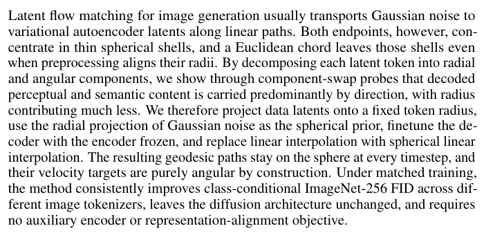
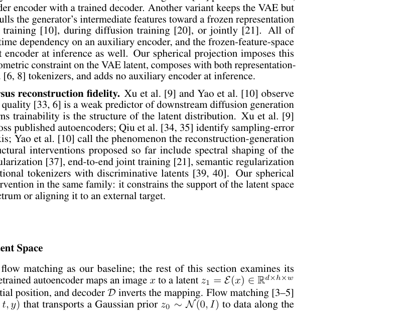
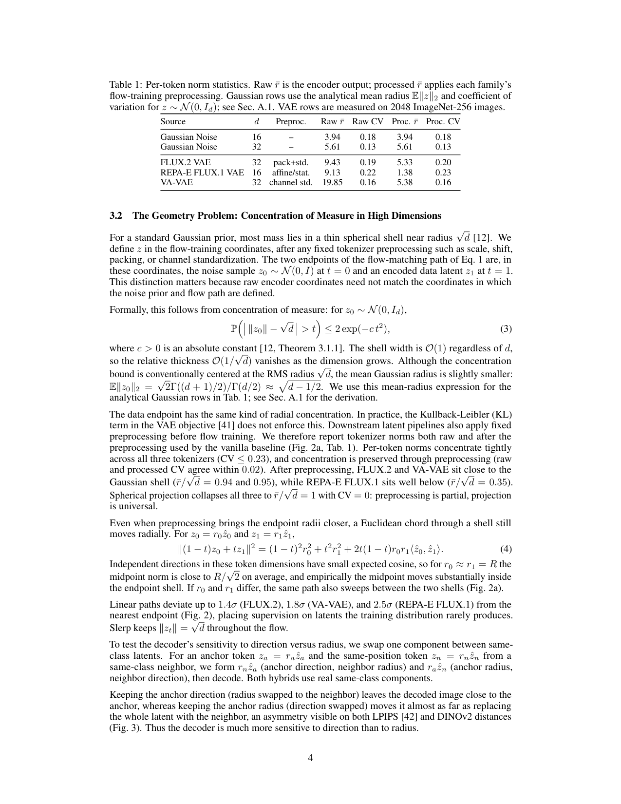
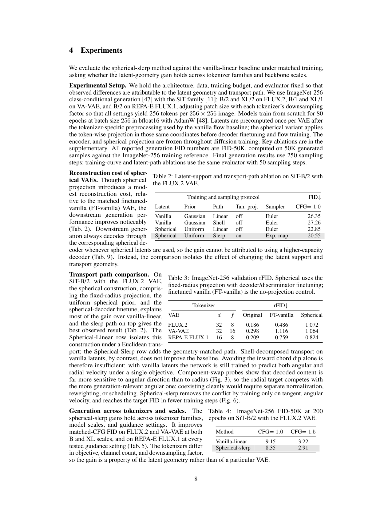
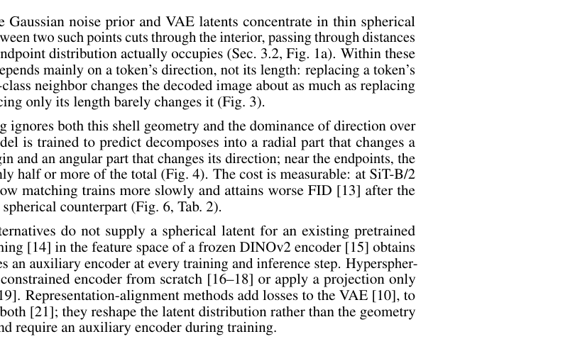
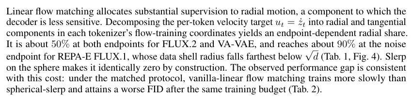
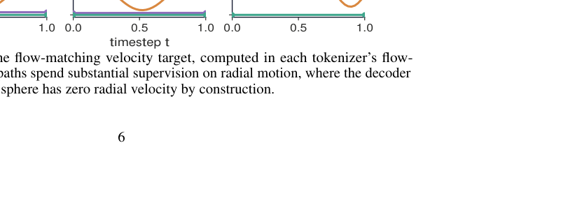
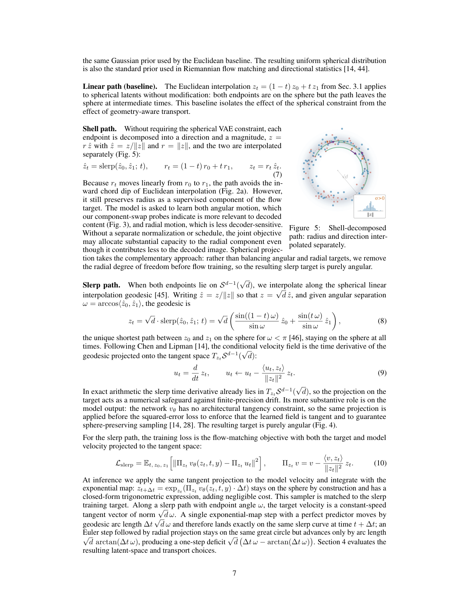
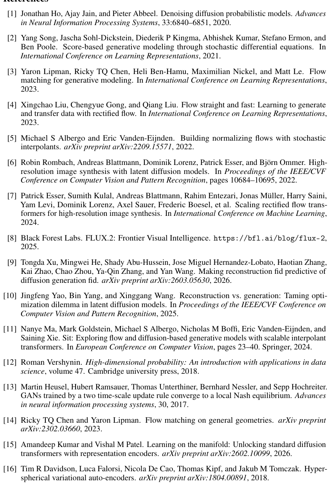
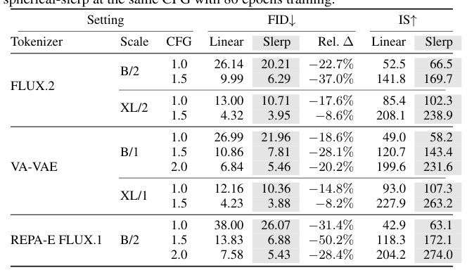

# Aligning Latent Geometry for Spherical Flow Matching in Image Generation

为图像生成中的球面流匹配对齐潜在几何

> 导读摘要：这篇论文抓住了一个很容易被忽略、但影响很实际的问题：标准 latent flow matching 默认把噪声和 VAE 潜变量之间的运动当作欧式直线，而真实的潜变量却更像分布在高维薄球壳上。作者据此提出一套相当克制的改法：把每个 latent token 投影到固定半径球面、把噪声也改成同一球面先验、冻结编码器只微调解码器，再用球面线性插值 slerp 代替直线插值来训练流匹配。这样一来，模型主要学习更重要的“方向变化”，而不是在半径上做大量无效运动；在不改动扩散骨干、也不引入额外编码器的前提下，方法在 ImageNet-256 上跨 tokenizer、跨模型规模都稳定降低 FID。

## 问题从哪里来：latent flow matching 其实走错了路

标准 latent flow matching 的训练方式很直接：先用 VAE 编码图像得到 latent，再从高斯噪声出发，沿着线性路径逐步走到数据 latent，让模型学习这条路径上的速度场。问题在于，这套做法默认 latent 空间是普通欧式空间，直线就是合理的运输路径。

但作者指出，这个默认设定和真实几何并不一致。无论是高维高斯噪声，还是 VAE 编码后的 token，在高维下都会集中在一个“薄球壳”附近。也就是说，端点本身主要出现在某个固定半径附近，而直线连接这两个点时，往往会穿过球壳内部——那片区域既不是噪声常出现的位置，也不是数据 latent 常出现的位置。模型于是被迫学习大量“偏离真实支撑集”的中间状态。

这个动机在论文开头就讲得很清楚：左边是标准直线路径，中间是作者提出的球面路径，右边则直接展示了训练收益——在相同扩散骨干下，球面方案更快达到相同 FID，而且还能继续改善。

这张图的重要性在于，它把论文的核心判断压缩成了一句话：**问题不一定在生成器不够强，而可能在 latent 空间里“怎么走”本身就不对。** 如果路径始终贴着潜变量真正活跃的区域走，监督信号就更自然，学习也更有效。

## 几何失配不只是直觉，而是可测量的结构问题

作者没有停留在“看起来像球壳”这种描述上，而是去量化各类 tokenizer 的 token 半径分布。结论是，不同 tokenizer 的 latent token 虽然预处理方式不一样，但它们的范数都高度集中，变异系数很小，说明“薄球壳”并非偶发现象，而是一个稳定结构。

更具体地说，论文比较了原始 encoder 输出与流训练前预处理后的半径统计，显示即便做过缩放、平移、通道标准化等处理，token 仍然集中在窄半径带内。也就是说，常规预处理最多只是“把半径调近一些”，但没有真正解决路径几何问题；而逐 token 的固定半径投影，则能把所有 token 直接压到统一球面上。

这一点在统计表里体现得更直接：不同 tokenizer 的处理后平均半径可能接近高斯球壳，也可能明显偏离，但投影后都能统一到固定半径，且半径方差为零。

这里可以顺着作者的逻辑理解三件事：

1. **常规线性基线并不真的生活在“欧式均匀空间”里**，它只是训练时假设如此；
2. **简单预处理不是几何对齐**，因为直线路径仍然会切进球内；
3. **球面投影不是为了美观，而是为了让训练支撑集和路径几何一致。**

这也是论文相较于许多“再加一个对齐损失”工作的不同之处：它没有去额外学习一个语义表征空间，也不依赖外部表示编码器，而是直接修改 latent 的几何支撑集。

## 核心洞察：图像语义主要在方向里，不在半径里

如果只是“latent 像球壳”，还不足以证明必须上球面方法。真正让这篇论文站住脚的，是第二个洞察：**解码器对 token 方向比对半径更敏感。**

作者把每个 latent token 分成径向和角向两部分，即“长度”和“方向”，然后做 component-swap probe：从同类图像里找邻居 token，分别只替换半径、只替换方向，再看解码结果变化。实验发现，只换半径时，重建图像和原图很接近；只换方向时，图像变化几乎和换掉整个 token 一样大。无论用感知距离还是语义距离衡量，结论都一致：**语义与感知内容主要由方向承载，半径贡献小得多。**

这就直接改写了对 flow matching 目标的理解。标准线性流匹配的目标速度可以分解成两部分：

- 径向分量：改变 token 到原点的距离；
- 切向分量：沿球面改变 token 方向。

如果解码器真正关心的是方向，那么大量训练容量花在径向运动上，很可能就是浪费。作者进一步分析发现，在线性路径下，尤其靠近起终点时，速度目标里径向分量占比相当高，甚至能到接近一半或更多。这意味着模型相当大一部分监督，其实都在学“不太重要”的变化。

因此，论文的方法并不是单纯“把直线换成曲线”，而是基于一个更强的假设重构训练目标：**既然方向才是主要信息载体，那训练就应尽量变成纯角向运动。**

## 方法主线：投影到球面、适配解码器、沿测地线训练

作者的方法可以概括成三步，而且每一步都围绕“让训练只关注方向变化”展开。

### 1. 逐 token 固定半径投影

对于编码器输出的每个 latent token，先做 L2 归一化，再缩放到固定半径 \(\sqrt d\)。这样数据端 latent 全部落在同一个球面上，半径不再携带可变信息。

与此同时，噪声先验也不再直接使用欧式高斯，而是取高斯噪声的方向分量，再投影到同一固定半径球面上。这样流匹配的起点和终点就处在同一个几何空间里。

### 2. 冻结编码器，只微调解码器

投影后的 latent 坐标与原 VAE 解码器习惯的空间不完全一致，所以作者冻结 encoder，只对 decoder 做短暂微调，使其重新适应新的球面 latent。这个设计很节制：不重训 tokenizer，也不额外引入辅助编码器。

### 3. 用 slerp 取代线性插值

这是方法最核心的一步。传统 flow matching 采用线性插值
\[
z_t=(1-t)z_0+t z_1
\]
而作者改成球面线性插值 slerp，让每个时间步的 \(z_t\) 始终停留在球面上。由于整条路径都在固定半径球面上，目标速度天然落在切空间里，换句话说，训练目标变成了**纯角向速度场**。

推理阶段，作者也不是随便用欧式更新，而是采用球面上的积分方式，让采样轨迹始终留在球面。这保证了训练与采样几何的一致性。

方法拆解实验正是为了说明，这几个环节分别在起作用：光有球面 latent 已经能带来显著收益，而在此基础上再把训练路径换成 slerp，结果会进一步变好。

这张表很值得看，因为它说明论文不是靠某一个技巧“碰巧变好”，而是有清晰的因果链：

- 先让 latent 支撑集球面化；
- 再让噪声先验与之对齐；
- 最后让训练路径和速度目标也变成球面的。

如果只做“壳层插值”但仍保留径向变化，效果不如真正的 slerp，这恰好支持作者的中心论点：**关键不只是把端点放到球壳上，而是把学习目标收缩到角向变化。**

## 实验结果：收益稳定，而且不是某个组件偶然奏效

在主实验里，作者使用 ImageNet-256 条件生成任务，比较标准线性 latent flow matching 与球面方案，在不同 tokenizer、不同 SiT 骨干规模下都做了配平评测。整体趋势很统一：球面方法在相同训练预算、相同 guidance 设置下，FID 更低。

这说明前面的几何分析不是“理论上也许更合理”，而是会真实转化成生成质量提升。更重要的是，作者并没有修改扩散/流匹配主体结构，所以这类提升更能归因于 latent 几何与路径设计本身。

跨 tokenizer、跨模型规模的主结果进一步表明，这不是某一种特定 tokenizer 的特例。无论是 FLUX.2、VA-VAE，还是带表示对齐的 tokenizer，球面方案都有一致收益；从 SiT-B 到更大的 SiT-XL，也都成立。

更细的结果表同样延续这个趋势：在相同任务与预算下，固定半径投影加 slerp 的组合，整体上优于线性基线。

如果把不同几何设计单独拉出来比较，也能看到作者方案的优势不是偶然某一行数字，而是在多组模块配置中持续出现。

最后一张总览表把这种稳定性总结得更完整：不仅 FID 普遍更低，其他指标也整体更好，而且这种趋势同时跨 tokenizer、跨模型规模出现。

这些实验共同支持一个很强的结论：**球面化不是“只对某个 VAE 有效的小技巧”，而是一种可迁移的几何修正。**

## 归因与启发：为什么这篇方法显得“轻”，却很有效

论文还专门做了一个很关键的控制实验：把线性方案和球面方案训练得到的 decoder 互换使用。如果球面方法只是因为 decoder 微调得更好，那么把它换到线性流程里应该也能提升表现；但实际并非如此，互换后两边都会变差。

这说明性能提升不是“解码器更强”这么简单，而是 decoder 已经和对应的 latent 几何、流路径共同适配了。换言之，收益来自整个系统的几何一致性，而不是某个局部组件单独变强。

从方法论上看，这篇论文最有价值的地方有三点。

第一，它把关注点从“换更强生成骨干”转向了“修正 latent 空间中的运动方式”。这很像是在提醒大家：生成模型的难点不只在网络表达力，也在训练目标是否尊重表示空间的结构。

第二，它提出的改法非常克制。没有额外 encoder，没有复杂对齐损失，也不需要重训整个 VAE，只是：
- 投影 latent，
- 微调 decoder，
- 把线性路径换成 slerp。

第三，它给出了一个很值得迁移的视角：**如果某类 latent 的信息主要编码在方向上，那么生成过程就应该优先学习方向变化，而不是把容量浪费在径向自由度上。** 这未必只适用于本文的 VAE latent，也可能启发更多关于 tokenizer 几何结构、表征支撑集以及生成路径设计的工作。

整体看，这篇论文并不是在发明一种更复杂的生成器，而是在做一件更基础、也更有说服力的事情：让 flow matching 的路径，终于和 latent 真正所在的空间对上了。
