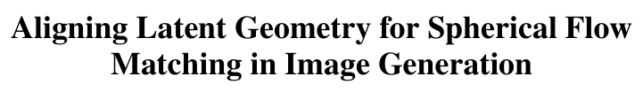
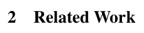
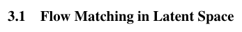
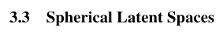
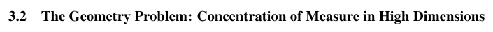
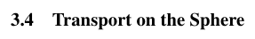

# Aligning Latent Geometry for Spherical Flow Matching in Image Generation

为图像生成中的球面流匹配对齐潜在几何

> 导读摘要：这篇论文瞄准 latent flow matching 中一个很具体但长期被忽略的问题：VAE 潜变量和高斯噪声在高维里都集中在薄球壳上，传统直线插值却会穿过球壳内部，逼着模型学习大量“不自然”的中间状态。作者进一步证明，解码后的语义与感知内容主要由 token 的方向决定，长度作用较弱。基于此，论文提出一套很干净的几何对齐方案：把每个 latent token 投影到固定半径球面上，把噪声也投到同一球面上，冻结编码器、微调解码器，再用 slerp 取代线性插值做 flow matching。这样训练目标天然只保留球面切空间中的角向运动，不改扩散骨干、也不引入辅助编码器，却能在 ImageNet-256 上跨 tokenizer、跨模型规模稳定提升 FID，并明显加快收敛。

## 问题从哪里来：latent flow matching 的欧式假设并不合适

标准 latent flow matching 的做法很直接：先用预训练 VAE 把图像编码成潜变量，再让生成模型从高斯噪声出发，沿线性路径走到数据 latent。写成公式，就是在时刻 \(t\) 使用
\[
z_t = (1-t)z_0 + tz_1
\]
其中 \(z_0\) 是高斯噪声，\(z_1\) 是图像 latent，模型学习预测对应速度。

问题在于，这个设定默认潜空间是“欧式的”，直线就是自然路径。但论文指出，对图像 VAE 的 token 来说，这个假设并不贴切。原因有两个：

1. **噪声端和数据端都集中在高维薄球壳上**  
   高维高斯本来就集中在半径接近 \(\sqrt d\) 的薄壳附近；而实际 VAE token，即便经过 tokenizer 自带的预处理后，范数同样高度集中。

2. **直线会离开这些高概率区域**  
   两个都在球壳上的点，用欧式直线相连时，中间段会切入球体内部。也就是说，训练过程会监督模型经过大量真实数据和先验都很少占据的半径区域。

论文最核心的直觉可以先用下图把握：作者不是改 backbone，而是改“潜变量几何”和“路径定义”。

图中的对比很关键。左边是传统做法：从噪声到 VAE latent 走直线。中间是本文方法：先把两端都放到同一半径球面上，再沿球面弧线前进。右边则说明，这种几何对齐不仅更“合理”，而且确实让训练更快、最终 FID 更低。

从论文叙事结构上看，作者接下来把自己的方法放入几类相关工作的脉络中：有些方法重训球面 VAE，有些方法依赖外部表征编码器，有些方法做表示对齐损失；而本文选择的是一条更轻量的路线——**直接在已有预训练 VAE 上做 token 级球面化，并把 flow path 改成球面测地线**。

这也是本文工程上最有吸引力的地方：它不是重新发明一套生成架构，而是在现有 latent diffusion / flow matching 管线里，尽量少改东西，优先修正几何错配。

## 关键观察：decoder 更在意方向，而不是长度

如果只是“端点在球壳上”，未必足以推出一定要做球面方法。真正把整套设计串起来的，是作者对 latent token 的径向—角向分解分析。

他们把单个 token 写成
\[
z = r\hat z
\]
其中 \(r\) 是长度，\(\hat z\) 是单位方向。然后设计了一个很有说服力的 probe：对同类图像的对应位置 token，分别交换“方向”或“长度”，再送进 decoder，看重建图像变化有多大。

实验结论很鲜明：

- 保留原方向，只换成邻居的长度，解码结果变化很小；
- 保留原长度，只把方向换成邻居的方向，解码结果会显著偏移；
- 这种偏移幅度，往往接近直接替换整个 token。

也就是说，**视觉语义与感知内容主要编码在方向上，而不是半径上**。

这张图的重要性不在“好不好看”，而在它为方法提供了表示层面的依据：既然 decoder 主要读的是方向信息，那么让 flow matching 花大量监督去学习半径变化，本身就可能是低效的。

作者还给出了更基础的统计证据：不同 tokenizer 的 token 范数确实都集中在较窄范围内，而球面投影则能进一步把它们统一到固定半径。这个统计支撑了“薄球壳”并非个别现象，而是多种 latent 表示下都存在的结构特征。

这类统计的意义在于：普通预处理最多只是“部分对齐”半径，而球面投影是把所有 token 明确压到统一半径上，几何约束更彻底。

## 方法主线：球面投影、球面先验、slerp 路径

论文的方法其实很整洁，可以拆成三个连续步骤。

### 1. 把数据 latent 投影到固定半径球面

对每个空间位置的 latent token，作者做逐 token 的 L2 投影，把它映射到半径 \(\sqrt d\) 的球面上。这样每个 token 都不再拥有自由变化的长度，只保留方向。

这里有个很实际的细节：**编码器冻结，只微调解码器**。因为编码器原先产出的 latent 并不天然位于这个球面上，直接投影后，decoder 需要少量适配。作者的做法是保持 encoder 不动，只 finetune decoder 几个 epoch，让它重新学会从球面化 latent 恢复图像。

这一步很关键，因为它说明作者并不是把球面投影当成训练时的临时技巧，而是真正把 tokenizer 的潜空间支撑集改成球面。

### 2. 把高斯噪声端也改成球面先验

数据端上球面还不够，起点也要一致。作者并不直接从高斯向量出发，而是先采样高斯，再取其径向投影，得到球面上的噪声先验。

这样一来，流的起点和终点都位于同一个固定半径球面上。相比“数据在球面、噪声在欧式高斯”的混合设定，这个方案真正完成了两端几何对齐。

### 3. 用 slerp 替换线性插值

当起点、终点都在同一球面上时，最自然的连接方式不是直线，而是球面测地线。作者因此用 spherical linear interpolation，也就是 slerp，替换原本的线性路径。

直观上，slerp 有两个直接后果：

- 整条路径在任意时刻都留在球面上；
- 速度目标天然落在球面切空间里，因此只包含角向变化。

这就把训练目标从“长度 + 方向一起学”，改成了“只学真正有语义意义的方向变化”。

为了让这个点更具体，作者把传统线性 flow matching 的目标速度拆成径向分量和切向分量，发现在线性路径中，径向部分并不小，尤其在接近起点和终点时，占比可达相当高的程度。

这说明传统训练确实把不少容量消耗在“把点拉进拉出球壳”上，而这些变化恰恰是 decoder 不太敏感的部分。于是，球面方法并不是单纯“插值更平滑”，而是在监督定义上主动删除了一块不重要、甚至带干扰的目标。

从设计逻辑上看，论文方法其实是一整套闭环：

- 先证明 latent 真正在薄球壳上；
- 再证明 decoder 更看方向；
- 然后把 latent 支撑集压到球面；
- 最后把 flow path 改成球面测地线，使监督只剩角向运动。

这也是为什么作者反复强调：有效的不只是“避开穿壳直线”，而是**固定半径 latent + 球面先验 + slerp + decoder 适配**这整组几何对齐。

## 实验结论：收益稳定，而且不是“微调 decoder”带来的假象

论文主要在 ImageNet-256 类条件生成上做验证，比较对象是匹配训练预算下的 vanilla linear flow matching。核心结果可以概括为三层。

### 第一层：最终生成质量更好

无论是 FLUX.2、VA-VAE，还是 REPA-E FLUX.1 这类不同 tokenizer，球面方法都能稳定优于线性基线，FID 一致下降。

这里最重要的不是某个单点数值，而是趋势很稳：提升并不依赖某一个特定 tokenizer，也不是只在单一模型尺度下成立。论文还报告了从 SiT-B 到更大规模模型时，收益依然能保留。

### 第二层：收敛更快

除了最终 FID 更低，训练过程也更高效。作者在曲线中展示，球面方法能更快达到基线同等质量，文中甚至给出一个很直观的量化：达到某一 FID 门槛时，所需训练步数明显更少。

这个结果很有说服力，因为它说明球面几何对齐不仅改善了最终上限，也改善了优化过程本身。换句话说，模型不是靠更长训练把劣势追回来，而是一开始就学得更顺。

### 第三层：提升不是因为“decoder 被额外微调了”

这类工作很容易被质疑：是不是你多做了一步 decoder finetune，所以效果更好？论文专门做了控制实验来排除这一点。作者进行 decoder swap，交换 vanilla 管线和 spherical 管线中的 decoder，结果两边都会退化。说明真正起作用的是**学习到的流与其对应 latent 几何是一体的**，并不是 decoder 单独变强了。

此外，论文也讨论了一个常见权衡：球面投影和 decoder 适配可能会牺牲一些重建指标，但生成质量反而更好。这与近年 tokenizer 研究中的共识一致：**重建好不等于更适合生成**，潜空间结构是否便于生成模型学习，往往更关键。

## 这篇论文真正贡献了什么

这篇工作的价值，不只是把线性插值换成球面插值，而是把 latent generation 里的一个基础假设重新写清楚了。

首先，它指出 latent flow matching 的问题不主要在 backbone，而在**训练路径与潜空间几何不匹配**。如果端点本来都活在薄球壳上，直线穿壳就会制造大量分布外中间态。

其次，它不是只从几何直觉出发，而是补上了表示层面的证据：通过 component-swap probe 证明 decoder 主要依赖方向信息，于是“去掉径向监督”才有充分理由。

最后，它给出了一条很实用的落地方案：

- 不需要辅助编码器；
- 不改 SiT 等生成主干；
- 不要求从头重训一个球面 tokenizer；
- 只做 token 级球面投影、少量 decoder finetune，以及训练/采样时的 slerp。

从研究角度看，本文把“潜变量支撑集的几何”推到了和“网络结构”“损失函数”同等重要的位置；从工程角度看，它则展示了一种低侵入、强兼容的改法：**先让 latent 空间更像模型该走的地方，再让 flow 在这个空间里走对路径**。这也是它能在多个 tokenizer、多个模型规模上都稳定受益的根本原因。
