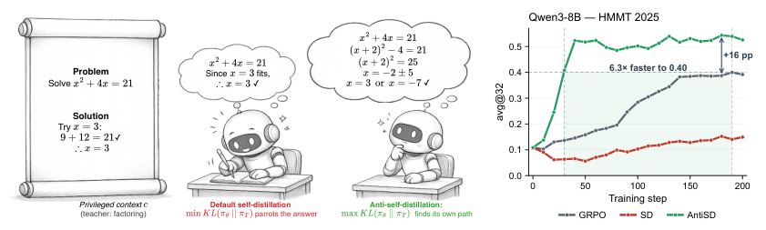
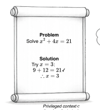
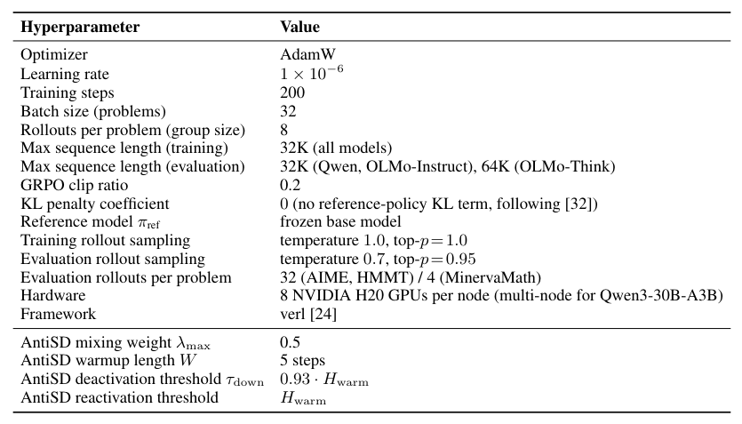
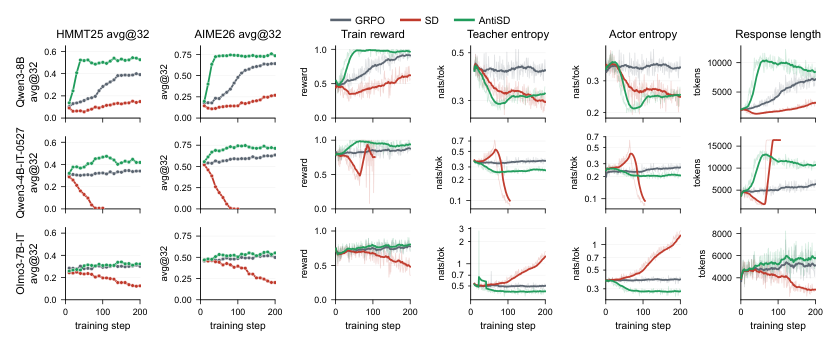
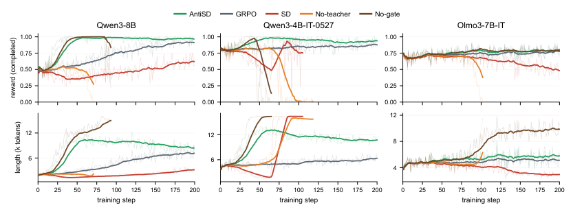
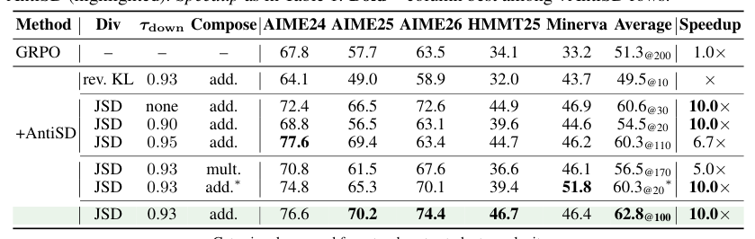
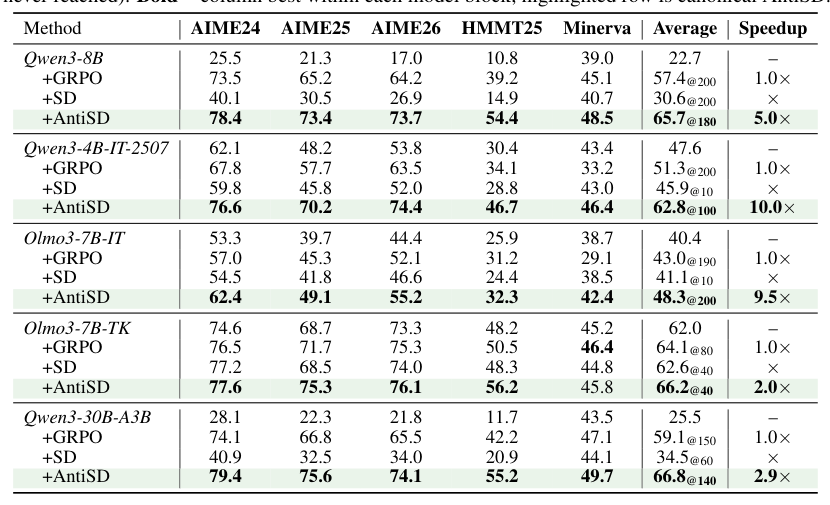
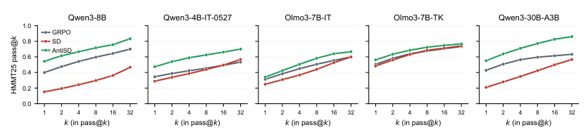
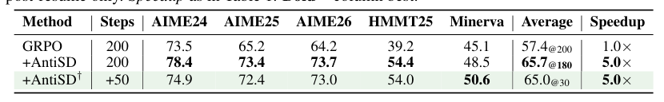
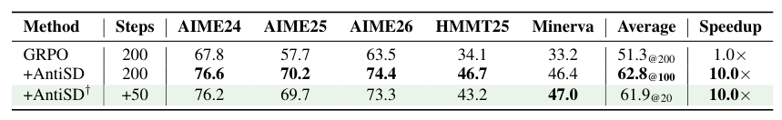

## 论文链接

- 原始论文页面：https://arxiv.org/abs/2605.11609
- PDF 下载：https://arxiv.org/pdf/2605.11609.pdf
- Hugging Face 论文页：https://huggingface.co/papers/2605.11609

通过点互信息实现用于推理强化学习的反自蒸馏

> 导读摘要：这篇论文的核心发现是，推理强化学习里的默认自蒸馏之所以常常帮不上忙，不是因为“自己教自己”无效，而是因为带有标准解或反馈的教师其实已经变成了“看过答案的自己”。它会提高那些顺着已知答案往下写的 token 概率，却压低真正推动多步搜索的思考型 token。作者据此提出 AntiSD：不再让学生逼近教师，而是反过来上升二者散度，并用教师熵门控控制何时关闭该信号。结果是在多个 4B 到 30B 模型上，AntiSD 不仅比默认自蒸馏稳定得多，还能用更少训练步数达到甚至超过 GRPO 的效果。

## 问题出在哪里：自蒸馏在数学推理上为什么失灵

这篇工作讨论的是推理类 RL 里的一个具体矛盾。

一方面，基于可验证奖励的训练范式很有效，但奖励通常只有序列级别的一位标量：答案对了就给分，错了就不给。这样的信号太稀疏，很难告诉模型“到底是哪一步想对了”。因此，很多方法希望补上一种 token 级别的细粒度训练信号。

另一方面，自蒸馏原本看起来很自然：让同一个模型同时扮演学生和教师。学生按通常条件生成推理轨迹，教师则额外看到特权上下文，比如标准解、验证反馈等，再对学生生成的每个 token 打分。这样就不用引入外部强教师，也不需要单独训练过程奖励模型。

问题在于，这套想法在数学推理上并不稳定。论文指出，原因不只是“教师不够强”，而是教师的条件本身就带来了结构性偏置：一旦教师看过答案，它就不再是在教“如何推理”，而是在教“已知答案后怎样顺着写下去”。

这个直觉在论文开头被压缩得很清楚：默认自蒸馏会把学生往一条现成解法上拉，而 AntiSD 则试图把这种拉力反向利用，保留中间探索空间。

上图左侧是方法动机的示意：带特权上下文的教师像一个“答案已知的自己”，会推动学生模仿已完成的解法轨迹，而不是保留尝试、回退、改写路径的空间。右侧则给出了一个代表性训练曲线：在 HMMT 2025 上，默认自蒸馏甚至落后于 GRPO，而 AntiSD 上升更快、最终也更高。论文在更大范围实验里反复看到这一模式，因此问题不是个别数据点，而是默认信号方向本身不适合推理搜索。

## 从逐 token 信号看偏置：默认自蒸馏其实在奖励“捷径 token”

论文最重要的分析，是把默认自蒸馏的逐 token 奖励写成了条件点互信息，也就是 PMI（点互信息）。

设学生在当前位置生成了 token \(y_t\)。学生分布只看题目和历史推理，教师分布则额外看到特权上下文。两者在这个 token 上的对数概率差
\[
u_t = \log \pi_T(y_t)-\log \pi_S(y_t)
\]
可以被解释为：在当前上下文下，特权信息 \(c\) 对这个 token 的支持到底增加了多少。也就是说，\(u_t\) 本质上就是该 token 与特权上下文之间的条件 PMI。

这个解释非常关键，因为它把默认自蒸馏的训练目标变得可读了：

- 如果某个 token 在“看过答案”后更容易出现，那么 \(u_t > 0\)，默认自蒸馏就奖励它。
- 如果某个 token 更像是在重新思考、尝试分支、反问自己，而教师因为已经知道答案不太会写，那么 \(u_t < 0\)，默认自蒸馏就会惩罚它。

于是问题一下子清楚了：默认自蒸馏不是在普遍鼓励更好的推理，而是在系统性地区分两类 token——一类是答案导向的结构词、结论词、确认词；另一类是搜索导向的思考词、犹豫词、改写词。对于数学推理，真正重要的往往恰恰是后者。

论文用具体可视化展示了这种分裂。

这张图非常值得细看。它显示，在真实数学轨迹里，像 “Given”“Assign”“holds” 这类已知答案后自然成立的 token，通常落在高 \(u_t\) 区域；而 “Wait”“Let”“Maybe”“Alternatively” 这类重新展开思路的 token，则常常落在低 \(u_t\) 区域。于是默认自蒸馏会强化前者、削弱后者。

作者把这称为一种“结构性捷径偏置”。它看起来像是在压缩回答、让输出更简洁，但实质上压缩掉的不是冗余废话，而是推理里最值钱的那部分：尝试、反思和分支搜索。

从方法角度看，论文由此得出两个判断：

1. **信号极性错了**：默认逐 token 奖励的符号与推理任务需要的方向相反。
2. **分布还不对称**：因为轨迹是学生自己采样的，批次里会天然更多地出现那些“学生高于教师”的 token，也就是思考型 token；这导致负向一侧不仅数量多，尾部还很重，容易放大训练不稳定。

这两个观察共同决定了后续方法设计：不是简单把 loss 改个符号就完事，还需要选一种合适的散度形状，去处理这种不对称采样。

## AntiSD 的方法主线：反向上升散度，而不是继续贴近教师

有了前面的诊断，AntiSD 的主线就很直接了：既然默认自蒸馏奖励的是“看过答案后更像教师”的 token，而这正会压制搜索，那么就不该再下降学生与教师之间的散度，而应该反过来**上升**它。

也就是说，默认自蒸馏是在做“向教师靠近”；AntiSD 则是在做“沿着学生与教师差异的反方向利用信号”。这样一来，原先被奖励的捷径 token 会受到抑制，而原先被压低的思考型 token 会得到保护甚至鼓励。

但作者并没有选择最简单的“反向 KL”。他们强调，仅仅翻转方向还不够，因为前面已经观察到，思考型 token 这一侧在采样分布中更重、更极端。如果直接反向使用 KL，容易被这些大幅负值 token 主导，训练会不稳。

所以 AntiSD 的第二个关键设计，是**上升 Jensen-Shannon 散度**而不是反向 KL。这样做的好处在于，JSD 对逐 token 优势的形状是天然有界的：

- 在局部小偏差处，它近似于“反向 KL 的线性翻转”，所以保留了纠正信号方向的核心作用。
- 在思考型 token 对应的重尾一侧，它会自动截断极端值，不让少数超大负差值把梯度拉爆。
- 在捷径 token 一侧，它依然保留线性惩罚，让那些被答案泄露强力支撑的 token 按比例受到抑制。

论文把这个逐 token 优势写成一个单调函数 \(-\phi(u_t)\)。理解时不必陷入公式细节，只要抓住它的作用：**AntiSD 不是无条件鼓励“跟教师不一样”，而是用 JSD 这条有形状控制的曲线，稳健地翻转原本错误的奖励极性。**

除此之外，作者还补上了第三个必要部件：**基于教师熵的门控**。

原因很现实。一旦从“下降散度”改成“上升散度”，这个目标本身就不再会自动停下。若教师分布已经塌缩得过于确定，继续使用其对数比值信号就没有意义，反而可能把模型推向无效发散。因此 AntiSD 在训练中监控教师的逐 token 熵：当教师熵低到阈值以下，就关闭 AntiSD 项；必要时再按门限重新开启。

这个设计使得 AntiSD 成为一个真正可替换默认自蒸馏的模块，而不是脆弱的技巧拼接。作者给出的配置也说明，它没有引入额外教师模型，也不需要新数据流，工程上属于低侵入式改动。

从这张配置表能看出，AntiSD 绝大多数训练设置沿用原来的 RL 框架，新增内容主要就是混合权重、warmup，以及教师熵触发的开关阈值。换句话说，它的收益主要来自训练信号本身，而不是堆叠更复杂的工程系统。

## 稳定性从哪里来：完整机制比单独翻转更重要

论文一个很好的地方是没有停在“主方法有效”，而是进一步拆开机制，看各部分到底在干什么。

先看总体训练动态。作者在多个模型上同时追踪了任务奖励、熵变化和生成长度等指标。结论是，AntiSD 不只是最终分数更高，而是训练过程本身更健康：更早把奖励拉起来，也更少出现输出长度失控、熵异常或奖励坍塌。

这张图的重要意义在于把“方法设计”和“训练行为”对应起来。默认自蒸馏失败时，往往不是慢慢输，而是会把模型带向某种退化状态：奖励下滑、回复越来越长，甚至顶到长度上限。AntiSD 通过“信号翻转 + JSD 有界优势 + 熵门控”把这种失稳压了下去。

接着看消融实验，更能理解为什么论文坚持这一整套组合，而不是只做最简翻转。

这组图展示了若干失败模式。去掉教师约束、去掉门控、或换掉某些核心设计后，训练会更容易出现自我强化、长度飙升和奖励崩塌。换言之，AntiSD 的关键不是一句“反着蒸馏”，而是：

- 要有教师，作为受控参照；
- 要翻转信号方向，纠正默认偏置；
- 要选 JSD 这样的散度形状，处理重尾不对称；
- 要用教师熵门控，在信号退化时及时停手。

这一点在更系统的消融表里也得到了量化支持。

表中比较了散度选择、门控设置、以及与 GRPO 序列级优势的组合方式。总体趋势很清楚：完整版本最稳，JSD 优于简单反向 KL，合适的熵门控能避免后期回落，而加性组合通常也比更激进的耦合方式更可靠。这说明 AntiSD 的收益不是偶然的奖励塑形，而是若干互相匹配的设计共同构成的。

## 实验结果说明了什么：更快收敛，而且提升来自更好的搜索

从结果上看，论文的结论很强：在 5 个 4B 到 30B 的模型上，AntiSD 都能比默认自蒸馏更好，而且往往能用 2 到 10 倍更少的训练步数达到 GRPO 的精度水平，最终平均准确率最高还能提升 11.5 个点。

先看总体汇总。

这张表最值得关注的不是某个单点 SOTA，而是跨模型的一致性：默认自蒸馏普遍不如 GRPO，而 AntiSD 则几乎系统性地扭转了这一点。这恰好呼应了论文的理论判断——问题不在“自蒸馏”四个字，而在默认自蒸馏用错了 token 级信号方向。

但作者还进一步回答了一个更细的问题：AntiSD 的提升，究竟只是让模型把概率更集中到某一条路径上，还是确实扩大了可找到的正确解覆盖范围？

为此他们看了 pass@k 曲线。

如果一种方法只是更会“押单一路径”，通常会在小 \(k\) 时看起来更强，但随着采样次数增加，优势会迅速缩小。这里 AntiSD 在不同 \(k\) 上持续领先，说明它不是单纯减小方差，而是在保留甚至增强解空间覆盖能力。换句话说，论文的核心叙事是成立的：被保护下来的思考型 token，确实转化成了更好的搜索与命中正确解的能力。

论文还考察了一个很有实用价值的设定：如果你已经有一个训练到接近饱和的 GRPO 模型，AntiSD 能不能作为后续增强模块继续接上去？

答案是可以，而且很省步数。

从表中可以看到，从头训练的 AntiSD 最终最好；但从已有 GRPO 检查点继续接入 AntiSD，也能在很少额外步数下逼近这一最佳水平，明显优于“停在 GRPO 就结束”。这意味着 AntiSD 并不要求你重写整个训练流水线，它可以自然嵌入现有后训练流程中。

这一点在补充结果里也得到了再次验证。

继续训练版通常略低于“从头就使用 AntiSD”的上限，但依然保留了明显的提速和性能收益。对于工业实践来说，这个结论其实很重要：AntiSD 不只是论文式的新目标函数，也是一种可直接叠加到已有 GRPO 资产上的增益模块。

## 如何理解这篇论文的价值

如果只用一句话概括，这篇工作的贡献是：**它把“自蒸馏在推理上为什么常失败”从经验现象，变成了可解释、可修正的逐 token 信号问题。**

它的价值主要有三层。

第一层，是诊断层。论文没有把失败归咎于“没有更强教师”，而是指出特权上下文本身会制造答案捷径偏置，这个偏置恰好打击了推理最需要的 deliberation token。这个洞见很扎实，因为它既有 PMI 推导，也有逐 token 可视化支撑。

第二层，是方法层。AntiSD 的设计并不复杂，但非常对症：
- 翻转信号方向，修正默认极性；
- 用 JSD 的有界形状处理不对称重尾；
- 用教师熵门控保证何时该停。

这使它成为一个低成本、可替换、可续训的模块，而不是依赖额外大教师或复杂新框架的方法。

第三层，是结果层。实验表明，AntiSD 的提升不是只体现在单次准确率，也不是靠输出收缩“装出来”的，而是体现在更快收敛、更稳训练，以及更好的 pass@k 覆盖能力上。这意味着它确实在强化“搜索过程”，而不只是改变表面文风。

如果把它放到更大的背景里看，这篇论文其实在回答一个很现实的问题：模型能否在没有外部更强教师的情况下，靠自己的训练信号持续自我改进？作者给出的答案是可以，但前提是你不能盲目相信“看过答案的自己”就是好老师。对推理任务来说，真正需要学会的，往往不是答案路径本身，而是那些犹豫、尝试、修正、重构的中间步骤。AntiSD 做的，正是把这些步骤重新从错误的训练信号中抢回来。
