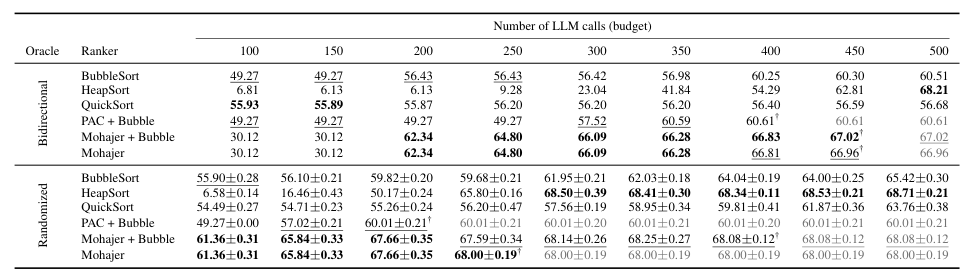
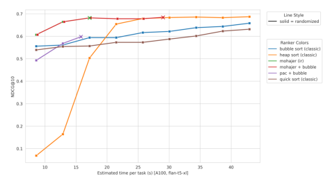
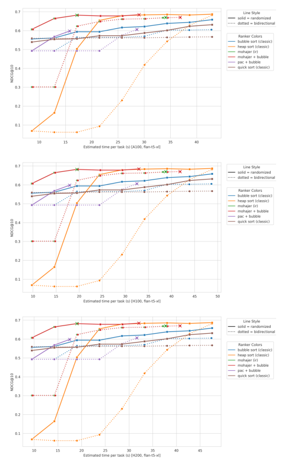
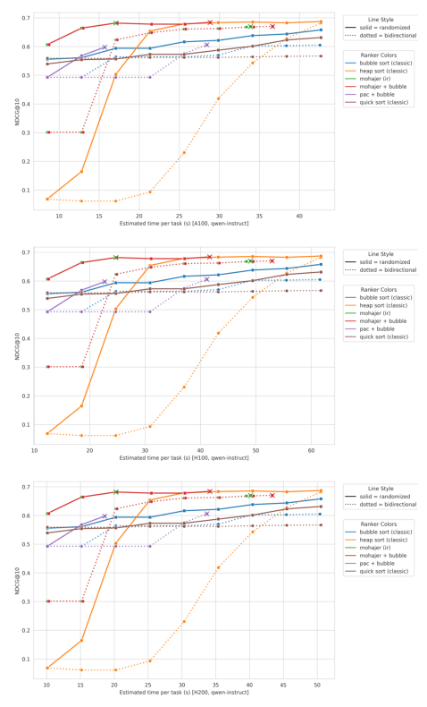
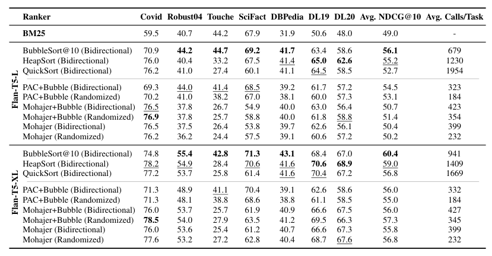
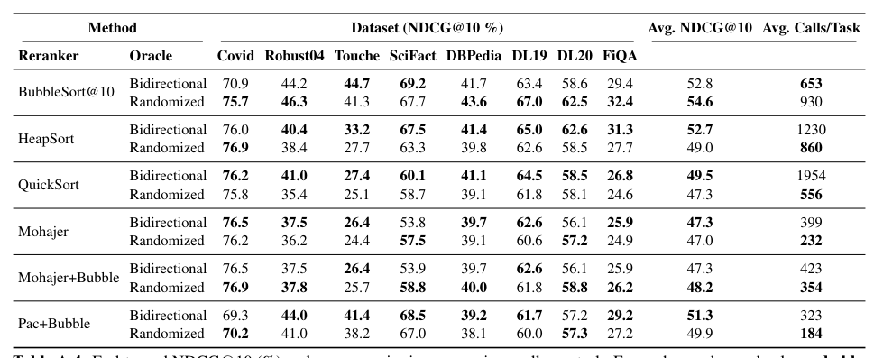
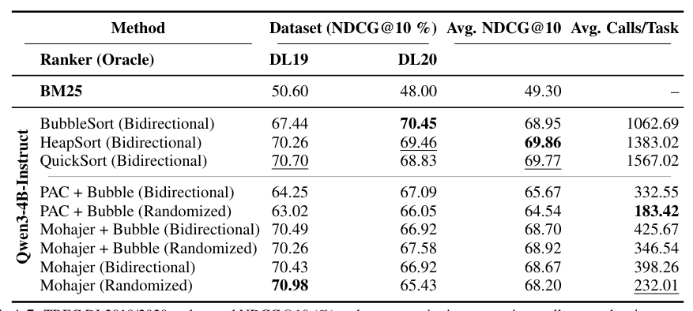
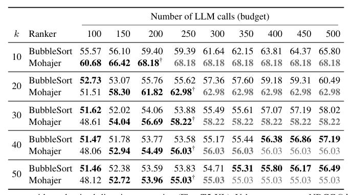

## 论文链接

- 原始论文页面：https://arxiv.org/abs/2605.14236
- PDF 下载：https://arxiv.org/pdf/2605.14236.pdf
- Hugging Face 论文页：https://huggingface.co/papers/2605.14236

作为高效 PRP 重排序器的主动学习器

> 导读摘要：这篇论文的核心不是“如何让 LLM 做更准的成对判断”，而是“在调用预算固定时，应该把比较机会花在哪些文档对上”。作者把 PRP 重排序从经典排序问题，改写成带噪声成对反馈下的主动 top-K 学习问题，并引入随机方向 oracle，把每对文档的成本从 2 次调用压到 1 次。结果表明：在最常见的低到中等预算区间，主动式调度明显优于把 PRP 直接交给 BubbleSort、QuickSort、HeapSort 之类排序器，尤其 Mohajer 方法能更快把预算集中到 top-K 边界附近，显著提升单位调用带来的 NDCG@10 收益。

## 一、问题为什么不在“排序”，而在“比较调度”

现有 PRP 的标准做法很直接：让 LLM 对两个候选文档做相关性比较，再把这些二元偏好交给某种排序算法，最后得到重排结果。问题在于，这套流程默认“比较关系大体稳定、可传递”，而这恰好不是 LLM 成对判断的真实特性。

论文指出了三层结构性错配：

1. **判断有噪声**：同一对文档的比较可能并不稳定。
2. **顺序敏感**：把文档 A 放前、B 放后，与把 B 放前、A 放后，LLM 可能会给出不同结论。
3. **可能非传递**：即使 A 胜 B、B 胜 C，也不保证 A 胜 C。

但经典排序算法追求的是**恢复完整全排列**。这会带来两个后果：  
一是它会把预算花在“修补整个列表的相对次序”上；二是在预算受限时，提前截断排序过程，并不能可靠地产出高质量 top-K。对 RAG 或检索重排而言，真正重要的是前 10 或前 K 个结果，而不是第 57 和第 63 名谁在前。

作者因此把问题重述为：**在有限 LLM 调用预算下，如何通过带噪声的成对比较，尽快识别出高质量 top-K**。这就从“排序”转成了“主动学习式 top-K 识别”。

这一定义上的转变，是全文最重要的贡献。它意味着优化目标不再是“全局顺序正确”，而是“前缀质量最大化”；相应地，算法也不该平均对待所有比较，而应把预算集中在最有信息量的位置，尤其是 **top-K 边界附近那些还不确定的候选**。

## 二、方法主线：把 PRP 重排改成主动学习问题

论文先给出统一的重排接口。对于一个查询，第一阶段检索器先返回 \(N\) 个候选文档；重排器需要输出前 \(K\) 个文档的有序列表。算法与文档集合的交互方式被限制为：只能通过成对比较 oracle 获取结果。

对任意一对文档 \(\{i,j\}\)，一次比较返回一个二值结果：  
- 1 表示 \(d_i\) 优于 \(d_j\)
- 0 表示反之

关键不在于这个定义，而在于作者对比较器做了非常弱的假设：只要求**成对一致性**，也就是 \(p_{ij}=1-p_{ji}\)。他们**不要求存在一个全局可传递的真实顺序**。这使得方法更符合 LLM 判断的现实。

在这个接口下，论文选择了两类主动排序器：

### 1. Mohajer：锦标赛式 best-K 识别
这是本文实验中表现最强的主动方法。它的思想不是像排序那样遍历性地整理整个列表，而是通过锦标赛和堆式抽取，把更多比较集中在“可能进入前 K 的候选”之间。

直观上，它会更快筛掉明显弱的文档，把调用预算保留给那些彼此接近、最影响 top-K 边界的样本。也因此，它尤其适合预算受限场景。

### 2. PAC + Bubble：锚点式 best-K 识别
另一条路线是基于锚点和 winner set 的 PAC best-K 方法。作者给它接入了一个零成本先验：**BM25 排名**。具体做法是，从 BM25 前缀中挑选锚点，并把比较限制在 top \(K \times m\) 范围内（文中 \(m=3\)），从而降低调用数。

PAC 本身输出的是一个无序 best-K 集合，所以作者再用 BubbleSort 对最终 top-K 做轻量排序。这说明论文并不是排斥排序，而是强调：**排序应作为局部收尾，而不是全流程主干**。

这一点很重要。作者并没有说“排序算法没用”，而是说“在带噪声、预算受限的 PRP 里，排序不该决定比较计划”。更合理的结构是：  
**先用主动算法找出高价值候选，再在很小的集合上做必要排序。**

## 三、随机方向 oracle：把位置偏差变成零均值噪声

论文的另一个关键设计，是比较 oracle 本身的改造。

传统 PRP 为了对抗顺序效应，常用**双向调用**：  
- 先问一次 \(LLM(d_i, d_j)\)
- 再问一次 \(LLM(d_j, d_i)\)

这样每对文档要花 2 次调用。虽然更稳，但成本很高，而且即便如此，偏好循环依然存在。

作者提出了一个更便宜的替代：**随机方向 oracle**。做法非常简单——对每一对文档，只随机选择一个输入方向，调用一次 LLM。如果抽到正向，就直接记录结果；如果抽到反向，就把输出做相应翻转。这样每对只需 1 次调用。

其核心不是“随机更准”，而是统计意义上的一个转换：

- 原本方向偏差是**系统性的**
- 加入随机化后，这种偏差在期望上被转成了**零均值噪声**

也就是说，单次比较可能仍有位置偏差，但在总体聚合时，它不再固定偏向“前放的文档”或“后放的文档”。于是，作者可以在只用 1 次调用的前提下，保留成对一致性所需的性质。

这一步和主动调度是互补的：

- **主动调度**解决“该比较谁”
- **随机方向 oracle**解决“每次比较能否更便宜”

两者结合后，预算优势会叠加：不仅每次比较更值钱，而且同样预算下还能覆盖更多文档对。

## 四、结果怎么看：真正的提升来自“更快接近高质量 top-K”

论文最有说服力的结果，来自不同预算下的 TREC DL2019/2020 实验。表格直接展示了：在相同调用预算下，主动方法能否比传统 PRP 排序器更快拿到更好的前 10 名质量。

从这张表可以抓住几个关键结论。

第一，在**双向 oracle**下，Mohajer 在 200 到 450 次调用的区间里持续领先。最典型的是 \(B=300\) 时，Mohajer 达到 **66.09 NDCG@10**，而最佳排序基线约为 **56.42**，差距接近 **+9.7**。这几乎就是论文最核心的主结果：  
**在真正受预算约束的区间，主动比较调度明显优于把 PRP 交给排序器。**

第二，低预算时主动方法也不是总赢。比如在 100、150 次调用时，QuickSort 反而更好，因为 Mohajer 还处在“热启动”阶段。这个观察很诚实，也说明作者不是在宣称“主动法全局碾压”，而是在强调它的适用区间：**一旦预算超过 warm-up 阈值，收益开始显著体现**。

第三，**随机方向 oracle** 会进一步压缩“达到高质量所需的时间/调用数”。在 randomized 设置下，Mohajer 在 \(B=250\) 左右就已达到约 **68.0** 的平台，而双向版本要接近 \(B=450\) 才到类似水平。论文把这称为“time-to-quality”的压缩，非常贴切：  
不是单纯分数高了多少，而是**更快达到自己的高点**。

从部署角度看，这比最终极限分数更关键。因为很多线上场景根本不会给你 500 次调用慢慢磨。

## 五、从调用数到真实耗时：主动方法为何更适合实际系统

作者没有停留在“调用次数更少”，而是进一步估计了任务级耗时。虽然这是顺序执行的上界估计，但足以看出方法在时间维度上的差别。

这张图是在 randomized oracle 下，把 TREC DL 的 **NDCG@10** 与 **平均任务耗时** 放到一起比较。最值得注意的是左上区域：谁能在更短时间内达到更高质量，谁就更适合实际重排服务。Mohajer 系列曲线明显更快进入高位，并且较早收敛，说明它不是靠“做更多比较”获胜，而是靠“把比较做在关键处”获胜。

如果进一步把两种 oracle 都放进来，趋势会更完整。

这张图同时展示双向与随机方向两种设置。读图时，同色实线与虚线的差别尤其重要：它们表示**同一调度器在不同 oracle 下的效率变化**。可以看到，随机方向通常能把曲线整体往左推，也就是用更少时间达到相近甚至更高的质量。对 Mohajer 来说，这个左移最明显，说明主动调度和单调用 oracle 的耦合效果非常强。

作者还补充了另一套模型上的结果，说明这种现象并不依赖单一 LLM。

在 Qwen3-4B 上，整体趋势依然成立：主动方法，特别是 Mohajer 系列，通常能更早到达高质量平台；随机方向也依旧比双向更划算。也就是说，这篇论文提出的不是某个模型专属 trick，而更像是一种**面向带噪声成对比较的通用调度原则**。

## 六、端到端实验说明了什么：不是绝对最高分，而是效果—成本比更优

如果只看单一预算，很容易把结论理解成“Mohajer 总比排序器强”。但端到端多数据集实验更细致地说明了真正优势所在：**更少调用下的可比质量**。

在 BEIR 风格任务与 TREC 上，表 2 给出的不是单点预算，而是每种方法在完整流程中的平均 NDCG@10 与平均调用数。这里最值得关注的是最右两列：

- 传统 PRP 排序基线往往需要 **941 到 1669** 次调用
- Mohajer 与 PAC 一类主动方法，通常在 **184 到 345** 次调用区间

也就是说，主动法能以大约 **3 到 5 倍更少**的调用，拿到接近甚至可比的效果。这就把论文的贡献从“预算曲线更好看”落到了“整体系统更省钱、也更快”。

作者还用若干补充表把这一点拆得更细。

这张补充表从更多数据集上看效果—成本比，说明主动调度并不是只在 TREC 特别有效。尽管不同任务上最优方法会变，整体趋势仍然稳定：**主动方法通常不是单点最好，但经常是成本最优或接近最优**。这与论文的目标完全一致，因为它优化的本来就不是无限预算下的最高分，而是单位调用收益。

表 9 把视角拉回 TREC DL2019/2020，进一步强调平均每任务调用数与平均 NDCG@10 的联合比较。这里尤其能看出随机方向 oracle 的价值：在许多方法上，它直接压低了调用数，而性能并未同步恶化。换句话说，作者不是靠更复杂的模型换来效果，而是靠**重新设计比较协议与调度策略**来提升效率。

## 七、一些更细的方法观察：为什么 Mohajer 比 PAC 更稳

论文里还有几张支持性表格，能帮助理解主动方法内部的差别。

这张表考察不同 top-K 目标长度下，预算增加时方法的表现变化。它支持了一个很重要的判断：**主动方法的优势首先体现在更早达到自己的峰值**。Mohajer 往往不需要很高预算就进入平台区，而 BubbleSort 还得继续增加比较，才能慢慢改善。这说明前者的预算利用方式更适合“只关心前列”的目标。

相比之下，PAC 的两阶段结构会把预算分散到“识别集合”和“排序收尾”两个目标上，因此在很多预算点不如 Mohajer 集中。作者也提到，PAC 在 BM25 先验很强的任务上更有机会，例如 Touché 一类场景。这提示我们：  
**主动调度并不是单一方法无条件胜出，而是要看先验质量、任务结构和预算区间。**

从整体方法论上，本文给出的经验可概括为三条：

1. **若预算极低**，经典排序有时更占优，因为主动法尚未完成热启动。  
2. **若预算处于常见中低区间**，主动法最值得用，因为它能把比较集中到 top-K 决策边界。  
3. **若预算很高**，全局细化开始变得值得，排序方法可能追上甚至略超主动法。

这三条边界感，让论文显得非常可信。它没有把主动学习神化成普适答案，而是清楚地说明：为什么它更适合今天的 PRP 使用场景——**调用昂贵、时延敏感、只关心前几个结果**。

## 八、可以怎样理解这篇论文的真正贡献

如果把全文压缩成一句话，最准确的表述可能是：

**论文证明了 PRP 的瓶颈不主要在“比较器不够强”，而在“比较计划不够聪明”。**

围绕这个判断，作者完成了两个层面的替换：

- 在**调度层**，用主动 top-K 学习替换传统排序流程；
- 在**oracle 层**，用随机方向单调用替换双向双调用。

这两个改动都非常“轻”：  
不需要额外训练，不需要新的打分模型，不需要修改 LLM 本身，只是重写了“如何挑选比较对、如何组织一次比较”。但正因为它们作用在 PRP 的结构性瓶颈上，所以带来的收益很实在。

对读者而言，最值得记住的不是某个具体数字，而是下面这条方法主线：

1. LLM 成对比较是带噪声、顺序敏感、可能非传递的；  
2. 因此不该直接套用追求全排序的经典排序算法；  
3. 真正目标是预算约束下的高质量 top-K；  
4. 最优策略是把比较预算主动集中到最不确定、最影响 top-K 的候选上；  
5. 同时用随机方向把位置偏差从系统误差改造成可平均掉的零均值噪声。

这也是为什么论文标题里的“Active Learners”并不只是一个换名词的包装，而是对 PRP 重排序问题本质的一次重新定义。
