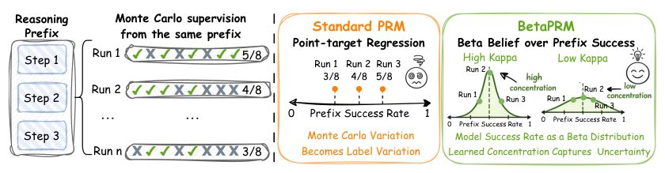
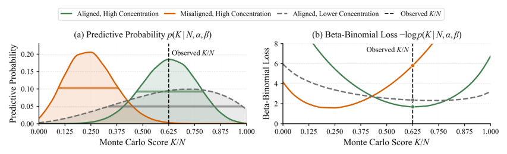
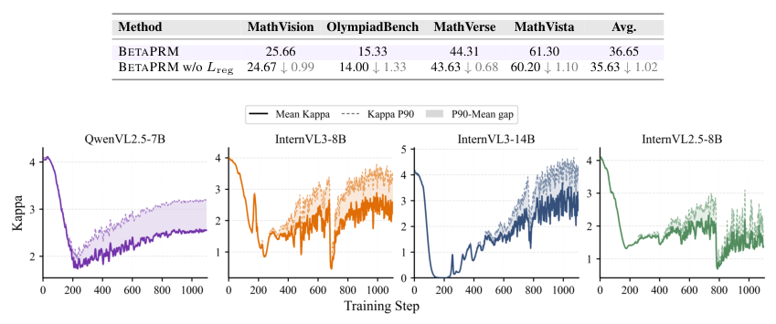
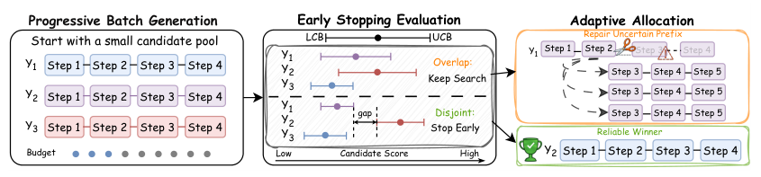
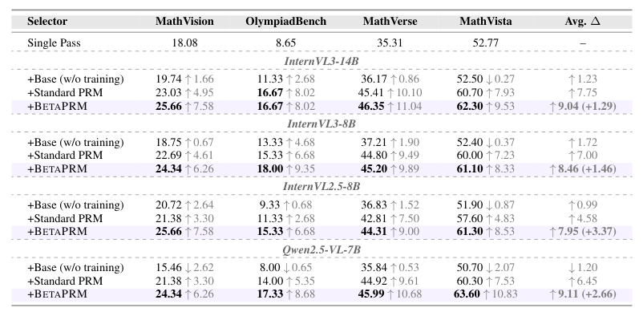
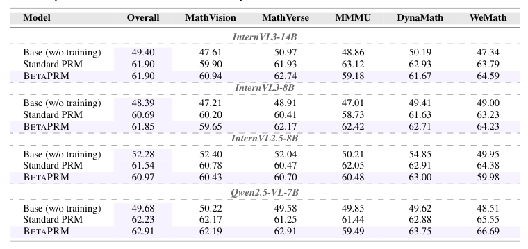
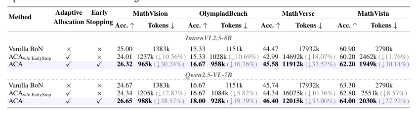
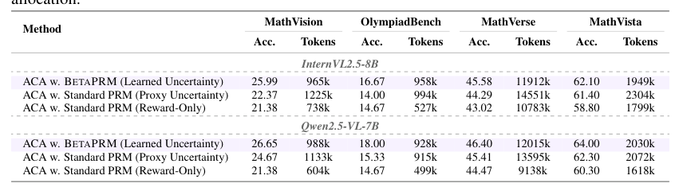
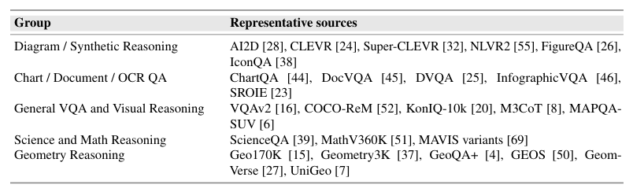
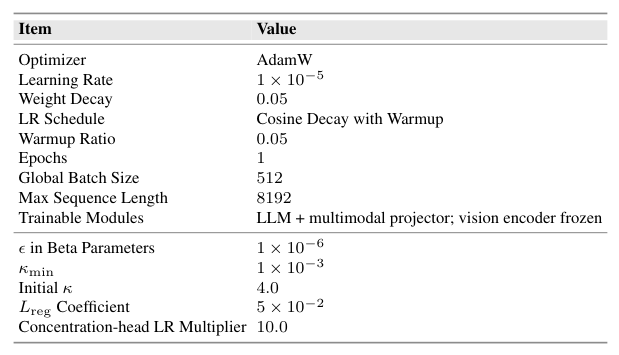

## 论文链接

- 原始论文页面：https://arxiv.org/abs/2605.15529
- PDF 下载：https://arxiv.org/pdf/2605.15529.pdf
- Hugging Face 论文页：https://huggingface.co/papers/2605.15529

具有学习型可靠性的过程奖励

> 导读摘要：这篇论文的核心不在于把过程奖励模型打得更“准”一点，而在于让它学会回答另一个同样关键的问题：**这个分数到底靠不靠谱**。作者提出 BetaPRM，把每个推理前缀的成功概率从单点分数改成一个 Beta 分布，用均值表示奖励、用浓度表示可靠性；训练时也不再把 Monte Carlo 得到的成功率 `K/N` 当作精确标签，而是直接拟合“在 `N` 次续写里观察到 `K` 次成功”的计数事实。基于这一可靠性信号，论文进一步提出 ACA，用于 Best-of-N 推理中的自适应计算分配：该停时停，不确定时把额外算力投到真正可能改变结果的前缀上。实验显示，这种“奖励 + 可靠性”的接口既提升了候选选择质量，也显著改善了准确率与 token 开销之间的权衡。

## 问题出在哪里：PRM 只有分数，没有“可信度”

过程奖励模型的典型作用，是在逐步推理过程中给每一步或每个前缀一个分数，告诉下游系统“这条推理现在看起来有多有希望”。问题在于，现有 PRM 往往只输出一个标量，于是下游无论做候选排序、Best-of-N 选择，还是搜索中的分支扩展，都只能把这个分数当成同等可信的信号。

这会带来两个结构性缺陷。

第一，**推理前缀的好坏本来就具有不确定性**。PRM 在判断第 `t` 步时，只看到了当前题目和已有前缀，并没有看到后续会怎么续写。一个“眼下看起来没错”的前缀，未必真的容易通向正确最终答案。也就是说，同样是 0.8 分，一个前缀可能是“很大概率真的好”，也可能只是“当前证据不足，但暂时看起来不错”。

第二，**训练监督本身带噪声**。常见做法是：从同一个推理前缀出发，采样 `N` 次后续续写，看其中有多少次最终答对，得到 `K/N` 这个经验成功率。可这只是有限样本估计，不是前缀真实成功概率。换一次采样，可能就从 `3/8` 变成 `5/8`。传统 PRM 却把某一次观测到的 `K/N` 当成点标签回归，等于把抽样波动也硬塞给模型去记。

这正是论文的出发点：如果同一个前缀反复采样会出现不同成功率，那么监督信号本质上就不是一个精确常数，而更像一个带不确定性的统计证据。BetaPRM 的思路因此很自然——模型不只预测“成功概率是多少”，还要预测“对这个判断有多确信”。

## 方法主线：把前缀成功率建模成 Beta 信念

论文把每个推理前缀对应的潜在成功概率记为 `q_t`，它表示：在当前题目和当前前缀条件下，后续最终答对的概率有多大。传统 PRM 直接学一个点估计；BetaPRM 则把 `q_t` 建模为一个 Beta 分布。

这样一来，模型输出就不再只有一个分数，而是两部分：

- `μ_t`：Beta 分布的均值，表示这个前缀的预期成功概率，也就是通常意义上的过程奖励；
- `κ_t`：Beta 分布的浓度，表示这个分布有多尖锐，也就是模型对该奖励判断的可靠性。

直观地说：

- `μ` 高，说明前缀更有希望；
- `κ` 高，说明模型对这个判断更有把握；
- 两个前缀即便 `μ` 相近，`κ` 也可能完全不同，一个是“高分且可信”，另一个是“高分但不稳”。

这种参数化很关键，因为它把“奖励值”和“奖励可靠性”显式拆开了。论文在实现上保持了与标准 PRM 接口的兼容性：`μ_t` 仍由 reward token 的 Yes/No 相对概率给出，所以原有的分数语义基本不变；`κ_t` 则由额外的轻量头从隐状态预测，作为新增的可靠性通道。

具体地，模型在每个 `<prm>` 标记处取隐藏状态 `h_t`。  
- 奖励均值 `μ_t` 用 Yes/No 两个 token 的 softmax 概率表示；
- 浓度 `κ_t` 用一个线性头加 `softplus` 预测，并配合一个最小下界保证数值稳定；
- 最终再由 `α_t = μ_t κ_t`、`β_t = (1-μ_t) κ_t` 得到对应的 Beta 分布参数。

这个设计有一个很好的性质：**它几乎不改变 PRM 原本“按步骤打分”的使用方式，但额外给出了一个可直接利用的可靠性信号。**

## 训练目标：从点标签回归改为 Beta-Binomial 计数似然

这篇论文最有方法含量的地方，在训练目标。

传统做法把 `K/N` 看作目标值，让模型预测的 `p_t` 去回归它，例如使用交叉熵拟合经验成功率。但这样做隐含了一个不合理假设：认为这次 Monte Carlo 采样得到的 `K/N` 就是真实成功概率本身。

BetaPRM 改成了更符合统计过程的建模方式：

1. 假设给定潜在成功概率 `q_t` 后，`K_t` 服从二项分布；
2. 再假设 `q_t` 本身来自模型预测的 Beta 分布；
3. 把 `q_t` 积分掉后，就得到对观测计数 `K_t` 的 Beta-Binomial 似然。

于是，模型优化的目标不再是“把预测值拟合到 `K/N` 这个点”，而是“让预测出来的整个分布，对观测到 `N` 次里成功 `K` 次这件事赋予高概率”。

这张图很好地展示了训练逻辑。若模型给出的分布既集中、又和观测成功率对齐，那么损失最低；若模型非常自信但均值偏了，惩罚就会很大；若模型不那么确定，分布更宽，就能容纳更大的采样波动。于是，训练过程不只是学均值，还会迫使模型学会**什么时候该自信，什么时候该保守**。

论文还加了一个辅助正则项来校准 `κ_t`。思想很简单：如果模型给出的均值 `μ_t` 和观测比率 `K_t/N` 明显不一致，却还给出很大的 `κ_t`，那就意味着“错得很自信”，这是不希望出现的。因此作者惩罚“均值与观测不一致程度 × 浓度”的乘积，并对 `μ_t` 使用 stop-gradient，避免这个正则项把训练又拉回点标签回归。这样做主要约束的是 `κ_t`：  
- 一致时，可以鼓励更高浓度；  
- 不一致时，会压低虚高的置信度。

最终损失由两部分组成：

- Beta-Binomial 负对数似然；
- 用于校准浓度的正则项。

这使得可靠性不是事后用校准器补出来的，而是作为训练目标的一部分直接学到的。

## 可靠性是怎样学出来的

一个容易担心的问题是：模型会不会把 `κ` 学成某个无意义的常数，或者简单地整体抬高、整体压低？论文给出的训练动态分析表明，情况并非如此。

从训练曲线看，`κ` 在早期会明显下降，之后再逐步回升，而且高分位部分回升得比整体均值更明显。这说明模型先进入一种更保守的状态：面对带噪声的 Monte Carlo 监督，先不急着对所有样本都给高置信度。随后随着训练推进，它开始有选择地把高 `κ` 分配给那些证据更充分、奖励估计更稳定的前缀。

这个现象很重要，因为它意味着 `κ` 不是一个装饰性参数，而是真在承担“可靠性”角色：

- 早期先学会不要乱自信；
- 后期再学会把自信集中到少数真正值得信的样本上。

从方法角度看，这也解释了为什么 BetaPRM 适合作为下游决策信号：如果 `κ` 能区分“普遍高分”与“高分但不确定”，那么后续算法就有机会做更精细的预算分配，而不是盲目追逐最高分。

## 从模型到推理策略：ACA 如何利用可靠性做自适应计算分配

有了 `μ` 和 `κ` 之后，论文没有停在“分数更好”这一层，而是进一步设计了 ACA，用于 PRM 引导的 Best-of-N 推理。

固定预算 Best-of-N 的问题在于：所有题目、所有候选一律花同样多的采样预算。可现实中不同问题难度差异很大，有些题很快就能出现一个明显领先且可信的候选；另一些题则可能多个候选都分数接近、可靠性不足，此时继续把预算平均花在所有候选上其实很浪费。

ACA 的核心就是把可靠性引入推理调度，采用“分批生成 + 可靠性判断 + 定向追加计算”的方式。

它的过程可以概括为三步：

### 1. 先小批量生成候选，而不是一开始打满预算

ACA 不会直接采样固定数量的完整解，而是先生成一小批候选，作为初始候选池。这样做的好处是，若当前候选已经足够说明问题，就可以提早停止，避免无谓计算。

### 2. 用奖励与可靠性共同判断：当前最优候选是否“可靠领先”

这里的关键不是只看哪个候选均值 `μ` 最高，而是结合可靠性构造类似上下界的比较。直观上，如果当前最佳候选的“保守下界”仍然高于其他候选的“乐观上界”，那就说明这个领先关系是稳的，可以停止。

换句话说，ACA 判断的不只是“谁分高”，而是“谁高得足够可信”。  
这比普通 Best-of-N 更接近统计决策，而不是简单排序。

### 3. 若仍不确定，就把额外计算投到最值得补充证据的前缀上

如果候选之间区间仍然重叠，说明当前排名还不稳。此时 ACA 不会机械地继续采样完整新解，而是优先保留有希望的候选，并把后续计算集中到那些**高分但高不确定**的前缀上继续扩展，相当于对“可能翻盘”的局部分支做定向修复。

这一步体现了 BetaPRM 的独特价值。没有可靠性时，下游系统只能继续“多采样”；有了可靠性后，系统可以更聪明地问：  
- 是不是已经足够确定，可以停？  
- 如果还不确定，问题出在谁身上？  
- 预算该投给哪个前缀，最可能改变最终决策？

因此，ACA 并不是单纯的启发式提速，而是一种由可靠性信号驱动的测试时资源调度机制。

## 实验结果：不仅分得更准，也更会花 token

论文在四个骨干模型、四个推理基准上进行了实验，结论相当一致：BetaPRM 相比标准 PRM，能够提升 PRM 引导的 Best-of-N 候选选择效果；而基于它的 ACA，则进一步改善了准确率与 token 使用量的权衡。

先看基础能力，一个关键问题是：加入可靠性建模后，会不会削弱 PRM 原有的步骤级错误检测能力？实验显示基本没有这个副作用。

在 VisualProcessBench 上，BetaPRM 与标准 PRM 的步骤级错误检测表现总体相当，部分设置还有小幅提升。这说明方法改动并没有破坏 PRM 的基础功能：它依然能做逐步判错，只是在此基础上多学到了一个“这个判断可信度如何”的维度。

补充结果也支持同样结论：无论从总体指标还是分骨干模型观察，BetaPRM 至少维持了与标准 PRM 同级别的步骤监督能力。这一点很重要，因为它表明论文不是拿原有能力去换一个新信号，而是在保底的同时增加了信息维度。

再看 ACA 的收益。论文最关心的是：这种自适应计算分配，到底是因为“策略写得巧”，还是因为 BetaPRM 真的提供了有用的可靠性信号？

在 ACA 消融实验中，作者比较了三类方案：

- 使用 BetaPRM 学到的不确定性；
- 使用标准 PRM 构造的代理不确定性；
- 只看奖励分数、不显式利用可靠性的方案。

结果表明，带有学得可靠性信号的版本，在多个基准上更稳定地实现了更好的准确率—token 权衡。也就是说，ACA 的效果并不只是“动态分批”这个调度框架本身带来的，更依赖于可靠性估计的质量。

这张补充表进一步强化了同一结论：临时构造的代理不确定性不如直接学得的 `κ` 有效。原因也容易理解——代理信号通常只能粗略反映“模型可能不确定”，而 BetaPRM 的可靠性是在 Beta-Binomial 目标下，围绕计数监督直接学出来的，因此更贴合“当前奖励是否值得信任”这一决策需求。

从最终效果上看，ACA 相比固定预算 Best-of-16，最高能减少 33.57% 的 token 使用量，同时还能提升最终答案准确率。这比“同精度更省算力”更进一步，说明它有时甚至能做到“更省算力且更准确”。

## 方法成立的边界条件与实现背景

为了理解这篇论文的方法为什么具有一定泛化性，还需要看两个支撑点：训练数据覆盖与实现改动规模。

训练数据方面，作者使用的 PRM 数据覆盖图形理解、图表与文档问答、通用视觉问答、科学数学推理、几何推理等多种来源。这意味着 BetaPRM 学到的奖励与可靠性，不是仅在某个狭窄题型上成立，而是在较广泛的视觉推理场景中训练出来的。对论文声称的“可用于多类 PRM 引导推理”而言，这一点是必要支撑。

实现上，BetaPRM 的改动也比较克制。它并不是重新设计一整套复杂训练体系，而是在标准 PRM 配方上，额外增加了浓度头、对应参数化和新的训练目标。因此，性能提升更容易归因于论文提出的核心思想——把单点奖励扩展为“均值 + 可靠性”的分布式建模——而不是靠特殊工程技巧堆出来。

## 这篇论文最值得记住的地方

可以把本文浓缩成三句话：

1. **PRM 不应该只输出“分数”，还应该输出“这个分数值不值得信”。**  
2. **对于 Monte Carlo 步骤监督，把 `K/N` 当点标签回归并不理想；用 Beta-Binomial 拟合计数事实更符合统计本质。**  
3. **一旦可靠性可用，它就不仅能改善候选排序，还能直接驱动测试时的计算分配。**

因此，BetaPRM 的价值并不只是提出了一个新损失函数，而是重新定义了 PRM 与下游推理系统之间的接口：从“单标量奖励”变成“奖励 + 可靠性”。这使得 PRM 不再只是一个打分器，而更像一个能表达自我不确定性的评估器。对需要做搜索、筛选、预算控制的推理系统来说，这个接口升级很可能比单纯再提升一点分数精度更重要。
