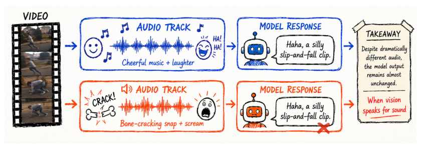
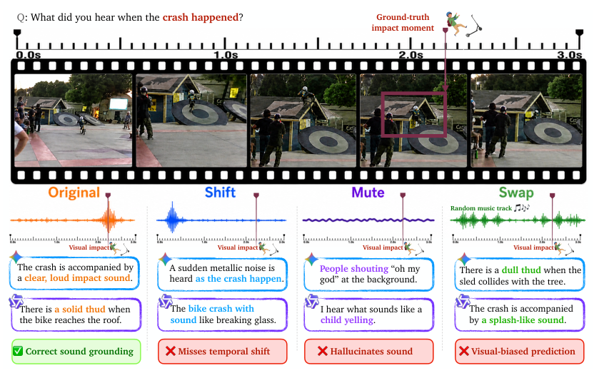
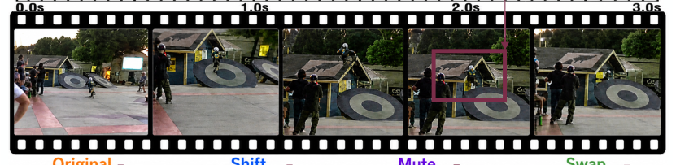
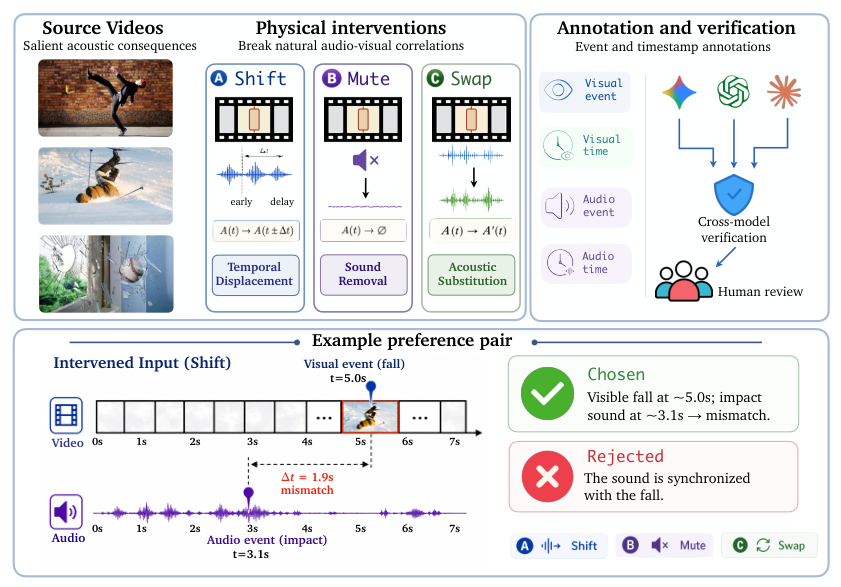
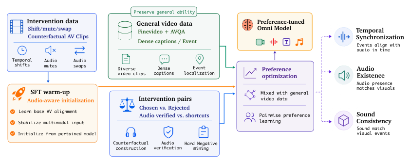
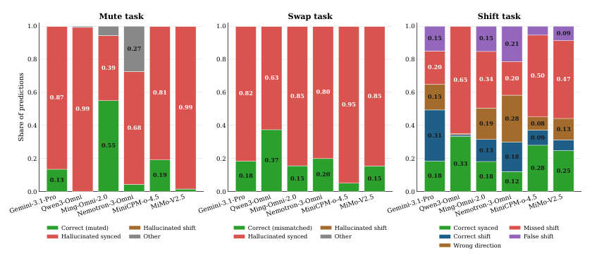
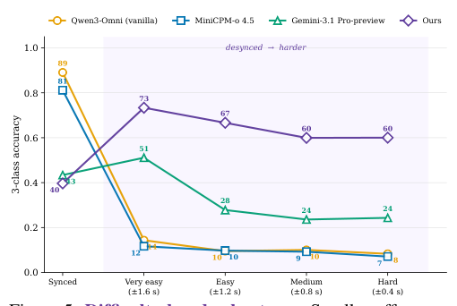
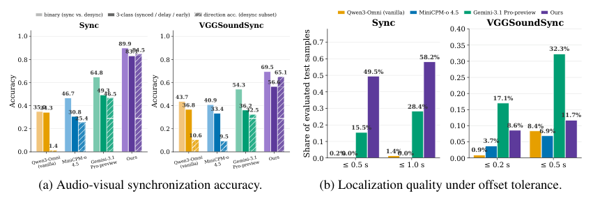
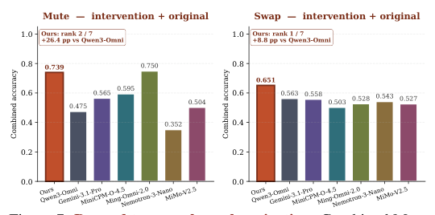
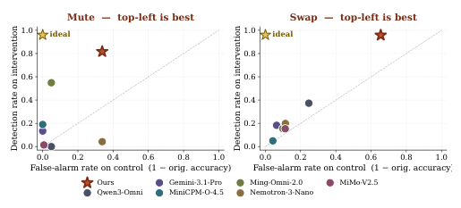

## 论文链接

- 原始论文页面：https://arxiv.org/abs/2605.16403
- PDF 下载：https://arxiv.org/pdf/2605.16403.pdf
- Hugging Face 论文页：https://huggingface.co/papers/2605.16403
- 项目主页：https://rakanwen.github.io/when-vision-speaks-for-sound/
- 开源代码仓库：https://github.com/rakanWen/wvs-code
- 开源代码仓库：https://github.com/deepcs233/Visual-CoT
- 开源代码仓库：https://github.com/eliahuhorwitz/Academic-project-page-template

当视觉替声音发言

> 导读摘要：这篇论文指出，当前很多视频多模态大模型在回答“听到了什么”时，并不一定真的依赖音频，而更像是根据画面去猜一个“合理的声音”。作者把这种现象概括为音视频版的 Clever Hans 效应，并提出 THUD 诊断框架，用 Shift、Mute、Swap 三种反事实音频干预系统拆解模型是否真的做了音频核验。更进一步，论文把这些干预样本转成偏好对齐数据，设计出一套两阶段训练流程，使模型学会先核对音频是否存在、是否同步、是否与画面一致，再回答问题。核心贡献不只是发现问题，而是把“如何测出模型没在听”进一步变成“如何训练模型学会听”。

## 一、论文在质疑什么：模型会谈声音，不等于真的听了声音

这篇工作的出发点很直接：视频模型越来越会描述视听内容，但“会描述”不代表“真的做了音频 grounding”。很多情况下，模型看到一个典型画面——比如摔倒、撞击、玻璃碎裂——就会顺着视觉常识补出一个听起来合理的声音描述，即使真实音轨里没有那个声音、声音时序对不上，甚至音轨来自别的视频。

这一点在论文最开始就被展示得很鲜明。下面这张图里，画面相同，但音轨已经被明显替换；如果模型回答几乎不变，就说明它主要是由视觉先验在驱动作答。

这正是作者所谓“视觉替声音发言”的问题：模型表面像是在做跨模态理解，实际上可能只是利用了自然视频里常见的音画相关性。因为在真实世界数据中，狗通常会叫、撞击通常会有声、张嘴说话通常伴随语音，传统评测如果不破坏这种相关性，就很难看出模型到底是在“验证音频”，还是在“按视觉猜音频”。

论文进一步把这个问题类比为 Clever Hans 效应：模型看起来答对了，但用的是捷径，而不是目标能力本身。这里的捷径不是文本偏见，而是**视觉—语义捷径**：先识别画面事件，再套用“这类事件通常对应什么声音”的经验模式。

作者给出的失败案例非常有说服力。无论是时间错位、静音，还是把音频换成别的事件，现有模型都经常仍然说出“撞击声”“闷响”“破碎声”等看似合理但与真实音轨不一致的内容。

从这张图也能看出，论文不是泛泛而谈“模型音频能力不够”，而是把失效拆成了三类更具体的问题：

- **Shift**：声音和画面是否同步；
- **Mute**：该有的声音是否真的存在；
- **Swap**：声音是否来自与画面一致的事件来源。

这三类失败模式共同指向一个核心判断：模型有没有把音频当作必须核验的证据，而不是可有可无的背景信息。

## 二、THUD 怎么测：用反事实音频干预拆掉视觉捷径

为系统暴露这个问题，作者提出了 THUD，一个干预驱动的诊断框架。它的关键思路不是再收集更多自然视频，而是**有控制地破坏自然音画对应关系**，让只靠视觉先验的模型无法继续“蒙对”。

形式化地看，一段视频可以写成视觉流和音频流的组合。THUD 保持画面不变，只修改音轨，构造三种反事实样本：

1. **Shift**：把音频整体前移或后移，测试时间同步；
2. **Mute**：把音频替换成静音，测试声音存在性；
3. **Swap**：把音频换成另一段视频的音轨，测试音画一致性。

其中，Shift 是最有代表性的，因为它专门测试模型是否真的比较了“看到事件发生的时间”和“听到声音出现的时间”。论文对这一操作的直观解释如下：

这类设计有一个很重要的优点：它不会改变视觉内容，因此如果模型回答变化正确，就更可能说明它确实参考了音频；反之，如果回答仍被画面牵着走，就能清楚暴露其依赖视觉默认值。尤其在 Shift 设置下，模型不能只说“有撞击声”，而必须进一步判断：

- 声音是否同步；
- 如果不同步，是提前还是延后；
- 有时甚至还要估计偏移量是否接近真实值。

这比普通的音视频问答更“刁钻”，但也更接近作者真正想测的能力：**音频核验，而不是事件联想**。

## 三、方法主线：如何把干预样本变成可训练的对齐信号

这篇论文最值得细读的地方，其实不只是 THUD 作为诊断框架，而是作者进一步把这套思路转成了训练信号。也就是说，它不是停留在“测出现有模型有问题”，而是继续追问：**如何让模型改掉只看画面猜声音的习惯？**

作者的方法可以概括为三步：选数据、做标注、造偏好对。

### 3.1 数据从哪里来

论文使用了 Oops 数据集作为主要来源。这个数据集集中包含各种意外事件，如滑倒、碰撞、坠落、物体破裂等，这些视频天然会诱发强烈的声音预期。正因为如此，它们非常适合构造 Clever Hans 风格样本：画面会强烈暗示某种声音，但真实音轨未必支持这种推断。

### 3.2 怎么做标注

作者没有只标一个整体标签，而是为每个样本补充了事件级信息：

- 视觉事件是什么；
- 视觉事件发生在什么时候；
- 对应音频事件是什么；
- 音频事件发生在什么时候。

这些标注决定了后面 Shift、Mute、Swap 的可操作性。尤其时间戳非常关键，因为如果没有可靠的视觉时间和音频时间，就无法严格判定同步、提前或延后。

为了提高标注可靠性，作者采用了跨模型核验再加人工复核的流程：视觉时间由多个模型交叉验证，音频时间则结合模型与人工检查。只有在时间戳一致性达到阈值时，样本才被自动保留；存在分歧的样本再人工修正。

整套数据构建流程可以用下图概括：

这张图特别重要，因为它说明作者的贡献不是简单“做了三种扰动”，而是把扰动样本做成了高质量偏好数据。底层逻辑是：只要能把“正确回答”定义为基于音频证据的回答，把“错误回答”定义为视觉上合理但忽略音频的回答，就可以把视觉捷径显式写进训练目标里。

### 3.3 偏好对是怎么定义的

作者把每个干预样本组织成 chosen–rejected 偏好对：

- **chosen**：明确核验音频与画面的关系；
- **rejected**：语言上很自然、视觉上也很合理，但和真实音轨不一致。

例如：

- 对 Shift，正确回答应指出声音提前或延后；错误回答则声称同步，或把方向说反；
- 对 Mute，正确回答应说明没有听到声音；错误回答则幻觉出本该存在的声音；
- 对 Swap，正确回答应指出声音来源和画面不符；错误回答则接受这个看似合理但实际错配的声音。

这一步非常精妙。以往很多对齐方法只是鼓励模型生成“更好”的答案，而这里的“更好”被定义得非常明确：**不是更流畅，而是更基于音频证据**。这使得反事实干预第一次不只是评测工具，也变成了可训练的监督形式。

## 四、两阶段对齐：先学会听，再避免只会做专项题

如果只用反事实干预数据训练，模型可能会过拟合这类诊断题，出现新的问题：它在 THUD 上分数变高了，但一般视频理解能力下降，或者在正常视频上变得过于敏感，动不动就怀疑音画不一致。作者因此设计了一个两阶段对齐方案。

这个流程可以概括成两句话：

- 第一阶段，用干预数据做 **SFT 预热**，让模型建立“回答前要先核对音频”的习惯；
- 第二阶段，把干预偏好对与通用视频数据混合，做 **偏好优化**，既强化音频验证，又防止模型只会做构造题。

这里通用视频数据并不是普通补充，而是起到类似正则化的作用。作者使用带有事件级时间分段标注的视频数据，让模型在正常视频里也学习“某个时间段看到了什么、听到了什么”，从而保住一般理解能力，避免所谓的对齐税。

从方法角度看，这个设计有三个值得注意的点。

### 4.1 不是“多喂音频数据”，而是“多喂反捷径数据”

论文强调，问题不在于模型从未见过音频，而在于它学会了更省力的策略：看到画面就猜。于是训练的关键不是单纯增加音频样本，而是提供能迫使模型放弃默认同步、默认有声、默认匹配的样本。

### 4.2 干预数据与通用数据分工明确

干预数据负责纠正偏差，通用数据负责保持能力边界。两者混在一起并不是凑数据量，而是在目标上互补：前者提高音频敏感性，后者抑制过度专门化。

### 4.3 三种失败模式并不完全等价

从论文结论看，时间同步、声音存在性、音画一致性虽然相关，但并不是一个统一问题的三个表象。针对 Shift 的训练未必会自然泛化到 Mute 和 Swap，这说明真正的音视频 grounding 包含多个相对独立的核验能力，因此作者才需要分别构造三类干预。

## 五、实验揭示了什么：主流模型普遍存在“默认同步、默认有声、默认匹配”

论文首先用 THUD 测了多种开源和闭源视频模型，结论相当直接：在自然视频上它们看起来表现不错，但一旦进入干预条件，性能明显崩塌。

作者不仅报告总体准确率，还分析了错误分布。这个分析很重要，因为它说明模型不是随机做错，而是在系统性地偏向某些“默认判断”。

从这类结果可以读出几个稳定现象：

- 面对 **Mute**，模型常把静音样本当成“有声音但我能推出来”；
- 面对 **Swap**，模型容易把视觉上合理的音频错当成正确来源；
- 面对 **Shift**，模型经常默认音画是同步的，即使音轨已被前后移动。

换句话说，很多模型的内在策略近似是：**先相信自然世界里通常成立的对应关系，再生成一个语言上合理的解释**。这也解释了为什么传统评测难以发现问题——因为在自然样本里，这种投机策略往往足够有效。

## 六、对齐训练有没有用：有，而且提升集中体现在“真正核验音频”

论文最强的结果来自基于 Qwen3-Omni-30B 的两阶段对齐版本。根据摘要，最佳 10K 配方在 Shift、Mute、Swap 三类干预上的平均表现提升约 28 个百分点，同时在一般视频和音视频问答基准上没有明显退化，部分还有小幅提升。这个结果说明方法并非只是在诊断集上“刷题”，而是在一定程度上纠正了模型的跨模态推理方式。

### 6.1 时间同步能力提升最显著

Shift 是论文着墨最多的一类任务，因为它最能排除视觉先验。作者不仅看“是否同步”的二分类，还看更细的时间判断，如三分类、方向判断、偏移定位等。

这张图说明，在不同错位难度下，基线模型一旦失去“默认同步”的便利，就很容易崩掉；而作者的方法在更细微、更困难的错位条件下仍保持更高准确率。这意味着它学到的不是单纯的阈值规则，而是更认真地比较了视觉事件和声音事件的时间关系。

进一步地，论文还报告了更细粒度的同步分析：

这里可以看到，方法的提升不只体现在“发现不同步”，还体现在：

- 区分提前还是延后；
- 预测偏移方向；
- 让估计出的偏移更接近真实错位量。

这很关键。因为如果模型只是从“总是报同步”改成“总是报不同步”，分数未必就真正说明它会听了。只有在方向和定位上也变好，才能说明模型确实更多依赖了音频时间线。

### 6.2 Mute 与 Swap 也得到改善，但显示出任务的独立性

作者进一步测试了非时序的两类能力：声音是否存在，以及声音是否与画面一致。

结果表明，经过针对性训练后，模型在这两项上也有明显提升，尤其在 Mute 上更能抑制“看画面脑补声音”的幻觉。不过论文也强调，如果没有专门加入对应干预样本，仅靠时间同步训练，这些能力的提升会比较有限。也就是说，模型学会判断“不同步”，并不自动意味着它也会判断“根本没声”或“声音来源不对”。

这个发现其实很有价值：它提示未来音视频对齐不能只把所有错误都归结为“跨模态理解差”，而应拆成多个可操作、可针对训练的子能力。

### 6.3 方法没有靠“多报异常”取胜

还有一个容易被忽略的问题是：如果一个模型变得很敏感，它可能在所有视频里都更容易报异常，这样在干预集上也许会涨分，但在正常样本上会制造大量误报。作者专门检查了这个权衡。

图中的理想位置是左上角：既能抓住干预，又不误伤原始正常视频。作者的方法整体更靠近这个区域，说明它不是简单变得“更激进”，而是更能有依据地核验音频。对于实际系统来说，这一点很重要，因为真正有用的模型不应在正常视频里到处怀疑音画错配。

## 七、这篇论文真正推进了什么

从表面看，这篇论文是在做一个新诊断集；但更深一层，它推进的是对视频多模态模型“音频理解”这一能力的定义方式。

过去人们常默认：只要模型能围绕视频说出和声音有关的内容，就说明它懂声音。本文则指出，这个判断标准太宽松，因为模型完全可能是在利用视觉事件和声音类型之间的统计相关性。THUD 的意义就在于，把“真的懂”拆成了更可验证的三件事：

- 是否确认声音真的存在；
- 是否确认声音和画面在时间上对齐；
- 是否确认声音的来源与画面一致。

方法上，论文最有启发性的地方是把反事实干预转成偏好优化信号。这样一来，诊断不再只是验尸工具，而成为训练时可直接利用的对齐资源。相比“让模型看更多带声音的视频”，这种做法更针对问题本身，因为它明确教会模型：**哪些回答只是视觉猜测，哪些回答才是核验过音频的结论。**

如果用一句话概括全文主旨，那就是：这篇论文并不是在问“模型能不能描述声音”，而是在问“模型有没有把声音当证据”。而作者给出的回答是，当前很多模型还没有；但通过 THUD 及其两阶段对齐方案，这件事是可以被系统改善的。
