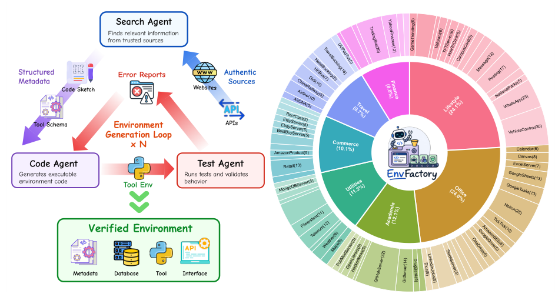
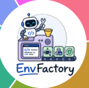
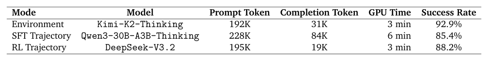
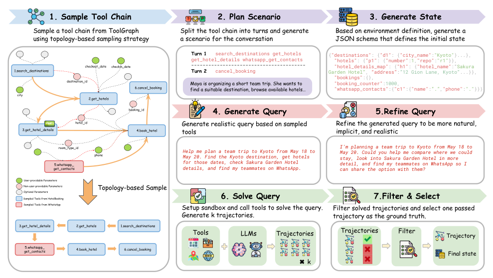
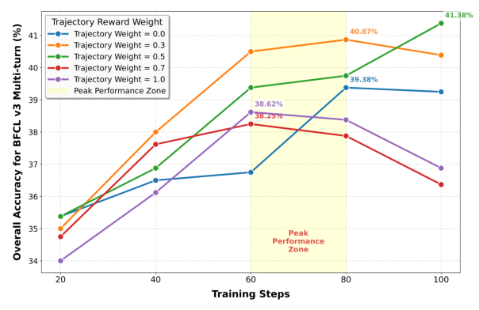
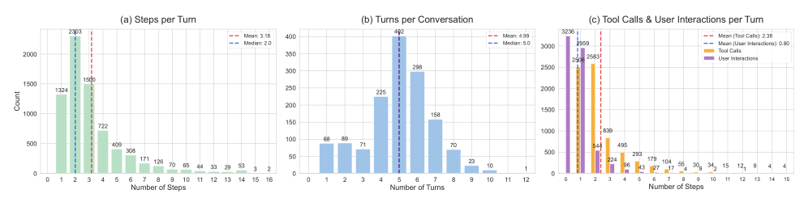
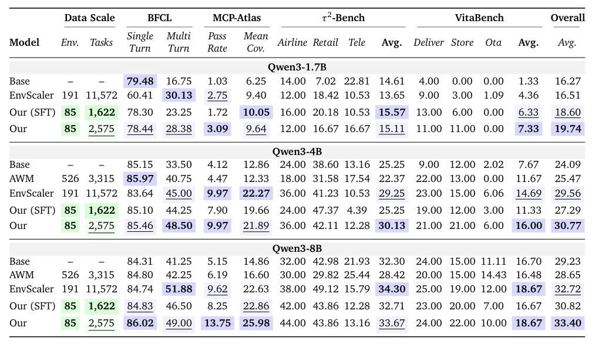
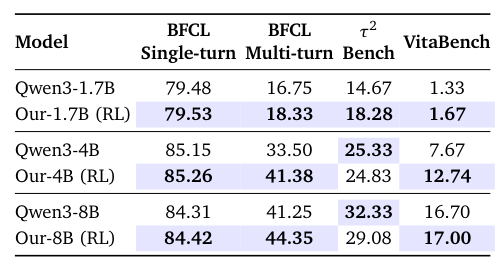
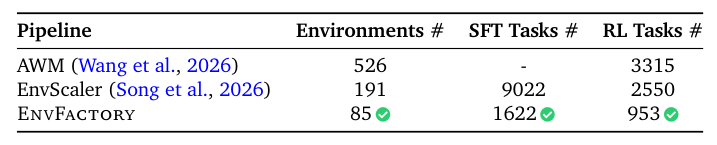

## 论文链接

- 原始论文页面：https://arxiv.org/abs/2605.18703
- PDF 下载：https://arxiv.org/pdf/2605.18703.pdf
- Hugging Face 论文页：https://huggingface.co/papers/2605.18703

EnvFactory：通过可执行环境合成与鲁棒强化学习扩展工具使用智能体

> 导读摘要：这篇论文要解决 Agentic RL 的两个老问题：一是训练工具智能体时，缺少既真实又稳定、还能大规模扩展的执行环境；二是缺少像真实用户那样“话说得少、意图却很隐含”的训练轨迹。作者提出 EnvFactory，把“自动造环境”和“自动造多轮任务”合在一条流水线里：先从真实在线资源中发现工具生态，自动实现带状态数据库与可执行接口，再构建工具依赖图，用拓扑感知采样生成可执行的工具链，最后把它改写成更自然的多轮用户请求。结果是，只用 85 个已验证环境和 2575 条轨迹，就能显著提升 Qwen3 系列模型的工具使用能力，并在 BFCLv3、MCP-Atlas、τ²-Bench、VitaBench 等基准上取得稳定收益。

## 一、论文到底在补哪块短板

工具使用智能体的训练，表面上看是模型问题，实际上常常卡在“环境”和“数据”两端。

一方面，真实 API 或 MCP 环境当然最接近实际应用，但它们贵、慢，而且联网执行的不稳定性会干扰 RL。另一方面，纯 LLM 模拟器虽然便宜灵活，却容易幻觉，导致训练出来的策略未必能迁移到真实工具生态。还有一类做法是代码沙箱里的合成环境，这条路更适合大规模训练，但很多已有工作仍然依赖预收集文档、静态任务集，或者只支持单轮、无状态交互。

数据侧的问题更隐蔽。真实用户往往不会把任务写成“先查 A，再算 B，最后填 C”的步骤清单；他们通常只说一个含糊但合理的目标，剩下的依赖补全、条件推断、信息串联，需要智能体自己做。可现有大量合成轨迹为了提高通过率，往往把任务写得过于显式，像“操作说明书”而不像真实意图。这种数据虽然容易验证，却不太适合训练真正的决策能力。

因此，这篇论文的核心判断是：**Agentic RL 的规模化，不只是需要更多轨迹，而是需要能持续产出“可执行环境 + 自然多轮任务”的自动化基础设施。**

## 二、EnvFactory 的整体结构：先造环境，再造任务，再用 RL 学策略

论文把整个系统拆成两个主模块：

- **EnvGen**：自动构建可执行、可验证、带状态的工具环境
- **QueryGen**：基于这些环境生成自然的多轮工具使用轨迹

从训练视角看，它的流程可以概括成：

1. 自动发现真实在线资源，提炼环境草图；
2. 构建数据库模式、工具接口与 Python 实现；
3. 通过测试闭环不断修正，留下已验证环境；
4. 从所有工具中构建依赖图；
5. 用拓扑感知采样抽取一条逻辑自洽的工具链；
6. 再把工具链包装成多轮用户对话、环境初始状态和可验证求解轨迹；
7. 用这些数据做 SFT，再进一步做 RL。

这也是论文最值得注意的一点：它不是单纯“合成一些任务”，而是把任务背后的执行世界也一起合成出来，并且要求这个世界可运行、可测、可复现。

上图很适合理解 EnvFactory 的定位。左侧是环境构建主线：Search Agent 负责找真实来源并提出环境方案，Code Agent 负责把这些方案落成数据库和工具代码，Test Agent 则生成测试用例、报告错误，再把反馈送回实现环节。关键不是一次生成成功，而是三类代理形成闭环，直到环境可验证为止。右侧的分布信息则说明，作者并不是只做少数 demo，而是在多个领域里构造了具备一定工具规模的环境池。

论文最终构建出 **85 个已验证环境、842 个工具，覆盖 7 个领域**，包括 commerce、finance、travel、office、lifestyle、research、utilities。这个规模不算夸张，但它强调的是“每个环境都能真实执行、带状态、可测试”，而不是只堆数量。

作为补充，文中还有一张同主题图，进一步强调环境生成是可重复扩展的循环过程，而不是手工拼接示例。

这张图的重要性在于，它把论文的“方法价值”从模型训练前移到了基础设施层：如果环境本身不稳、不真、不可批量扩展，那么后续的轨迹生成和 RL 奖励都会失真。

## 三、EnvGen：如何从真实资源自动长出一个带状态工具环境

EnvGen 的目标是，从空环境池出发，自动加入一个新的环境  
\( e = (m, D, \pi, V_e) \)：

- \(m\)：元数据，包括环境描述、工具定义、工具 schema
- \(D\)：状态数据库模式
- \(\pi\)：工具的可执行 Python 实现
- \(V_e\)：暴露给智能体的工具接口

### 1. 方案提出：从真实资源而不是静态文档出发

Search Agent 不直接照着现成任务集扩写，而是先看当前环境池里缺什么，再去外部资源中找具有代表性的功能来源，例如网站、API 文档、技术说明、使用示例等。然后它把这些资源整理成结构化草图，包括：

- 环境描述
- 可能包含的工具集合
- 每个工具的输入输出 schema
- 任务场景的功能边界

这个设计的意义在于：环境并非从抽象“题目模板”反推，而是从真实在线工具生态中恢复出来，因此更容易覆盖未见过的工具组合，也更贴近未来部署场景。

### 2. 数据库建模：把工具行为落到可变状态上

拿到元数据后，Code Agent 会构建状态数据库 \(D\)。这里的重点不是简单存一些静态字段，而是让环境支持真正的**状态变更**：

- 实体关系要明确
- 中间状态要可序列化
- 持久记录要可加载、可导出
- 不同 rollout 间要能隔离 session

作者使用标准化 schema 来定义参数、记录和状态，使训练中的每一次交互都能在一个一致、可复现的世界里执行。这对 RL 很关键，因为奖励信号必须建立在稳定的状态转移上。

### 3. 代码实现：把工具 schema 变成真实可调用接口

在有了元数据和数据库模式之后，Code Agent 会实现每个工具的 Python 逻辑，并暴露统一接口给智能体使用。论文默认使用 MCP 风格的工具接口。

这里有两个难点：

- 工具功能要和元数据描述一致
- 工具执行要和状态数据库一致

如果工具 schema 很漂亮，但执行逻辑和状态变化不匹配，那么后续自动生成的轨迹即使“看起来合理”，也会在真正执行时失败。

### 4. 测试验证：让环境构建进入闭环

Test Agent 会自动生成测试案例，对工具行为进行校验，并返回错误报告。然后系统再根据这些错误修订代码和状态设计。也就是说，环境构建不是“LLM 一次写完代码”，而是典型的 generate-test-revise 循环。

这个验证环节是论文与很多“只做合成数据”的工作拉开差距的地方。因为 Agentic RL 要依赖环境提供反馈，如果环境自己都不可靠，RL 过程就会学到奇怪的策略。

为了说明整条流水线的成本和可扩展性，论文给出了环境构建与任务合成的资源统计。

从方法理解上，可以把这张图再次视为“质量保障”的证据：Search、Code、Test 三个环节都不是装饰，它们共同决定了环境是否足够稳，能不能承载后续 RL。

更具体的成本侧信息见下表。

这张表的作用不是展示性能分数，而是回答一个很现实的问题：**这种自动化流程到底贵不贵、稳不稳、能不能规模化复用？** 论文用 token 消耗、时间和成功率说明，EnvFactory 虽然比简单 prompt 合成更重，但它换来的是可执行、可验证的环境与轨迹，这种成本在 Agentic RL 场景里是合理的。

## 四、QueryGen：如何把工具链变成自然、多轮、可验证的用户请求

环境有了之后，第二个核心问题是：如何从一堆工具里生成真正适合训练的任务？

作者的答案不是随机挑几个工具拼起来，而是先构建一个**依赖工具图**，再用**拓扑感知采样**得到一条逻辑可执行的工具链，最后把这条工具链包装成自然对话。

这张图非常关键，因为它完整展示了 QueryGen 的流水线：先决定“该用哪些工具、以什么依赖顺序使用”，再生成场景、初始状态、用户请求、语言改写、执行验证和样本筛选。前半段保证任务可做，后半段保证任务像真实人会提出的问题。

### 1. 依赖工具图：先表示“哪些工具能接上哪些工具”

对每个工具 \(v\)，作者关心其输入空间 \(I(v)\) 和输出空间 \(O(v)\)。如果一个工具的输出能满足另一个工具的输入，那么它们之间就可能存在依赖边。

已有工作常见两种构图方法：

- 只看参数和描述的语义相似度，快但浅
- 让 LLM 显式推理依赖关系，灵活但贵且不稳定

这篇论文采用折中方案：先做语义匹配，再用 LLM 辅助修正，从而构建更可靠的依赖图 \(G\)。

### 2. 拓扑感知采样：不是随机游走，而是递归补齐依赖

这是全文方法层最核心的创新之一。

传统做法常在依赖图上随机走几步，得到一串工具序列。但真实多工具任务往往存在这样的情况：某个工具需要的输入，不是来自上一个工具，而是需要由更早的多个工具共同准备。随机游走很容易采到“局部合理、整体不可执行”的链。

作者提出的拓扑感知采样策略会在选择某个工具前，**递归检查它的输入是否已经满足**。若未满足，就继续向前采样能够提供这些输入的前置工具，直到依赖全部闭合。这样得到的工具链满足一个重要条件：

- 每个必需输入，要么直接来自用户，要么来自前面某个工具的输出

因此，最终得到的工具序列不只是“有关联”，而是可真正执行的任务骨架。

这一步带来的收益很直接：

- 工具链逻辑更连贯
- 多工具任务更容易闭环
- 后续生成用户请求时，不必强行把依赖写成显式说明
- RL 环境中的成功执行率更高

### 3. 生成场景、初始状态与查询

在采样出工具链之后，QueryGen 会继续补全任务上下文：

- 设计对话场景
- 生成初始环境状态
- 形成用户请求
- 再对语言进行改写与校准

这里特别重要的是，作者不满足于“把工具链翻译成自然语言”，而是专门让请求变得更像真实用户：

- 隐去过度显式的中间步骤
- 压缩操作说明
- 注入合理歧义
- 保留隐式意图
- 在必要时扩展现实目标约束

例如，真实用户更可能说“帮我挑一个下周去上海最省心的方案，预算别太离谱”，而不是完整枚举“先查航班、再查酒店、再比较地理位置、再做预算合计”。EnvFactory 追求的是前一种表达。

### 4. 执行求解与筛选：只留下真正站得住的轨迹

生成查询后，系统会在环境里真正执行求解，再根据执行结果筛掉有问题的样本。于是最终留下的轨迹同时满足两点：

- 在环境中可执行、可验证
- 对用户来说又足够自然，不是机械指令

这一点解释了为什么论文能在较小数据规模下仍有不错效果：它生成的不是“便宜的大量模板任务”，而是“有逻辑闭环、语言自然、可真实执行”的训练样本。

## 五、训练设计：SFT 与 RL 如何配合，以及奖励为何不能只看结果

基于 EnvFactory，作者合成了：

- **1622 条 SFT 轨迹**
- **953 条 RL 轨迹**

总计 **2575 条** 多轮、多步任务。

训练上，论文并不把 SFT 和 RL 对立起来，而是把它们看成两个连续阶段：

1. 先用高质量合成轨迹做 SFT，学会工具调用格式和基础交互模式；
2. 再在可执行环境中做 RL，进一步优化决策过程与长期工具使用策略。

这一设计和实验结果高度一致：直接 RL 能带来提升，但通常**先 SFT 再 RL**更稳、更强。

### 1. 为什么 RL 奖励不能只看终态

工具使用任务有个特点：同一个目标往往存在多条正确路径。只要最后状态对了，不代表中间过程合理；反过来，中间过程像参考轨迹，也不代表最终真的完成了任务。

所以作者设计了复合奖励，综合考虑：

- **轨迹匹配**：执行过程与参考解是否大体一致
- **最终状态一致性**：任务结果是否真的达成
- **长度惩罚**：避免无谓冗长、低效调用

这个设计非常贴合工具智能体的训练现实。因为在多工具场景里，模型既要“做成”，也要“做得像一个会用工具的人”，而不是盲目穷举调用。

下图给出了不同奖励权重下的消融结果。

图里最核心的信息是：极端地偏向“只看结果”或“只看过程”都不理想，中间权重更好。这说明 RL 的收益并不只是来自有环境可跑，还来自奖励设计准确刻画了工具任务的多解性。对这类任务来说，正确答案不是唯一动作序列，因此奖励必须在过程约束与结果正确之间找到平衡。

### 2. 合成轨迹本身的复杂度长什么样

论文还统计了生成对话的结构分布。

这组统计图支持一个重要结论：EnvFactory 生成的数据并非全是一步完成的简单样本，也不是特别冗长的复杂流程，而是以**中等复杂度的多轮交互**为主。每轮中工具调用通常多于用户补充，这说明它确实在训练“借助工具完成任务”的能力，而不是靠用户不断明确指令来降低难度。

从训练角度看，这种复杂度分布很合理：太简单的数据学不到真正的链式决策，太复杂又会让训练噪声过大。EnvFactory 在这两者间取了一个比较实用的平衡。

## 六、实验结果：为什么说它体现了“少而精”的数据效率

这篇论文最有说服力的地方，不是绝对分数多高，而是**它用更少的环境，换来了更强的训练收益**。

### 1. 主结果：更少环境，整体仍优于强基线

主结果表明，EnvFactory 在多个 benchmark 上都取得了稳定增益。论文摘要中给出的代表性结果是：

- BFCLv3 最高提升 **15%**
- MCP-Atlas 最高提升 **8.6%**
- 对话型 benchmark（含 τ²-Bench、VitaBench）最高提升约 **6%**

而这些提升是在仅 **85 个已验证环境** 的前提下获得的。作者特别强调，许多并行工作往往使用约 **5 倍** 的环境规模。这意味着 EnvFactory 的优势不只是“做得更多”，而是“每个环境和每条轨迹更值钱”。

### 2. 直接 RL 也有效，但不如 SFT+RL 稳健

这张表展示了直接用 RL 训练时的收益。可以看到，多轮工具使用能力确实会提升，尤其在 BFCL 这类强调多步调用的任务上更明显。但整体来看，RL 单独使用的收益通常不如先用高质量轨迹做 SFT，再进一步 RL 来得稳健。

这恰好反过来支持了 EnvFactory 的双模块设计：它并不是只为 RL 服务，QueryGen 生成的高质量轨迹本身就足以作为很好的后训练数据；而可执行环境又让这些轨迹可以继续转化为 RL 信号。

### 3. 数据效率：不是堆环境数量，而是提高单位环境产出

这张表特别能体现论文的工程判断。EnvFactory 不是追求“我有多少环境”，而是追求“每个环境是否足够真实、可执行、可支持稳定任务合成”。结果就是：即使环境数更少，它仍能产出成体系的 SFT 和 RL 训练数据。

换句话说，作者想证明的是：**高质量的已验证环境，比大批粗糙环境更能支持 Agentic RL。**

## 七、这篇论文最值得记住的三点

第一，EnvFactory 把两个经常被分开处理的问题统一了：**环境构建**与**轨迹生成**。这不是单一算法小改，而是把 Agentic RL 的数据和执行基础设施一起自动化。

第二，方法上真正的亮点是**拓扑感知采样**。它显式处理工具输入输出的递归依赖，让生成出来的多工具任务不只是“语义相关”，而是逻辑可执行。这一步直接决定了后续任务能否自然、能否闭环。

第三，实验传达了一个很重要的结论：对于工具智能体训练，**环境真实性、状态一致性和轨迹自然性，比单纯扩大环境数量更重要**。EnvFactory 用更少环境取得更强结果，本质上是在证明“少而精”的环境与数据更适合训练可泛化的工具使用策略。

如果把这篇论文放在更大的脉络里看，它提供的不是又一个 benchmark 上的提分技巧，而是一种更完整的 Agentic RL 生产方式：先自动造出可靠的世界，再在这个世界里造出像真实人类会提出的问题，最后让模型在其中学会真正的工具使用。
