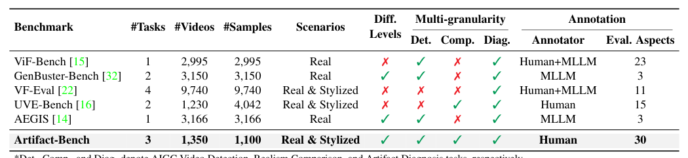
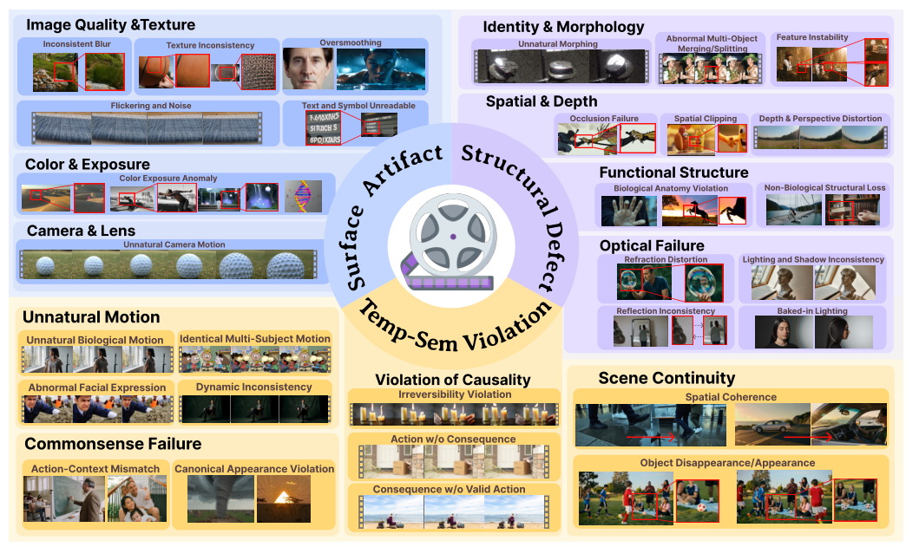
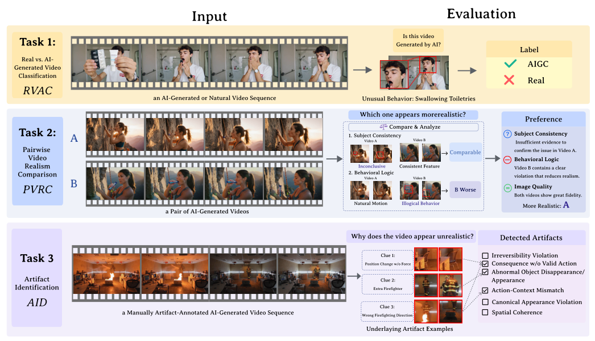
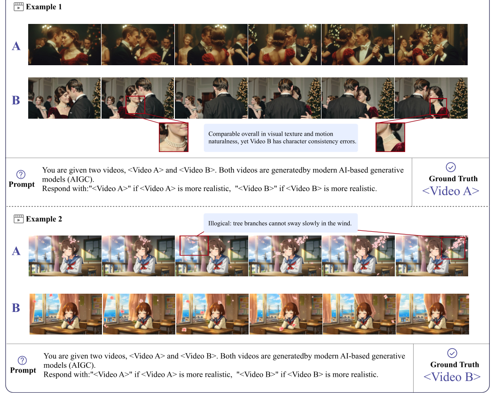
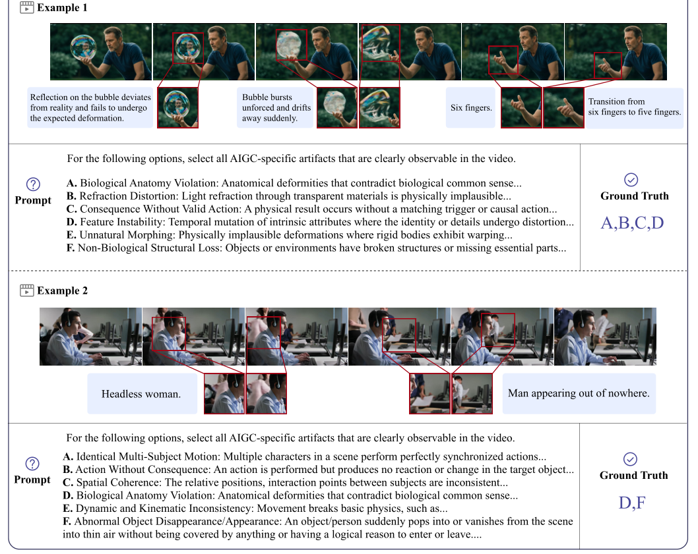
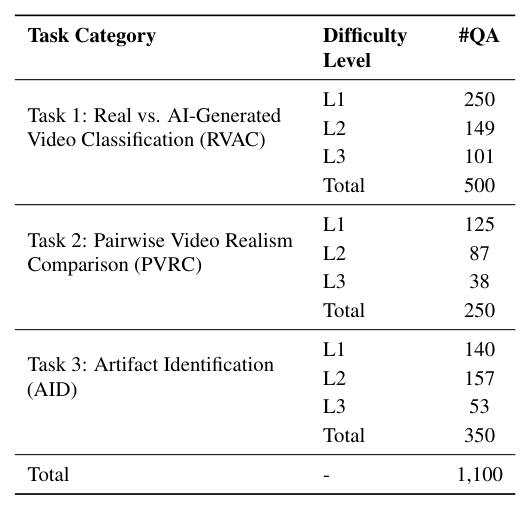
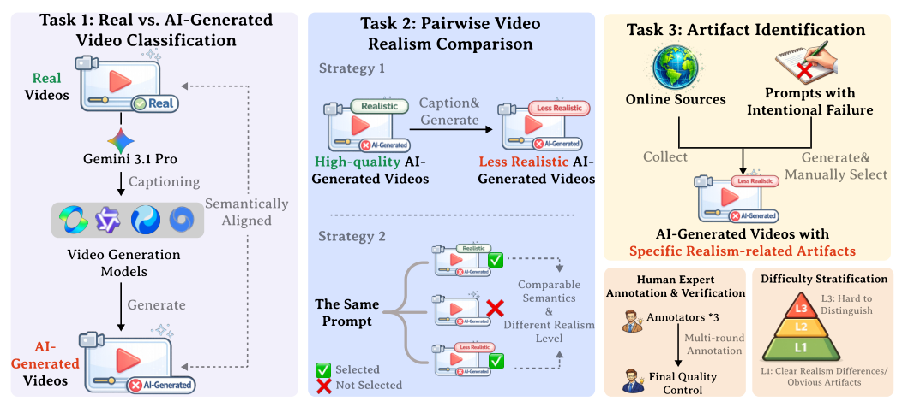
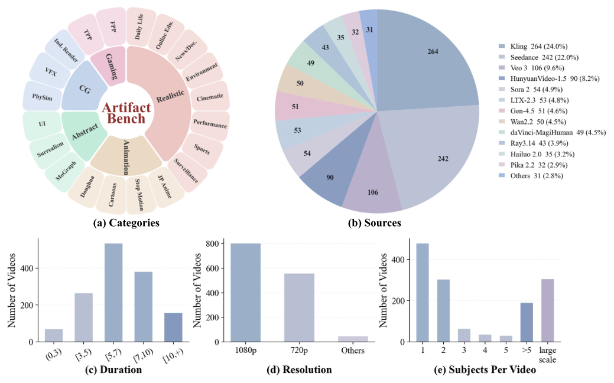
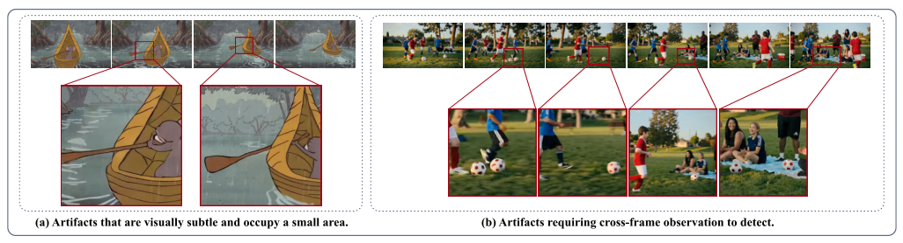
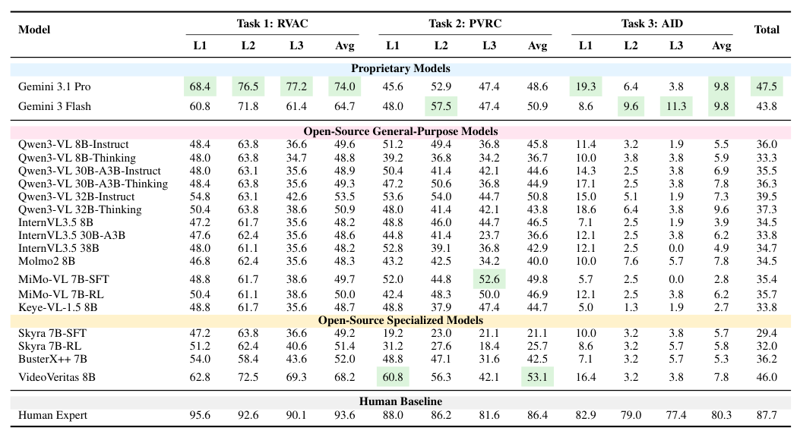

## 论文链接

- 原始论文页面：https://arxiv.org/abs/2605.18984
- PDF 下载：https://arxiv.org/pdf/2605.18984.pdf
- Hugging Face 论文页：https://huggingface.co/papers/2605.18984

Artifact-Bench：评估多模态大语言模型检测与分析 AI 生成视频伪影能力的基准

> 导读摘要：这篇论文提出了一个专门衡量 MLLM 是否真正理解“AI 生成视频为什么不真实”的基准 Artifact-Bench。它的关键不只是收集真假视频，而是先把视频伪影系统化为三层级、30 类可诊断标签，再据此设计真假判别、成对真实感比较、细粒度伪影识别三类渐进任务，并用语义对齐生成、定向失败诱导、人工复核和难度分层来构建数据。实验覆盖 19 个主流模型，结果显示当前模型在粗粒度判断上尚可，但一旦进入细粒度、跨帧、因果与结构层面的伪影诊断，性能明显失速，且与人类真实感偏好存在显著错位。

## 一、论文要解决的核心问题

视频生成模型这两年进步很快，很多 AI 视频在单帧视觉上已经足够“像真”。但只要把注意力放到连续帧、局部结构、物理合理性或语义连贯性上，问题仍然很多，比如：

- 物体形状前后漂移
- 人体结构不合解剖
- 反射、折射、阴影关系错误
- 多帧之间目标数量变化
- 事件结果缺乏因果依据
- 镜头切换前后内容不一致

论文关注的不是一般视频质量，而是**AI 生成过程特有的真实感伪影**。作者认为，若想评估 MLLM 是否能成为可靠的 AI 视频评估器，就不能只问“这是不是 AI 生成”，还必须进一步问：

1. 它能否在语义相近的样本中看出哪段更真实？
2. 它能否明确指出“不真实”究竟体现在哪些伪影上？
3. 它的判断是否真的来自伪影感知，而非语义先验、风格偏好或数据偏差？

这正是 Artifact-Bench 的切入点。与现有基准相比，它不是单点测试，而是把检测、比较、诊断串成一条递进主线。表格对比能看出作者补的是哪块空白：不仅覆盖真实与风格化视频，还同时纳入难度分层、多粒度任务和人工标注支持。

## 二、方法起点：先把“伪影”变成可操作的分类体系

这篇论文的方法核心，首先不是任务，而是**taxonomy**。如果没有一套稳定的伪影分类，后面的评测就很容易退化成主观打分或开放式描述，难以比较模型能力。

作者通过人工迭代分析公开可得的 AIGC 视频，覆盖照片级、动画、CG 等多种风格，反复归纳常见失败模式，最后建立了一套三层级体系：

- **顶层**：三大伪影域  
  - 表层视觉缺陷
  - 结构性缺陷
  - 时序—语义违例
- **中层**：失败家族  
  例如颜色与曝光、相机与镜头、身份与形态、空间与深度、运动与因果等
- **底层**：30 个细粒度伪影类型  
  如纹理不一致、深度透视畸变、解剖错误、反射不一致、跨镜头连贯性错误、不可逆事件违例等

这套体系有几个重要设计点。

### 1. 从“哪里不对”走向“为什么不对”
很多评测只要求模型说视频“不自然”，但这种回答过于粗糙。Artifact-Bench 试图把“不自然”拆解成可诊断标签，让模型必须落到具体失真模式上。

### 2. 不是单标签，而是多标签
同一个视频可以同时存在多个问题。比如一个人物在运动时，既可能有人体结构异常，也可能伴随身份特征漂移和时序不连续。作者因此把标注做成多标签形式，更贴近真实失败样本。

### 3. 三个顶层域对应三种能力深度
- 表层视觉缺陷更多依赖局部外观线索
- 结构性缺陷要求理解物体、空间和功能组织
- 时序—语义违例则要求跨帧整合和一定常识推理

这也是后文实验中最关键的观察基础：模型在不同层级上的落差，能帮助判断它究竟强在表面识别，还是具备更深的真实感理解。

## 三、三类任务如何逐步逼近“真实伪影理解”

在 taxonomy 之上，作者设计了三个互补任务，分别对应从粗粒度感知到诊断推理的能力递进。

### 1. RVAC：真实/AI 视频分类
这是最基础的一层，任务是判断输入视频究竟是真实拍摄还是 AI 生成。它测试的是最粗粒度的真实性识别能力。

但作者并没有把这层任务当成终点，因为单纯二分类很容易让模型借助内容偏差、风格线索或训练集记忆取巧。

### 2. PVRC：成对视频真实感比较
这里两段视频都可能是 AI 生成，模型需要选出**哪一段更真实**。这样一来，问题就从“会不会识别 AI 痕迹”变成“能不能比较微妙的真实感差异”。

这个设计很关键，因为它降低了语义和题材的干扰空间，迫使模型更多依赖细微伪影。图中的代表性样例就体现了这一点：比较依据不是画面主题，而是身份一致性、环境运动是否合理、局部稳定性是否持续。

### 3. AID：细粒度伪影识别
这是最难也最有诊断价值的任务。模型面对一段视频，需要从候选列表中选出实际出现的伪影类型。和开放式生成回答相比，这种形式一方面保留了诊断粒度，另一方面又便于稳定量化。

AID 直接对应作者提出的 30 类底层标签，因此最能测出模型是否真的学会“看见并归因”伪影，而不是只产生模糊的负面评价。示例中可以看到，答案往往涉及多个层次的问题同时出现，例如结构错误、光学异常、因果违例和属性漂移。

为了更清楚呈现评测框架，论文还将三类任务按 L1、L2、L3 做了难度组织。这个设计意味着作者不满足于一个总体平均分，而是希望检验模型在不同真实感强度下的敏感性与鲁棒性。

整体上，这三个任务形成了一条很清晰的主线：

- RVAC 测“能否察觉异常”
- PVRC 测“能否比较异常轻重”
- AID 测“能否解释异常来源”

这也是本文方法设计最有价值的地方：它把“检测”与“诊断”明确区分开来。

## 四、数据构建：如何避免模型靠语义取巧

一个评测基准是否有效，很大程度取决于它的数据构造是否真的把问题压到“伪影感知”上。论文在这部分下了很大功夫。

作者采用的是混合式构建流程，核心目标有两个：**语义对齐**和**伪影可控**。

### 1. 真实视频与语义对齐生成
对于 RVAC，作者不是简单找一批真实视频再随便拼一批 AI 视频，而是尽量让 AI 视频与真实视频在语义层面对应。做法大致是先从真实视频生成描述，再用这些描述去驱动生成模型产生语义相近的 AI 版本。这样，模型更难依靠“内容本身”判断真假。

### 2. 生成视频之间的成对比较
对于 PVRC，需要控制两段视频的语义相近，只让真实感差异成为主要变量。作者会利用高质量生成视频、同提示词重生成等方式构造对比对，使“哪段更真实”的答案尽量建立在伪影多少与轻重上。

### 3. 定向诱导失败样本
对于 AID，仅靠自然采样可能很难覆盖足够全面的细粒度伪影，所以作者会通过带失败倾向的提示设计、筛选和人工审查，得到更具代表性的伪影样本。这使得 30 类标签不只是理论划分，而能真正落到可观察的视频上。

### 4. 多轮人工标注与质检
论文强调该基准的人类参与度较高。标注流程不是一次性给标签，而是结合人工检查、专家复核与一致性控制，尽量保证样本难度和标签可信度。

### 5. 难度分层
作者把样本进一步划分为不同难度等级，用来区分：
- 伪影是否明显
- 真实感差异是否微弱
- 是否需要更强的时空整合
- 是否需要因果或常识支持

这种设计让后续实验不再只是“平均准确率谁更高”，而是能追问：模型是否真的随着难度提升而稳定退化，或者出现不符合人类感知的异常波动。

为了说明基准覆盖面不是集中在单一数据源，论文还统计了内容类别、视频来源、时长、分辨率和主体数量等分布。可以看到，它既包含真实感视频，也覆盖动画、CG 等非照片级风格，并且 AI 视频来自多种主流生成模型，这有助于减少特定风格或特定生成器偏差。

## 五、为什么这个问题难：瓶颈在细粒度与跨帧感知

论文专门用失败案例解释了一个重要事实：很多伪影并不是“语义不懂”，而是“看不到、跟不住、连不起来”。

一个例子是局部空间穿插错误，比如船桨与船体发生不合理交叉。问题区域可能只占整帧很小一部分，如果模型主要依赖稀疏帧采样、全局摘要或大区域表征，就很容易漏掉。

另一个例子是目标数量在多帧中不一致，比如球从两个变成一个又变回两个。单看某一帧并不明显，必须做跨帧追踪才能识别。这类问题直接挑战当前很多视频 MLLM 的时序建模方式：它们往往能概括“发生了什么”，却未必能稳定维护对象级状态。

这恰好解释了 Artifact-Bench 为什么要把 AID 单独拎出来，也解释了为何 PVRC 这种相对比较任务同样必要。因为很多时候，模型并非完全看不出问题，而是：
- 看到了局部异常但无法归类
- 察觉到不自然但无法比较轻重
- 能说出语义内容，却无法维护结构和时序一致性

因此，论文的方法设计并不是为了“让题更复杂”，而是为了把这几类能力差异显性化。

## 六、实验结果：粗粒度尚可，细粒度诊断明显失速

作者在 19 个主流 MLLM 上做了评测，结论相当直接：**当前模型离“可靠的 AI 视频真实感评估器”还有明显距离。**

整体结果表明，即便是表现最好的模型，总分也并不高；不少模型在更难设置下接近随机，甚至低于随机。这说明它们并没有形成稳定的伪影感知机制。

从任务层面看，趋势尤其清楚：

- **RVAC**：部分模型还能做出一定程度的真假区分
- **PVRC**：一旦比较两段都像 AI 生成的视频，性能开始明显波动
- **AID**：要求指出具体伪影类型时，几乎所有模型都大幅下滑

这组结果支撑了论文的核心论断：很多模型也许能感觉“哪里不太对”，但难以稳定回答“到底哪里不对”。而一旦任务涉及：

- 多帧对象跟踪
- 结构畸变识别
- 光学关系判断
- 因果与常识一致性
- 多标签联合诊断

模型能力就会迅速暴露短板。

此外，论文还指出一个更值得警惕的问题：**模型判断与人类感知偏好存在显著失配**。也就是说，哪怕模型在某些题上答对了，它也未必是按人类真实感标准在做判断，而可能依赖了别的统计线索。这一点非常关键，因为论文的目标并不是训练一个“会做题”的评测器，而是检验 MLLM 是否具备与人类对齐的真实感理解。

## 七、这篇论文的方法价值在哪里

这篇工作最有价值的地方，不只是又提出了一个 benchmark，而是把“AI 视频伪影评测”从松散问题变成了一个结构化方法框架。

可以把它的贡献概括成三层：

### 1. 概念层：把伪影系统化
作者给出了三层级、30 类标签的诊断体系。它让“视频不真实”从主观印象变成可分析对象，这对后续评测、数据标注、模型训练都很重要。

### 2. 任务层：把能力拆分开测
RVAC、PVRC、AID 三类任务分别对应识别、比较、诊断，避免了以单一二分类成绩替代全部真实感能力。

### 3. 数据层：尽量控制语义偏差
通过语义对齐、成对生成、定向失败诱导、人工复核和难度分层，作者尽可能把模型注意力逼向真正的伪影线索，而不是题材、风格或数据捷径。

这也意味着 Artifact-Bench 不只是一个“排行榜工具”，更像是一套分析框架。它能帮助研究者回答更细的问题，例如：

- 模型到底弱在局部感知还是时序整合？
- 弱在发现异常，还是弱在归因分类？
- 对风格化视频的泛化是否更差？
- 与人类偏好不一致时，偏差来自哪里？

## 八、读完后应记住的结论

第一，当前 MLLM 的通用视频理解能力，并不等于它具备**伪影感知与诊断能力**。这篇论文用分层任务清楚地证明了两者之间存在明显鸿沟。

第二，评测 AI 视频真实感，不能只看真假分类。真正困难、也真正有价值的部分，在于比较细微真实感差异，以及指出不真实的具体成因。

第三，Artifact-Bench 的意义在于提供了一套更接近人类判断过程的评测路径：先察觉异常，再比较优劣，最后诊断原因。实验结果则表明，现阶段模型大多还停留在前两步的边缘，距离稳定、可解释、与人类对齐的真实感评估仍有不小距离。
