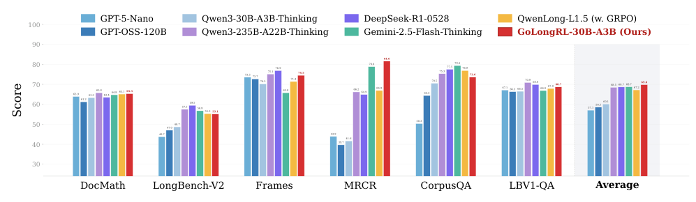
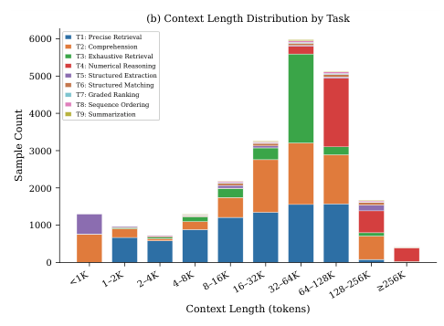
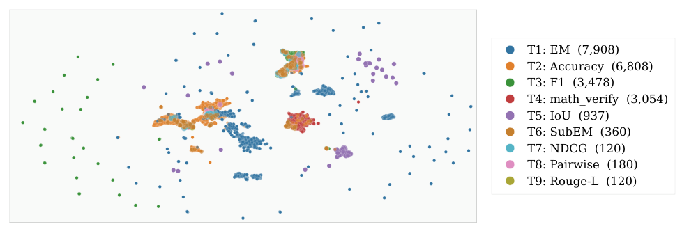
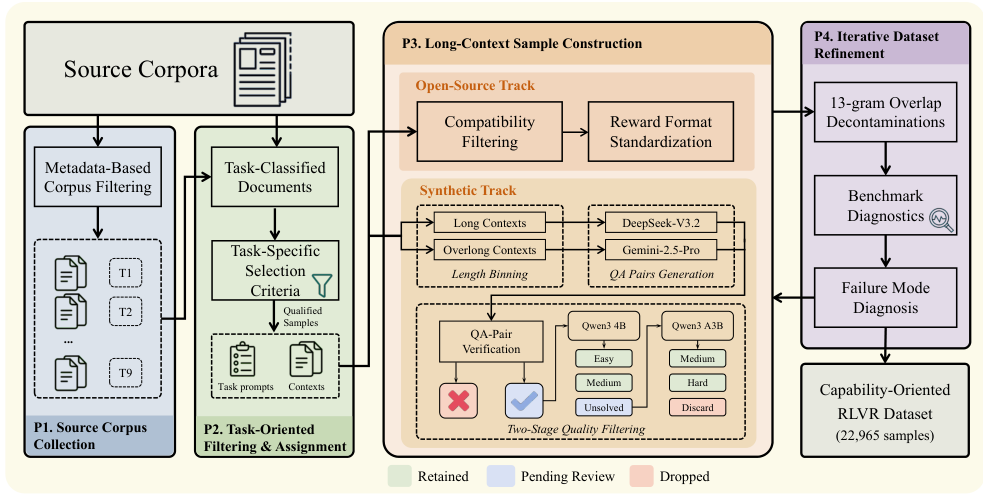
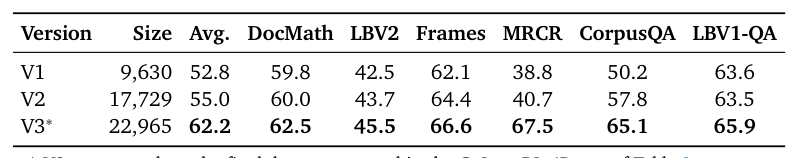
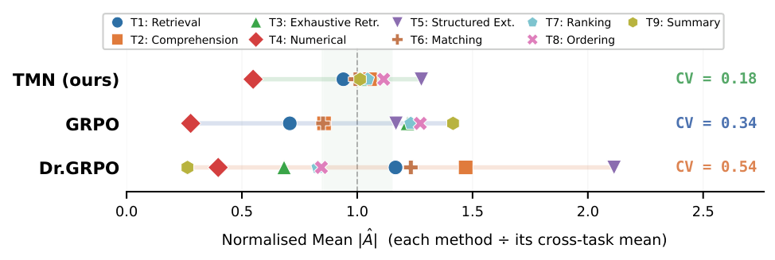
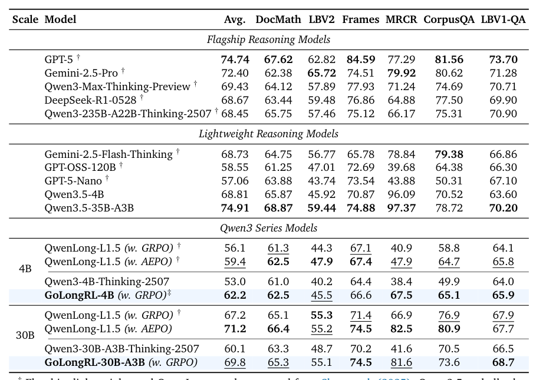
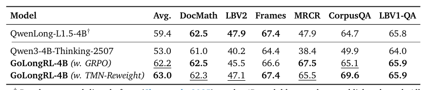
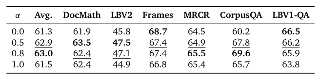
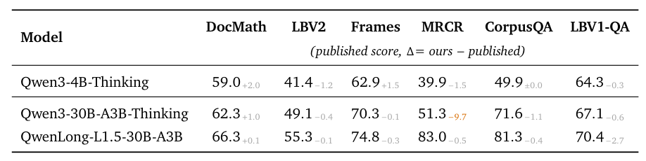

## 论文链接

- 原始论文页面：https://arxiv.org/abs/2605.19577
- PDF 下载：https://arxiv.org/pdf/2605.19577.pdf
- Hugging Face 论文页：https://huggingface.co/papers/2605.19577
- 项目主页：https://huggingface.co/collections/Kwai-Klear/golongrl

GoLongRL：面向能力的长上下文强化学习与多任务对齐

> 导读摘要：这篇论文把长上下文强化学习的两个核心瓶颈拆开来解决：一是训练数据不能只围绕“更复杂的检索路径”打转，而要真正覆盖长文理解所需的多种能力；二是多任务奖励异构时，标准 GRPO 很容易被奖励尺度和样本难度带偏。作者据此提出 GoLongRL：先构造一个覆盖 9 类任务、约 23K 样本、保留自然奖励函数的开源 RLVR 数据集，再用 TMN-Reweight 做跨任务奖励对齐与难度自适应加权。结果表明，数据设计本身就能带来大幅提升，而 TMN-Reweight 还能进一步把多任务训练变得更稳、更均衡。

## 一、论文要解决的不是“更长”，而是“长上下文能力”本身

这篇论文的出发点非常明确：长上下文后训练的主要问题，不是模型看不见足够长的输入，而是**训练信号没有真正覆盖长上下文所需的能力空间**。

以往很多长上下文 RL 工作，会把数据设计重点放在检索链路上，例如多跳检索、chunk 定位、UUID 链追踪等。这类做法当然有用，但也容易把训练目标收窄成“在很长的上下文里找东西”。问题在于，真实长文任务远不止检索，还包括：

- 跨段理解与整合
- 穷举式信息收集
- 数值推理
- 结构化抽取与匹配
- 排序
- 序列恢复
- 长文摘要

如果训练数据长期只强化一种检索范式，模型学到的就更像“长文搜索技巧”，而不是全面的长上下文能力。

作者因此提出一个很重要的转向：**从能力分类出发设计数据，而不是从造长输入的技巧出发设计数据。**  
这也是 GoLongRL 名字里 capability-oriented 的核心含义。

从整体结果上看，这种思路不是概念包装，而是能转化成可测的收益。下面这张总览图给出了最直观的结论：GoLongRL 在多个长上下文基准上进入第一梯队，不只是某个单项任务涨分，而是整体平均分显著提升。

这张图最值得看的其实是最右侧平均分：它说明作者的方法不是在某一类题型上“刷榜”，而是跨检索、阅读理解、聚合等多种能力都获得了更稳定的提升。也正因为如此，论文后面的数据构建和多任务优化才值得细看。

## 二、GoLongRL 的第一条主线：按能力而不是按模板构造 RLVR 数据

论文最核心的方法贡献之一，是构造了一套**能力导向的长上下文 RLVR 数据集**。作者开源了约 22,965 条样本，覆盖 9 个任务类型，上下文长度从 0.1K 到 256K token。

这 9 类任务并不是随意拼出来的，而是对应作者理解中的长上下文核心能力。更关键的是，**每种任务都配自己的自然奖励函数**，而不是强行统一成一个简单的 EM 或准确率。比如：

- 检索或抽取任务可用 EM / F1
- 排序任务更自然地用 NDCG
- 摘要任务用 ROUGE-L 更合理

这一步很重要。因为如果把所有任务都压成单一二元奖励，很多本该保留的细粒度结构就会丢失。排序任务最典型：输出顺序有“部分正确”和“相对更优”的差别，用 EM 会把这些都抹平。

从分布上看，这套数据也不是只在某几个长度区间堆量。作者专门展示了任务类型与上下文长度的联合分布，可以看到 9 类任务分散在多个长度带上，尤其集中在 4K 到 256K 这个最需要长上下文能力的区间。

这张图支持了论文的一个隐含判断：如果数据只集中在某个固定长度或者单一题型，多任务训练的意义会被大幅削弱。GoLongRL 则刻意让不同能力在不同长度尺度上都被看到，这样模型学到的更可能是“如何使用长上下文”，而不是“如何适配一种模板”。

除了长度覆盖，作者还用语义空间投影来说明这 9 类任务确实具有明显差异，而不是同一类问答的改写版。UMAP 投影显示，不同任务大多能形成相对独立的簇，说明这套数据在语义目标上确实是多样的。

这张图的意义在于，它从另一个角度证明了“能力导向”不是口号：如果不同任务全混在一起，那多任务很可能只是表面上的；但现在能看到相对分离的语义簇，说明不同任务确实在给模型施加不同类型的学习压力。

## 三、四阶段数据流水线：不是简单收集数据，而是系统化生产训练信号

论文把数据构建流程设计成一个四阶段闭环，这比“拼一批长文本 QA”要系统得多。整套流程的关键目标，是同时保证三件事：

1. 能力覆盖足够广  
2. 奖励可验证  
3. 数据质量可持续迭代

作者给出的流程图很能说明这一点。

按论文描述，这四个阶段可以概括为：

### 1. 来源收集

先从两类来源建立原材料池：

- **开源标注样本**：来自已有长上下文语料和基准，带天然监督信号
- **真实文档上的合成样本**：从书籍、论文、多轮对话等真实文档中生成 QA 或结构化任务

作者强调，他们尽量避免“先合成长文档，再在上面出题”的做法，而是优先使用真实文档。这是因为模板化合成文本很容易产生可利用的表面规律，比如段落边界、格式模式等，模型可能学会投机，而不是真的学会长程理解。

### 2. 按能力任务筛选与分配

这一步不是按来源分桶，而是按任务能力映射。也就是说，一份原始文档会被判断更适合做哪类长上下文能力训练，而不是统一转成某种问答格式。

这一步直接决定了数据集不是“数据来源的拼盘”，而是“能力目标明确的训练集合”。

### 3. 样本构造与多阶段质控

开源轨道和合成轨道在这里分开处理：

- 对已有标注样本，重点是标准化与适配 RLVR 训练格式
- 对合成样本，重点是生成、校验、过滤、难度控制

由于 RLVR 依赖可验证奖励，所以样本构造时必须保证答案或目标输出能够被规则可靠评估，否则训练奖励就会失真。

### 4. 基于基准诊断的迭代修正

这一步很像“数据工程化”的关键闭环。作者不是做完一版数据就结束，而是根据 benchmark 诊断、失败模式分析和污染检查，对数据继续补齐与清洗。

这种迭代式构建的收益，在数据版本实验里体现得很明显。随着数据从 V1 到 V3 持续扩充与修订，4B 模型的平均成绩持续上升，而且不是只有个别任务在涨分。

这里最值得注意的是：性能提升跟着“数据集版本成熟度”一起走，说明改进并不只是样本数量增加，更来自任务覆盖、质量控制和样本难度分布的逐步优化。这一点很符合作者的核心论点：**长上下文 RL 的第一瓶颈，首先是数据。**

## 四、TMN-Reweight：用任务级对齐与难度加权解决异构多任务优化

GoLongRL 的第二条主线是算法。作者认为，哪怕数据已经覆盖了多种能力，直接用标准 GRPO 去做异构多任务 RL，仍然会遇到两个优化问题。

### 问题 1：不同任务的奖励尺度和方差不一致

长上下文任务的奖励函数本身就不同：EM、F1、NDCG、ROUGE-L 的数值分布、方差结构都不一样。标准 GRPO 若直接按 prompt 内部统计量做 advantage 归一化，容易让某些高方差任务产生更强梯度，从而主导训练。

### 问题 2：不同 prompt 难度下的 advantage 估计会偏

GRPO 常见写法中，advantage 依赖当前 prompt 下多次采样奖励的均值与标准差。这样做在单任务里都可能引入难度偏置；到了异构多任务场景，这种偏差还会和任务尺度问题叠加。

为了解决这两件事，作者提出 **TMN-Reweight**，也就是任务级均值归一化加难度自适应重加权。

### 1. TMN：任务级均值归一化

核心思想是：不要只在单个 prompt 内部做归一化，而是引入**任务级统计量**，让同一任务内部的奖励尺度先被拉到相对可比的范围，再去参与整体优化。

这样做的目标不是把所有任务“做成一样”，而是减少奖励尺度天然不同带来的训练失衡。作者特别强调，这比简单抹掉难度差异更合理，因为他们希望保留 prompt 之间“难不难”的信息，只是不希望任务间尺度差异干扰优化。

TMN 的直接效果，就是让不同任务贡献的 advantage 幅度更接近。下面这张图展示了三种优势估计方式下，各任务的归一化平均绝对 advantage 分布。TMN 的任务间波动最小，整体更集中在 1 附近。

这张图非常关键，因为它不是最终任务分数，而是直接把方法作用点可视化出来了：GoLongRL 不是“靠调参碰巧更好”，而是在优化层面确实让多任务训练信号变得更均衡。

### 2. Reweight：基于平滑通过率的难度自适应加权

只做尺度对齐还不够，因为训练中还有另一个问题：**太容易的样本会提供冗余信号，太难的负样本可能又不稳定**。于是作者进一步根据样本的平滑通过率来做重加权，把更有信息量的“较难正样本”权重提上来，同时压低已经学会的简单样本。

这一步可以理解为：  
TMN 先解决“不同任务说话音量不一样”的问题，Reweight 再解决“哪些样本更值得听”的问题。

作者把这两步组合成 TMN-Reweight，本质上是在 advantage 估计层面同时处理：

- 跨任务奖励尺度对齐
- 跨样本难度信息利用

从实验上看，这种组合优于普通 GRPO，也优于只改 difficulty bias 的一些变体，因为它更贴合异构多任务 RLVR 的场景设定。

## 五、实验结果说明：数据贡献是主因，TMN-Reweight 提供进一步增益

论文实验里一个非常清晰的结论是：**哪怕先不谈新算法，只换成 GoLongRL 的能力导向数据，性能就已经显著提升。**

不同模型规模上的主结果对比说明了这一点。无论 4B 还是 30B，使用 GoLongRL 数据训练后的模型，都明显优于对应基座模型，也整体超过了同规模的 QwenLong-L1.5（GRPO）。

这个结果支撑了论文最强的判断之一：长上下文 RL 的收益，首先不是来自“更复杂的训练技巧”，而是来自**训练数据有没有真正覆盖能力空间，以及奖励有没有保留任务语义**。

在此基础上，TMN-Reweight 又继续往上推了一步。作者专门做了对照：同样用 GoLongRL 数据，只替换 advantage 估计方法，从普通 GRPO 换成 TMN-Reweight，平均分还能继续提升。

这里最好把贡献拆开理解：

- **数据贡献**：把训练目标从单一路径检索扩展为九类能力任务，已经能带来主增益
- **算法贡献**：在这些异构任务共同训练时，TMN-Reweight 让优化更稳、任务间更平衡，因此进一步提高平均表现

也就是说，GoLongRL 不是“单点 trick”，而是一个比较完整的 recipe：  
先让训练数据值得学，再让优化过程学得稳。

最终 30B 模型的表现也说明，这套开放方案并不只是“小模型练手”，它已经能把 Qwen3-30B-A3B 推到接近 DeepSeek-R1-0528 和 Qwen3-235B-A22B-Thinking-2507 这一梯队的长上下文水平。这也是图 1 最有说服力的地方：方法收益足够大，以至于能在部分任务上逼近更大或更强的模型。

## 六、为什么这篇论文值得关注：它把长上下文 RL 从“题型工程”推向“能力工程”

除了主榜结果，论文还检查了一个实际很重要的问题：做长上下文 RL 之后，模型会不会伤到原本的通用能力？作者给出的结论是，至少在他们的设定下，这种副作用并不明显，甚至部分能力还有迁移增益。

这里尤其值得看记忆相关任务：agentic memory 和长对话记忆有较明显提升。这说明 GoLongRL 学到的并不只是“长文定位答案”的局部技巧，而更像是**在长程信息中保持、筛选、整合和回忆关键信息的能力**。这和它的数据构建理念是一致的。

另外，论文也给出了统一的训练超参数设置，并说明两种模型规模共用一套 RL 配置。

这类信息虽然不直接贡献新思想，但对理解论文很关键：它意味着作者尽量把收益归因到“数据设计 + TMN-Reweight”，而不是每个模型都各自细调出一套参数。对于一篇方法论文来说，这会让结论更可信，也更方便社区复现。

## 总结

GoLongRL 最值得记住的，不是它又做了一个长上下文 RL 数据集，而是它提出了一种更像“能力工程”的长上下文后训练范式：

- **数据层面**：先定义长上下文需要哪些能力，再按能力组织任务与奖励，而不是只造更复杂的检索路径。
- **优化层面**：面对异构任务，不能默认 GRPO 直接可用，需要显式处理跨任务奖励尺度与样本难度偏差。
- **结果层面**：数据覆盖本身就是主要增益来源，TMN-Reweight 则进一步把这种多任务训练做稳、做均衡。

如果只用一句话概括这篇论文，那就是：**长上下文强化学习的关键，不只是让模型“读得更长”，而是让它在长上下文里系统地学会检索、理解、聚合、排序、抽取与总结。**
