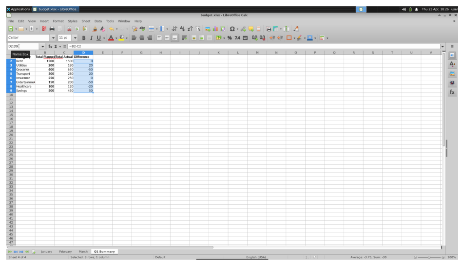
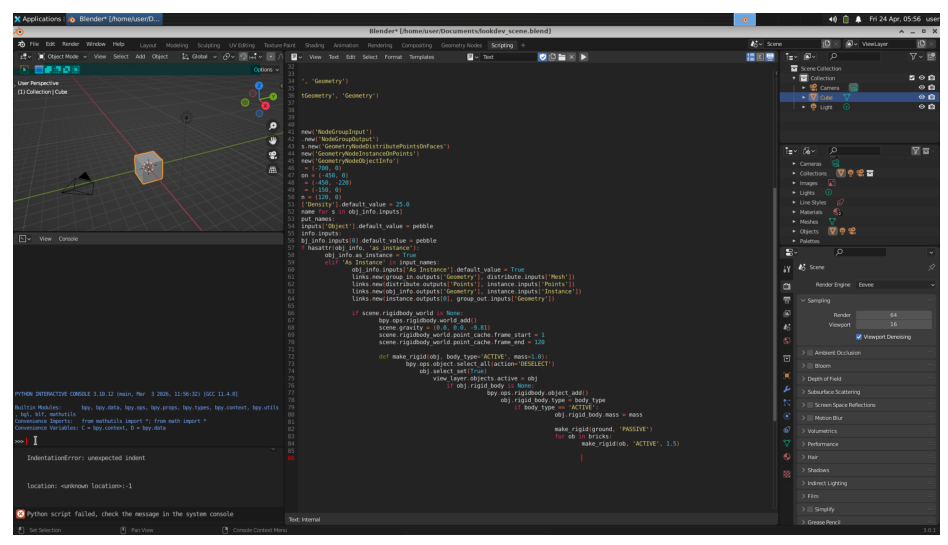
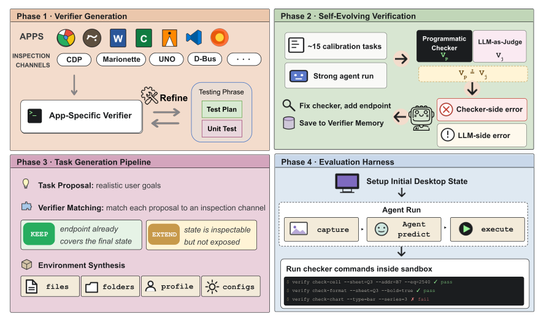
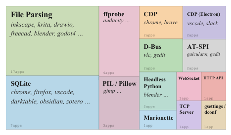
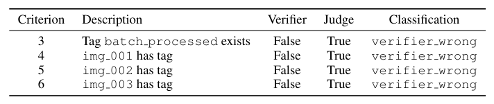
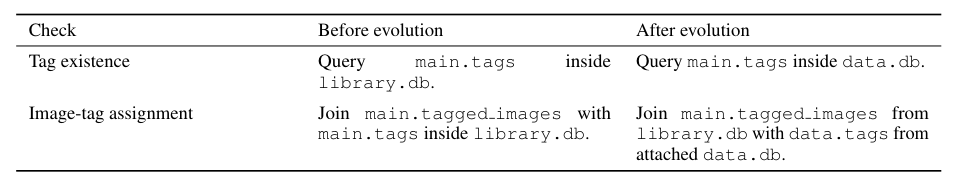
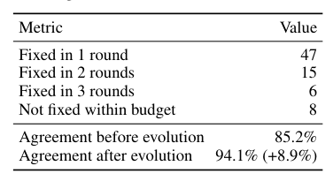
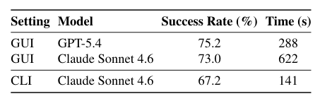
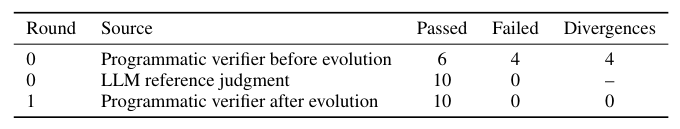
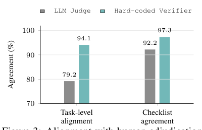

## 论文链接

- 原始论文页面：https://arxiv.org/abs/2605.19769
- PDF 下载：https://arxiv.org/pdf/2605.19769.pdf
- Hugging Face 论文页：https://huggingface.co/papers/2605.19769

OpenComputer：面向计算机使用智能体的可验证软件世界

> 导读摘要：这篇论文的重点不是再做一个桌面任务基准，而是提出一种“以验证器为中心”的软件世界构建范式：先为真实应用建立可程序化读取内部状态的验证器，再据此生成可执行环境、可检查任务和可审计奖励。OpenComputer 目前覆盖 33 个桌面应用、1000 个任务，实验表明它的程序化验证比 LLM 裁判更接近人工判断，也更能暴露当前计算机使用智能体在真实桌面自动化中的稳健性缺口。

## 问题不在于“有没有任务”，而在于“任务能否被可信评测”

计算机使用智能体近来进展很快，但桌面环境始终有两个很顽固的瓶颈。

第一，**任务构造很贵**。一个看似简单的桌面任务，背后常常需要提前准备文件、文件夹、浏览器历史、文档内容、邮件、项目目录、软件配置等初始状态，而且这些状态必须既真实、又可复现。仅写一句自然语言指令远远不够，真正麻烦的是把这句话落成一个可执行的软件世界。

第二，**任务验证更难**。桌面任务的成败往往不只体现在截图上，而是藏在应用内部状态、文件内容、元数据、数据库记录、历史记录和持久化副作用里。只看最终屏幕，很多“看起来差不多”的结果其实是错的；而如果改用 LLM 当裁判，又会遇到提示词敏感、观察不完整、不可复现、难审计等问题。

论文用两个很直观的例子说明这件事。电子表格任务里，智能体可能把本应填入两个单元格的内容误写进同一个单元格；从截图上看几乎像是完成了，但底层状态是错的。终端任务更极端，真正决定成败的常常是日志、退出码和生成文件，而不是最后一帧界面。

这也是 OpenComputer 的出发点：**不要把验证当成最后补上的评分脚本，而要把“可验证性”前置成环境生成与任务设计的基本约束。**

## 方法总览：先建验证层，再生成任务，再做评测

OpenComputer 的总体框架可以概括成四个阶段，而且它们不是松散拼接，而是一条围绕验证收紧约束的流水线。

核心对象是一个任务实例 \(\tau=(x,e,c)\)：其中 \(x\) 是给智能体看的任务描述，\(e\) 是环境初始化过程，\(c\) 是一组可机器检查的成功条件。论文的关键主张是，只有当一个用户目标既能被落成真实环境，又能被程序化检查时，它才配成为一个合格的桌面任务。

因此，系统先做的不是“生成题目”，而是：

1. 为每个应用建立专属状态验证器；
2. 用真实执行反馈持续修补验证器；
3. 只生成那些既真实、又可实例化、且能被验证器检查的任务；
4. 在沙箱中运行智能体，并依据检查项计算可审计奖励。

这套思路和很多已有基准的差异非常明显。后者往往把奖励设计成手写检查器，或者退回到截图+LLM 裁判；而 OpenComputer 则把验证层变成整个软件世界构建的“地基”。

## 验证栈：面向真实应用状态，而不是面向截图外观

OpenComputer 最重要的方法贡献，是它的应用专属验证栈。每个支持的应用都会配一个合成的 Python 验证模块，在沙箱内以 CLI 子命令形式暴露结构化 JSON 接口。它并不只检查“最终文档长什么样”，而是尽量覆盖这个应用所有稳定、可读取的状态表面：内容、偏好设置、插件、历史、书签、工程结构、媒体属性、元数据等。

这幅图很好地说明了作者的设计原则：**不同应用走不同的可靠检查通道**。浏览器可走调试协议，办公软件可走文档解析或对象接口，某些应用可直接检查 SQLite 数据库，另一些则依赖 D-Bus、AT-SPI、文件解析或无头 Python 接口。也就是说，OpenComputer 不追求统一格式的“万能裁判”，而是追求**按应用选择最稳的状态观测接口**。

围绕这个思路，验证器构建大致分成三步：

- **枚举可检查状态面**：先分析某个应用究竟有哪些状态是任务中常用、且能稳定读取的。
- **为每个状态面匹配检查通道**：例如文档内容走文件解析，浏览器历史走 profile 数据库，配置项走系统设置接口。
- **实现 query 与 check 端点**：前者负责暴露结构化状态，后者负责把任务标准落实为布尔或分项判断。

论文还强调，验证器不是随手写的脚本，而是被当作真正的软件工件来开发：有端点说明、有测试计划，也有单元与集成测试。这一点很关键，因为一旦验证器不稳，后续任务生成、训练奖励和评测结论都会被污染。

## 自进化验证：把“判分器出错”从系统里分离出来

即便如此，验证器也不会一开始就完美。真实桌面软件状态复杂、接口多变、版本差异多，错误常常不是智能体执行失败，而是验证器读错了地方、查错了字段、做错了假设。OpenComputer 的第二个关键创新，就是引入一个**自进化验证层**。

它的基本闭环是：

1. 构造一批校准任务；
2. 让强智能体在真实沙箱里执行；
3. 同时收集程序化验证结果与 LLM 参考判断；
4. 对二者的分歧做归因；
5. 若问题出在验证器一侧，就修补端点、检查逻辑或文档；
6. 继续迭代。

这个设计的精华不在“让 LLM 来代替验证器”，而在于**利用分歧去发现验证器自身的问题**。换句话说，LLM 在这里更像调试参考，而不是最终裁判。

论文给了一个很具体的 darktable 案例：任务其实已经完成，但程序化验证器把若干标签相关条件判错了。分歧分析把责任定位到 verifier，而不是 agent。本质问题不是评分标准有误，而是验证器读取了过时的数据位置或错误的数据关联方式。

从结果上看，这种机制不仅能定位错误来源，还能提高修复效率与一致性。论文报告，自进化过程中的大部分问题都能在少量迭代内修复，修完之后验证结果与人工判断的一致率显著提高。

如果想看更细的单任务示例，darktable 的标签检查修复前后也展示得很清楚：初始验证器漏判了多项条件，更新逻辑后就能重新和参考判断对齐。

这部分方法上的意义很大。传统评测里，一旦自动评分与人工不一致，往往只会把它记成“噪声”或“个例”；OpenComputer 则把这类不一致制度化地纳入一个可迭代修复流程。于是验证层不再是静态规则库，而是一种能随着真实执行反馈不断校正的基础设施。

## 任务生成：只保留“真实、可造、可检”的目标

在验证层稳定之后，OpenComputer 才进入任务合成。这里的关键不是“让模型随便编任务”，而是让任务生成受验证器约束。

论文把环境构造视为一个受限合成问题：给定应用和用户目标，系统需要产生一组彼此匹配的元素——用户可读指令、环境初始化脚本、以及与之严格对应的成功条件。一个目标若想被采纳，至少要满足三件事：

- **真实**：像真实用户会提出的目标，而不是为了评测硬造的谜题；
- **可实例化**：系统确实能自动准备出所需的软件环境和数据；
- **可检查**：最终状态能被现有验证器可靠判定。

这意味着 OpenComputer 的任务生成并不是开放式自由创作，而是一种受验证能力支配的筛选式合成。验证器先定义了“哪些状态能可信地看见”，任务生成器再只围绕这些状态去设计世界与目标。这正是论文所谓 verifier-aware synthesis 的含义。

这样做的结果，是环境、任务和奖励三者天然配套：环境中的对象和初始状态不是人工拼出来的孤立样本，而是为了通向某种可检查目标而构造；奖励也不是后补的启发式分数，而是由检查项直接计算出来的可审计部分分。

这类设计对训练和评测都很重要。因为现实桌面任务往往不是非黑即白的，智能体可能完成了大半流程，却在一个关键状态上出错。OpenComputer 记录完整轨迹，并按检查项给部分分，使得失败不再只是“0 分黑箱”，而是可分析、可复盘的结构化结果。

## 实验结果：验证器更可信，而智能体仍远未过关

OpenComputer 最终落成了一个覆盖 33 个桌面应用、1000 个任务的软件世界，涉及浏览器、办公工具、创作软件、开发环境、文件管理和通信应用等多个类别。实验层面有两类结果尤其值得注意。

第一类是**评测本身是否可信**。在一个 120 任务的比较集上，作者把硬编码验证器与 LLM 裁判都拿去和人工裁决对齐，结果很明确：无论是任务级还是检查项级，程序化验证器都更接近人工判断。

这说明 OpenComputer 的核心方法假设是成立的：对于依赖细粒度应用状态的桌面任务，程序化读取真实状态，比从截图或文本描述中“猜测完成度”更可靠。

第二类是**当前智能体到底做得怎么样**。论文报告，最强前沿模型的整体完成率虽已不低，但端到端成功仍不饱和。GPT-5.4 约为 68.3%，Claude-Sonnet-4.6 为 64.4%，Kimi-K2.6 为 58.8%。更值得注意的是，开源模型在这个基准上的表现相对既有桌面基准会出现明显下滑。

这背后的含义并不只是“这个基准更难”，而是：**一旦把评测建立在真实可检查的软件状态上，而不是较松的视觉代理信号，很多模型原本看起来不错的桌面能力会被重新校准。** 它们往往能推进流程、取得部分分，但在跨应用细节、持久化状态正确性、鲁棒完成度上仍有明显缺口。

## 这篇论文真正留下了什么

OpenComputer 的最大价值，不是任务数量，也不只是覆盖了多少应用，而是把桌面软件世界的构造逻辑重新组织了一遍：

- 先定义什么状态能被可信观察；
- 再围绕这些可观察状态构建验证器；
- 再用验证器约束任务与环境生成；
- 最后才谈训练奖励和模型评测。

这种“先验证、后生成”的路线，实际上给计算机使用智能体提供了一套更稳的基础设施视角。它解决的是一个比“刷榜”更底层的问题：**如何让真实软件世界中的任务既大规模生成，又能被可信地自动判分。**

从结果看，这套框架也顺手给出了一个不太乐观但很清晰的结论：即便是最强的前沿模型，距离稳健的真实桌面自动化仍有明显距离。它们能做对不少步骤，却还不够可靠地把任务真正做完。而 OpenComputer 的意义，恰恰在于它把这种差距用更可信的方式量化了出来。
