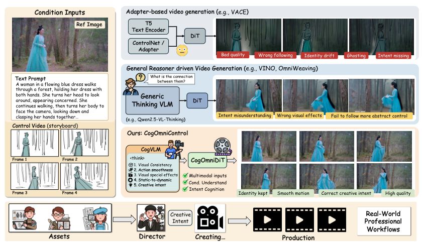
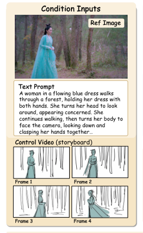
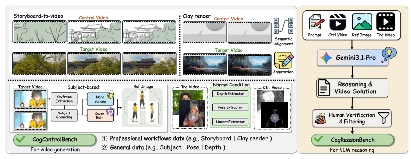
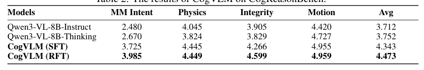
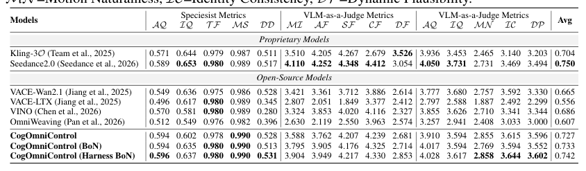
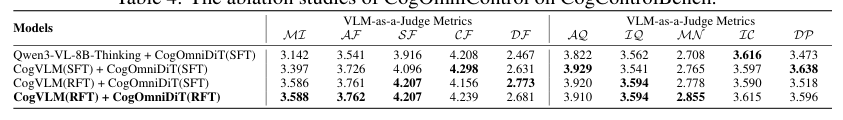
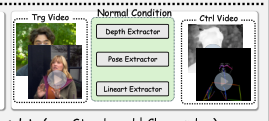
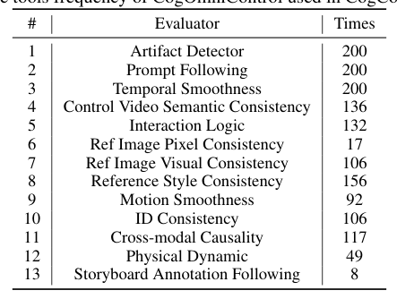
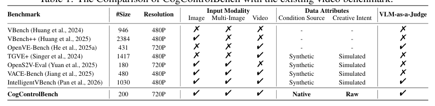
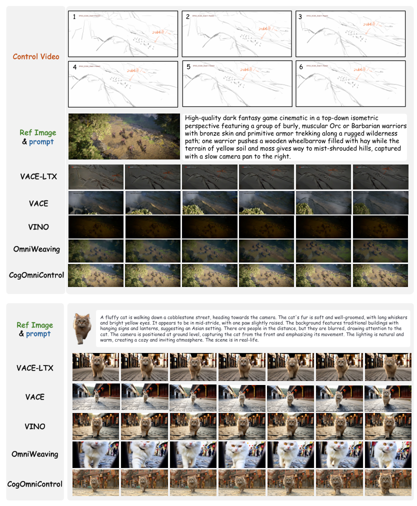

## 论文链接

- 原始论文页面：https://arxiv.org/abs/2605.19995
- PDF 下载：https://arxiv.org/pdf/2605.19995.pdf
- Hugging Face 论文页：https://huggingface.co/papers/2605.19995
- 项目主页：https://um-lab.github.io/CogOmniControl/

CogOmniControl：通过创意意图认知实现推理驱动的可控视频生成

> 导读摘要：这篇论文的核心不是再给视频扩散模型多接一个控制分支，而是把问题重写成“先理解创作意图，再执行生成”。作者提出专业化的 CogVLM 负责从分镜、参考图、文本等稀疏且抽象的条件中提炼出可执行的创作意图，再由 CogOmniDiT 将这些高层推理结果与像素级控制统一到同一生成过程中；进一步，模型还能根据当前任务自动挑选评估器，对多个候选视频做 Best-of-N 筛选，形成推理—生成—验证的闭环系统。整篇论文最值得关注的是方法链条的完整性：不仅补了“看懂条件”的认知缺口，也补了“推理结果能否真正落到视频里”的对齐缺口。

## 一、问题不在“控制不够多”，而在“意图没有被真正理解”

过去几年，可控视频生成的主流路线大致有两类：一类是 adapter/ControlNet 式方法，把姿态、深度、线稿等条件直接注入扩散骨干；另一类则把通用 VLM 接进生成系统，希望它先做跨模态理解，再辅助视频生成。作者认为，这两条路都没有真正解决专业创作场景中的核心难点：**用户给出的并不是完整、清晰、低歧义的生成指令，而是来自制作流程的零散线索**，例如分镜草图、灰模视频、角色设定图、简短说明文本等。

这也是论文开篇动机图想说明的重点：分镜、参考图和文本提示并不直接等于“可生成的视频规范”。如果模型只能做像素对齐，往往会出现跟随错误、身份漂移、镜头意图丢失、动作不连贯等问题；而如果直接依赖通用推理型 VLM，又容易在专业场景中误读创作意图，或者输出一堆“看起来合理”的推理文字，却无法稳定转化成可执行的视频控制信号。

因此，作者把任务重新形式化为两步：

1. 从多模态条件中认知创作意图；
2. 根据该意图与原始条件联合生成视频。

论文用一个分解式概率表达这一点：先建模 `P(R | 条件)`，再建模 `P(V | R, 条件)`。这里的 `R` 不是简单文本描述，而是更密集、更结构化、带专业知识的推理结果。这个拆分很关键，因为它明确承认了“抽象条件 → 创意意图 → 连续视频”之间本来就存在中间层，而不是一步到位就能学好。

## 二、整体框架：CogVLM 负责认知，CogOmniDiT 负责执行

CogOmniControl 的系统输入由三部分组成：控制视频、参考图像、文本描述。它们各自承担不同角色：控制视频提供时间与构图线索，参考图约束主体身份与风格，文本给出全局语义和动作补充。作者强调，这三类条件并不是等价冗余，而是共同构成“创作意图”的多视角证据。

从图里可以直观看到，这类输入本身是稀疏且互补的：参考图回答“角色是谁、长什么样”，文本回答“发生了什么”，分镜或控制视频回答“镜头如何推进、动作如何展开”。现有模型常把这些信号并列塞进生成器，但论文认为更合理的顺序是先做跨模态整合，再生成。

系统主体由两个模块组成：

- **CogVLM**：专门用于创意意图认知的 VLM；
- **CogOmniDiT**：统一多条件控制的视频扩散生成器。

这套设计并不是凭空搭出来的，作者还专门构建了两套数据：  
一套是面向推理能力的 **CogReasonBench**，用于训练和评估模型是否真的理解抽象条件与创作意图；另一套是面向视频生成的 **CogControlBench**，用于检验系统能否把这些意图落实到连续视频中。图中可以看出，数据来源不只是公开视频或自动合成控制对，而是直接纳入了专业动画制作流程中的中间资产，比如分镜、灰模渲染、目标成片等。这一点与方法强相关：如果训练数据本身不携带真实创作意图，前端认知模块就很难学到作者想要的能力。

## 三、CogVLM：把稀疏条件翻译成“可执行的创作意图”

论文最核心的方法贡献之一，是把通用 VLM 专门塑造成一个懂专业制作流程的“意图认知器”。作者并不满足于让模型输出一句更长的提示词，而是希望它能从多模态条件中生成**专业、清晰、密集的推理结果**，包括角色外观约束、镜头组织、动作逻辑、特效与氛围要求、物理动态等。

### 1. 为什么需要专门训练的 VLM

作者认为通用 VLM 的短板不在“看不见图”，而在“不会按创作流程组织视觉线索”。例如面对一个分镜草图和角色参考图，通用模型也许能分别描述它们，却未必能推断出：

- 哪些信息是主约束，哪些只是参考；
- 分镜中的镜头关系如何串成连续动作；
- 参考图中的哪些属性必须强保留；
- 文本里哪些描述应覆盖草图的模糊部分；
- 当条件冲突时，应该优先服从谁。

所以 CogVLM 的目标不是通用问答，而是**面向可控视频生成的专业推理**。

### 2. 训练流程：SFT + RFT

作者采用两阶段训练：

- **SFT（监督微调）**：用真实工作流样本教模型输出专业推理结果；
- **RFT（强化微调）**：进一步通过奖励机制，让模型学会输出更有用、更正确、更适合驱动生成的推理。

从文中框架图看，CogVLM 在强化阶段并不是只看一个粗糙总分，而是结合多种奖励信号。结构化提炼里提到，奖励会覆盖创意意图理解、物理合理性、信息完整性、运动描述等维度；此外还包含带有二元核验性质的事实性奖励，用来约束模型不要胡乱“脑补”。这很重要，因为生成任务前端的推理如果带噪声，后端视频模型会被系统性误导。

在 CogReasonBench 上，专门训练后的 CogVLM 相比通用模型有明显提升，而且从 SFT 到 RFT 还能继续变好。这个结果说明，论文的方法拆分不是“多加一个大模型试试看”，而是确实把前端认知能力做成了一个可独立优化、可独立验证的模块。

### 3. CogVLM 的输出到底起什么作用

CogVLM 输出的不只是自然语言说明，它在系统中承担三重角色：

1. **显化创作意图**：把隐含在多模态条件中的高层约束说清楚；
2. **提供生成语义特征**：其最后层特征会直接送入 CogOmniDiT；
3. **规划后验评估方式**：决定后面该用哪些评估器筛选候选视频。

也就是说，CogVLM 不是生成器的“外挂解释器”，而是整套系统的认知中枢。

## 四、CogOmniDiT：把高层推理和像素级控制统一到同一生成过程

如果说 CogVLM 解决的是“懂不懂用户到底想要什么”，那么 CogOmniDiT 解决的就是“懂了以后，怎么真的生成出来”。论文的第二个关键点，是没有把 VLM 的推理结果只当成一段旁白文本，而是把它转成高层语义嵌入，与视频扩散模型内部的多种 latent 一起建模。

### 1. 输入组织方式

CogOmniDiT 统一接收以下信息：

- 噪声 latent；
- 参考图 latent；
- 控制视频 latent；
- 来自 CogVLM 的语义嵌入；
- 文本编码结果。

这些内容被拼接成统一输入序列，送入 DiT 主干进行预测。这里的设计重点在于：**高层语义不是替代底层控制，而是与底层控制并行进入生成器**。这比单纯在前面“先让 VLM 生成一段 prompt，再喂给视频模型”要强，因为后者很容易在扩散过程中把抽象推理稀释掉。

### 2. 为什么这种设计能更稳

控制视频、姿态、深度这类条件擅长约束局部结构，却难表达镜头语言、氛围变化、特效强弱、角色心理状态等抽象意图；而 VLM 推理恰好擅长补足这些高层语义，但又不擅长逐像素对齐。CogOmniDiT 的统一建模正是在做这件事：

- 让像素级条件保证“形”；
- 让推理级条件保证“意”；
- 在同一生成器里完成二者融合。

这样，模型既不会完全被分镜草图的低保真外观限制住，也不会只剩下“语义上大致对”的松散生成。

### 3. 生成侧也做了强化对齐

论文没有停在“前端 VLM 变强”这一步。作者还进一步对 CogOmniDiT 做强化对齐，让它更好地遵循 CogVLM 的推理结果，同时兼顾原始条件与视频质量。结构化摘要里提到，这一步的目标就是弥补“推理正确但生成没跟上”的对齐缺口。

两张消融表传达的是同一个结论：**系统性能提升来自前后端协同，而不是某一个模块单独变大**。如果只换成更强的 VLM，但生成器没跟上，提升有限；如果生成器更强，但前端意图理解仍然模糊，控制质量也上不去。只有 CogVLM 和 CogOmniDiT 都经过针对性训练，条件跟随、创意意图对齐、画面质量和运动稳定性才会同时改善。

## 五、闭环 harness：让模型自己决定“该怎么评估这次生成”

这篇论文区别于许多“推理驱动生成”工作的另一个亮点，是把测试阶段也纳入设计。作者借鉴 harness 思路，让 CogVLM 在输出推理结果的同时，还输出**适合当前样本的评估器集合**。于是系统不再只生成一个视频就结束，而是可以采样多个候选，再根据任务相关评估器做 Best-of-N 选择。

这个设计有两个层面的新意。

### 1. 评估标准不再固定

不同任务应该关注的维度本来就不同：

- 有的样本最重要的是身份一致性；
- 有的更看重动作连贯；
- 有的强调特效和氛围；
- 有的则要严格跟随分镜镜头语言。

传统做法常用一套统一指标验所有样本，但在创意生成场景里，这很容易失真。CogVLM 先通过条件理解判断“这次任务真正重要的是什么”，再从工具库里动态选择评估器，于是验证环节也变得条件自适应。

表中的统计正是在说明这一点：系统会频繁调用一些通用评估器，但也会根据样本特征按需启用身份一致性、风格一致性、物理动态、分镜跟随等更专门的工具。换句话说，CogVLM 不只负责“写作业要求”，还负责“制定阅卷标准”。

### 2. 从单次生成变成闭环优化

有了动态评估器，CogOmniControl 的推理—生成链条被延伸成：

1. 理解条件，提炼创作意图；
2. 生成多个候选视频；
3. 根据当前任务适配的评估器打分；
4. 选出最贴近创作目标的结果。

这一步虽然不改变单个生成器的参数结构，但在系统层面很关键，因为它直接把“创作意图”从前端推理贯通到了后端筛选。论文称其为闭环 Reasoning-Generation-Verification，本质上是在做任务级对齐，而不是只做模型级对齐。

## 六、实验怎么看：不仅分数更高，而且更符合这条方法主线

论文的实验分成两部分：前端推理能力，以及最终视频生成能力。这个划分与其方法分解完全一致，也使得论证链条比较扎实。

### 1. 基准本身的定位

作者先强调，现有评测集往往更偏通用控制、标准化条件或后验模拟意图，不足以覆盖专业制作流程中的抽象约束。因此他们构建的 CogControlBench 更强调真实工作流、多模态输入和原生创作意图。

这张表的重要性不在数值，而在评测哲学：如果 benchmark 本身不包含真实分镜、灰模、角色参考图等生产资产，那么“是否理解创作意图”很可能根本测不出来。CogOmniControl 之所以看起来更复杂，恰恰是因为它试图解决更接近真实生产的问题。

### 2. 推理端：CogVLM 确实更懂专业意图

如前所述，CogReasonBench 上的结果表明，专业化训练后的 CogVLM 在创意意图理解、完整性、运动描述等方面都优于通用 VLM。这个结论对全文非常关键，因为如果前端推理并没有显著提升，那么整个“先认知再生成”的故事就站不住。

### 3. 生成端：复杂控制条件下更稳

定性结果图给出的直观印象是：在复杂条件下，CogOmniControl 对主体外观、动作轨迹、场景语义和镜头意图的保持更稳定。阅读这类图时，不能只看单帧精细度，更应看跨帧一致性、条件跟随程度，以及是否真正把参考图与控制视频的信息整合起来了。从图中两个案例来看，作者方法在这些维度上的表现都更接近输入要求。

### 4. 消融结果强化了主张

消融实验反复支持同一条主线：

- 只用通用 VLM 不够；
- 只有前端认知升级也不够；
- 后端生成器需要显式接收高层推理并做对齐训练；
- 闭环评估器与 Best-of-N 还能进一步提升输出质量。

这说明 CogOmniControl 的创新并不是一个点子，而是一条完整方法链：**专业认知器 + 统一生成器 + 条件自适应验证器**。

## 结语

CogOmniControl 最值得记住的，不是又提出了一个新的视频扩散模型名字，而是它对“可控视频生成”这个问题的重新定义：真正困难的地方，不只是把更多控制条件塞进模型，而是让系统先明白这些条件在创作流程里分别意味着什么，再把这种理解可靠地落实到生成和筛选中。

从方法上看，论文有三层递进：

- 用专业化 CogVLM 补上抽象条件到创作意图之间的认知缺口；
- 用 CogOmniDiT 补上推理结果到连续视频之间的生成对齐缺口；
- 用自适应评估器和 Best-of-N 补上“生成之后如何判定更符合意图”的验证缺口。

因此，这篇工作代表的不只是“VLM + 视频生成”的又一次组合，而是一种更系统化的思路：把可控视频生成做成一个真正闭环的、面向真实工作流的创作系统。
