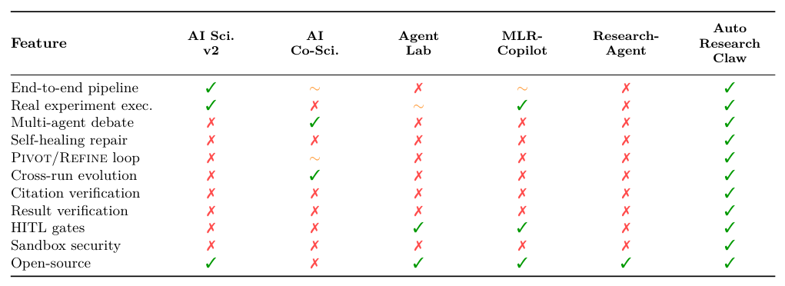
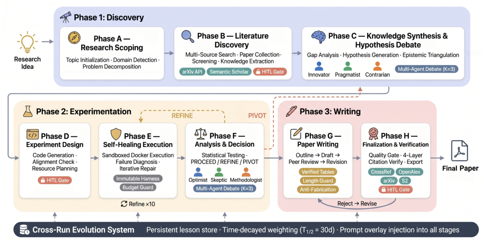
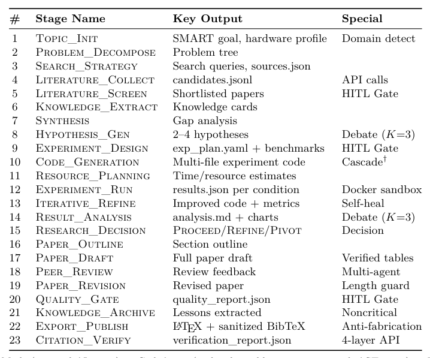
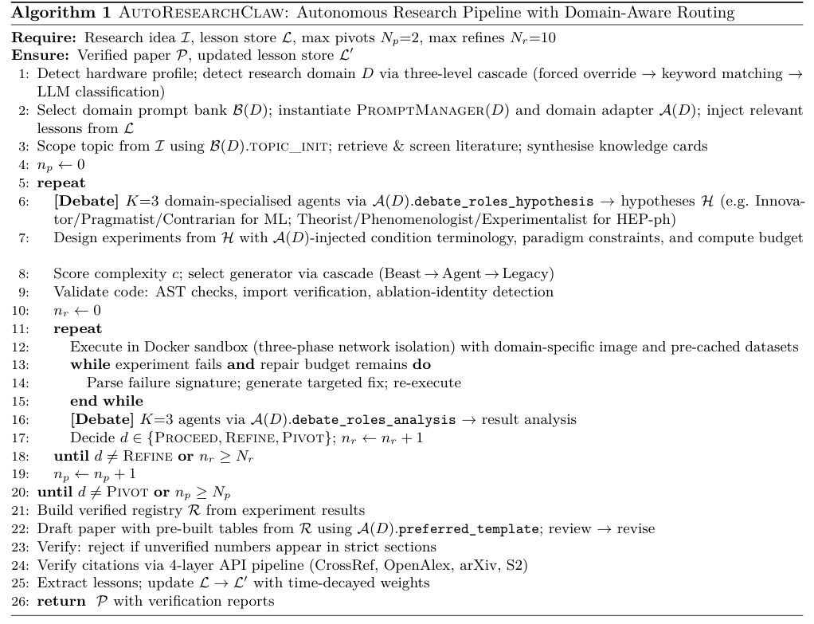
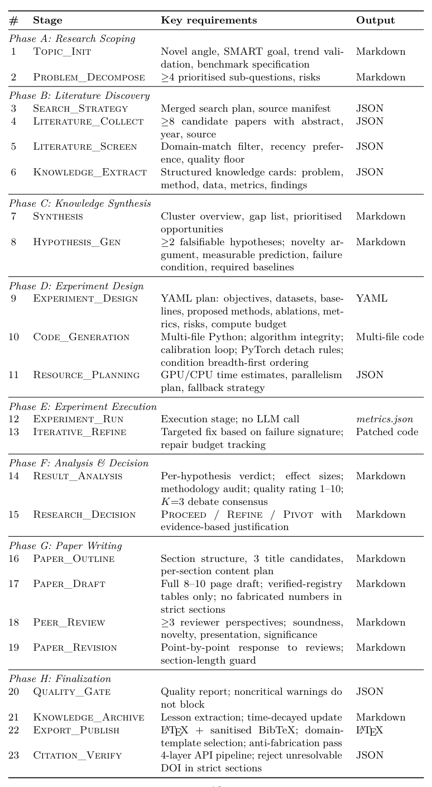
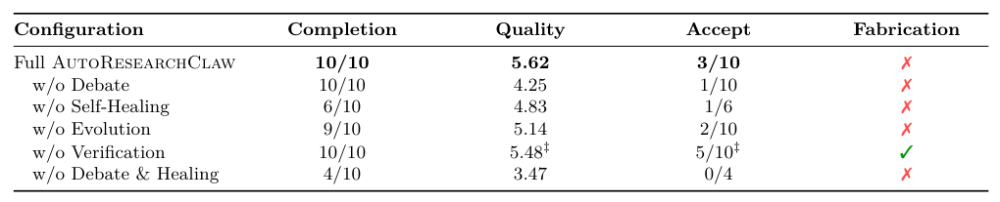
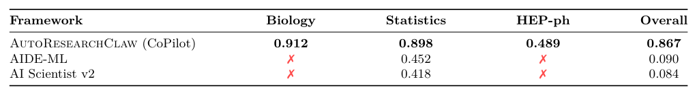
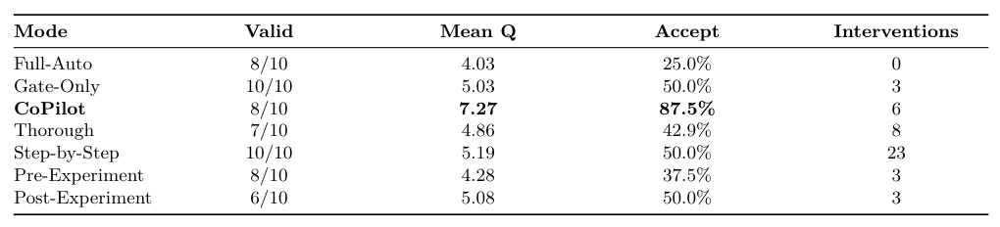
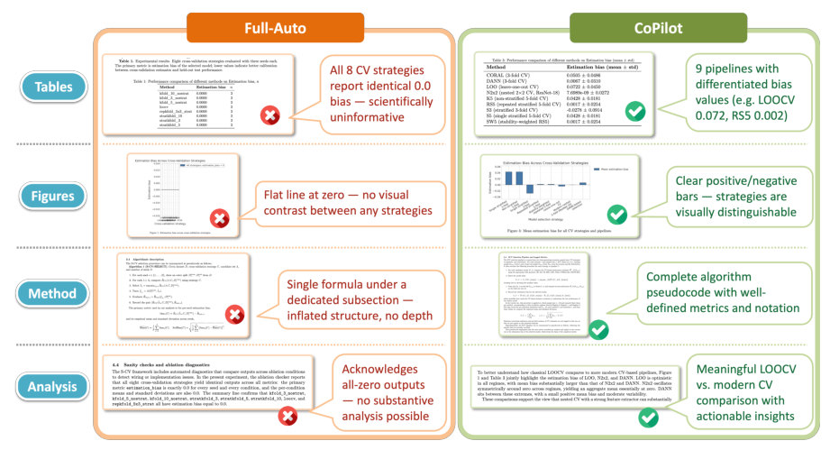
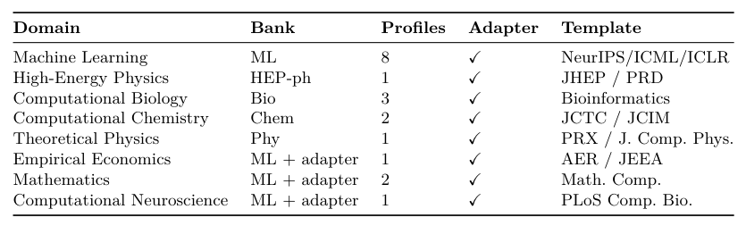

## 论文链接

- 原始论文页面：https://arxiv.org/abs/2605.20025
- PDF 下载：https://arxiv.org/pdf/2605.20025.pdf
- Hugging Face 论文页：https://huggingface.co/papers/2605.20025
- 项目主页：https://github.com/aiming-lab/AutoResearchClaw
- 开源代码仓库：https://github.com/aiming-lab/AutoResearchClaw
- 开源代码仓库：https://github.com/aiming-lab/AutoResearchClaw.git
- 开源代码仓库：https://github.com/features/copilot
- 开源代码仓库：https://github.com/features/spark
- 开源代码仓库：https://github.com/features/models
- 开源代码仓库：https://github.com/features/actions
- 开源代码仓库：https://github.com/features/codespaces
- 开源代码仓库：https://github.com/features/issues
- 开源代码仓库：https://github.com/features/code-review
- 开源代码仓库：https://github.com/security/advanced-security
- 开源代码仓库：https://github.com/enterprise/startups
- 开源代码仓库：https://github.com/solutions/industry
- 开源代码仓库：https://github.com/solutions/use-case
- 开源代码仓库：https://github.com/resources/articles
- 开源代码仓库：https://github.com/resources/events
- 开源代码仓库：https://github.com/resources/whitepapers
- 开源代码仓库：https://github.com/solutions/executive-insights
- 开源代码仓库：https://github.com/orgs/community
- 开源代码仓库：https://github.com/A-EVO-Lab/a-evolve
- 开源代码仓库：https://github.com/anomalyco/opencode
- 开源代码仓库：https://github.com/aiming-lab/MetaClaw
- 开源代码仓库：https://github.com/openclaw/openclaw
- 开源代码仓库：https://github.com/openclaw/acpx
- 开源代码仓库：https://github.com/K-Dense-AI/claude-scientific-skills
- 开源代码仓库：https://github.com/SakanaAI/AI-Scientist
- 开源代码仓库：https://github.com/karpathy/autoresearch

AutoResearchClaw：面向人机协作的自强化自主科研系统

> 导读摘要：这篇论文的重点，不是让 AI 从想法直接“写出一篇论文”，而是把真实科研中更关键的部分系统化：多角度提出并质疑假设、在实验失败后继续修补或转向、把结果与引用都绑定到可验证证据、在关键节点引入人类判断，并把历次运行的经验沉淀到后续任务中。作者据此构建了一个三阶段、23 步的自主科研框架 AutoResearchClaw，并在 ARC-Bench 上显著超过已有系统；更有意思的是，人机协作并非越多越好，最有效的是在高杠杆决策点进行少量而精准的介入。

## 一、论文要解决的不是“生成论文”，而是“重建科研闭环”

作者对现有自主科研系统的批评很集中：很多方法把科研理解为一条线性流水线——给定想法，检索文献，写代码，跑实验，生成论文。这样的设定在工程上便于实现，但和真实科研差别很大。真实研究往往充满反复：  
- 假设需要被不同立场反复挑战；  
- 实验失败本身会提供信息，而不只是中止信号；  
- 过去的错误和修复经验，应该影响下一轮设计，而不是每次从零开始。  

也因此，作者强调三个长期缺口：**假设质量、执行鲁棒性、跨运行记忆**。单智能体很容易“自己提出、自己认可”一个方向；一旦代码执行失败，很多系统直接终止；即便某次运行踩过坑，下一次也未必能记住。AutoResearchClaw 的核心贡献，就是把这三件事放进同一个系统里联合处理。

从能力对比上看，作者并不想只证明“自己的模型更强”，而是要说明现有系统在关键环节上存在结构性缺口。下面这张能力对比表就很能体现作者的定位：AutoResearchClaw 不是只补一个点，而是把端到端执行、多智能体辩论、自愈式修复、Pivot/Refine 决策、结果与引用验证、人机协作、跨轮演化这些模块一起补齐。

这也解释了论文标题里的 **Self-Reinforcing**：所谓“自强化”不是指训练一个会自我提升的模型，而是指科研流程本身会因为失败修复、经验沉淀和跨轮反馈而逐渐变得更稳健。

## 二、整体框架：三阶段主线 + 五个贯穿机制

AutoResearchClaw 被组织成一个覆盖 **Discovery、Experimentation、Writing** 的三阶段流程，总共 23 个步骤。最值得注意的不是步骤数量，而是作者把每一步都设计成有明确输入输出契约、可检查点恢复、可被其他模块接力的结构化节点。这让系统不像一次性长链推理，而更像一个可回滚、可修补、可审计的研究工作流。

整套框架的全景可以直接看总览图：

从图里可以抓住三条主线：

1. **发现阶段**：先做问题界定、文献搜索，再用多智能体辩论形成候选假设。  
2. **实验阶段**：执行代码、诊断失败、做结果分析，并在 Proceed / Refine / Pivot 三种决策之间切换。  
3. **写作阶段**：起草论文、审查修订、做结果绑定与引用校验。  

而真正让这条流水线变成“科研闭环”的，是贯穿三阶段的五个机制：

- **多智能体辩论**：既用于假设生成，也用于结果分析；
- **自愈式执行器**：把实验失败变成诊断信息；
- **可验证结果报告**：限制虚构数字和幻觉引用；
- **HITL（人类在环）协作**：让人类只在关键节点介入；
- **跨运行演化**：把过去运行中的经验注入后续任务。

如果想更细地理解作者如何把这些模块嵌进流程中，可以看 23 步流水线与核心伪代码级流程。前者告诉你“系统有哪些阶段”，后者告诉你“这些阶段如何在循环里真正运行”。

而另一张阶段拆解表则更进一步说明：作者不是把流程粗糙地切成几个大块，而是把每一步都约束成结构化产物，例如 Markdown、JSON、YAML、代码或 LaTeX。这一点很关键，因为只有中间结果可检查、可传递、可复用，多智能体协作、自愈修复和经验归档才真正有抓手。

## 三、方法主线一：用“双阶段多智能体辩论”提升假设与分析质量

这篇论文最容易被记住的设计之一，是把多智能体辩论放在**两个不同位置**，而不是只在前面“头脑风暴”一次。

### 1. 假设阶段的辩论

在假设生成阶段，系统使用 3 个角色分工明确的智能体：
- **Innovator**：提出高风险、高新颖性的假设；
- **Pragmatist**：检查这些假设在资源、时间和硬件约束下是否可做；
- **Contrarian**：专门寻找漏洞、混淆因素和不成立之处。

最后由一个综合器把这三方意见压缩成 2 到 4 个**可证伪**的假设，并为每个假设附上测试标准和必要基线。这里的关键不只是“多 agent 比单 agent 更强”，而是作者给了这些 agent 明确的认识论角色：有人负责开拓，有人负责收敛，有人负责拆台。这样可以减少单模型常见的自我确认偏差。

### 2. 结果阶段的辩论

很多系统在实验跑完后，就默认数值“等于结论”。AutoResearchClaw 在这里再放一轮辩论：
- **Optimist**：尽量提炼积极发现；
- **Skeptic**：质疑统计显著性、寻找混淆因素；
- **Methodologist**：检查复现性和潜在数据泄漏。

综合器最后要做的，不是润色结论，而是先划清边界：哪些结论被证据支持，哪些结论其实站不住。这个设计很重要，因为它把“论文写得像不像样”之前，先放上了一层“科学上是否成立”的筛选。

这种双阶段辩论和传统单 agent 流程的差异，在组件消融里也能看到：去掉辩论，未必总是最先影响“能不能跑完”，但往往会明显影响最终质量和可接受输出数。也就是说，它主要提升的是研究判断力，而不是脚本执行率。

## 四、方法主线二：自愈式执行与 Pivot/Refine，把失败转成信息

如果说多智能体辩论解决的是“前面想得是否靠谱”，那么自愈式执行器解决的就是“中间撞墙后怎么办”。

### 1. 复杂度感知的代码生成

论文里一个很实用的设计，是先给实验计划打复杂度分数。评分会参考六类因素：架构深度、文件数量、领域难度、依赖链、历史失败率、控制流复杂度，并把它压成一个介于 0 到 1 之间的标量。  
- 高于阈值的任务，会交给外部 AI 编程代理；  
- 低于阈值的任务，则由内置多阶段代码代理处理。  

内置代理也不是一次性吐出整份代码，而是先做逐文件蓝图，再按依赖顺序生成文件，并借助 AST 摘要来维持跨文件一致性。执行前还会经过静态验证，检查诸如“不同消融实验其实写成了一样的实现”或“指标数值被硬编码”之类的明显错误。

这说明作者其实把“科研代码生成”看成了一个和普通脚本生成不同的问题：它需要跨文件依赖管理、基线发现、绘图规范，以及实验语义层面的静态检查。

### 2. 沙箱执行与只读评测

代码执行全部放在 Docker 沙箱中，并分成三阶段网络策略：
- 第一阶段允许装依赖；
- 第二阶段允许下载数据；
- 第三阶段执行实验时彻底断网。

这个设计有两层用意：  
一是防止实验阶段偷偷访问外部网络，把预计算结果“拿来即用”；  
二是让指标评估走只读评测 harness，避免生成代码自己重写测量逻辑。  

从方法角度看，这不是单纯的安全加固，而是为“结果可验证”打地基：如果执行环境和测量基础设施不受控，后面的数字绑定与防编造都会失效。

### 3. Proceed / Refine / Pivot 决策循环

最核心的部分在这里。实验失败或结果退化后，系统不会直接退出，而是先抽取失败特征，再做三选一：
- **Proceed**：当前证据已经支持假设，可以继续推进；
- **Refine**：方向没错，但实现、参数、数据处理或实验设计还需修补；
- **Pivot**：当前路线从根上不成立，应该转向新方案。

其中 **Refine** 对应局部修补，**Pivot** 对应方向重构。作者想表达的是：真实科研里最有价值的往往不是一次成功，而是知道“这条路为什么不通”，并据此调整研究策略。AutoResearchClaw 试图把这一点编码成显式决策回路，而不是把失败当成异常退出。

这类设计的价值，在跨领域任务中尤其明显。因为不同学科的软件栈、实验依赖和失败模式差异很大，若没有模块化执行与恢复机制，系统往往连跑通都困难，更谈不上从失败中学习。跨学科对比表显示，AutoResearchClaw 在生物、统计和高能物理任务上的可用性明显更强，而一些基线方法在需要专用工具链的领域直接失效。

## 五、方法主线三：结果与引用必须“可核查”，而不是“写得像真的”

作者很清楚，自主科研系统最危险的地方不只是实验失败，而是**看起来成功了，实际上在编造**。因此论文把“可验证报告”作为独立机制，而不是写作阶段的附属检查。

### 1. 数值必须绑定到执行注册表

论文中的结果报告并不是让模型自由写结论，而是要求所有数值都能回溯到执行输出注册表。换句话说，最终文稿中的指标、表格、图表都应该能追到具体实验产物。这样做的目标很直接：防止模型在总结时补出“合理但不存在”的数字。

### 2. 引用采用四层校验

同样地，引用也不是只靠语言模型“记得像某篇论文”。作者设计了四层引用验证管线，目的是在任何内容进入草稿之前，先确认引文是否存在、是否匹配、是否被正确使用。虽然正文给出的细节有限，但它传达的信息很清楚：在自动科研系统里，引用幻觉不是小问题，而是必须工程化约束的核心风险。

### 3. 验证机制在消融中的角色

组件消融表很能说明这一点。验证模块未必总是直接抬高“表面分数”，但它对减少 fabrication 至关重要。也就是说，它更像一层安全与诚信护栏，而不是单纯的性能增强器。少了它，系统可能依旧能生成“完整论文”，却更容易在关键数字、论断或引文上越界。

这个判断也和作者整篇论文的立场一致：他们把系统定位为**研究放大器**，而不是替代科学判断的黑箱。如果最终输出无法核查，那么不管自动化程度多高，都很难被当成可信的科研工具。

## 六、人机协作与跨轮进化：为什么“精准介入”比“全自动”或“全程盯控”更好

这篇论文另一个很有意思的发现，是人类参与并不是越多越好。AutoResearchClaw 提供了七种 HITL 模式，从完全自治到逐步审批不等，并通过 **SmartPause** 把人工介入集中在系统高不确定性、高杠杆的节点上。

在人机协作实验中，作者比较的不是单一步骤成功率，而是从想法到论文的整体质量、录用率和人工干预次数。结果显示：**少量但精准的协作**，比完全自治更好，也比每一步都要求人工审批更好。

这意味着两个直观但常被忽视的结论：

1. **完全自治并不总是最优**  
   系统有时会产出“形式完整但科学上没信息量”的结果，人类在关键处纠偏能显著改善这一点。

2. **全程细粒度监督也不理想**  
   如果每一步都需要人工确认，系统会失去自动化效率，而且人类注意力被大量低价值决策消耗，反而不利于在真正关键的地方投入判断。

论文里的一个案例图特别能说明这个问题。它比较了同一研究题目下 Full-Auto 与 CoPilot 两种模式：前者虽然看上去也生成了完整实验和论文材料，但不同交叉验证策略竟然得到几乎相同的零偏差输出，属于一种“语义塌缩”；后者在人类关键节点介入后，结果才真正产生区分度，使得后续比较和分析有意义。

这也解释了作者为什么强调 HITL 不是外挂，而是系统设计的一部分。验证机制可以防止瞎编，但未必能发现“实验虽然跑完，却没有回答问题”；多智能体辩论可以质疑结论，但不一定总能改正高层研究路线。因此，人类最有效的位置不是替代全部流程，而是在少数高杠杆节点给出方向性判断。

最后，跨运行演化机制把这件事又向前推进了一步。系统会把过去运行中的错误、修复、反馈和经验整理成带时间衰减的 lesson store，再注入后续任务。作者还展示了系统的多学科适配能力：通过提示词库、领域配置、适配器和模板，AutoResearchClaw 不是只会跑某一类机器学习脚本，而是试图把同一套研究闭环迁移到不同学科。

从这个角度看，AutoResearchClaw 的“自强化”真正依赖的是两层记忆：  
- 一层是**单次运行内部**的失败修复与 Pivot/Refine 循环；  
- 另一层是**跨次运行之间**的 lesson store 演化。  

前者让系统不会一摔就停，后者让系统不会反复踩同一个坑。

## 七、实验结论该如何理解

论文最直接的结果是：在 ARC-Bench 的 25 个实验主题上，AutoResearchClaw 明显优于 AI Scientist v2，提升达到 54.7%。这说明作者的改进不是停留在流程设计层面，而是确实转化成了更强的实验阶段表现。

但比单一数字更重要的是，这些结果背后的结构性解释：

- 提升并不是靠某一个“神奇模块”，而是靠多模块联动；
- 优势尤其体现在结果分析和整体研究闭环的可靠性上；
- 人类介入最有效的方式是关键点协作，而不是完全接管；
- 系统价值不仅是“能生成研究材料”，更是“能减少失败浪费、限制编造、积累经验”。

因此，这篇论文真正推动的方向，不是“AI 会不会马上替代研究者”，而是一个更实际的问题：**能否把 AI 变成会讨论、会试错、会记教训、会在关键处向人类求助的研究搭档**。从作者给出的系统设计和实验结果来看，AutoResearchClaw 至少给出了一条相当完整、而且工程上可落地的答案。
