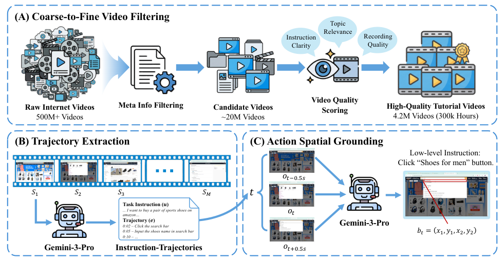
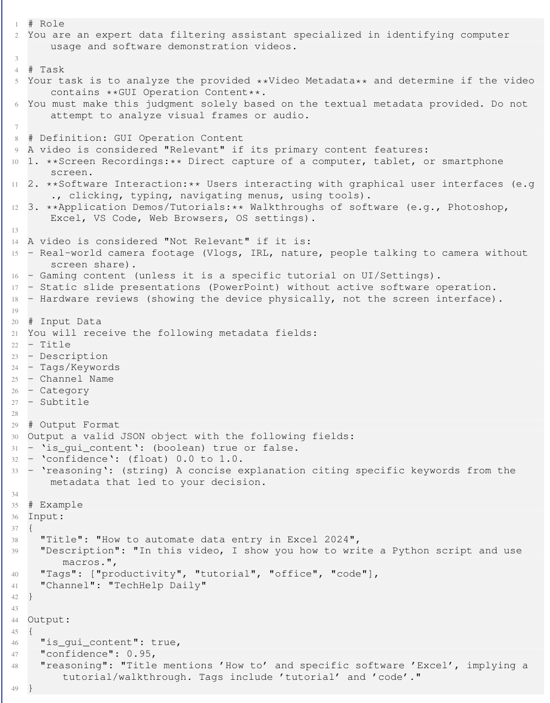
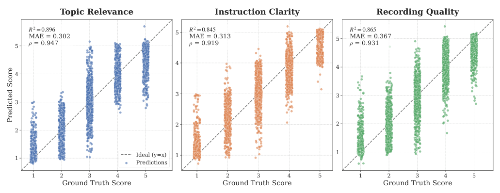
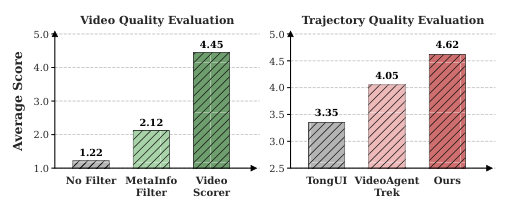
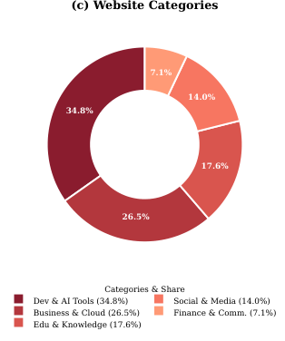
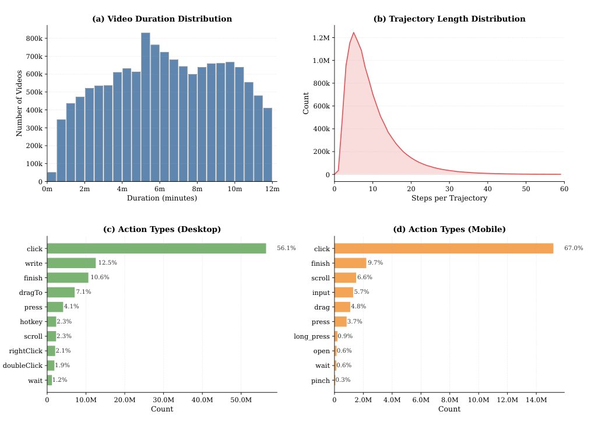
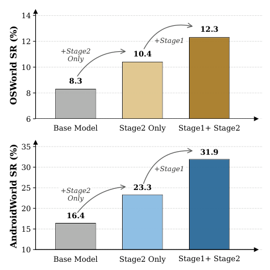
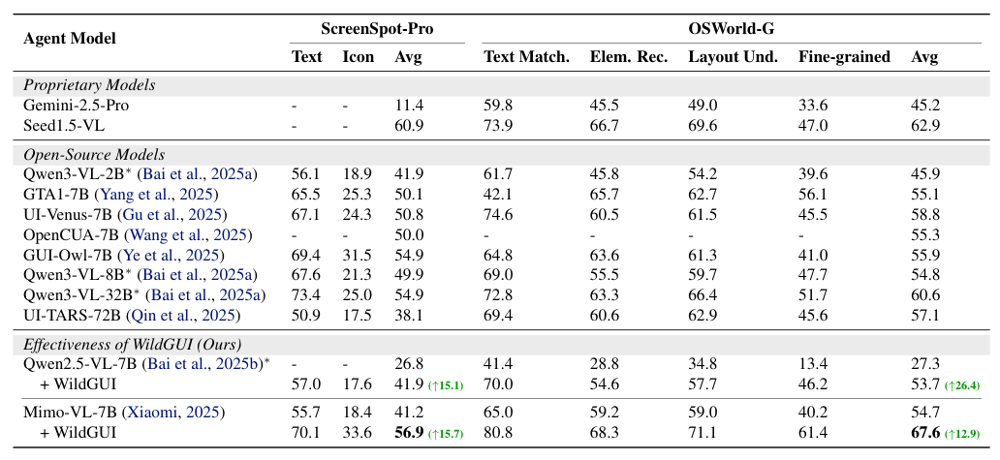
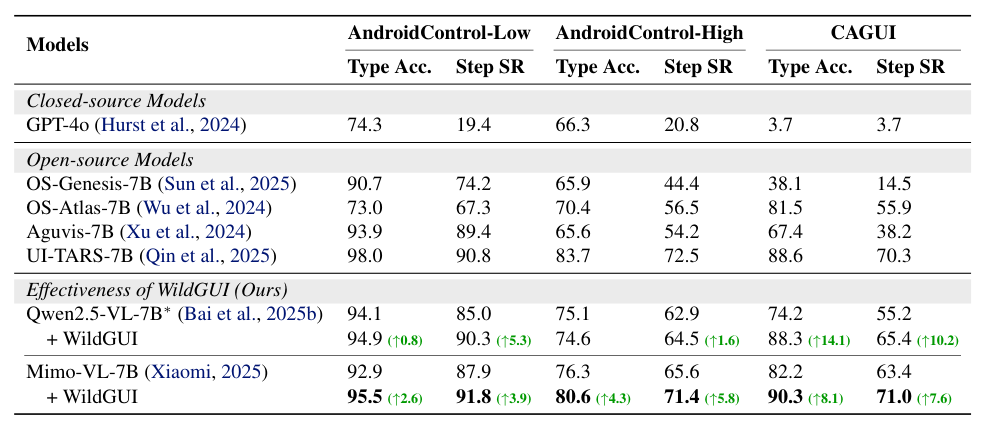

## 论文链接

- 原始论文页面：https://arxiv.org/abs/2605.14747
- PDF 下载：https://arxiv.org/pdf/2605.14747.pdf
- Hugging Face 论文页：https://huggingface.co/papers/2605.14747
- 项目主页：https://weiminxiong.github.io/Video2GUI/
- 开源代码仓库：https://github.com/WeiminXiong/Video2GUI

Video2GUI：为通用 GUI 智能体预训练合成大规模交互轨迹

> 导读摘要：这篇论文的核心贡献，不只是又做了一个更大的 GUI 数据集，而是提出了一条能从海量无标注互联网视频中自动“挖出” GUI 交互监督信号的完整流水线。作者先用粗到细的视频筛选，从 5 亿条视频元信息中找到高质量教程；再从长视频里抽取任务、动作时间戳和操作步骤；最后把文字化动作精确对齐到屏幕坐标，得到可直接训练智能体的 grounded trajectory。基于这条流程构建的 WildGUI 覆盖 1500+ 应用与网站、1270 万轨迹、1.245 亿截图，并在 grounding、离线决策和在线执行上为 Qwen2.5-VL、Mimo-VL 带来 5% 到 20% 的稳定提升。

## 问题背景：GUI 智能体为什么卡在数据上

GUI 智能体要真正泛化，关键不是只会某几个应用，而是能在网页、桌面、移动端等不同环境里理解界面、定位元素、执行多步操作。问题在于，这类能力极度依赖真实交互轨迹：用户要做什么、界面在每一步长什么样、该点哪里、该输入什么、为什么这样做。

现有数据主要有两类来源：

- **人工标注轨迹**：质量高，但标注成本很高，规模很难上去；
- **模拟环境数据**：更易扩展，但界面和任务往往偏人工构造，和真实世界差距明显。

作者的切入点很直接：互联网其实已经存在大量 GUI 教程视频，里面天然包含“人如何操作软件”的过程。难点不在于“有没有数据”，而在于能否把这些原始视频自动转成适合训练 GUI 智能体的结构化监督信号。这里至少有三道坎：

1. 海量视频里绝大多数与 GUI 操作无关；
2. 即便是教程视频，也未必清晰、完整、可学习；
3. 视频没有显式动作标注，必须恢复出时序步骤，还要把动作落到屏幕上的精确位置。

这正是 Video2GUI 要解决的主问题。

## 方法主线：把互联网视频变成 grounded trajectory

论文把整个数据生产过程拆成三步，形成一条从“原始视频”到“可训练轨迹”的自动化流水线。

这张图最值得注意的地方，是它把问题拆成了三个彼此衔接的层次：

- **质量层**：先判断哪些视频值得处理；
- **时序层**：再判断视频里做了哪些步骤；
- **空间层**：最后判断每一步具体作用在界面的哪里。

这种分解非常合理。因为 GUI 智能体训练需要的不是泛泛的视频语义，而是一种很特殊的监督：既要知道任务与动作序列，又要知道动作对应的视觉目标。单靠字幕、标题或全局视频描述都不够，必须同时恢复“任务—步骤—屏幕位置”三种信息。

作者还给出了 GUI 智能体的形式化表述，把交互过程看成一个 POMDP。用户指令是高层目标，观测是截图等多模态输入，动作是点击、输入、滚动、拖拽等原子操作。最终训练样本是形如 `(任务指令, 交互轨迹)` 的序列，其中每个动作都带有类型与参数，例如点击坐标或输入文本。

这意味着 WildGUI 不是简单的“视频转描述”，而是尽量贴近 agent 训练所需的数据形态。

## 粗到细的视频过滤：先省算力，再保质量

如果直接下载并分析数亿视频，成本几乎不可接受。作者因此采用了一个非常工程化、也非常关键的设计：**粗到细过滤**。

### 第一步：只看元信息做粗筛

作者先从 YouTube 收集了超过 5 亿条视频元信息，包括标题、描述、关键词、作者、上传时间等。这里的直觉是，很多与 GUI 操作无关的视频，其实在文本层就能被排除掉，没必要进入后续昂贵的视频理解阶段。

这一步的方法是：

- 先用强模型对 1 万条样本元信息打“是否与 GUI 操作相关”的标签；
- 再用这些自动标签训练一个轻量分类器；
- 最后让轻量模型在 5 亿级规模上批量推断。

这种“大模型标注，小模型扩展”的思路很常见，但放在这里特别合适：它避免了直接拿大模型扫全量数据的成本，同时又比手工写关键词规则鲁棒得多。粗筛后，候选视频从 5 亿缩到大约 2000 万。

论文附录里还展示了元数据初筛所用的提示设计，本质上是把“什么算 GUI 教程视频”明确成结构化判断标准，包括相关内容、无关内容、输出标签、置信度与理由等。

这个细节说明，作者并不是随意让模型“凭感觉分类”，而是尽量把粗筛规则标准化，方便大规模自动运行。

### 第二步：基于内容做细筛

只看标题和描述还不够。很多视频标题像教程，但实际可能是产品介绍、营销广告，或者录屏模糊、讲解混乱、没有完整操作过程。于是作者加入第二道筛选：**视频质量评分模型**。

他们定义了三个评分维度：

- **主题相关性**：是不是在讲目标平台上的 GUI 操作；
- **讲解清晰度**：操作说明是否连贯、明确；
- **录制质量**：画面是否清晰、稳定、完整。

实现上，作者先从粗筛结果中抽取约 200 小时视频，由强多模态模型打分并给出理由，再训练轻量视频评分模型批量预测。最后从 2000 万候选视频里保留 416 万条高质量教程视频，总计约 30 万小时。

这张图显示三项评分任务的预测值都比较贴近人工标注，说明这个细筛模块足以承担数据入口的质量控制责任。

更重要的是，人工评测也证明了这套粗到细设计确实有效：从“不筛选”到“元信息过滤”，再到“加入视频评分”，保留下来的视频质量是持续上升的。

这点很关键，因为后续轨迹抽取再强，也无法弥补原始视频本身“不是教程”或“看不清界面”的问题。Video2GUI 的第一个核心创新，正是把“海量但脏的视频源”压缩成“可被学习的教程子集”。

## 从长视频中抽轨迹：恢复任务、步骤与动作理由

筛到高质量教程后，第二个难点是：**怎么把视频变成交互轨迹**。

作者希望抽取出的不是松散字幕，而是适合智能体学习的结构化序列，包括：

- 高层任务指令；
- 每一步操作的时间戳；
- 动作细节；
- 动作背后的理由；
- 以及更低层的可执行文本描述。

例如，高层任务可能是“在某电商网站购买运动鞋”，低层步骤则是“点击搜索框”“输入鞋名”“选择某筛选项”等。这样的层次化抽取，对 GUI agent 很有价值：高层任务帮助学习规划，低层步骤帮助学习执行。

论文在结构化总结中提到，这一步依赖长上下文多模态模型，并采用了**滑动窗口 + 历史记忆**的方式处理长视频和跨片段任务。这意味着模型不是一次性看完整个长教程，而是分段理解，再通过历史信息把前后步骤串起来。这个设计很实用，因为很多真实教程视频并不短，且任务可能跨越多个界面切换、多个操作阶段。

人工评测同样支持这一步的质量：在轨迹准确性、多样性和任务贴合度上，Video2GUI 生成的轨迹优于对比方法。也就是说，它不仅筛出了更好的视频源，也更稳定地从中恢复出了“能教会 agent 做事”的操作序列。

## 动作空间 grounding：把文字步骤落到屏幕坐标

只有步骤文本还不够。GUI agent 的训练常常需要更强监督：动作必须定位到界面的具体区域，比如某个按钮、输入框、菜单项的屏幕坐标。这正是 Video2GUI 的第三步：**动作空间 grounding**。

论文指出，直接从压缩视频帧上做定位会遇到一个实际问题：视频经过平台压缩后，许多界面细节会模糊，导致按钮边界不清、文本发虚，影响点击目标的精确定位。作者因此使用高分辨率多帧截图，把低层操作指令映射到精确屏幕坐标，以缓解压缩引起的误差。

这个模块的重要性在于，它把“看懂教程视频”进一步提升为“生成可执行监督”。对于 GUI agent 来说，点击 `(x1, y1, x2, y2)` 这样的空间标注，通常比纯文字步骤更直接、更可训练，也更方便统一网页、桌面、移动端三类环境。

从数据形态上看，WildGUI 因此同时包含高层与低层信息：既有任务目标，也有逐步动作，还有 grounded 的屏幕位置。这也是它能同时支撑 grounding 任务和 agent 决策任务的原因。

## WildGUI 长什么样：规模之外，更重要的是覆盖与异质性

基于上述流程，作者最终构建了 **WildGUI**。它的量级非常大：

- **1270 万**交互轨迹
- **1.245 亿**截图
- 覆盖 **1500+** 应用和网站
- 横跨网页、移动端、桌面端

如果只看规模，这已经是目前开源 GUI 预训练数据里非常靠前的一档；但论文更强调的是**覆盖范围与真实异质性**。

从平台分布、软件类别、网站类别可以看到，WildGUI 并不是集中在某一个单一生态，而是覆盖开发、办公、教育、商业、媒体等多类真实应用场景。对 GUI agent 来说，这种横跨平台、场景、任务类型的广覆盖，比单纯多收一些同类数据更重要，因为泛化正是靠异质性“逼出来”的。

这组统计还补充了两个信息：

- 原始视频时长和轨迹长度都呈长尾分布，说明既有短操作，也有更复杂的多步任务；
- 点击是主导动作，但输入、滚动、拖拽、按键等也都存在，说明数据并非单一点击序列。

从方法角度看，这些分布说明 Video2GUI 没有把真实教程过度简化成碎片化片段，而是保留了相当一部分真实任务结构。对预训练来说，这是非常宝贵的。

## 训练策略与实验结果：大规模视频轨迹确实能提升泛化

作者不是把 WildGUI 直接当成最终监督来微调，而是采用了两阶段训练：

1. **持续预训练**：先在 WildGUI 上进行大规模预训练，让模型吸收跨应用、跨平台的 GUI 交互知识；
2. **后训练**：再在精心整理的开源数据上做任务化训练，强化具体 benchmark 所需的执行能力。

这个策略很像视觉语言领域的常见做法：先用海量但噪声更高的数据学通用能力，再用更小但更干净的数据对齐任务目标。

### 在线任务：真实交互成功率明显上升

在 OSWorld 和 AndroidWorld 这样的在线基准上，加入 WildGUI 预训练后，模型成功率显著提高，而且优于“只做第二阶段后训练”的版本。

这说明 WildGUI 带来的不是单纯的离线拟合收益，而是能迁移到真实交互闭环中的能力提升。对于 GUI agent 来说，这一点特别重要，因为很多离线指标提升并不一定转化为在线执行成功率。

### Grounding 与离线任务：同一模型前后对比最有说服力

在 grounding 任务上，作者重点比较了同一基座模型加入 WildGUI 前后的变化。结果显示，无论是 ScreenSpot-Pro 还是 OSWorld-G，平均表现都有明显提升。

这张表的意义在于：前面那些复杂的数据筛选、轨迹抽取和 grounding 设计，并不是“为了把数据集做大而做大”，而是真的转化成了更强的视觉定位与界面理解能力。

在离线 GUI 任务上，AndroidControl 与 CAGUI 也出现了稳定增益，尤其是更接近完整任务执行的成功率指标提升明显。

这说明 WildGUI 不只是帮助模型识别某个按钮在哪，还改善了“看界面—选动作—连续执行”的整体能力。

### 结果应如何理解

论文总结中的一个关键信息是：不同模型架构、不同 benchmark 上，WildGUI 预训练基本都带来 **5% 到 20%** 的提升，部分任务更高。更有价值的是，这种提升跨越了：

- GUI grounding
- 离线动作预测
- 在线环境执行

也就是说，WildGUI 学到的并不是单点技能，而是更底层的 GUI 交互知识：界面元素如何出现、任务步骤如何展开、动作如何落到视觉目标上。

## 这篇论文的方法价值在哪里

Video2GUI 最重要的意义，不只是“从视频做数据”，而是把这件事做成了一条可扩展、可自动化、对 agent 训练真正有用的流水线。它的方法价值主要体现在三点。

第一，它把数据问题拆解得非常准确。  
作者没有试图用一个大模型端到端解决所有问题，而是明确区分了**筛视频、抽步骤、做 grounding**三个环节。每一环都针对一个特定瓶颈：规模、时序结构、空间精度。这使得整条管线既能扩展，又能定位问题来源。

第二，它在工程上很务实。  
元信息粗筛、内容细筛、大模型标注小模型推断、长视频滑窗处理、高分辨率截图定位，这些设计看起来不“炫技”，但恰好构成了互联网规模数据生产真正需要的能力。很多工作提出了想法，却无法在 5 亿级候选集上跑通；而这篇论文最强的地方，就是它真的把“互联网视频转轨迹”做到了可落地。

第三，它证明了真实世界视频是 GUI 预训练的重要来源。  
WildGUI 的成功表明，大规模、跨平台、跨场景、带真实操作痕迹的数据，对 GUI 智能体泛化至关重要。相比只依赖人工标注或模拟环境，这条路线显然更有可能持续扩张。

如果要说局限，直观上也存在：教程视频天然偏向“可演示的操作”，对异常恢复、试错过程、复杂长期任务的覆盖可能仍有限；自动抽取的数据再强，也难免有噪声。不过从结果看，这些噪声并没有抵消大规模真实数据带来的收益，反而说明这条路线在“量足够大且质量控制合理”时是成立的。

总体上，这是一篇非常典型、也非常有分量的方法论文：它没有只优化某个 benchmark 上的一两个点，而是直接扩展了 GUI agent 的数据供给方式。对于想做通用 GUI 智能体的人来说，Video2GUI 提供的不是一个小技巧，而是一套新的数据基础设施。
