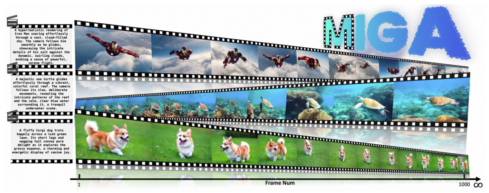
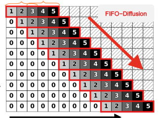
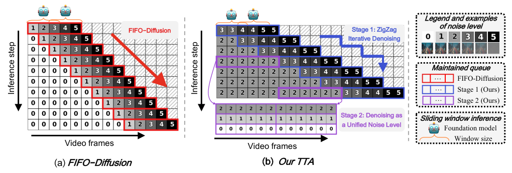
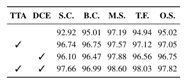
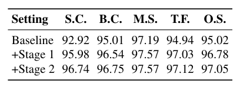
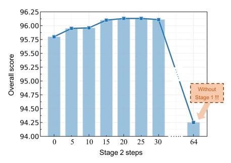
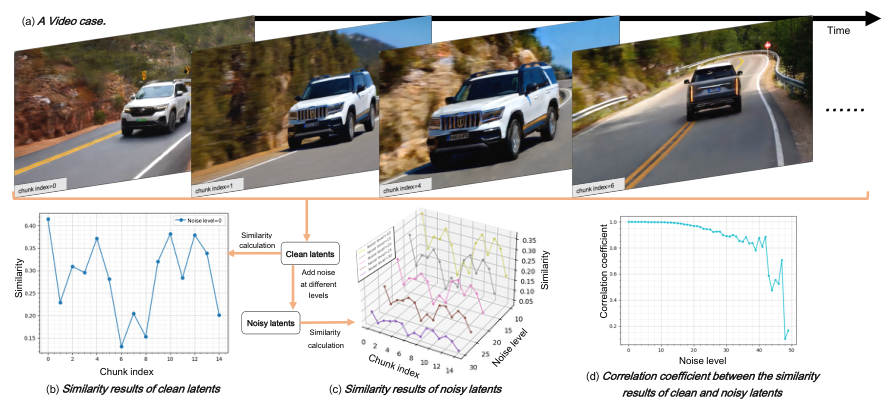
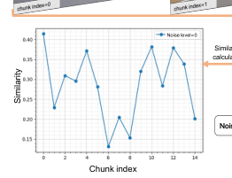
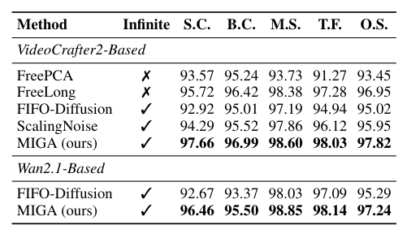
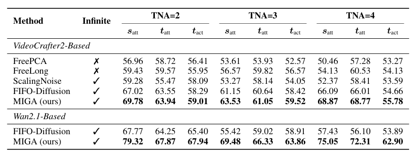

## 论文链接

- 原始论文页面：https://arxiv.org/abs/2605.18233
- PDF 下载：https://arxiv.org/pdf/2605.18233.pdf
- Hugging Face 论文页：https://huggingface.co/papers/2605.18233
- 项目主页：https://xiaokunfeng.github.io/miga_homepage/

增强免训练无限帧生成以实现一致性的长视频

> 导读摘要：这篇论文提出 MIGA，一种面向“常数显存、可无限帧生成”的免训练长视频方法。它抓住了帧级自回归视频生成的两个核心瓶颈：一是基础模型训练时只见过“同噪声水平”的短序列，但推理时却要处理“多噪声混合”的长队列；二是局部滑窗机制难以维持长时一致性。为此，MIGA设计了两阶段训练-推理对齐机制，把推理输入逐步拉回更接近训练分布的噪声形态；又设计了双重一致性增强机制，分别处理早期高噪声错误和后期长程依赖不足的问题。在 VBench 与 NarrLV 上，它都显著优于同类无限帧方法。

## 问题背景：为什么“能无限生成”还不够

长视频生成的一个现实约束是：高质量基础视频模型通常只支持固定长度短片段，比如几十帧。直接把模型重训成长视频模型，成本太高；因此，近年的一条路线是**免训练延长生成长度**，尽量复用现成基础模型。

但这条路线里又分成两类方法：

- 一类是把视频长度扩到更长，但显存开销会随帧数增长；
- 另一类是像 FIFO-Diffusion 这样的帧级自回归方案，用固定长度 latent 队列循环生成，从而做到**常数显存 + 理论上无限帧**。

MIGA接续的正是第二类路线。它承认 FIFO 这类方法有非常强的工程价值：显存不再随视频时长线性上涨，长视频乃至超长视频才真正可行。但作者指出，现有无限帧方案仍有两个根本短板：

1. **训练-推理失配严重**  
   基础视频模型训练时，通常输入的是一段长度固定、且噪声水平一致的多帧序列；而在无限帧推理时，模型每次看到的是一个沿时间排列、噪声水平相差很大的队列。  
   这不是小扰动，而是输入分布的结构性变化。

2. **长时一致性缺少显式建模**  
   传统滑窗去噪主要让相邻片段交换信息，远距离帧之间几乎没有稳定交互，因此容易出现主体漂移、背景变化、叙事断裂和时序伪影。

论文开头给出的结果图非常直观：原本只支持 81 帧的基础模型，经由 MIGA 可以稳定延长到 1000 帧以上，而且主体和环境还能维持较好一致性。

这张图的重要性不在于“能生成长视频”本身，而在于它说明作者解决的是更苛刻的问题：**不额外训练、不增显存级别、却尽量维持长时稳定输出**。后面所有方法设计，都是围绕这个目标展开的。

## 方法主线：从 FIFO 框架出发，先修正输入失配

MIGA并没有抛弃帧级自回归框架，而是在其上做两层增强。先看它的第一条主线：**Two-Stage Training-Inference Alignment，简称 TTA（两阶段训练-推理对齐）**。

作者首先明确指出问题症结：并不是基础模型不会生成视频，而是它在推理时被迫处理一种训练中没见过的输入形式。下图就概括了这种失配。

理解这件事的关键是“噪声跨度”。在 FIFO 式生成中，latent 队列里的帧会对应不同去噪阶段：队首的帧已经接近干净，队尾的帧则仍是高斯噪声。于是模型每次处理一个局部窗口时，窗口内部就混着“很干净”和“很嘈杂”的帧。作者认为，这种跨度越大，模型越难稳定发挥原本的生成能力。

因此，MIGA不是简单沿用对角线式推进，而是把整个生成过程拆成两个阶段：

- **阶段一：先缩小噪声跨度**
- **阶段二：再把一批 latent 拉到统一噪声层级后一起去噪**

这一设计在图里很清楚：

左边是传统 FIFO：噪声等级沿帧维度单调变化，每次滑窗都会覆盖很大的噪声跨度。右边则是 MIGA 的 TTA：

### 阶段一：ZigZag 队列，减缓噪声变化

MIGA在队列中不再让每一帧都对应不同噪声层级，而是采用一种 **zigzag 结构**。直观地说，它让若干相邻 latent 共享相同或更接近的噪声等级，再逐段推进。这样做的效果是：

- 队列内部的噪声变化不再那么陡；
- 局部窗口中送入模型的 latent，更接近“同噪声水平”的训练条件；
- 仍然保留自回归滚动生成的形式，不破坏常数显存。

这一步并不要求把队首帧彻底去噪干净，而是“部分去噪”，目的是先把输入条件变平滑。

### 阶段二：统一噪声水平后的联合去噪

当一批 latent 已经被推进到相同噪声层级后，MIGA再进入第二阶段，对这批 latent 做**统一噪声水平的去噪**。这一步非常关键，因为它真正把推理输入重新拉回了基础模型训练时更熟悉的分布：多帧、同噪声。

所以，TTA的本质不是多加几步采样，而是在推理流程里人为恢复训练分布的核心结构约束。作者的观点可以概括成一句话：**无限帧生成的瓶颈，不只是长度，而是输入噪声组织方式。**

这点也被消融实验支持。表中的比较说明，只加阶段一已经有效，再加阶段二还能继续提升，说明两个阶段并非重复，而是前后衔接、各司其职。

进一步地，作者还分析了阶段二步数的影响：不是越多越好，而是在合适范围内能稳定收益，说明阶段二确实是在做“分布对齐”，而不是单纯堆计算。

## 一致性增强：既要早纠错，也要看得更远

如果说 TTA 解决的是“模型输入不对劲”，那么 MIGA 的第二条主线 **Dual Consistency Enhancement，简称 DCE（双重一致性增强）**，解决的就是“即便能持续生成，怎样避免长时间漂移”。

DCE分成两个方向，分别对应两类常见失败模式：

- **早期高噪声阶段一旦走偏，错误会在后续不断放大**
- **局部滑窗只看邻近帧，缺少远距离信息，导致长程一致性差**

### 1. Self-Reflection：在高噪声阶段提前发现异常

一个很有意思的观察是：长视频中的一致性问题，往往不是等画面完全清晰后才出现的。很多偏移在高噪声阶段其实已经埋下了，只是人眼看不出来。如果能在早期就发现这些异常，就能避免错误一路传染到后面的数百帧。

问题是，怎么在高噪声 latent 上判断一致性是否出了问题？

已有一些方法会借助外部评估器，或者每一步都做额外搜索，但代价很高。MIGA提出的做法更“内生”：**直接利用 latent 之间的自相似性来做自反思评估**。它的依据如下图所示。

图里传递的核心结论是：尽管加入噪声会改变 latent 的绝对表示，但不同片段之间的**相对相似性结构**仍能较大程度保留。于是，模型可以在较高噪声下就监测相似性走势，判断哪些位置可能发生一致性突变。

在机制上，Self-Reflection 分成两步：

1. **轻量评估**：检测一致性是否在某个位置突然恶化  
2. **选择性纠错**：只在可疑位置触发扩展搜索与修正

这意味着 MIGA 不会像暴力搜索那样每一步都做昂贵纠错，而是把计算集中到真正有风险的地方。相关流程在图中总结得很清晰。

这部分方法有两个优点：

- **无需外部评估模型**，避免额外管线与解码开销；
- **触发时机自适应**，比固定步数搜索更灵活。

从长视频角度看，这一步很重要，因为无限帧生成最怕的是“前面一个小错误，后面越滚越大”。Self-Reflection 的价值就在于：它把纠错前移到了错误尚未扩散的时候。

### 2. Long-Range Frame Guidance：让远处的低噪声帧也参与引导

仅靠早纠错还不够。即便前期没有明显异常，局部窗口式去噪依然可能在长程上逐渐漂移，原因是模型主要接触的是邻近帧，远距离帧的信息很难持续传回当前生成位置。

为此，MIGA又加入 **Long-Range Frame Guidance（长程帧引导）**。思路并不复杂，但很有效：在局部滑窗去噪时，除了窗口内的邻近帧，还显式引入一些**稀疏采样的远距离低噪声帧**作为引导信号。

为什么选低噪声帧？因为它们已经包含更稳定、更可解释的语义和外观信息，覆盖范围也更广，能给当前去噪过程提供长程约束。这样一来：

- 主体外观更不容易在长时间里悄悄变化；
- 背景风格和场景属性更稳定；
- 不同视频段之间的信息传递，不再只依赖局部重叠窗口。

所以 DCE 的两部分其实是互补的：

- Self-Reflection 处理“早期错误放大”
- Long-Range Frame Guidance 处理“长程依赖缺失”

前者像异常检测与及时回滚，后者像持续的全局提醒。合起来，才构成对长时一致性的系统性增强。

## 实验结果：不仅更长，而且一致性和叙事都更稳

论文的实验重点放在两个基准：

- **VBench**：更偏综合视频质量与一致性评估
- **NarrLV**：更偏长视频叙事能力评估

先看 VBench 上的整体比较。作者不仅和常见免训练长视频扩展方法比较，也和同属无限帧生成范式的方法比较。结果显示，MIGA在支持无限帧的同时，主体一致性、背景一致性、运动质量和综合指标都处于最好或接近最好水平。

这个结果最有说服力的地方在于，它不是以牺牲“无限帧能力”为代价换取分数。很多长视频方法在有限长度上能做得不错，但显存与序列长度绑定；MIGA则是在**无限帧、常数显存**这个严格前提下，仍把质量往上推了一截。

论文在摘要与正文中强调，相比相似框架的 FIFO-Diffusion，MIGA在 VBench 上的主体一致性和背景一致性都有明显提升。这恰好对应其方法设计的两条主线：TTA 修正输入失配，DCE 修正长时一致性。

再看 NarrLV。这个基准更难，因为它不是只看画面“像不像”，而是看长视频里能否持续保持：

- 场景属性
- 目标属性
- 目标动作

也就是叙事信息有没有随着时间被保留下来。结果表明，MIGA在不同基础模型上都优于同类方法，尤其在更复杂设定下优势仍然稳定。

这说明 MIGA 的收益不只是“纹理更稳”或“短期运动更顺”，而是能够帮助模型在更长时间内维持语义层面的连续性。对真实应用来说，这比单纯多生成几百帧更有价值。

## 消融与启示：MIGA 真正有效的地方是什么

这篇论文的方法不少，但实验传达出的结论并不复杂：**最关键的是把问题拆对了。**

首先，TTA 的消融表明，两阶段对齐确实分别在发挥作用：

- 只做阶段一，已经能显著缓解训练-推理失配；
- 再加阶段二，性能继续提升；
- 说明“缩小噪声跨度”与“恢复统一噪声条件”是两个互补环节。

其次，阶段二步数的实验说明，这不是简单堆采样次数。性能会随阶段二增强而提升，但存在合理区间，说明它的收益来自**更贴近训练分布**，而不是盲目增加去噪量。

再者，Self-Reflection 背后的相关性分析也很关键。它证明了一个以前未被充分利用的事实：**高噪声 latent 中仍然保留足够的一致性结构信息**，因此可以在不解码到清晰图像的情况下提前做异常检测。这让“早纠错”从直觉变成了可操作的方法。

结合流程图来看，自反思不是泛泛地“多看一眼”，而是一个明确的触发—搜索—修正机制。

最后，再回头看 TTA 的整体框架图，会发现 MIGA 的方法哲学其实很统一：它既没有重新训练基础模型，也没有硬塞一个庞大外部模块，而是围绕 latent 队列本身做文章，尽量让已有短视频模型在长视频条件下“用得对”。

## 总结：这篇论文最值得记住的三点

MIGA 的贡献不只是提出了一个新的无限帧生成技巧，而是把这一方向的两个核心问题系统化了。

第一，论文明确指出：**帧级自回归长视频生成的关键瓶颈，是训练时统一噪声、推理时混合噪声的结构性失配。**  
这让问题从“怎么延长视频”转向“怎么组织推理噪声”。

第二，它给出的答案很有针对性：**用两阶段对齐缩小噪声跨度，并在适当时机恢复统一噪声条件。**  
这一步让基础模型能更稳定复用原本短视频生成能力。

第三，它没有把一致性问题只理解为“后处理修补”，而是拆成两类：  
- 早期高噪声错误要尽早识别并纠正  
- 远距离帧依赖要在生成过程中持续注入  
于是形成了 Self-Reflection + Long-Range Frame Guidance 的双重一致性增强。

如果只用一句话概括这篇论文，可以说：**MIGA 证明了，在不训练新模型的前提下，想把短视频基础模型真正扩展到无限长视频，核心不是盲目延长生成链，而是先让推理过程重新尊重模型原本的训练条件，再显式补上长程一致性。**
