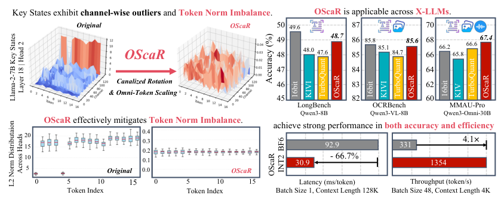
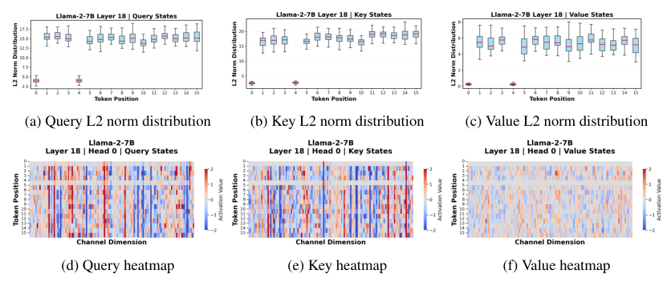
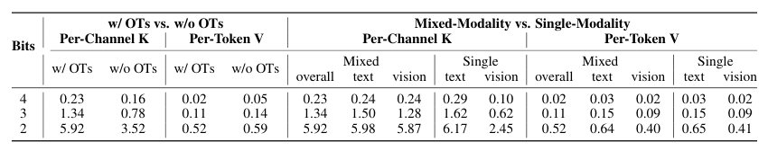
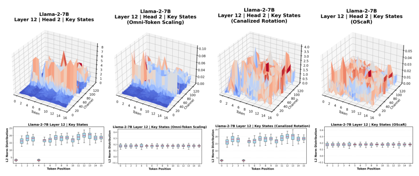
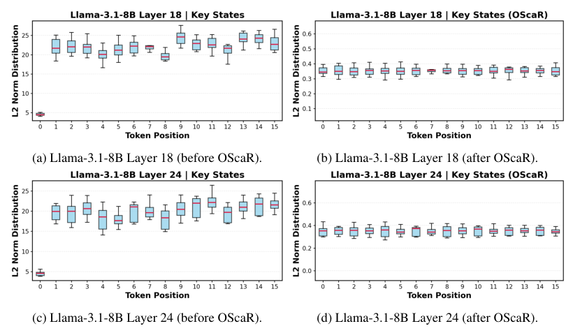
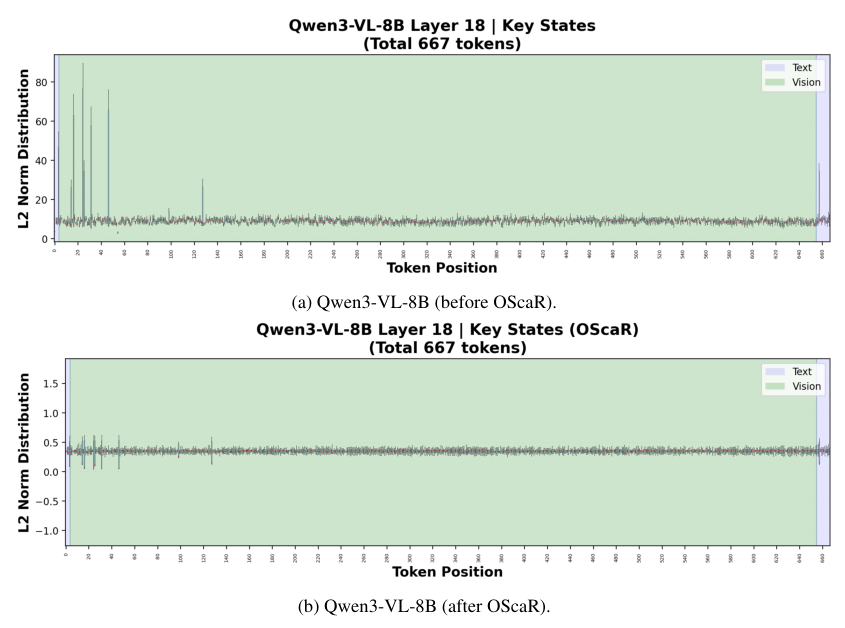
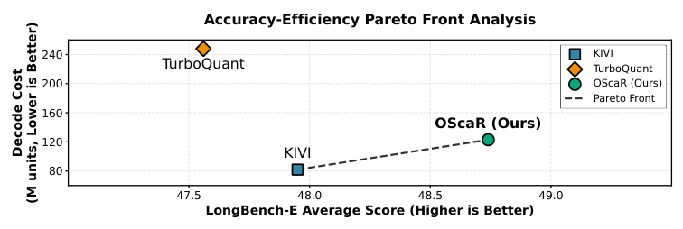
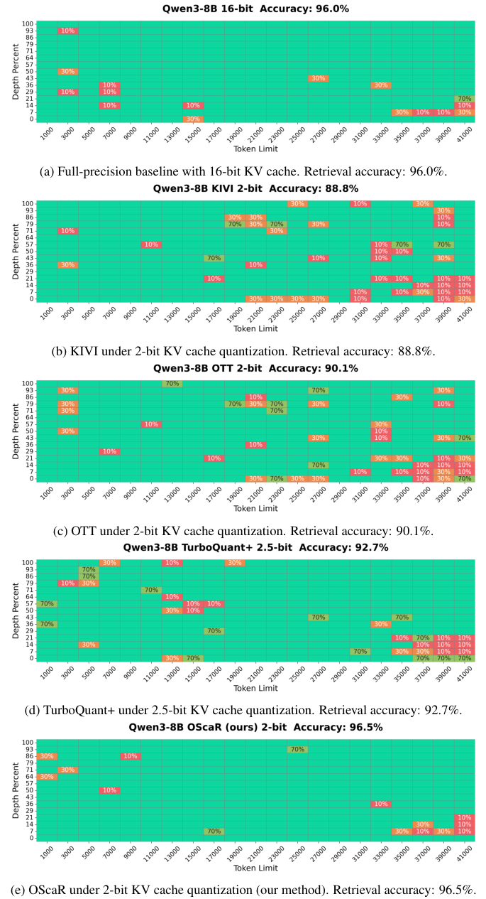
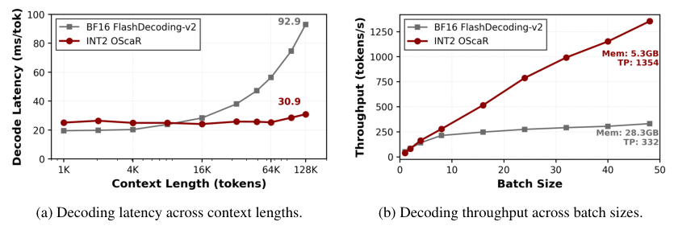
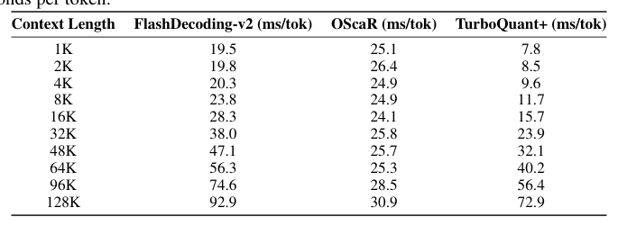

## 论文链接

- 原始论文页面：https://arxiv.org/abs/2605.19660
- PDF 下载：https://arxiv.org/pdf/2605.19660.pdf
- Hugging Face 论文页：https://huggingface.co/papers/2605.19660
- 项目主页：https://iridescent-gcrace.github.io/OScaR/
- 开源代码仓库：https://github.com/ZunhaiSu/OScaR-KV-Quant
- 开源代码仓库：https://github.com/OpenBitSys/BitDecoding
- 开源代码仓库：https://github.com/segyges/hadacore
- 开源代码仓库：https://github.com/jy-yuan/KIVI
- 开源代码仓库：https://github.com/meituan-longcat/SGLang-FluentLLM

OScaR：面向大语言模型及更广泛场景的极限 KV 缓存量化之奥卡姆剃刀

> 导读摘要：这篇论文的关键判断很鲜明：极低比特 KV Cache 量化真正卡住精度的，不只是 Key 里的通道异常值，而是同一量化组内 token 之间范数差异过大，即 TNI（Token Norm Imbalance，token 范数失衡）。作者据此提出一个很“克制”的两步框架 OScaR：先用 Canalized Rotation 打散会干扰缩放的通道结构，再用 Omni-Token Scaling 在序列维上压平 token 范数分布。结果是在文本、多模态、全模态模型上，INT2 量化也能接近无损，同时把显存、吞吐和长上下文解码效率都显著做上去。

## 问题重估：极低比特 KV 量化为什么会失效

随着长上下文、视频音频理解和多模态推理变得常态，推理时的 KV Cache 已经从“附属开销”变成了主要显存瓶颈。因为它随序列长度线性增长，context 一长，HBM 很快被吃满，进一步限制 batch size、吞吐和部署密度。于是，KV Cache 压到 2 bit 这类极低位宽，几乎成了工程上绕不过去的方向。

已有方法里，一个常见共识是：**Key 比 Value 更难量化**。原因在于 Key 往往有显著的通道级异常值，所以很多工作采用混合策略——Key 做 per-channel，Value 做 per-token。论文在前置分析中也沿用了这个基本观察。图中对 Key/Value 分布和 KIVI 方案的示意，正体现了这个经典出发点：Key 的数值集中在少数通道上，更需要按通道处理；Value 的分布相对均匀，因此按 token 量化就够了。

但作者的核心观点是：**这套范式在 INT2 之类极限压缩下不够用了**。问题不再只是“有没有异常通道”，而是“同一个量化组里的 token 差得太大，导致共享量化参数本身就不合适”。这也是本文提出 TNI 的背景。

上面这张总览图几乎可以视作全文的路线图：左侧先指出 per-channel 量化虽能应对通道异常值，却会被 token 范数失衡拖垮；中间给出 OScaR 的两步处理；右侧和下方再展示它在不同类型模型上的收益。论文的“奥卡姆剃刀”也体现在这里：不继续往量化管线里叠复杂补偿，而是先找准主要矛盾，再用最少的机制对症处理。

## TNI：比通道异常值更根本的结构性瓶颈

作者先通过可视化和误差分析说明，token 级的不均衡并不是零散噪声，而是稳定存在于注意力状态中的结构现象。尤其在 Query、Key、Value 上，都能看到一小批范数显著偏低的 token；它们在序列维上反复出现，说明问题不是某个通道偶然爆了，而是 token 本身的“能量分布”很不平衡。

这张图里，上排看每个 token 位置的 L2 范数分布，下排则把 token×channel 的模式直接摊开。能直观看到：有些 token 在整行上都偏“淡”，对应整体范数偏低。对量化来说，这意味着如果一个分组同时覆盖高范数 token 和低范数 token，共享的 scale 与 zero-point 往往会更偏向前者，后者的有效分辨率就被牺牲掉了。

作者进一步把这种现象和量化误差直接对上。表中的结论很集中：两类场景尤其容易放大 TNI——其一是量化组中混入异常 token，其二是同组内混合了不同模态的 token。它们都会显著恶化 **Key 的 per-channel 分组量化**，而对 **Value 的 per-token 量化** 影响很小。

这其实非常重要。它解释了为什么很多方法明明已经处理了通道异常值，到了 INT2 仍然掉点明显：**问题出在量化参数的共享方式和 token 范数分布之间发生了错配**。在多模态场景里，这个问题更严重，因为视觉 token、文本 token、音频 token 的尺度天然可能不同，混在同一个序列里后，TNI 会更突出。

从方法论角度看，论文完成了一个“问题重定位”：  
- 过去强调的是通道维异常值；  
- 本文指出真正限制极低比特精度的，是**序列维上的范数失衡**；  
- 因而改进重点不应只是继续修补量化器，而是要主动整理 Key 在 token 维上的分布。

## OScaR 的方法主线：先旋转，再统一 token 尺度

OScaR 的设计很简洁，但并不是把两个常见操作简单拼接，而是围绕“怎样安全地消除 TNI”组织起来的。

### 1. Canalized Rotation：先把通道异常结构打散

如果直接对原始 Key 做 token scaling，会有一个副作用：通道异常值本来集中在少数维度上，按 token 整体缩放后，可能把这种异常结构进一步扭曲，反而制造新的量化困难。论文把这类问题概括为“缩放诱发的异常伪影”。

为避免这一点，OScaR 先做 **Canalized Rotation**。实现上，作者采用基于 Hadamard 变换的旋转，把原本集中在少数通道中的能量更均匀地扩散开。这样做有两个直接效果：

- 不改变整体信息量，但降低少数通道对后续缩放的支配作用；
- 为 token 级尺度归一化创造更平滑的输入分布。

它本质上是在“通道维预处理”：先把最容易干扰 token 归一化的结构整理掉。

### 2. Omni-Token Scaling：在全序列范围压平范数

完成旋转后，OScaR 再做 **Omni-Token Scaling**。名字里的 “Omni” 强调的是它不是只盯某一类 token，也不是只处理文本段，而是在整个序列、跨模态范围内统一调整 token 的尺度，把 token 间范数差异拉回更接近的区间。

它瞄准的正是 TNI：  
- 如果某些 token 范数极高，量化范围会被它们拉大；  
- 如果某些 token 范数极低，它们在量化后容易被淹没；  
- 统一缩放后，同一组 token 共享量化参数时，误差会更均衡。

论文强调，这两步是相互依赖的，而不是任选其一：  
- 只有 scaling，没有 rotation，缩放可能被通道异常值“带偏”；  
- 只有 rotation，没有 scaling，token 之间的尺度失衡仍然存在。  

下面这张分阶段可视化把这个逻辑展示得很清楚。

图里比较了原始 Key、只做 Omni-Token Scaling、只做 Canalized Rotation，以及二者结合后的结果。单独做任一步都能改善一部分不稳定性，但真正把 Key 幅值波动和 token 范数起伏一起压下来的，是组合后的 OScaR。这也是作者坚持“两步都必要”的主要证据。

## 分布层面的效果：OScaR 确实把 TNI 压平了

方法是否真正击中问题，最直接的证据就是：处理前后，token 范数分布有没有明显变得更均衡。论文在文本模型和多模态模型上都给出了这样的可视化。

先看文本模型。下面这张图展示了 Llama-3.1-8B 在不同层中，OScaR 前后 token 位置上的 Key 向量 L2 范数分布。

处理前，不同 token 位置的中位数和波动范围差异很大，说明序列维上确实存在明显失衡；处理后，各位置的分布被显著压平，箱体更接近，离散程度也下降。这个现象和 OScaR 的目标完全一致：让共享量化参数面对的是一组“尺度接近”的 token，而不是高低悬殊的一组。

多模态场景下，这一步更关键。因为视觉 token 往往与文本 token 的统计特性不同，如果直接共用分组量化，误差会进一步扩大。论文在 Qwen3-VL-8B 上也展示了 OScaR 的效果：

图中可以看到，原始分布存在明显尖峰，且不同模态区域的波动风格也不一致；经过 OScaR 后，整体曲线更加平滑，跨模态 token 的尺度差异被压缩到更可控的范围。这说明 OScaR 并不只是对纯文本模型有效，而是真的适配 X-LLMs，包括多模态与全模态模型。

从方法价值上看，这一点很重要。因为很多 KV 量化方法是在文本模型上成立的，一旦进入图文、音频、视频混合序列，原先依赖单一分布假设的技巧就会失灵。OScaR 之所以更通用，原因正是它抓住了一个跨场景都成立的现象：**共享量化参数最怕 token 范数不均衡**。

## 实验结果：不靠复杂管线，也能站上新的 Pareto 前沿

在精度上，作者报告 OScaR 在文本 LLM、多模态 LLM 和全模态 LLM 上都稳定优于 KIVI、RotateKV、QuaRot、OTT、TurboQuant 等方法，并在 INT2 设置下做到接近无损。更关键的是，它不是通过更复杂的残差纠错、混合精度保护或额外参数换来的，而是依靠前面两步对分布本身的整理。

这种优势在 Pareto 分析里很直观。下面这张图以 Qwen3-8B 为例，把平均 LongBench-E 精度和解码成本放在同一坐标系里比较。

右下角代表“更准且更省”。OScaR 落在更靠右、同时成本仍然较低的位置，说明它不仅追求高精度，而且没有把系统负担推高到难以部署。相比之下，KIVI 虽然便宜，但精度不够；更复杂的方法则可能付出更高代价，却没有换来更好的最终结果。论文所谓“重新定义 Pareto front”，讲的就是这个综合优势。

长上下文任务上的表现也很能说明问题。NIAH 这类检索评测本质上在问：模型在很长的上下文里，还能不能把埋得很深的信息找回来。如果 KV 量化破坏了记忆能力，这类任务会首先崩掉。OScaR 在这里的表现几乎贴近 16bit 基线，而且优于其他 2bit 方法，甚至压过了更高位宽的 TurboQuant+。

这张图的重要意义在于：它说明 OScaR 不是只在常规 benchmark 上“平均分高一点”，而是在真正依赖长程上下文保持能力的任务里，也维持了极强的稳健性。对于 KV Cache 压缩来说，这是非常硬的结果。

## 系统实现与效率：方法上的简洁，最终兑现为部署收益

很多量化论文的问题在于：理论上压得很低，实践里却因为 on-the-fly 校正、额外残差路径、混合精度碎片化等原因，把系统收益吃掉了。OScaR 的另一个亮点是，它从一开始就把实现复杂度纳入设计目标，配套做了 CUDA kernel 和系统级融合。

作者将 FHT、缩放、量化、反量化和注意力计算做了紧密集成，因此不是“纸面 INT2”，而是实际能带来端到端加速的 INT2。效率曲线显示，随着上下文变长、batch 变大，OScaR 的优势反而更明显。

和 BF16 FlashDecoding-v2 相比，论文报告的最佳结果达到：
- 最多 **3.0×** 解码加速
- **5.3×** 显存占用缩减
- **4.1×** 吞吐提升

而且这种收益并非只体现在某个点状设置上。下面这张延迟表说明，在 1K 到 128K 的上下文长度范围内，OScaR 的单 token 解码延迟增长更平稳，长上下文扩展性尤其好。

这点很实际。短上下文下某个方法快一点，工程意义未必大；真正关键的是，当序列拉到 64K、128K 时，延迟是否还能稳定、是否还能撑住更高并发。OScaR 在这方面的表现，说明它不是只靠“压缩率好看”，而是把内存节省真正转化成了系统级性能。

## 总结：这篇论文最值得记住什么

这篇论文最有价值的地方，不只是又提出了一个 KV 量化方法，而是**重新定义了问题本身**：

1. 极低比特 KV 量化的主要瓶颈，不只是通道异常值，而是 **TNI**。
2. 一味堆复杂量化补偿，并不一定比“先整理分布、再量化”更有效。
3. OScaR 用 **Canalized Rotation + Omni-Token Scaling** 两步，就在文本、多模态、全模态模型上把 INT2 做到了接近无损。
4. 它还证明了：轻量方法如果抓对了矛盾，完全可以同时赢下精度、显存和吞吐。

如果只记一句话，可以记成：**OScaR 的核心贡献不是把量化器做得更复杂，而是发现了 per-channel KV 量化真正怕的是 token 范数失衡，并用最简洁的两步法把它压下去。**
