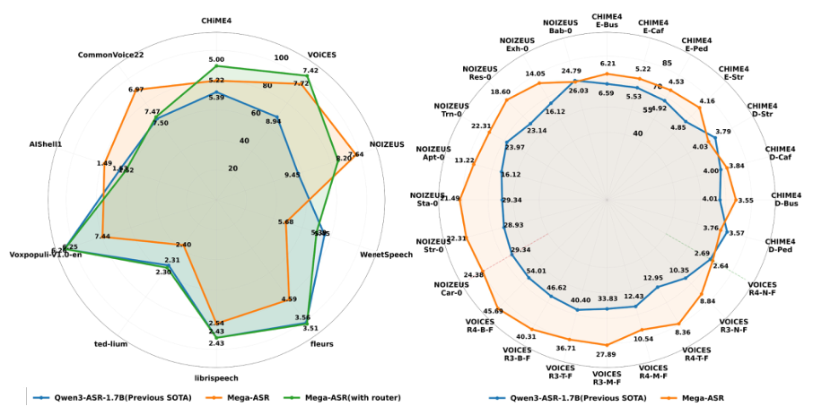
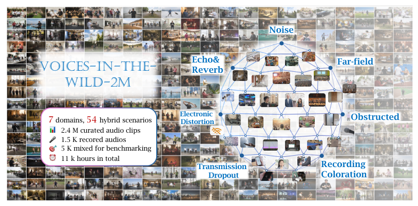
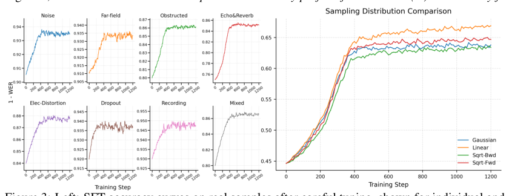
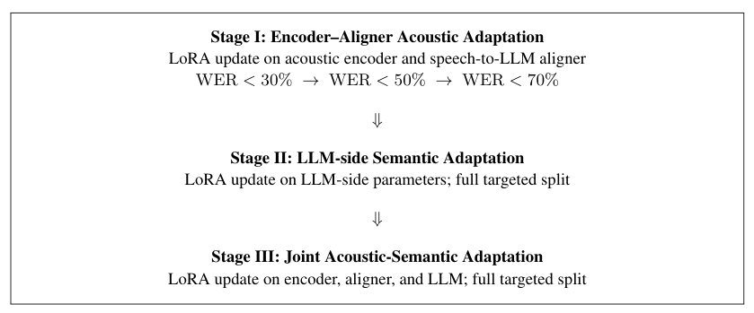
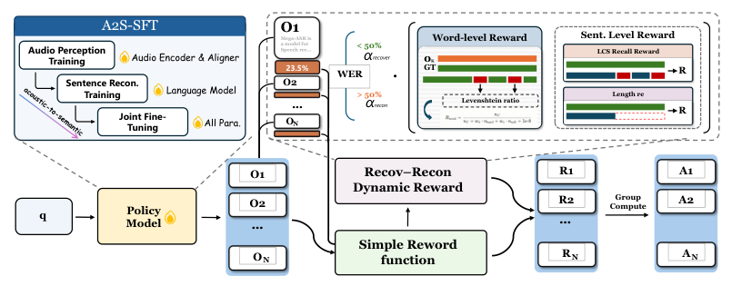
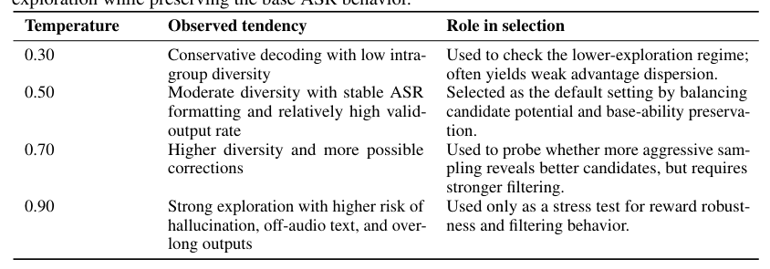
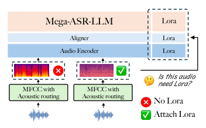
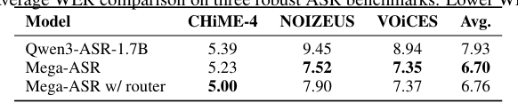
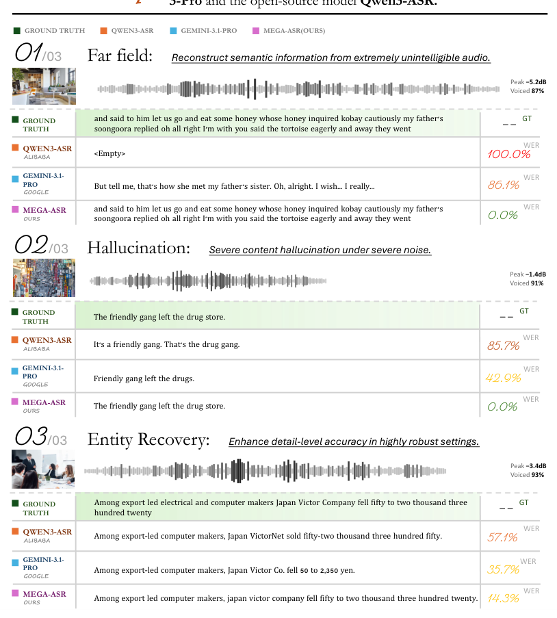
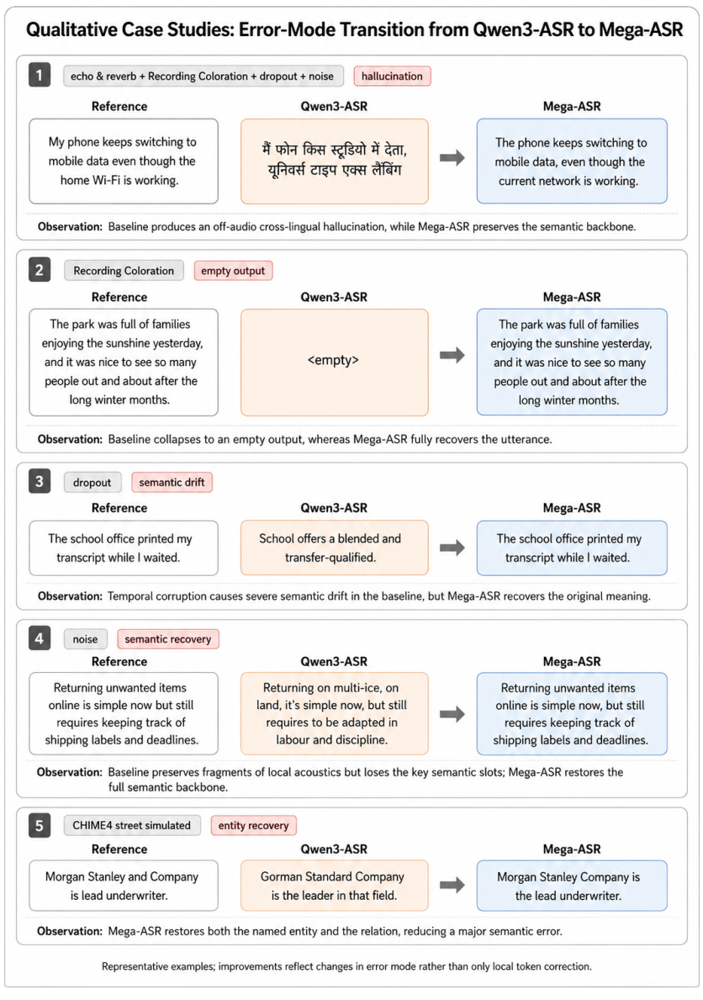

## 论文链接

- 原始论文页面：https://arxiv.org/abs/2605.19833
- PDF 下载：https://arxiv.org/pdf/2605.19833.pdf
- Hugging Face 论文页：https://huggingface.co/papers/2605.19833
- 项目主页：https://xzf-thu.github.io/Mega-ASR/
- 开源代码仓库：https://github.com/xzf-thu/Mega-ASR

Mega-ASR：通过扩大真实世界声学模拟迈向“野外平方”语音识别

> 导读摘要：这篇论文要解决的不是普通噪声下的语音识别，而是“真实环境里多种退化同时出现”时 ASR 为什么会突然崩掉。作者给出的答案很完整：先构造一个覆盖 7 类原子声学因素、54 种复合场景的大规模数据集 Voices-in-the-Wild-2M，再用 A2S-SFT（声学到语义渐进式监督微调）分阶段建立“先听清、再补全语义”的能力，最后用 DG-WGPO（双粒度 WER 门控策略优化）针对高错误率区间的幻觉、整句遗漏和语义漂移设计更合适的强化学习奖励。结果上，Mega-ASR 不只是平均 WER 更低，更关键的是在复杂真实环境中显著减少了灾难性误识别。

## 问题不在“有噪声”，而在“复合失真让模型失去声学锚点”

这篇工作的出发点很明确：今天很多 ASR 模型在标准测试集上已经非常强，但这并不等于它们能在真实世界里稳定工作。只要语音同时受到远场传播、混响、遮挡、设备着色、电子失真、传输丢包等多种因素影响，模型常见的失败模式就不再是“错几个词”，而会变成整句遗漏、凭空补写、语义严重偏离。

作者把这个问题称为**声学鲁棒性瓶颈**。核心现象是：模型在干净语音上学到的语言先验很强，但一旦输入声学证据严重退化，它就容易“听不清却还在猜”，于是从正常转写滑向幻觉式生成。传统做法之所以不够，主要有三点：

1. 训练数据通常只覆盖单一或少量退化因素；
2. 真实环境中的退化是组合出现的，但大规模复合场景数据很缺；
3. 现有训练样本的难度分布偏温和，难以覆盖 WER 超过 30% 后那种错误模式突变的区间。

论文首页的总体结果图就说明了这一点：Mega-ASR 的提升主要不是来自干净场景刷分，而是来自复杂环境下的明显外扩。

这也决定了全文的主线不是单纯改一个网络模块，而是围绕“真实环境鲁棒识别”同时重做数据、训练节奏和奖励设计。

## Voices-in-the-Wild-2M：先把真实世界的复杂声学条件系统化

Mega-ASR 的第一块基石是数据。作者没有继续依赖零散的真实录音采集，而是选择从干净语音出发做大规模模拟，因为只有这样才能同时保证**规模、可控性和场景覆盖度**。

数据集的设计思路可以直接从下图理解：先定义 7 类原子声学现象，再把它们组合成 54 种物理上合理的复合场景。

这 7 类原子因素包括：噪声、远场、遮挡、回声与混响、录音着色、电子失真、传输丢失。它们不是抽象标签，而是通过频谱级处理流水线来实现的。作者强调，模拟不是随手叠加增强，而是先对每一类原子效应做单独实现和反复调参，再和真实录音对比校准，使其尽量贴近现实中的听感与识别难度。

在此基础上，数据生成分为四步：

- **原子效应模拟**：对 7 类退化分别实现滤波、卷积、频谱裁剪等处理；
- **现实约束下的复合组合**：从 2 到 5 个原子因素组合，只保留物理上说得通的场景；
- **可控难度采样**：为每种退化设置统一的严重度参数 \(k\in[0,1]\)，再选择合适的难度分布；
- **可学习性过滤**：去掉 WER 高于 70% 的样本，避免训练直接不稳定。

其中，“难度怎么分布”并不是细枝末节。作者专门比较了几种严重度采样方式，并最终采用线性分布，因为它在真实样本迁移和训练稳定性之间更平衡。左图体现了模拟参数对真实样本适配的校准过程，右图则展示了不同难度分布带来的训练效果差异。

这一步很关键，因为作者并不想得到一个“极其难但学不会”的数据集，而是想得到一个**足够接近真实、足够复杂、同时仍可用于训练**的数据分布。最终构建出的 Voices-in-the-Wild-2M 规模约 240 万音频，约 1.1 万小时，总体难度显著高于传统鲁棒 ASR 数据集；即便是强基线模型，在这个数据上平均 WER 也很高。

除了训练集，作者还补充发布了 Voices-in-the-Wild-Bench，包含真实录音和模拟样本的测试集，用来检验模型是否真的学到了跨场景鲁棒性，而不是只适应某一种增强脚本。

## A2S-SFT：把“听清声音”和“恢复语义”拆成三阶段学习

有了更难的数据，接下来还不能直接粗暴微调。论文对失败机制的判断是：高退化语音识别里其实有两个耦合问题。

- 第一，模型未必能从受损声波中提取出可靠的局部声学证据；
- 第二，即便只能听到一部分，它也未必能正确重建整句语义。

因此作者提出 A2S-SFT，思路是把训练从“声学感知”逐步推进到“语义恢复”，而不是一开始就让整个模型同时解决所有问题。其三阶段训练节奏如下图所示。

具体来说：

### 第一阶段：只强化编码器和对齐器的声学适配

这一阶段只训练前端与对齐部分，并采用按 WER 逐步放宽的课程学习：先学 WER<30% 的样本，再扩展到 <50%，最后到 <70%。

这个设计背后的逻辑是，模型必须先重新获得基本的“听清能力”。如果一上来就把极难样本塞给整个系统，LLM 端往往会过早接管，导致模型学会“猜句子”而不是“依据音频恢复文本”。

### 第二阶段：训练语言模型侧的语义恢复能力

当前端已经能提供哪怕不完美、但至少相关的声学证据后，再让 LLM 部分在全量目标难度样本上学习，重点不是提升字面匹配，而是学会在声学线索残缺时进行合理的语义补全。

### 第三阶段：端到端联合对齐

最后再把编码器、对齐器和 LLM 一起联合微调，把“听到了什么”和“该输出什么”重新配平。这样可以避免前后端各自为战，形成更稳定的声学到语义映射。

这套方案的核心不是 curriculum 本身，而是作者明确承认：**高退化 ASR 不是纯感知任务，也不是纯语言恢复任务，而是二者要按顺序搭桥**。这一点在方法总览图里也很清楚，A2S-SFT 是后续强化优化的初始化基础。

图中左侧就是 A2S-SFT 的三段式结构：先做音频感知训练，再做句子重建训练，最后联合微调，得到具备初始鲁棒性的 Mega-ASR-Base。

## DG-WGPO：当 WER 奖励失灵后，如何改造强化学习信号

A2S-SFT 解决的是“能力怎么建立”，但作者认为仅靠监督微调还不够，尤其在更困难样本上，模型的输出空间仍然需要进一步被校准。因此他们在 Mega-ASR-Base 上继续做策略优化，并提出 DG-WGPO。

问题出在：**单一 WER 奖励在高退化区间并不好用**。当错误较轻时，模型主要是词级别错漏，WER 还能提供有意义的梯度方向；但当错误严重时，输出往往会变成整句幻觉、大段缺失、甚至完全偏题，这时只看 WER 很难指导模型到底该优先修局部词，还是先找回整句语义。

DG-WGPO 的解决方式有两层：

1. 保留基础的静态规则奖励，比如 WER 奖励和重复惩罚；
2. 额外引入一个**双粒度动态奖励**，把学习信号拆成：
   - **词级恢复奖励**：关注局部 token 是否找回来了；
   - **句级重建奖励**：关注整句语义结构是否保住了。

更重要的是，这两个奖励的权重不是固定的，而是由 WER 门控动态切换。错误较轻时，更强调词级修正；错误较重时，更强调句级重建。这正是图 4 右侧的重点：模型先生成多个候选，再依据当前样本的错误严重程度，在两类奖励之间做镜像式融合。

为了让这种设计更具体，论文还给出了关键奖励超参数。下面这张表虽然是实现细节，但很能体现方法思想：它把静态约束、软替换折扣、WER 门限和动态融合权重放在一起，形成一套结构化奖励机制。

从方法上看，DG-WGPO 的价值不只是“再做一次 RL”，而是明确建模了**错误模式随难度变化而切换**这件事。ASR 在复杂环境下的失败，很多时候不是统一类型的；如果奖励函数不随错误形态变化，优化就会失焦。

## Environment-aware routing：只在必要时打开鲁棒分支

论文还有一个很实用的补充：如果把整个模型都朝“高鲁棒”方向推得很强，可能会损害它在干净语音、热词或其他常规场景中的表现。为此作者加入了一个可插拔的环境感知路由机制。

这个模块的思路很工程化：推理时先用轻量路由器判断当前音频是否属于复杂受损环境，如果是，就给主干模型挂载专门的 LoRA 适配器；如果不是，就直接走基础路径。这样做的好处是：

- 不必为所有输入都承担鲁棒分支的代价；
- 可以尽量保留原始模型在常规场景中的强项；
- 让“复杂环境增强”成为按需启用的能力，而不是永久改写整套模型行为。

这部分虽然不是全文最核心的理论贡献，但它解释了作者为什么能在提升复杂场景表现的同时，尽量不牺牲干净场景性能。

## 实验结果说明：不只是平均 WER 更低，而是灾难性错误明显减少

结果层面，Mega-ASR 在传统鲁棒基准和作者自建复合场景基准上都显示出明显优势。摘要里给出的两个代表性数字就很有说服力：

- 在 VOiCES R4-B-F 上，WER 从 54.01% 降到 45.69%
- 在 NOIZEUS Sta-0 上，WER 从 29.34% 降到 21.49%

更重要的是，这种提升不是局限在某一类噪声，而是跨场景出现。以 CHiME-4 为例，细粒度结果表明 Mega-ASR 及其带路由版本在多个真实/模拟噪声子集上都优于基线，带 router 的版本整体平均成绩最好。

这与作者的方法主张是吻合的：收益来自跨环境泛化，而不是为单一退化定制一个特化模型。

不过，复杂环境 ASR 只看平均 WER 还不够，因为高难样本中的关键问题常常是错误类型。论文用案例对比展示了这一点：在远场、强噪声和细粒度实体恢复等样例里，Mega-ASR 相比强基线更少出现空白、幻觉和细节丢失。

如果再看更多定性案例，会发现 Mega-ASR 的改进并不只是“把几个词修对”，而是把错误模式从灾难性的跨语言幻觉、整句跑偏、主干语义崩塌，拉回到至少能围绕原音频内容进行恢复。

这恰好对应了作者最想证明的一点：他们的方法不仅降低了错误率，更让模型在极端退化下重新“贴住音频”。换句话说，模型不是更会猜了，而是更会在残缺声学证据下维持正确的语义锚定。

## 这篇论文真正有价值的地方

如果只看表面，Mega-ASR 像是在做“大数据集 + 分阶段训练 + RL 奖励设计”。但它更值得注意的地方在于，作者把复杂真实环境 ASR 的问题结构化了：

- **数据层**：真实世界不是单因素退化，而是多因素复合，需要系统化模拟；
- **能力层**：高退化识别不是单纯前端增强，而是从声学感知到语义恢复的渐进建立；
- **优化层**：错误类型会随难度变化，奖励信号也必须跟着变化。

因此，这篇论文最强的地方不一定是某个单独模块，而是整条方法链条是连起来的：  
先用 Voices-in-the-Wild-2M 提供足够真实且可学习的困难场景，再用 A2S-SFT 建立从感知到恢复的基础能力，最后用 DG-WGPO 精修在高 WER 区间最容易崩坏的部分。

从趋势上看，这也给鲁棒 ASR 提了一个很清晰的方向：未来的重点可能不再是给模型多加几种局部增强，而是构造更真实、更可控、可规模化的环境模拟，并让训练目标显式适应“从词级错误到句级崩塌”的过渡。Mega-ASR 的贡献，正是在这个方向上给出了一套相当完整的范式。
