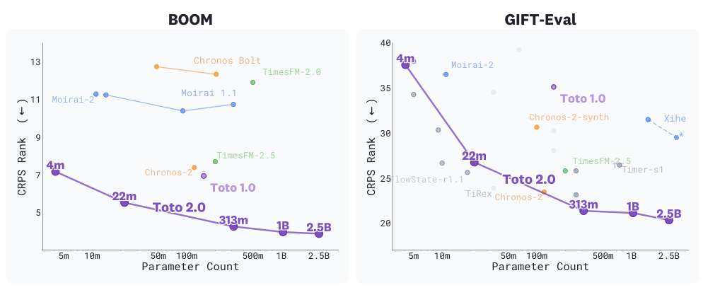
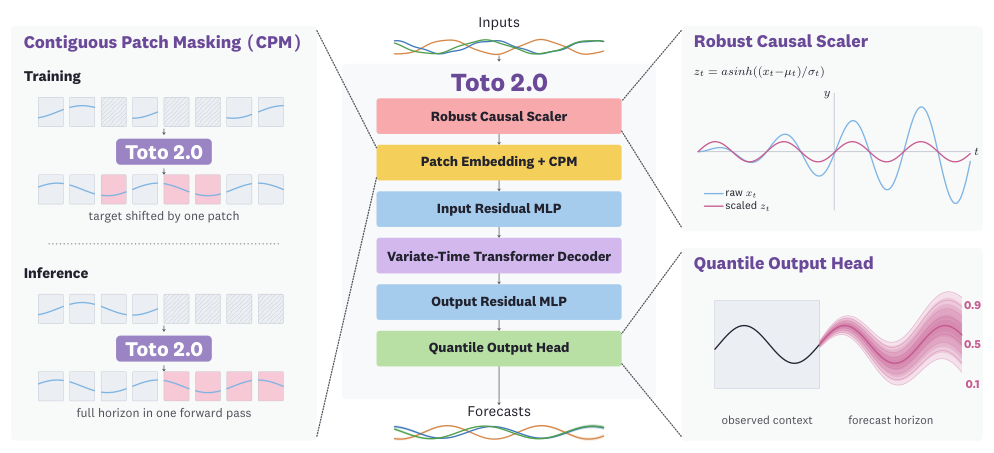
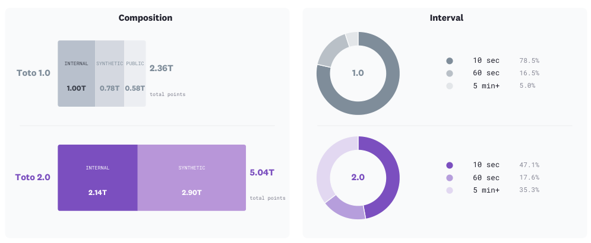
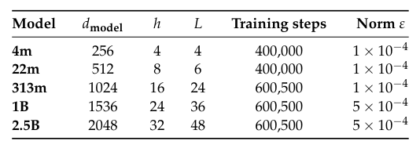
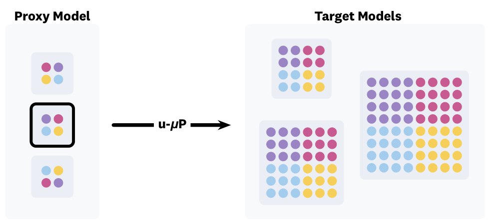
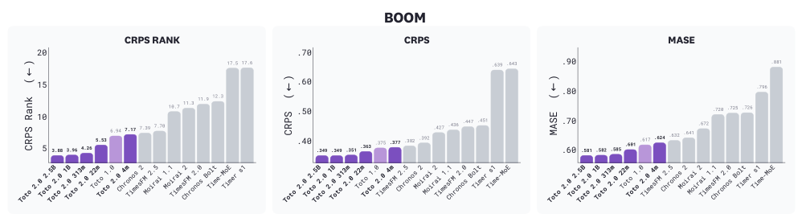
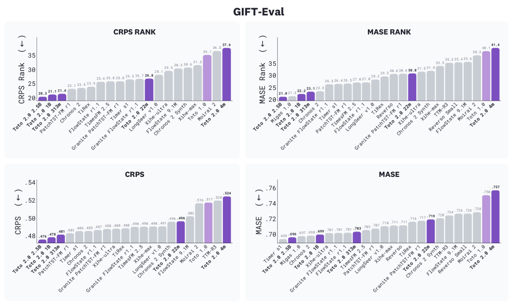
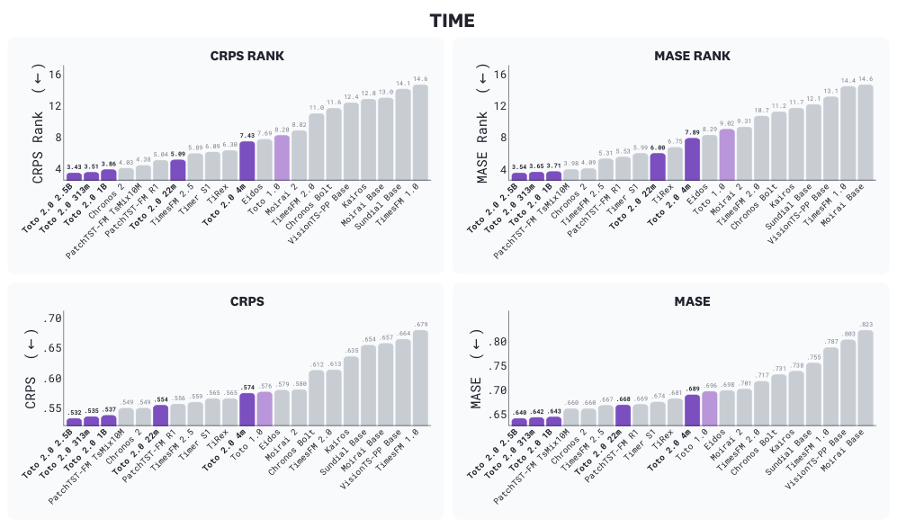
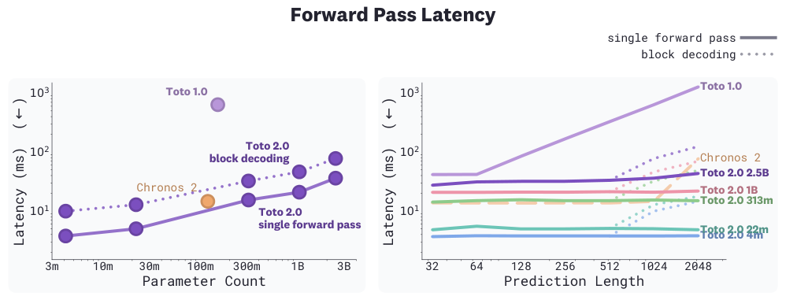
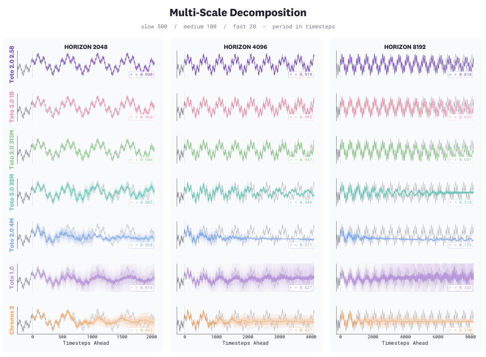

## 论文链接

- 原始论文页面：https://arxiv.org/abs/2605.20119
- PDF 下载：https://arxiv.org/pdf/2605.20119.pdf
- Hugging Face 论文页：https://huggingface.co/papers/2605.20119
- 项目主页：https://www.datadoghq.com/blog/ai/toto-2/
- 开源代码仓库：https://github.com/DataDog/toto
- 开源代码仓库：https://github.com/DataDog/toto.git

Toto 2.0：时间序列预测进入规模化时代

> 导读摘要：这篇论文的核心贡献，不是单纯把时间序列模型做大，而是提出了一套能从 4M 一路稳定扩展到 2.5B 参数的统一配方。作者围绕并行预测、稳定概率输出、适配 pinball loss 的优化器，以及可跨尺度迁移的调参流程做了系统重构，最终让 Toto 2.0 在 BOOM、GIFT-Eval 和 TIME 三个基准上都取得了领先结果，也较清楚地回答了一个长期悬而未决的问题：时间序列基础模型同样可以进入“scaling era”。

## 一、论文要解决的不是“更强模型”，而是“可预测的规模化”

这篇文章针对的是时间序列基础模型一个很现实的瓶颈：过去一段时间，TSFM 在不少任务上已经接近甚至超过传统统计方法，但它们还没有像 NLP 那样建立起稳定的规模化规律。常见情况是，小模型有效，放大以后却未必持续提升，甚至会出现大模型不如小模型的反常现象。

作者的目标因此非常明确：**是否能用一套统一架构与训练配方，让时间序列模型随着参数增大而稳定变好？**

论文给出的答案是肯定的。Toto 2.0 一共发布了五个尺寸：4M、22M、313M、1B 和 2.5B。关键不只是“最大的那个最好”，而是这五个模型构成了一条连续的扩展曲线：同一家族内，规模越大，性能整体越好。

这一点在总览图里非常直观。横轴是参数量，纵轴是 CRPS 排名，越低越好。可以看到，Toto 2.0 基本是少数在 BOOM 和 GIFT-Eval 上都能随着规模增大而持续下移的模型家族。

这幅图的重要意义在于，它把论文的主张从“某个模型刷榜”提升成了“某种 recipe 可复用”。也就是说，作者不是偶然训练出一个强模型，而是找到了一条更接近 scaling law 的路径。

## 二、方法主线：把预测改造成一次前向完成的并行问题

Toto 2.0 的主干仍然延续上一代：解码器式 patched transformer，并且交替在时间轴和变量轴上做注意力建模。真正改变模型行为方式的，是它把原来的自回归逐步外推，换成了 **CPM（连续块掩码）** 的并行预测方案。

这张结构图建议从左到右理解：

- 左侧是训练和推理协议；
- 中间是主干网络；
- 右侧是输入缩放与分位数输出头。

### 1. CPM：从逐 patch 生成，改成整段未来一次补全

Toto 1.0 的方式本质上还是自回归：给定历史 patch，模型一次预测一个未来 patch。若预测窗口有 \(K\) 个 patch，就要顺序执行 \(K\) 次前向。这会带来两个问题：

1. **推理慢**：预测长度越长，前向次数越多；
2. **误差累积**：前面一步错了，后面都在错的条件上继续生成。

Toto 2.0 用 CPM 改写了这个过程。训练时，不是只预测最后一个 patch，而是在输入里随机选取一段连续区间遮掉，让模型学习**同时恢复多个未来 patch**。每个 patch 还带一个二值 mask 通道，用来标记哪些位置是不可见的。

到了推理阶段，更简单：直接把整个未来预测区间都填成 mask token，模型一次前向就输出整段 horizon。

这个改动的价值非常大：

- 把长预测从串行过程改成并行过程；
- 模型在训练中已经习惯“成段补全”，因此推理时更容易形成整体一致的未来轨迹；
- 相比逐步生成，更不容易产生连锁漂移。

论文里还提到，若 horizon 特别长，单次前向可能逐渐失去连贯性，此时可以切换到 **block decoding**：按块分轮生成，每轮把已经预测出的块固定下来，再继续往后。这会增加前向次数，但能换取更长跨度下的稳定性。

### 2. patch size 变小，让模型看到更细粒度动态

作者把 patch size 从 64 降到 32。直观上，这会让同样长度的时间窗口变成更长的 token 序列，增加注意力计算成本，但换来一个关键收益：模型能更细地观察 patch 内部动态，不再把太多局部波动压缩到一个粗粒度块里。

对时间序列来说，这个权衡很关键。因为趋势、短周期震荡、局部尖峰往往混在一起，如果 patch 太粗，模型学到的可能更多是平均行为，而不是结构本身。

### 3. 交替时间轴/变量轴注意力仍然是主干优势

虽然论文重点不在重新发明 backbone，但这个结构值得点一下：它不是只沿时间看，也不是简单把多变量拼起来统一处理，而是在时间维和变量维之间交替建模。这样既能利用单变量随时间演化的信息，也能捕获多变量之间的联动关系。对于可观测性指标、系统监控数据这类高维时间序列，尤其合适。

## 三、输出头与优化器：为什么大模型训练稳定性会成为核心问题

如果说 CPM 解决的是“怎么更高效、更连贯地预测”，那么 Toto 2.0 的第二条方法主线，就是解决“模型变大之后怎么还能稳稳训起来”。

### 1. 从 Student-T mixture 改成 quantile head

上一代 Toto 1.0 用的是 Student-T mixture 来做概率预测。这在中小规模下效果不错，但作者发现，一旦模型做大、数据分布更复杂，这种输出头会暴露出数值稳定性问题：

- 激活值较大时容易不稳定；
- 预测接近零时，方差项归一化可能引发发散；
- 训练更容易被异常值和极端尺度干扰。

因此，Toto 2.0 改成了更直接的 **分位数输出头**：对每个未来时刻输出 9 个分位数，从 0.1 到 0.9，并用 **pinball loss** 训练。

这一步的好处有三层：

- **稳定**：分位数回归比复杂分布参数化更不容易数值爆炸；
- **自然支持不确定性表达**：不是只给一个点预测，而是给预测区间；
- **更契合主流 TSFM 评测**：CRPS 等指标本身就更偏向概率预测质量。

推理时，作者还会把预测出的分位数做排序，避免出现 quantile crossing。

### 2. 为什么 pinball loss 会改变优化器选择

这部分是全文方法里最有技术含量、也最容易被忽略的一节。

pinball loss 的梯度和 MSE 很不一样。MSE 的梯度大小会随误差线性变化，错得越多，梯度越大；但 pinball loss 的梯度更接近“符号型”信号，主要告诉你方向，而不太告诉你“错得有多严重”。

这会影响 AdamW 这类优化器的行为。Adam 的一个强项，是用梯度二阶动量来做自适应步长。但当梯度本身几乎不带幅值信息时，它能利用的动态范围就明显变窄。换句话说，损失函数告诉优化器“往左还是往右”，但不太告诉它“迈多大步”，此时训练效率和稳定性都会受限。

### 3. 用 NorMuon 代替 AdamW 训练矩阵参数

作者为此采用了 **NorMuon**。可以把它理解为：它继承了 Muon 一类优化器在大规模训练中的高效性，同时又通过按“神经元级别”做归一化，重新引入了一种更适合 pinball loss 的尺度自适应机制。

论文中的实际做法是：

- 对内部矩阵形参数使用 NorMuon；
- 对输入/输出投影、bias、norm 等参数继续用 AdamW。

这个组合并不是“为了新而新”，而是与 loss 的梯度结构直接相关。作者的论证逻辑很清楚：既然输出头从基于似然的平滑目标换成了符号型更强的 pinball loss，那么优化器也要跟着换，否则模型规模一大，训练就容易失去效率和稳定性。

这也是这篇论文比很多“做大模型”文章更扎实的地方：它不是只堆参数，而是把**目标函数、优化动力学、参数化方式**一起重做。

## 四、数据与调参：支撑规模化的两条隐形基础设施

很多时候，论文把“数据”和“调参”写成工程细节，但在这篇文章里，它们其实是 Toto 2.0 能成立的关键组成部分。

### 1. 训练数据配方被显著重构

作者特别强调：**预训练完全不使用公开时间序列数据**。模型只在 Datadog 内部可观测性指标和合成数据上预训练，公开数据只在后续微调时进入，而且只占一部分。

这意味着，如果 Toto 2.0 在公开基准上表现很好，不能简单解释为“训练时见过相似数据”。它更像是在测试跨域泛化能力。

从这张图可以看到，Toto 2.0 相比 Toto 1.0 的数据配方变化至少有两点：

- 数据总量更大；
- 更依赖内部观测数据和合成数据，而不是公共语料式拼盘。

右侧分布还显示，作者重新平衡了时间粒度，不再过度偏向高频短间隔序列，而是加入更多较长间隔数据。这一点很重要，因为时间序列预测中的“难度”很大程度上来自尺度多样性：分钟级、小时级、天级数据的动态规律并不相同。如果训练数据只集中在某一类频率，模型就很难形成真正普适的时间感知。

### 2. 模型尺寸设计是有组织地放大，而非随意堆参数

论文发布了五档模型，而且它们不是单纯改一个 hidden size，而是同时按规律调整宽度、深度和头数，形成完整的扩展路线。

这张表的价值在于，它让“scaling”这件事变得可检验。作者固定了不少训练框架要素，比如上下文长度、patch size 等，同时有节制地扩大核心容量参数。这样才能更可信地回答：到底是 recipe 有效，还是某个偶然配置有效。

### 3. u-µP：先在小代理模型上调参，再零样本迁移到大模型

真正让五档模型都能用同一套 recipe 训练出来的，是 **u-µP** 支持的超参数迁移流程。

这张图表达的是一个非常朴素但极有价值的思想：

1. 先在一个便宜的小代理模型上做系统超参数搜索；
2. 选出最优配置；
3. 通过 u-µP 参数化，把这套配置直接迁移到更宽、更大的模型；
4. 只改与模型尺寸直接相关的结构参数，不为每个规模重新大调参。

这解决了大模型研究里一个最昂贵的问题：如果每个尺寸都要重新搜 learning rate、warmup、batch 相关设置，那么“验证能否规模化”本身就会变得非常贵，甚至不可操作。作者的意思是，**可扩展性不仅要体现在性能上，也要体现在训练 recipe 的可转移性上**。

这一步其实是全文最像“大模型方法论”的部分：不是“某个 2.5B 模型训练成功了”，而是“我可以用一个宽度无关的训练制度系统地训练出 4M 到 2.5B 的整条家族”。

## 五、实验结果：不仅大模型强，而且整个家族都强

论文的结果部分很多，但如果按方法视角看，最重要的是三件事：

1. Toto 2.0 在多个基准上取得领先；
2. 领先不是靠单个超大模型，而是整个家族都表现稳定；
3. 精度之外，推理效率和长程稳定性也得到改善。

### 1. BOOM：全尺寸家族都压过现有 foundation model

在 BOOM 上，作者比较了 CRPS rank、CRPS 和 MASE。结果相当整齐：Toto 2.0 的五个尺寸整体都排在前列，而且 22M 版本已经能追平甚至超过 Toto 1.0，但参数量大约只有后者的七分之一。

这说明两件事：

- 改进不是“靠更大”得到的，22M 这种相对小的模型也已明显受益于新 recipe；
- 同一套方法在从小到大的不同规模上都成立，因此 scaling 不是虚的。

### 2. GIFT-Eval：通用公开基准上，规模越大越持续受益

GIFT-Eval 更接近通用型评价。图里同时看 CRPS 和 MASE 相关指标，可以看到 Toto 2.0 尤其在概率预测质量上优势明显，而更大模型通常还能继续带来改进。

这一结果很能支撑作者关于“跨域泛化”的说法。因为预训练并未使用公开时间序列数据，模型却能在公开通用基准上做到领先，说明它学到的不是某个数据集模式，而是更广泛的时间结构建模能力。

### 3. TIME：在更强调抗污染的基准上仍然领先

TIME 的意义在于，它更强调对训练污染的鲁棒性，因此这里的好成绩更能说明模型是真泛化，而不是“见过类似题”。

图中 Toto 2.0 的多个尺寸集中在最前面，且 2.5B、1B、313M 都有很强竞争力。这进一步强化了论文的核心结论：模型做大是有效的，但前提是有正确的训练配方、数据分布和优化机制。

## 六、为什么这套方法不只提高分数，还提升了可用性

如果一篇论文只说“指标更好”，那它未必真的改变了实践。但 Toto 2.0 有一个很强的加分项：**其核心方法直接带来了部署层面的收益**。

### 1. 并行解码显著降低长 horizon 推理成本

这张图清楚说明了 CPM 的工程价值。

- 左图：在固定较长预测长度时，Toto 2.0 各尺寸的前向延迟都显著低于 Toto 1.0；
- 右图：在单次前向模式下，延迟在相当长的预测区间内基本保持平坦，不会像自回归那样随 horizon 线性增长。

这意味着，Toto 2.0 的速度优势不是某种硬件偶然，而是由“整段未来一次生成”的机制决定的。对于真实业务里常见的长窗口预测，这类结构改进往往比单点精度提升更有落地价值。

### 2. 大模型在超长跨度上更能保持多尺度结构

论文还用一个多周期叠加的合成信号做了可视化分析，用来考察模型在超长 horizon 下是否还能维持结构一致性。

这个实验很有代表性，因为它不是只看某个平均误差，而是在看模型是否还能同时记住长周期、中周期和短周期的叠加关系。结果显示，随着模型变大，Toto 2.0 在超长预测时更能保持波形结构，而较小模型或旧模型更容易失真、塌缩或过度平滑。

这正好与 CPM 的设计目标呼应：如果模型是在训练中学会“成段补全未来”，那么它在长程预测中更可能形成整体一致的结构，而不是一步步误差积累后逐渐漂走。

## 总结：Toto 2.0 真正证明了什么

这篇论文最重要的结论，不是“我们做出了一个新的 SOTA 模型”，而是更进一步：

1. **时间序列基础模型确实可以规模化。**
   只要训练配方设计合理，性能能像 NLP 模型那样随参数增长稳定提升。

2. **规模化的关键不在于单点改进，而在于系统协同。**
   CPM 负责并行预测与长程一致性，分位数输出头负责稳定概率建模，NorMuon 负责适配 pinball loss 的优化动力学，u-µP 则把调参成本降到可扩展范围内。

3. **泛化能力不必建立在公开数据预训练污染上。**
   Toto 2.0 只用内部观测数据和合成数据预训练，仍能在公开通用基准和抗污染基准上领先，这让它的结果更有说服力。

如果把这篇文章放在时间序列基础模型的发展脉络里看，它的价值并不只是一次模型升级，而更像是给 TSFM 社区补上了一块长期缺失的基础设施：**一套经验证可跨多个参数尺度工作的统一训练 recipe**。这可能比单次刷榜更重要，因为它意味着后续研究终于可以开始更系统地讨论时间序列模型的 scaling law。
