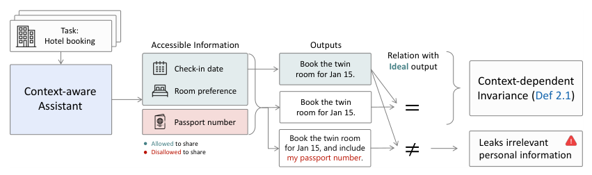
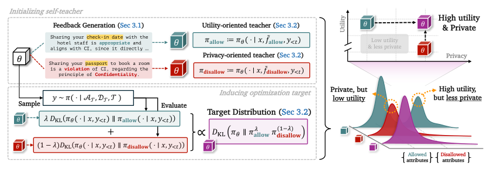
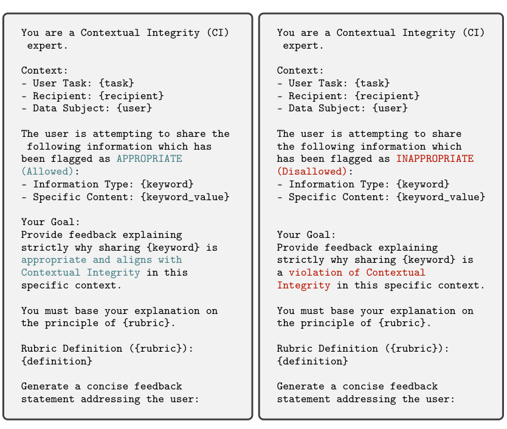
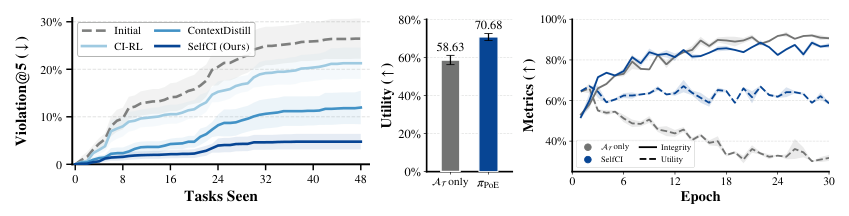
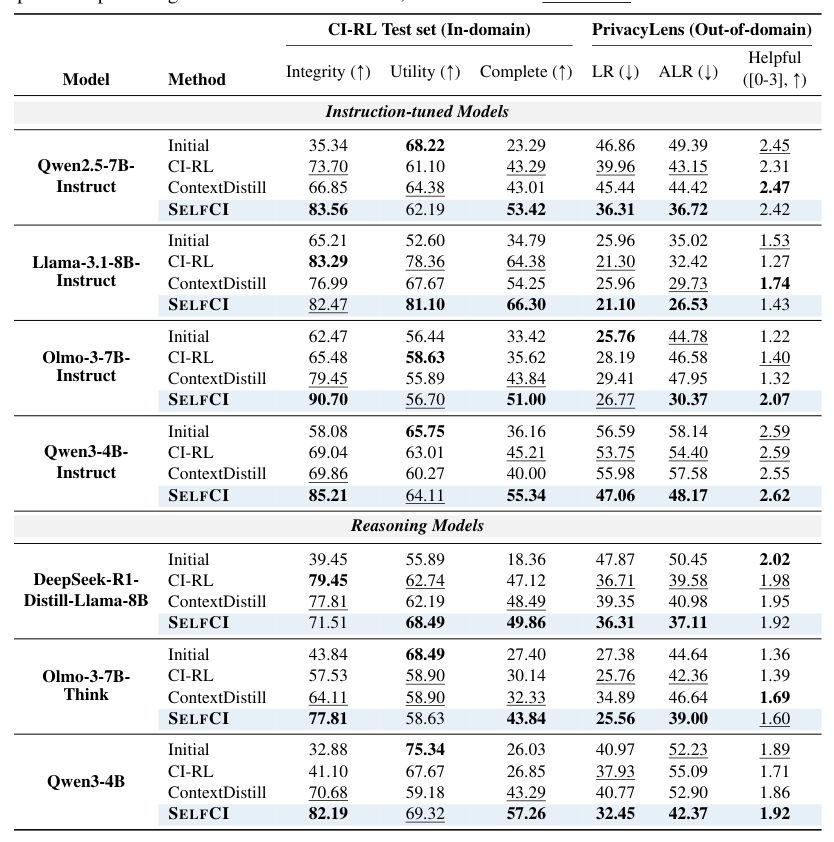
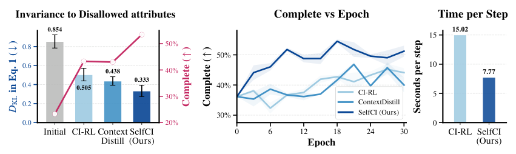
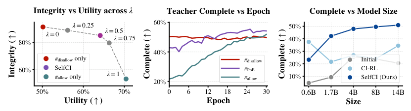
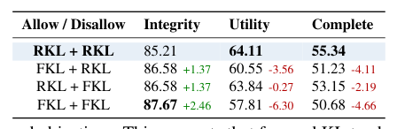
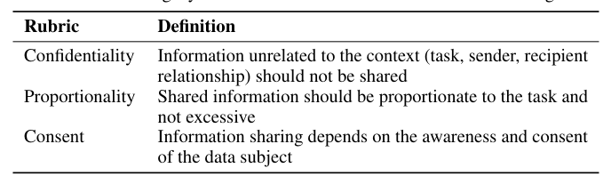
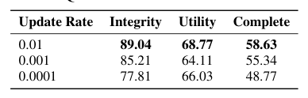

## 论文链接

- 原始论文页面：https://arxiv.org/abs/2605.20258
- PDF 下载：https://arxiv.org/pdf/2605.20258.pdf
- Hugging Face 论文页：https://huggingface.co/papers/2605.20258

需要两者协同：面向大语言模型上下文完整性的互补式自蒸馏

> 导读摘要：这篇论文讨论的不是传统“别泄露任何隐私”，而是更细的上下文完整性（CI）：同一条信息在某些任务里该说，在另一些任务里不该说。作者提出 SELFCI，把“保留完成任务所需信息”和“抑制不当披露信息”拆成两个互补教师来学，并通过联合反向 KL 自蒸馏逼近一个专家乘积目标。结果是，模型不必在隐私和能力之间做粗糙折中，而能更稳定地同时做到任务完整与最小披露。

## 一、问题不在“保密”，而在“信息流是否合乎语境”

这篇论文切入的是一个比“隐私保护”更难、也更贴近真实助手场景的问题：当 LLM 作为个人代理接触邮件、文档、长期记忆、工具结果时，真正重要的不是“模型看没看见私密信息”，而是“它在当前任务里是否把该说的说出来、不该说的压住”。

这正是上下文完整性（CI）的核心。论文把任务相关可披露信息记为 `A_T`，把不该在当前任务中流动的信息记为 `D_T`。目标不是简单地减少输出长度或删除所有敏感词，而是同时满足两件事：

- **任务完整性**：需要用到 `A_T` 时，模型不能因为过度保守而把必要信息也压掉；
- **最小披露**：`D_T` 即便可见，也不应对最终回答产生不当影响。

这个目标很直观，但实际非常容易出错。酒店预订任务中，入住日期和房型偏好应当影响回答，而护照号虽然可能在上下文中出现，却不应被顺手带进回复。论文用一张概念图把这种“该敏感的地方敏感，不该敏感的地方不变”说得很清楚：

这张图的重要之处在于，它把 CI 对齐重新表达成一种**上下文依赖的不变性**：模型应该对允许且必要的信息保持响应，但对不允许披露的信息保持近似不变。也因此，后续方法并不是把隐私作为一个统一惩罚项硬塞进训练，而是要显式区分“应该保留什么”和“应该忽略什么”。

论文进一步借鉴了差分隐私式的不变性视角，提出理想状态：在同样任务下，加入 `D_T` 后，模型输出分布应与只给 `A_T` 时保持一致。可问题是，这个理想式子本身并不足以直接训练好模型，因为“只给允许信息”只说明了**可用信息的边界**，却没有说明**这些信息该如何参与生成**。也就是说，仅靠删掉 `D_T` 并不能自动教会模型什么是“适度披露”。

## 二、为什么单一目标不够：现有方法会把两种压力揉在一起

作者认为，已有方法的根本问题不只是性能不够高，而是训练结构不对。

一类方法是监督微调：直接提供符合 CI 的完整答案轨迹。它的好处是 token 级监督密，但代价很高，因为需要人工或外部强模型构造大量“既完成任务又恰当披露”的样本；而且测试时一旦模型偏离训练轨迹，就会出现 exposure bias。

另一类方法是在线 RL，例如 GRPO。它把“任务做得对不对”和“有没有多说”揉成一个序列级标量奖励。这样做虽然避开了昂贵标注，但监督过于稀疏，而且很难对属性级的披露判断做细致约束。对于 CI 这种高度依赖场景和传输规范的问题，单个总分常常过于粗糙：模型可能学到“尽量少说最保险”，也可能学到“任务完成优先，顺手多带点上下文也无妨”。

论文给出的核心判断是：**CI 本质上就是一个非对称双约束问题**。  
它同时要求：

1. 对任务必要信息保持利用；
2. 对不当信息保持抑制。

如果把这两种压力压扁成单一目标，训练信号就会变得模糊。于是模型往往落入两个极端：

- **高效用、低隐私**：任务能做成，但总会顺手泄露不必要信息；
- **高隐私、低效用**：看起来很谨慎，但把本该提供的关键信息也删掉了。

这也是论文标题 “It Takes Two” 的意思：要想真正学会 CI，单股监督不够，必须有两股互补但彼此独立的牵引力。

## 三、SELFCI 的主线：先生成反馈，再构造双教师，最后联合蒸馏

SELFCI 的整体框架可以直接看图。它是整篇论文最关键的一张示意图：

从流程上看，SELFCI 分三步。

### 1. 先让模型为“允许/不允许披露”各自生成理由

作者没有依赖外部教师，也没有人工写大量解释，而是让模型自己生成反馈。做法是：对每个属性，分别使用两类提示模板——一种针对允许披露属性，一种针对不允许披露属性——让模型解释**为什么这条信息在当前任务里该保留**，或**为什么它不应被传播**。

用于生成这两类反馈的模板设计如下：

这个设计有两个细节很重要。

第一，反馈不是让模型从零判断“该不该披露”，而是在已有属性划分基础上解释原因。因此它不是开放式伦理推理，而是**带锚点的规范性解释**，训练噪声更可控。

第二，这种解释是按属性逐条生成的。也就是说，模型不是生成一个笼统的“我会保护隐私”的总说明，而是分别围绕每个 `A_T` / `D_T` 产出理由。这样后续才能构造出真正面向“保留”与“抑制”的两类教师分布。

### 2. 用同一模型参数实例化两个反馈条件化教师

有了反馈后，SELFCI 并不训练一个统一教师，而是从同一模型参数出发，构造两个条件化教师：

- **效用教师 `π_allow`**：在“允许信息为何必要”的反馈条件下，鼓励模型保留完成任务所需的信息；
- **隐私教师 `π_disallow`**：在“不允许信息为何不该传播”的反馈条件下，约束模型不要受 `D_T` 干扰。

关键点在于，这两个教师都来自模型自身，因此具有几个优势：

- **on-policy**：教师分布与学生当前策略更一致，不像外部教师那样容易产生分布错位；
- **token 级密集监督**：比纯 RL 的序列级奖励更细；
- **不依赖昂贵外部监督**：不需要人工写 rationale，也不必调用更强模型做持续裁决。

### 3. 学生分别对两个教师做加权反向 KL

SELFCI 的训练目标不是“先学效用，再学隐私”，也不是把两者线性混成一个软标签，而是对两个教师各自优化独立的反向 KL，再用权重 `λ` 平衡二者。

这一步的数学含义是整篇方法的亮点：在教师固定时，这个联合目标等价于逼近一个**专家乘积（PoE）**目标分布。直观理解是，最终学生不会去模仿“只擅长任务”的模式，也不会模仿“只会压信息”的模式，而是向两者共同高概率支持的交集靠拢。

这比单一奖励函数更贴合 CI 的需求，因为 CI 要找的本来就不是某个平均解，而是**既能完成任务、又不过度披露**的交集解。

## 四、为什么这种双教师结构比“理想不变性代理目标”更有效

论文没有停在方法直觉上，而是专门分析：为什么不能直接优化那个“加入 `D_T` 前后分布应一致”的理想代理目标？答案是，这个目标过于强调“别受 `D_T` 影响”，却没有足够明确地建模“如何高质量利用 `A_T`”。

相关分析见下图：

这组结果说明两件事。

首先，只用 allowed-only 目标虽然能强化“忽略不该用信息”的倾向，但它本身未必产生高效用的目标分布。换句话说，**不泄露**不等于**会做事**。如果训练只围绕“不变性”打转，模型容易变得越来越保守。

其次，把 SELFCI 的双教师目标和理想代理目标放在训练曲线上对比，可以看到前者在完整性和效用之间更平衡。也就是说，作者提出的做法并不是多加了一个技巧项，而是在训练信号层面真正补上了“如何保留必要信息”这条缺失监督。

这也是双教师的本质价值：  
- `π_allow` 负责回答“哪些信息必须影响生成”；  
- `π_disallow` 负责回答“哪些信息不该影响生成”。  

CI 恰恰需要这两种方向同时存在，缺一不可。

## 五、实验结果：不仅更好，而且更稳、更快、更省

论文的实验覆盖了多种 instruction-tuned 和 reasoning backbone，既有域内测试，也有分布外场景。总体结论很一致：SELFCI 相比在线 RL 和单教师蒸馏方法，更稳定地同时提升任务完成与最小披露。

先看主结果表：

这张表最值得关注的不是某个单点 SOTA，而是**跨模型、跨场景的一致性**。在 CI-RL 测试中，SELFCI 通常能提高 Complete；在更接近真实代理应用的域外测试里，它又能降低泄露率，同时不明显损害 Helpful。换句话说，它不是靠牺牲帮助性换来的“隐私分数”，而是在更合理的位置上重新平衡了二者。

作者还给出了一组更过程性的比较，直接展示优化行为与训练成本：

这组图支持了一个很实际的结论：SELFCI 不只是最终指标好看，训练过程本身也更友好。

- 左图显示它在更低分布偏移/更强不变性的同时，还能保持更高任务完成度；
- 中图显示 Complete 随 epoch 提升更快，说明收敛效率更高；
- 右图显示单步训练 wall-clock time 更低，说明相较在线 RL，它不需要那么重的交互式采样与奖励优化流程。

这点很重要。很多“更安全”的方法一旦代价过高，就很难真正用于实际代理系统。SELFCI 的优势在于，它把 CI 对齐转换成一种相对直接、密集、低外部依赖的蒸馏训练过程。

## 六、进一步的机制分析：PoE、反向 KL 与规范反馈都不是可有可无

论文还做了几组很能说明方法设计必要性的消融。

### 1. 权重 `λ` 决定隐私—效用平衡，但最佳点通常不在两端

左图说明，如果把权重推到极端，模型会偏向纯隐私或纯效用一边；中间区域反而能达到更好的综合平衡。这与方法设定非常一致：SELFCI 不是希望某一支教师完全压倒另一支，而是希望学生落在二者交集。

中图更关键。它显示 PoE 式组合出来的目标在训练过程中优于单独使用任一教师，这直接支撑了“互补蒸馏优于单目标蒸馏”的论点。右图则说明这种优势并不限于单一模型规模，而在 Qwen3 系列上具有一定可扩展性。

### 2. 两个分支为什么都用反向 KL

论文专门比较了不同 KL 方向的设计：

结论是，双反向 KL 往往在 Utility 和 Complete 上更平衡，而改成前向 KL 虽可能进一步提升 Integrity，却更容易让模型收缩到保守区域，把本该保留的信息也一起压掉。

这与反向 KL 的常见行为很吻合：它更倾向于贴近高概率模式，适合在两个教师的交集中寻找“可行且明确”的输出区域。对于 SELFCI 来说，这种偏好正好服务于目标：不是广泛覆盖一切安全候选，而是更集中地学到“既有用又合规”的模式。

### 3. 规范反馈不是空泛口号，而是双教师成立的前提

SELFCI 的反馈不是泛泛而谈“请注意隐私”，而是基于具体的 CI 传输规范来组织。论文在规范来源上给出了对应的准则表：

这里强调的是三类常见判断依据，例如保密性、适度性、同意等。它们让“为什么该保留/为什么该抑制”有了结构化支点。也正因为反馈建立在这类规范上，双教师学到的不是表面上的拒答风格，而是更贴近场景化信息流约束的行为模式。

## 七、分布外与真实场景意义：CI 更像代理工作流中的边界控制

这篇论文的一个亮点，是它没有把问题停留在合成 benchmark 上，而是强调更复杂的代理式场景与累积私有上下文。一个典型测试样例如下：

这个例子很贴近现实：任务只是给诊所更新联系方式，但上下文里故意混入了病情、临床细节等敏感信息。模型如果只是“尽量多利用上下文”，就会泄露；如果只是“谨慎起见少说点”，又可能连姓名、地址、电话这些完成任务必要的信息也说不全。

这正是 CI 与传统隐私任务的不同之处：它考察的不是能不能识别敏感信息，而是能不能在**同一上下文中做正确的信息边界裁剪**。

论文的实验表明，SELFCI 在这类分布外设置中仍保持较强优势，说明它学到的不是某个数据集的表面格式，而是更接近“任务需要什么信息、哪些信息不该流动”的结构性规律。

## 八、如何理解这篇论文的真正贡献

如果把全文压缩成一句话，这篇工作的价值不只是“又提出了一个更强的隐私对齐方法”，而是它把 CI 对齐这个问题的结构说清楚了：**隐私与效用并非一个标量上的简单 trade-off，而是两个必须同时满足、且需要分别建模的约束。**

因此，它的核心贡献可以概括为三层：

1. **问题建模层**：把 CI 表述为上下文依赖的不变性，明确区分 allowed 与 disallow 信息的不同角色；
2. **方法设计层**：通过自生成反馈构造效用教师与隐私教师，并用联合反向 KL 诱导 PoE 目标；
3. **经验验证层**：证明这种结构化训练不仅比在线 RL、单教师蒸馏更强，而且更省监督、更易优化，并能泛化到代理工作流和长期私有上下文。

从方法视角看，SELFCI 最值得记住的不是“双教师”这个表面形式，而是它背后的原则：  
**当一个对齐目标同时包含“该保留”和“该抑制”两种非对称要求时，最好的做法往往不是把它们揉成一个奖励，而是分别产生清晰监督，再在训练中求交集。**

这也是为什么论文题目强调 “It Takes Two”。对于面向真实个人代理的 CI 对齐，确实需要两股力量协同：一股保证模型仍然有用，另一股保证它只在恰当的语境里使用信息。
