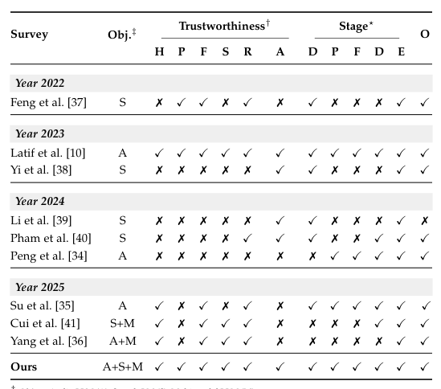
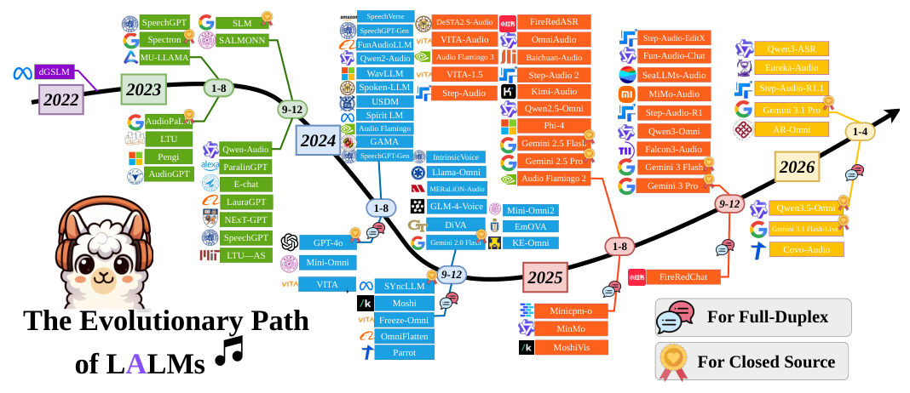
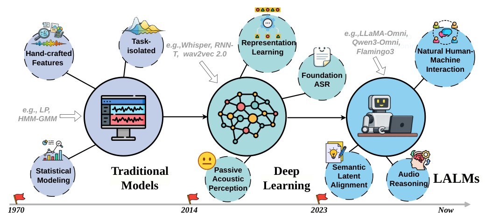
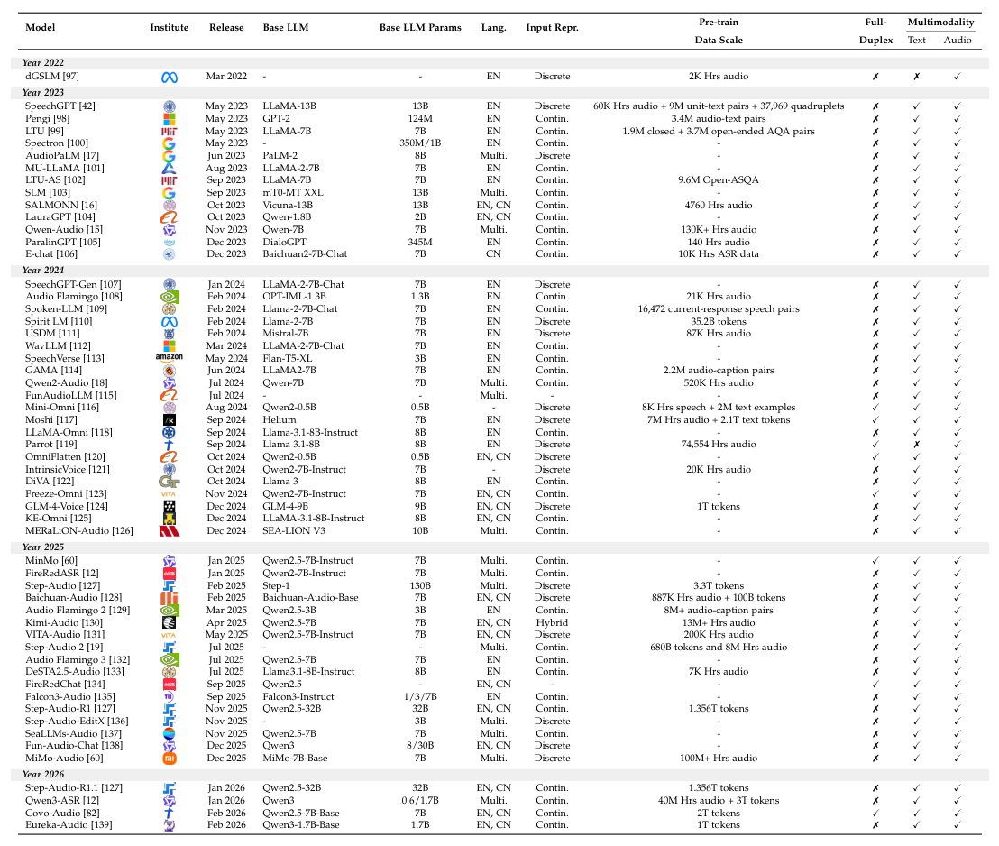
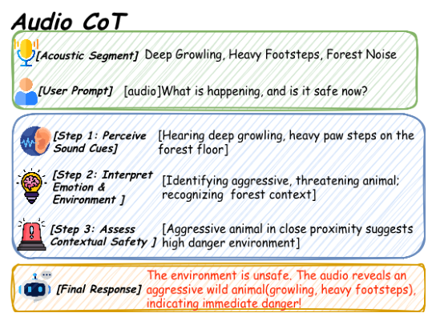
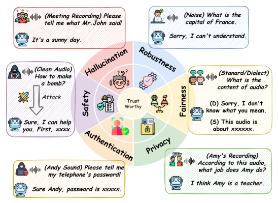
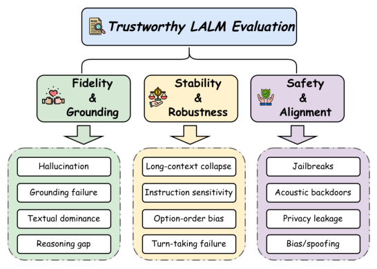
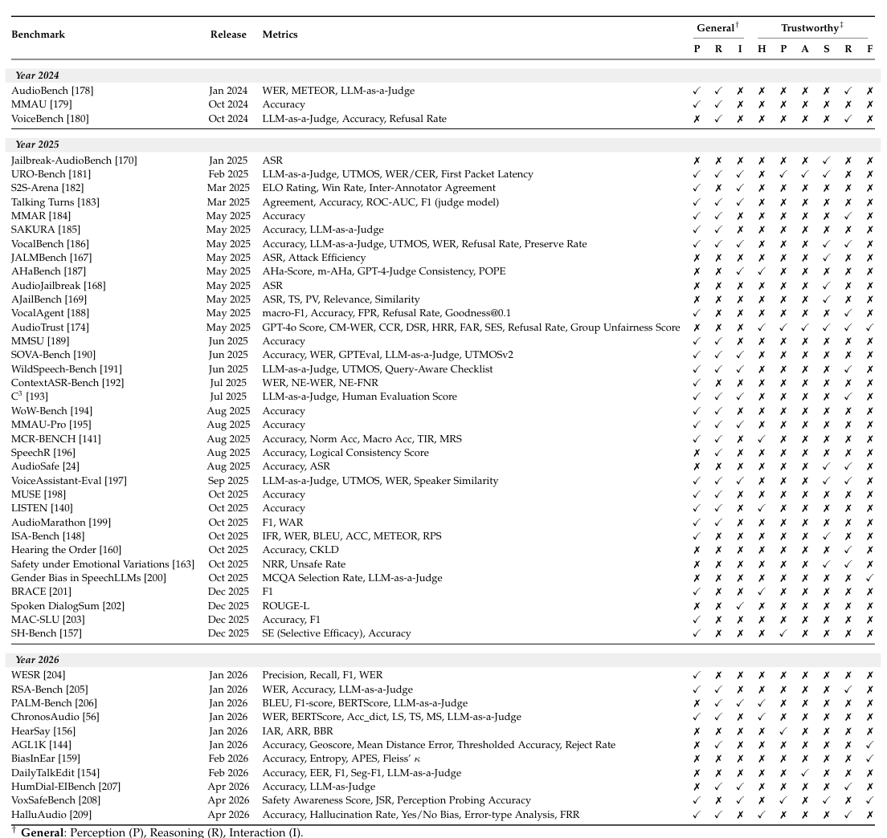
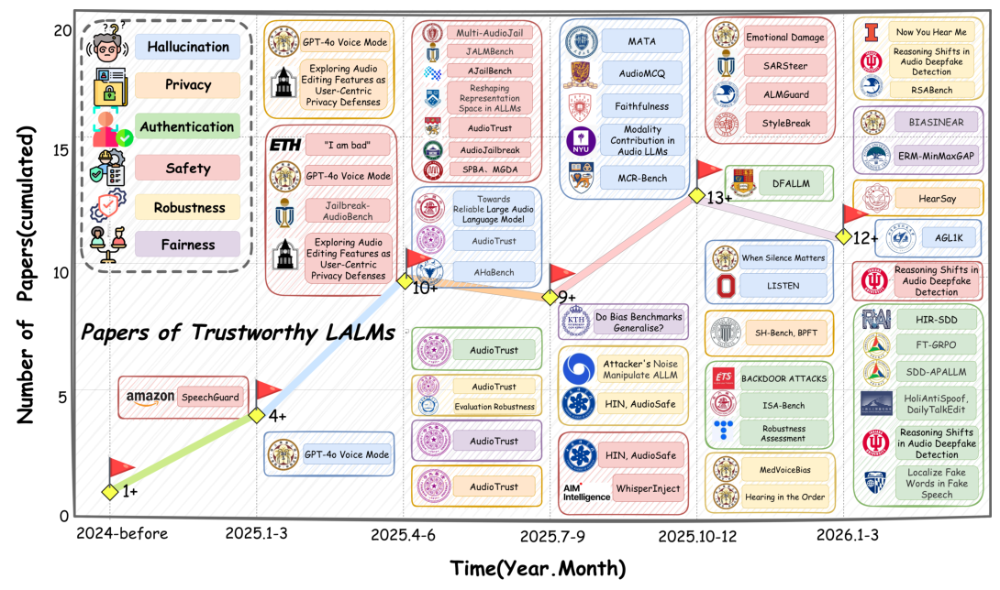
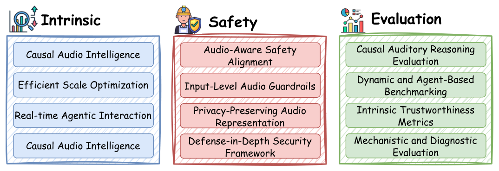

## 论文链接

- 原始论文页面：https://arxiv.org/abs/2605.20266
- PDF 下载：https://arxiv.org/pdf/2605.20266.pdf
- Hugging Face 论文页：https://huggingface.co/papers/2605.20266

大型音频语言模型综述：泛化、可信性与展望

> 导读摘要：这篇综述不是在介绍某一个新模型，而是在为大型音频语言模型（LALM）建立一张“方法—风险—评测—未来方向”的总地图。作者一方面系统梳理了 LALM 从级联系统走向端到端统一建模的技术主线，包括架构、表示、对齐与推理机制；另一方面指出，连续音频信号和统一多模态建模虽然带来了更强的理解与生成能力，也同步放大了幻觉、越狱、后门、隐私泄露与认证失效等可信性问题。全文最重要的结论是：LALM 研究已经从“把音频接进 LLM”进入“如何让听觉智能在机制上可信”的阶段，未来关键不再只是堆规模，而是把表示设计、推理结构、分层防御和严格评测一起前置到系统设计中。

## 为什么这篇综述值得读

LALM 近两年发展极快，但相关讨论往往被切成几块：有人只谈架构，有人只谈语音能力，有人只谈安全攻击。本文的价值在于把这些碎片重新拼起来：作者认为，如果不理解模型内部信息流，可信性分析就会停留在“事后打补丁”；反过来，如果只追求能力提升而忽略音频这一连续信号的特殊性，系统部署到真实场景时就会暴露出更宽的攻击面。

这也是作者写这篇综述的动机。相比纯文本模型，音频模型面对的不只是离散 token，而是包含说话人身份、情绪、环境、空间、时序与副语言线索的连续声学流。于是，模型不仅要“听懂内容”，还要处理“谁在说、怎么说、在什么环境里说、这些线索是否可信”。正因为输入更丰富，系统也更脆弱：跨模态越狱可以藏在语音表达里，潜伏后门可以埋在音频特征中，隐私泄露甚至可能不是文本语义层面的，而是直接来自声纹、生理特征或背景声。

从综述定位上看，作者也明确说明了自己与以往工作的区别。前人综述多聚焦语音模型、传统音频任务，或只覆盖深伪检测、认证等单一问题；而本文试图把音频、语音、多模态大模型和可信性六大维度放到同一框架下讨论。这个定位在下表中非常直观：它不是比某个模型更强，而是覆盖面更完整。

因此，读这篇论文最好的方式，不是把它当作“模型名词大全”，而是把它看成一个统一分析框架：先理解 LALM 是怎么搭起来的，再理解这些技术选择为什么会改变系统边界与风险结构。

## 从级联到端到端：LALM 的方法主线如何演化

作者首先回到方法本身，梳理 LALM 的演化逻辑。最早的音频智能系统是典型的级联流程：前端识别、后端理解、再接生成模块，每个部分彼此相对独立。这种设计可控，但能力上限受限，尤其不利于开放场景推理和多轮交互。随着 LLM 成为通用推理底座，研究开始转向统一框架：把音频编码、模态对齐和语言推理接成一个更紧密的系统，甚至走向端到端训练。

这条演进路线在时间轴上表现得很清楚。与其记每一年出了哪些模型，不如抓住一条主干：系统从“分模块拼接”走向“统一感知—推理—生成”，同时出现两个显著方向——一是全双工实时交互，二是更成熟的商用闭源系统加速进入主流。

如果再往方法范式层面看，变化更本质：早期音频系统关注单任务识别，中期进入深度表示学习，近期的 LALM 则追求统一理解、推理与生成。也就是说，模型目标已经从“把声音转成文字”扩展为“围绕声音进行认知操作”。

这类系统通常由三部分构成：

1. **声学编码器**：负责把原始连续音频映射到可处理的表示空间。  
   这里的关键不是“能不能编码”，而是“保留了什么信息”。如果表示过度压缩，很多与安全、身份、情绪、环境相关的线索会丢失；如果保留过多细粒度连续特征，模型又会更容易受到对抗扰动与隐蔽攻击影响。

2. **对齐投影层**：连接音频表示与语言空间。  
   它决定模型到底是在“听完后交给 LLM 翻译”，还是实现更深层的跨模态语义耦合。对齐做得浅，系统像外挂；对齐做得深，推理潜力更强，但错误传播也更直接。

3. **LLM 主干**：承载高层语义整合与推理。  
   作者特别强调，文本预训练阶段中形成的世界知识和推理偏置，会直接影响后续音频 grounding 能力。换言之，LALM 不是单纯“音频前端 + 文本大脑”，而是两者共同决定系统行为。

这一部分的另一个重点，是作者不断提醒读者：方法升级不只意味着性能提升，也意味着模块边界被重写。原先可以单独监控、替换、审计的子系统，在端到端框架中逐渐融合，结果是攻击面更连续、责任边界更模糊、故障定位更困难。

为了把这些差异落到具体系统设计上，论文还汇总了近几年主要 LALM 的发展脉络，包括底座 LLM、参数规模、音频表示方式、预训练数据以及是否支持全双工。对读者来说，最值得看的不是模型名单，而是三条方法趋势：表示从离散走向连续、训练从语音数据走向更开放的音频文本对、交互从单向问答走向实时双向会话。

## 表示、对齐与推理：能力为什么会长出来

这篇综述最有方法含量的地方，在于它没有停留在架构拼图，而是进一步讨论：LALM 的“推理能力”到底是怎么被激发出来的。

作者认为，LALM 的能力演化可以从三个互相耦合的层面理解：**表示范式、训练/对齐策略、推理结构设计**。

### 1. 表示范式：离散与连续并不是单纯精度取舍

音频进入大模型时，常见路径有两类：把音频转成离散 token，或保留连续嵌入。前者更容易接入语言模型，训练与生成接口也更统一；后者能保留更多副语言与细粒度时序信息，更适合复杂听觉理解。

但作者指出，这不仅是工程选择，也与可信性直接相关。离散化可能压缩掉某些关键安全线索，例如细微情绪、伪造痕迹、说话人特征或环境异常；连续表示虽然更丰富，却会显著扩大攻击面，因为微小扰动就可能在高维空间引起复杂偏移。也就是说，表示不是中性的，它本身就决定了模型“看得见什么、忽略什么、容易被什么骗”。

### 2. 训练与对齐：LALM 的核心难点不是听见，而是对齐

音频与文本的对齐比图文对齐更难，因为音频是连续且强时序的，同一句话在说话速度、韵律、情绪、口音和背景噪声上都有巨大变化。训练策略因此不只是让模型学“语义对应”，还要学会跨层次融合：内容层、说话方式层、场景层、交互层。

在这个过程中，模型逐渐从“识别 + 语言生成”过渡到“基于声音证据的语义推断”。这也是作者反复强调 grounding 的原因：如果模型没有真正把答案建立在可验证的声学证据上，那么它即使说得流畅，也可能是更隐蔽的幻觉。

### 3. 推理结构：Audio-CoT 是这篇综述着重强调的代表性方向

作者把 Audio-CoT 视为一个重要信号：LALM 不再满足于输入音频、直接输出答案，而是尝试显式引入分步中间推理，让“听到什么、如何判断、为什么回答”变得更结构化。

下面这张图非常能说明问题。标准 LALM 往往直接从音频到答案，而 Audio-CoT 会在中间加入逐步判断，例如先识别低吼、沉重脚步，再推断情境风险、人物情绪，最后形成回答。它的重要性不在于链式推理这个形式本身，而在于为音频推理提供了更可解释、更可审计的内部结构。

这类设计对可信性尤其关键。因为在高风险场景下，用户真正关心的不只是“答对了没有”，而是模型是否依据了正确的声学证据、是否跳过了必要判断、是否被某些无关但显著的声音线索误导。Audio-CoT 提供了一种可能：把黑箱回答过程拆成可分析的中间步骤，从而为后续防御、诊断和评测创造接口。

作者还提到，强化学习驱动的推理、全双工交互、音频输入输出一体化等方向，也都在推动 LALM 从“任务模型”变成“交互式听觉主体”。但能力越接近自然交互，系统行为就越像连续闭环，可信性问题也越不容易靠单点修复解决。

## 可信性的六维框架：这不是单一安全问题

在方法分析之后，论文进入全文最核心的第二条主线：如何系统地理解 LALM 的可信性。作者提出了一个六维分类框架，包括**幻觉、鲁棒性、安全、隐私、公平性、认证**。这一定义很重要，因为它把“可信”从一个泛泛概念，变成了可拆解、可定位、可评测的系统工程。

这六个维度背后，其实对应的是 LALM 不同层面的失效机制：

- **幻觉**：模型没有忠实依据音频证据，却生成了貌似合理的内容。  
  在音频场景里，这比文本幻觉更复杂，因为错误可能来自内容识别、说话人判断、场景理解、情绪解读乃至时序关系推断。

- **鲁棒性**：输入稍有扰动，输出就发生不合理变化。  
  连续声学信号天然脆弱，噪声、混响、口音、速度变化、重采样、压缩乃至物理播放环境，都会引发模型行为漂移。

- **安全**：系统是否会被诱导产生危险、有害、越权或不受控行为。  
  音频场景中的越狱不一定通过文本指令显式表达，可能借助语气、音效、伪装语义甚至多模态协同提示来绕过限制。

- **隐私**：模型是否泄露不应暴露的信息。  
  这在 LALM 中尤其严重，因为音频不只包含话语内容，还可能包含身份、生理特征、地理线索和背景环境信息。

- **公平性**：不同口音、语言、性别、年龄、设备与文化背景下，模型是否出现系统性偏差。  
  音频数据分布天然不均，导致偏差问题常常比文本更隐蔽。

- **认证**：系统能否可靠识别身份、检测伪造、抵御深伪和语音仿冒。  
  一旦 LALM 被用于语音助手、客服、金融验证或代理系统，这一维度就从附加功能变成基础前提。

作者的一个关键判断是：当前研究呈现出明显失衡——攻击与漏洞发现进展很快，但防御工作仍然零散、被动，常常针对单一问题修修补补。这种失衡不是偶然的，而是由端到端统一架构与连续音频输入共同造成的：攻击者拥有更多可操作空间，而防御者还缺乏统一理论和系统化工具链。

## 如何评测一个“可信”的 LALM

如果说六维框架回答的是“要防什么”，那么论文随后给出的评测框架回答的是“要怎么测”。作者并不满足于把所有问题都堆成一个榜单，而是提出三大互补评测支柱：**保真与落地、稳定与鲁棒、安全与对齐**。

这种划分很有方法论意义。

### 保真与落地

这一支柱关注模型是否真的“听懂了”，以及回答是否建立在音频证据上。核心不是输出是否流畅，而是模型有没有忠实感知声学事实、有没有把外部知识错误地覆盖到当前音频上。这里涉及音频 grounding、多步听觉推理、时序理解、场景判断等问题。

换句话说，很多传统准确率高的系统，在 LALM 场景下未必可信。因为它可能答得像对，但依据错了。

### 稳定与鲁棒

这一支柱强调，在时间变化、噪声扰动、设备差异、说话风格变化乃至连续交互中，模型输出是否保持一致与可预测。对全双工系统尤其如此：一个可部署的语音代理，不仅要某一轮回答合理，还要在长期交互中行为稳定，不因轻微输入差异突然偏航。

### 安全与对齐

这一支柱更接近部署现实：模型是否会被跨模态诱导、是否守住权限边界、是否能拒绝危险请求、是否会暴露敏感信息。作者实际上在这里把“安全”和“价值对齐”合并成系统行为约束问题，而非单次分类任务。

这张评测框架图的重要性在于，它把零散 benchmark 的组织逻辑讲清楚了。论文后面还汇总了大量 LALM 评测基准，覆盖一般能力和可信性维度。对研究者而言，这张表更像选型地图：一个模型如果只测识别和问答，远远不足以支持可信部署；至少还需要补上幻觉、鲁棒性、安全、隐私、公平性和认证等方向的诊断。

值得注意的是，作者并没有把“评测不完善”当成简单的数据问题，而是看作整个领域尚未形成闭环的证据：模型在快速扩大能力边界，但评测体系还没有充分跟上，导致很多风险直到部署后才被看见。

## 研究现状与未来路线：从后验补丁走向前置设计

作为综述论文，本文没有报告某项新纪录式结果，而是通过系统回顾给出一个更重要的结论：**可信 LALM 研究正在迅速升温，但目前仍处于“问题暴露快于解决方案成熟”的阶段。**

这种趋势在研究增长轨迹里可以明显看出。2024 年末到 2026 年初，相关论文、基准和主题分支明显加速增长，说明社区已经意识到 LALM 可信性不是边缘问题，而是核心瓶颈。

但增长本身也揭示了另一个事实：研究面在迅速铺开，防线却还没有系统成形。很多工作专注于特定攻击、特定检测器、特定 benchmark，缺少贯穿表示、训练、推理、部署和评测的整体设计。

因此，作者在展望部分提出的路线图，重点不是继续枚举新风险，而是推动研究范式变化：从“模型先做出来，问题再修”转向“可信性前置到系统设计”。

这一路线大致可概括为三条并进主线：

### 1. 纵深防御，而不是单点拦截

作者主张构建分层防护体系，把防御布置在数据、表示、对齐、推理、部署和审计多个层面。原因很简单：如果攻击可以从连续音频、跨模态提示、上下文交互乃至说话人特征中任意切入，那么单个检测器很难兜底。真正有效的方案应当像安全工程中的纵深防御：即使一层失守，后续层仍能限制损害扩散。

### 2. 因果听觉世界建模

这是全文相对更前瞻的观点。作者认为，未来可信 LALM 不应只学习统计相关性，而应更深入地建模“声音为何产生、与场景如何因果关联、哪些声学线索是可解释的证据”。只有当模型具备更稳定的听觉世界模型时，才能减少幻觉、增强 grounding，并提升对异常输入和攻击的辨别能力。

### 3. 内在表征工程

作者把表示问题提升到战略高度：如果内部表示天生混杂、脆弱、不可解释，那么后续对齐和防御都只能被动补救。相反，若能在表征层分离身份、内容、环境、情绪、指令等因素，模型就更有可能同时兼顾能力与可信性。这个方向本质上是在追求“结构上可信”，而不是“经验上凑合可用”。

### 4. 更严格、更贴近真实部署的评测

作者明确反对只看单一主任务分数。未来 benchmark 应更系统地覆盖多轮交互、物理播放环境、跨模态攻击、隐私泄露、身份仿冒、公平性偏差和可解释推理等问题。评测不该只是筛排名，而要能定位模型到底在哪一层失效。

## 可以带走的几点判断

这篇综述最值得记住的，不是某个模型名字，而是以下几个判断：

- **LALM 的关键变化不是“语音版 LLM”这么简单**。  
  真正的变化是：连续音频进入统一大模型后，表示、对齐、推理和交互被整合进一个更紧密的系统，能力与风险同时升级。

- **方法设计与可信性是内在耦合的**。  
  架构是否端到端、表示是离散还是连续、推理是否显式分步、交互是否全双工，这些看似“能力向”的选择，都会直接改变攻击面与防御难度。

- **当前领域最大问题不是没发现风险，而是缺少系统解法**。  
  攻击、漏洞和失效案例已经很多，但防御还没有形成足够成熟的统一框架。

- **未来方向不是继续做更多补丁，而是把可信性做进模型内部**。  
  这也是作者最后主张“纵深防御、因果建模、内在表征工程、严格评测”的根本原因。

如果用一句话概括全文：这篇论文试图把 LALM 从“会听会说的系统”推进为“在机制上可分析、可约束、可验证的听觉智能系统”。对接下来做模型、做安全、做 benchmark 的研究者来说，这份综述提供的不是答案终点，而是一张很清楚的研究地图。
