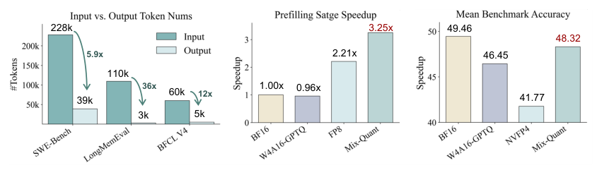
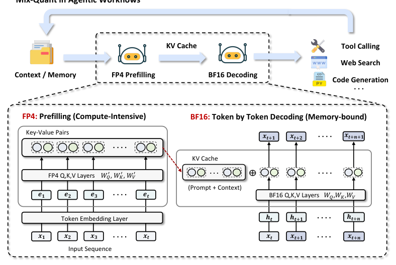
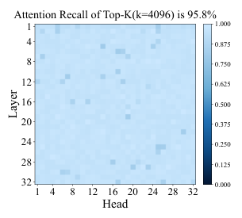
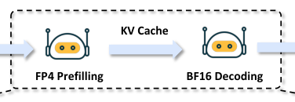
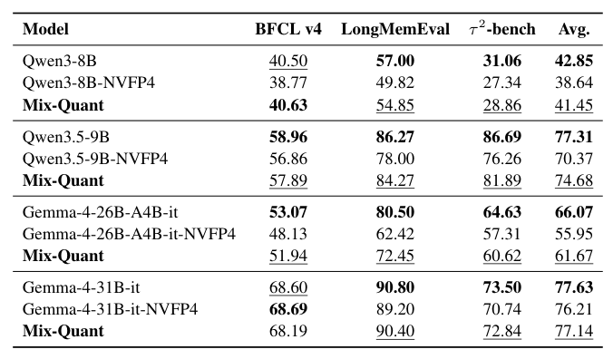
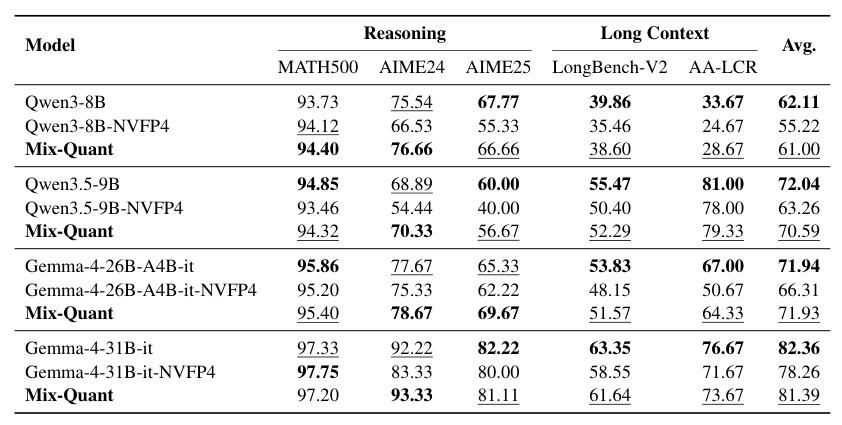
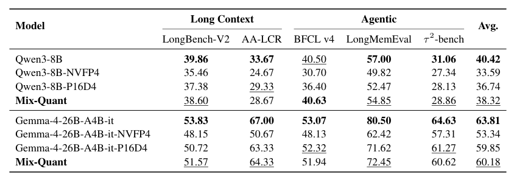

## 论文链接

- 原始论文页面：https://arxiv.org/abs/2605.20315
- PDF 下载：https://arxiv.org/pdf/2605.20315.pdf
- Hugging Face 论文页：https://huggingface.co/papers/2605.20315
- 项目主页：https://haiquanlu.github.io/Mix-Quant/
- 开源代码仓库：https://github.com/haiquanlu/Mix-Quant
- 开源代码仓库：https://github.com/eliahuhorwitz/Academic-project-page-template

Mix-Quant：量化预填充、精确解码的智能体大语言模型推理框架

> 导读摘要：这篇论文抓住了一个很容易被忽略、但对 LLM 智能体极其关键的事实：真正拖慢多轮智能体推理的，往往不是逐 token 生成，而是每一轮都要重新处理的大段上下文。作者据此提出 Mix-Quant，把推理拆成两个阶段分别优化——对计算最重的预填充阶段使用 NVFP4 低比特量化，对最怕误差累积的解码阶段保留 BF16 精度。结果是：在长上下文和多轮 Agent 任务上，方法能显著减少统一量化带来的性能损失，同时把预填充速度提升到约 2 到 3 倍，最高可达 3 倍。

## 问题不在“能不能量化”，而在“该量化哪一段”

这篇论文的切入点非常明确：LLM 智能体的工作负载，和普通单轮生成并不一样。智能体在规划、调用工具、读回工具结果、检索记忆、更新状态的过程中，会不断把新信息追加进输入上下文。于是，每次模型调用时都要重新编码一大段提示词、历史轨迹、工具描述、环境反馈和中间结果。

这种工作流有两个直接后果：

1. **输入远长于输出**：一轮里真正生成的内容可能只是一个短动作、一个工具调用或者几句推理，但输入上下文却很长。
2. **预填充成为主要瓶颈**：模型需要反复对长上下文做并行编码并构造 KV cache，这部分算力开销极大。

上图把问题和动机都压缩得很清楚：Agent 工作流普遍是“长输入、短输出”，所以计算时间大量耗在预填充而不是解码上。与此同时，如果把整条推理链路都统一压到 NVFP4 这类低比特格式，虽然速度会更快，但任务表现会明显下降。也就是说，矛盾不在于“低比特是否有效”，而在于**全程统一量化会把最脆弱的部分也一起压低精度**。

作者因此提出一个相当自然但很关键的判断：**预填充和解码不是同一种计算阶段，不应该用同一种量化策略对待。**

## 方法主线：只量化预填充，解码维持高精度

Mix-Quant 的核心设计可以概括成一句话：**预填充用 NVFP4，解码用 BF16。**

具体来看，LLM 推理被拆成两个阶段：

- **预填充**：对整段输入上下文并行计算，生成隐藏表示并建立 KV cache  
- **解码**：基于已有上下文，自回归地逐 token 生成输出

作者认为这两个阶段在计算形态和误差容忍性上完全不同：

- 预填充是**计算密集型**的，大规模矩阵乘法多，适合用低比特算子换吞吐；
- 解码是**记忆与缓存访问更敏感**的，而且每一步输出会影响下一步输入，误差会沿生成轨迹不断传播。

因此，Mix-Quant 选择在第一阶段激进加速，在第二阶段谨慎保真。

从流程图上看，这个方案并不复杂：长上下文先走低比特预填充路径，把最重的上下文编码尽快完成，并把结果写入 KV cache；之后再切回 BF16，进行逐 token 的稳定解码。工具调用、检索、记忆回灌等 Agent 常见操作，会不断让上下文变长，因此这种“前快后稳”的分工尤其适合智能体场景。

论文采用的低比特格式是 **NVFP4**。它不是普通的粗糙 FP4，而是带有细粒度缩放的微缩放 FP4 格式，并且有 Blackwell 硬件原生支持。作者的意思很明确：Mix-Quant 不是只在算法层面说“我想分阶段量化”，而是把这种分阶段设计和硬件可高效执行的 FP4 路径结合了起来。这样得到的不是理论上的低比特方案，而是**真正能落到推理系统里的高吞吐预填充路径**。

## 为什么预填充更适合激进量化

论文的方法之所以成立，不只是因为“预填充更耗时”，还因为作者试图说明：**预填充本身就更有量化冗余。**

这个判断来自两层原因。

### 第一层：误差不会像解码那样递归放大

在预填充阶段，模型面对的是一段固定输入序列。即便量化带来一些数值扰动，这些误差也只发生在这一轮上下文编码里，不会像解码那样，把错误 token 继续喂给下一步生成，然后一层层扩大。

而在解码阶段，情况完全不同。这里每一步都依赖上一时刻的生成结果，一旦低比特误差改变了 token 选择，后面的整条轨迹都可能偏离。对于多轮 Agent 任务，这类偏差尤其危险，因为一个错误动作会引出错误工具结果，进而污染下一轮上下文。

### 第二层：长上下文里存在明显信息冗余

作者进一步用注意力分布来支撑这个观点：在超长上下文中，模型真正强依赖的往往只是少数关键 token，大量上下文虽然存在，但并非被同等强度地使用。

这张图展示了一个非常重要的统计现象：在 128K 长上下文里，只占很小比例的一部分高权重 token，却覆盖了绝大多数注意力质量，而且这种集中现象在不同层和头上都相当普遍。换句话说，长上下文并不是“每个 token 都一样重要”的平均结构，而更像是“少数关键点 + 大量冗余背景”。

这就解释了为什么预填充可以更大胆地量化：即便低比特近似损失了部分细节，模型往往仍能保住那些真正决定行为的核心上下文信号。作者并不是声称低比特没有误差，而是指出：**预填充阶段对这些误差更不敏感。**

## 系统视角：相位感知量化如何接入真实推理流程

从系统实现上看，Mix-Quant 其实也契合当前很多推理系统里的 prefill-decode disaggregation，也就是把预填充和解码分配到不同执行路径甚至不同硬件资源上。

这张图进一步强调了一个部署上的关键点：KV cache 是连接两个阶段的中枢。Mix-Quant 的思路不是反复在低精度和高精度之间来回切整个模型，而是让量化主要发生在长上下文的编码阶段，把缓存好的上下文表示直接交给后续高精度解码使用。这样做有几个好处：

- **把速度收益集中在最重的计算段**，收益更直接；
- **减少对生成路径的干扰**，不把低比特误差引入整个自回归过程；
- **更容易接入现有分离式服务架构**，例如专门的 prefill worker 和 decode worker。

这也是论文比较有现实感的地方：它不是泛泛提出“分阶段思路”，而是顺着今天 LLM 服务系统本来就存在的阶段拆分趋势，给出了一个自然兼容的量化策略。

同时，这种方法和其他预填充优化手段并不冲突。比如稀疏注意力、长上下文裁剪、动态上下文压缩等方法，目标也多是降低 prefill 成本；Mix-Quant 则从数值表示和硬件执行层面进一步压缩这部分开销。论文隐含的立场是：**它更像一个可叠加的基础加速模块，而不是排他性的替代方案。**

## 实验结果：统一量化伤性能，Mix-Quant 把损失拉回来

论文的实验重点不是证明“FP4 一定比 BF16 好”，而是证明：**如果必须追求低比特加速，那么把量化限制在预填充阶段，会比全程量化稳定得多。**

先看智能体任务上的结果。

这组结果覆盖了多类 Agent 基准，比较了 BF16、全程 NVFP4，以及 Mix-Quant。整体趋势很一致：全程低比特量化虽然能压低算力成本，但任务得分往往下降更明显；而 Mix-Quant 通常能把这部分损失显著收回来，整体表现更接近 BF16。这个结论很关键，因为它直接说明：**Agent 任务的脆弱点主要在解码稳定性，而不是预填充本身。**

再看推理和长上下文任务。

这里的结论同样鲜明。对于推理类任务和长上下文理解任务，统一 NVFP4 往往会造成更显著的退化，而 Mix-Quant 则能恢复大部分性能，在不少设置下接近 BF16 基线。这说明方法的适用性不局限于单一 Agent benchmark，而是对“长输入 + 生成敏感”的任务族都有效。

最后，论文还专门比较了不同阶段量化策略的差异。

这张表其实最能体现作者的核心论断：如果只量化 decoding，或者把 prefill 和 decoding 一起量化，效果通常都不理想；相反，只量化 prefill 的 Mix-Quant 更稳、更接近原始高精度模型。也就是说，性能差异并不是简单由“量化位宽”决定，而是由**量化发生在哪个推理阶段**决定。

在效率方面，论文报告了较稳定的预填充加速收益：在不同序列长度和 batch size 下，Mix-Quant 普遍能把预填充提速到约 2 到 3 倍，最高可达 3 倍。这一点和方法设计非常一致，因为它本来就瞄准的是 compute-bound 的 prefill，而不是 memory-bound 的 decode。

## 这篇论文最值得记住的地方

Mix-Quant 的贡献并不在于发明了全新的量化算法，而在于提出了一个对智能体推理非常有解释力的视角：**推理不是单一阶段的统一过程，而是由“可激进压缩的上下文编码”和“必须谨慎保真的自回归生成”拼起来的。**

因此，这篇论文最重要的结论可以归纳为三点：

1. **LLM 智能体的主要瓶颈常常在预填充，而不是解码。**  
   多轮交互、工具调用和记忆回灌让输入越来越长，反复编码长上下文才是延迟核心来源。

2. **统一低比特量化会错伤最脆弱的解码阶段。**  
   解码中的数值误差会影响 token 选择，并沿自回归轨迹不断累积，最终表现为任务完成度下降。

3. **真正合理的做法是阶段感知量化。**  
   把 NVFP4 放到预填充，把 BF16 留给解码，既能利用硬件低比特吞吐，又能尽量保住多步任务的稳定性。

如果把这篇论文放到更大的背景里看，它其实代表了一种很有前景的思路：未来 LLM 推理优化不应只问“模型能不能压缩”，而更该问“**模型在不同推理相位里，哪里可以压、哪里不能压**”。对长上下文智能体而言，Mix-Quant 给出的答案相当清晰，而且实验也说明这个答案是有效的。
