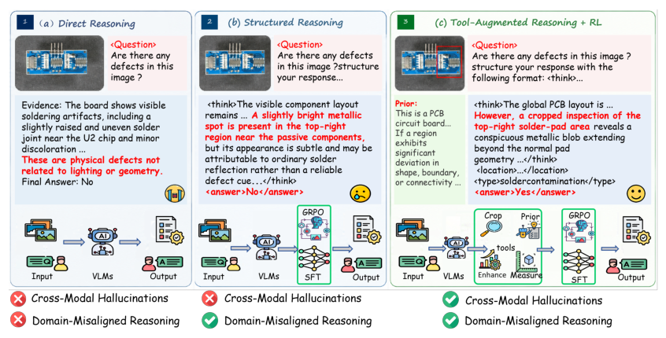
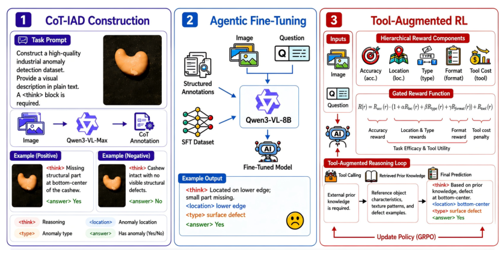
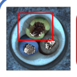
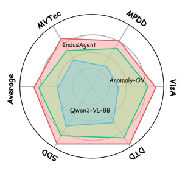
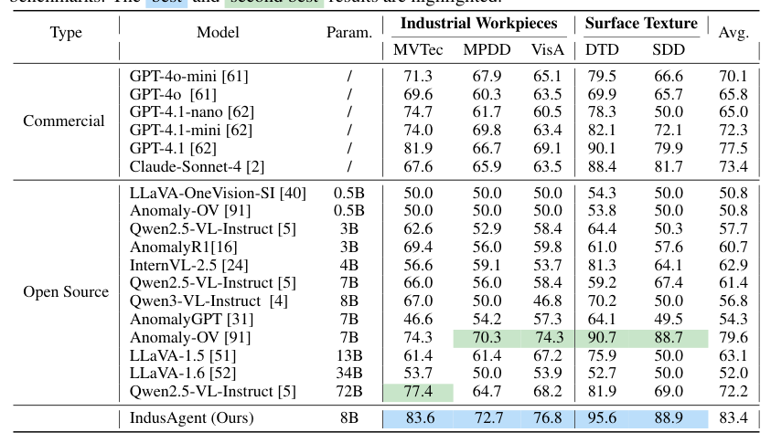
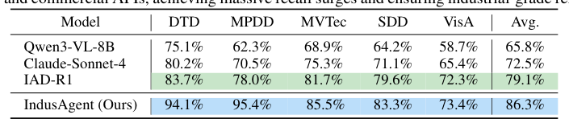
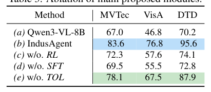
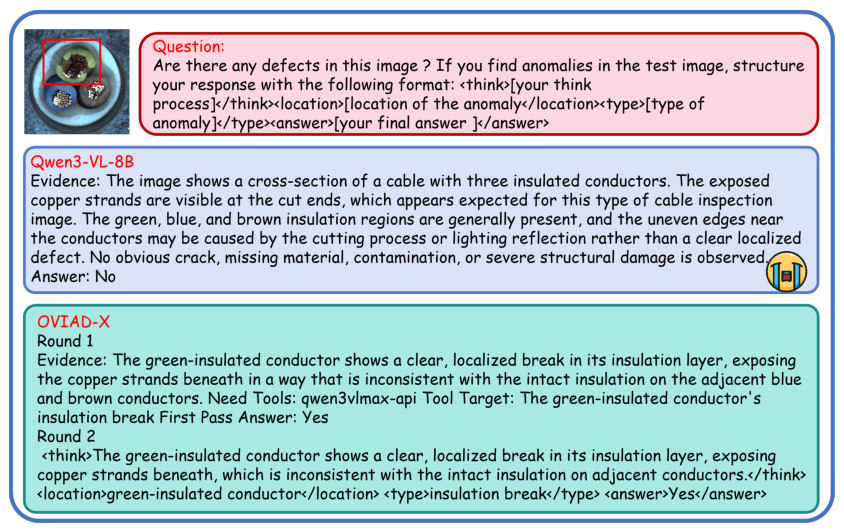
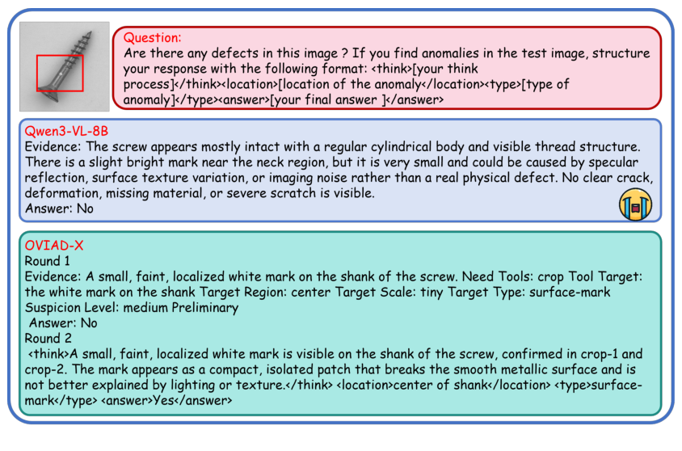
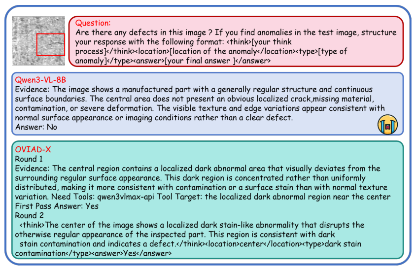

## 论文链接

- 原始论文页面：https://arxiv.org/abs/2605.20682
- PDF 下载：https://arxiv.org/pdf/2605.20682.pdf
- Hugging Face 论文页：https://huggingface.co/papers/2605.20682

IndusAgent：通过智能体工具增强强化开放词汇工业异常检测

> 导读摘要：这篇论文关注的是一个很实际也很难的问题：在没有见过具体产品类别、也没有正常参考图的情况下，如何让多模态模型完成工业异常检测。作者的核心思路不是单纯“让模型多想几步”，而是把模型变成一个会主动检查的智能体：先用结构化工业诊断轨迹做对齐，再给它配上局部裁剪、纹理增强、先验检索、几何测量等工具，最后通过精度门控的强化学习，让模型学会“什么时候值得调用工具、调用什么工具、如何把工具结果转成最终判断”。整篇工作的亮点，在于把工具调用本身纳入可学习决策，从而显著提升零样本场景下的异常分类、定位、类型推理与异常召回。

## 问题背景：为什么通用多模态模型不适合直接做工业质检

开放词汇工业异常检测的难点，不只是类别开放，更在于异常往往细小、局部、形态不固定，而且正常外观本身也可能有复杂变化。对通用多模态模型来说，这会引出三类典型失效：

1. **推理路径不符合工业诊断规范**：模型擅长开放式描述，但工业检测需要的是严格、逐证据验证的判断流程。
2. **局部异常在线索稀释后很难看见**：整图编码会把细粒度缺陷淹没在全局语义里。
3. **容易产生结构性幻觉**：当看不清局部时，模型可能凭经验“脑补”出一个合理但错误的解释。

论文开头用一张很有代表性的范式对比图说明了这一点：普通 MLLM 容易把正常变化误判为异常，或者把细小异常当成反光、噪声；即便加入普通 CoT，也只是“多说几步”，仍未真正获得局部证据和领域先验。

这张图的重要性在于，它把全文的方法动机讲得很清楚：工业异常检测真正需要的，不是更长的回答，而是**从被动看图转向主动巡检**。模型必须在不确定时主动放大局部、查询正常结构先验、必要时做几何验证，而不是直接基于整图给结论。

## 方法总览：把异常检测改写成“工具增强的诊断决策”

IndusAgent 的整体设计可以概括为三步：

- 先构建工业诊断链路数据 **Indus-CoT**
- 再通过 **Agentic SFT** 把基座模型对齐到工业检查流程
- 最后用 **工具增强强化学习** 优化真实推理中的决策策略

论文把这条主线画得很完整，既包括训练阶段，也包括测试时的推理闭环。

从这张总览图可以看出，作者不是简单给模型外挂几个工具，而是把整个系统视为一个策略体。输入只有查询图像和任务指令，模型需要输出的不只是“有无异常”，还包括：

- 推理轨迹
- 异常定位
- 缺陷类型
- 最终二分类结论

为此，作者定义了四类工具：

- **区域裁剪工具**：对可疑区域做高分辨率局部查看，解决细微缺陷被全局语义稀释的问题。
- **正常先验检索工具**：返回无缺陷状态下的结构、纹理与几何描述，给模型提供“应该长什么样”的比较基准。
- **纹理增强工具**：通过对比度增强、边缘提取等轻量图像处理，放大低对比纹理变化。
- **几何测量工具**：计算距离、角度、相对位置，用于判断错位、缺失、形变、间距异常等问题。

于是，推理就不再是“一次前向、一次回答”，而是一个多轮过程：先看全局，再发现歧义，再决定是否调用工具，最后把原图、局部补充证据、语义先验和几何信息一起整合成判断。这也是论文反复强调的“主动检查”范式。

如果把图 2 当作系统图，那么下面这张图更像是设计思想的浓缩版：先做工业推理对齐，再用工具补足感知，最后用强化学习把工具使用约束成真正服务于诊断正确性的行为。

这也是本文最关键的转变：**“是否调用工具”不再是人工规则，而是受任务目标约束的可学习决策。**

## Indus-CoT：先教模型学会工业诊断轨迹

作者认为，直接对视觉语言模型做强化学习很不稳定。模型很容易走捷径：跳过中间检查过程，只靠终局奖励去“猜”二分类答案，或者出现格式崩坏、奖励投机。因此，SFT 前必须先有一套足够像工业检查流程的数据。

### 数据怎么来

Indus-CoT 来自 Real-IAD 采样，大约构建了 3000 条推理轨迹，正负样本大致均衡。一个很重要的处理是：作者严格移除了与测试基准重叠的类别，避免类别泄漏，使训练集和 MVTec-AD、VisA、MPDD、DTD、SDD 等测试集类别解耦。

更关键的是，**构造过程不依赖配对正常图**。教师模型只拿到查询图像和任务指令，需要自己根据内部视觉语言知识推断“正常状态应该是什么样”。这与真实推理设置一致，也让模型真正适配零样本、无参考的工业检测场景。

### 一条轨迹包含什么

Indus-CoT 不是普通的图文问答，而是显式编码了三阶段诊断过程：

1. **全局观察与工具路由**  
   先看整图，识别可疑区域、模糊结构、难判断的纹理变化，并决定是否调用工具。

2. **工具执行与补充观察**  
   不同工具返回不同类型的补充证据：
   - 裁剪工具返回局部高分辨率 patch
   - 先验工具返回正常结构描述
   - 测量工具返回距离、角度等量化信息
   - 增强工具返回更易识别纹理变化的图像结果

3. **最终交叉验证与判定**  
   把原图与工具返回的信息合并，输出最终的异常状态、位置和缺陷类型。

其中，裁剪工具的实现也值得注意。作者没有在执行阶段使用真值框，而是设计了一个无监督前景提取流程，结合背景估计、图像差分、Otsu 阈值、形态学处理以及中心裁剪回退策略，尽量让工具使用贴近真实部署条件。

这一步的价值在于：它不仅给模型提供“正确答案”，更提供**正确的检查方式**。模型学到的是一条工业诊断证据链，而不是一个静态标签。

## Agentic SFT 与强化学习：如何把“会用工具”训练成可靠策略

### 先用 SFT 冷启动，避免 RL 直接失控

作者先对 Qwen3-VL-8B 做 Agentic SFT，让模型学会两件事：

- 工业诊断推理的结构
- 工具调用的语法与时机模式

这一步相当于把模型从通用视觉对话器，改造成一个初步符合工业检测流程的代理。论文强调，若缺少这个阶段，直接 RL 很容易出现 reward hacking：模型跳过中间取证，靠瞎猜争取终局回报；或者生成格式不稳定，难以解析和评估。

### 强化学习优化的不是“答题”，而是“决策轨迹”

真正有意思的是最后的工具增强强化学习。这里优化的对象，不只是最终标签对不对，而是整个检查策略是否合理：有没有正确定位、有没有说对缺陷类型、工具调用是否真正带来了价值。

为此，作者设计了**精度门控奖励**。核心原则是：

> 只有当最终诊断正确时，定位奖励、类型奖励、工具效用奖励等附加回报才生效。

这个设计很重要，因为它切断了“滥用工具也能赚奖励”的路径。模型如果频繁调用工具，但最后判断错了，就拿不到这些正向收益；只有真正帮助最终判断正确的工具调用，才会被鼓励。

这相当于把奖励结构从平铺式加和，改成了带主任务约束的层级门控。其直接效果是：

- 抑制无效 API 调用
- 让模型学会把工具当作高代价、高价值的检查手段
- 让工具使用与最终诊断成功绑定，而不是与“过程看起来复杂”绑定

论文在方法层面的最大贡献，就在这里：不是把工具简单拼进推理链，而是通过奖励设计把工具使用塑造成一种**审慎、目标导向的策略行为**。

## 实验结果：不仅整体分数更高，更关键是更少漏检

论文在五个工业异常检测基准上评估了零样本能力：MVTec-AD、VisA、MPDD、DTD 和 SDD。整体结论是，IndusAgent 在 8B 规模下取得了当前最优的零样本表现，平均分达到 83.4，并超过多种商业模型和更大开源模型。

但对工业任务而言，最值得关注的不是平均分本身，而是**异常召回率**。因为漏检真实缺陷的代价通常远大于误报。

这张图用跨数据集的对比说明，IndusAgent 在五个数据集上的异常召回率包络面积基本都最大，意味着它更少把异常误判为正常。换句话说，模型设计中的主动取证机制，确实转化成了更稳健的缺陷发现能力。

对应的表格结果也给出了更直接的量化支撑：

从这里能看到，IndusAgent 相比普通 MLLM 和已有方法，不是只在个别数据集上碰巧占优，而是在多个场景下稳定缓解了漏检问题。论文还提到，在 MVTec 上其表现相对已有最优方法提升了 9.3%，说明这套框架对工业异常检测确实有明显增益。

另一个表进一步从整体平均视角强化了这一点：

这类结果的意义在于，它们不只是说明“模型更会答题”，而是说明模型的行为方式更接近工业质检真正需要的目标：尽量把真实异常找出来。

## 消融与案例：哪些设计真正起作用

### 分层门控奖励不是装饰，而是性能关键

论文专门做了奖励设计的消融实验，考察去掉不同子奖励后的影响。

这张表最值得看的，不是某一个绝对数字，而是“去掉哪部分后跌得最多”。结论是：完整奖励最好，而去掉工具、定位、类型或格式等子目标后都会退化。这说明：

- 模型需要定位约束，才能把注意力落到异常区域
- 模型需要类型约束，才能形成更细致的工业解释
- 模型需要格式约束，才能维持稳定、可解析的诊断轨迹
- 工具相关奖励必须受最终正确性门控，否则容易产生无效调用

这也验证了前面的核心判断：IndusAgent 强的不是单一模块，而是**数据对齐、工具集、门控奖励三者联动**。

### 具体案例更能看出“主动检查”带来的变化

论文给了多组案例，展示基础模型和 IndusAgent 在同一输入上的差异。

在电缆截面案例中，基线模型更多依赖整图的一次性描述，容易把局部绝缘层破损解释成正常切割或反光；而 IndusAgent 会先锁定可疑区域，再围绕局部证据形成更清晰的定位和结论。

在螺丝样例中，微小白色痕迹很容易被当成反光或噪声。基础模型直接判正常，而 IndusAgent 先产生怀疑，再调用局部裁剪，最后确认表面异常。

另一类案例则说明，哪怕异常位于中心区域，如果整体纹理很复杂，通用模型仍可能把它当作正常变化；而代理式方法会通过分轮分析和工具强化，把深色污渍类缺陷从背景纹理中分离出来。

这些案例背后的共同点是：IndusAgent 的优势不只是“最后答对了”，而是它形成了更像工业检查的证据链。它会在不确定时延迟下结论，转而先获取补充证据，这一点正是普通 MLLM 很难自发做到的。

## 这篇论文真正推进了什么

从方法角度看，IndusAgent 的价值可以概括为三层。

第一，它证明了开放词汇工业异常检测不能只靠通用视觉语言能力，必须先做**领域化诊断轨迹对齐**。Indus-CoT 与 Agentic SFT 不是附属步骤，而是后续强化学习能稳定工作的前提。

第二，它把工具从“外挂模块”变成了**策略学习的一部分**。模型不只是会调用工具，而是学习何时该调用、调用哪一种、调用后如何整合结果。

第三，它用精度门控奖励解决了智能体系统里常见的工具滥用问题。这样得到的不是一个爱折腾工具的模型，而是一个在诊断正确性驱动下谨慎取证的检测代理。

如果用一句话总结，这篇论文最有启发性的地方是：**工业异常检测的核心，不在于让模型看得更多，而在于让模型学会按规范主动取证，并且只在有助于最终判断时才使用额外能力。** 这也解释了为什么它能在零样本场景下同时提升总体表现与异常召回。
