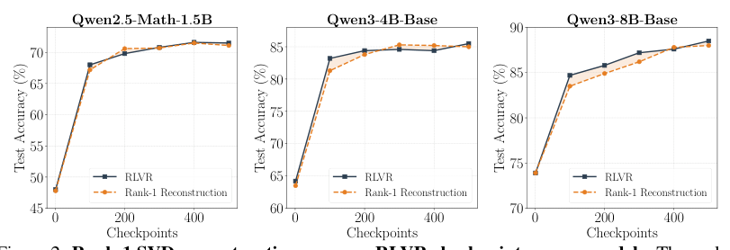
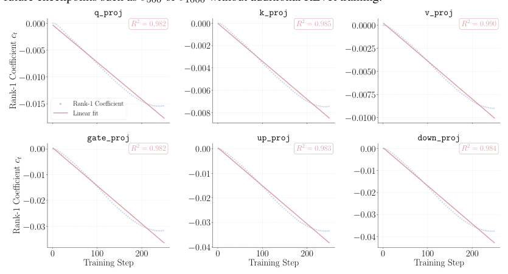
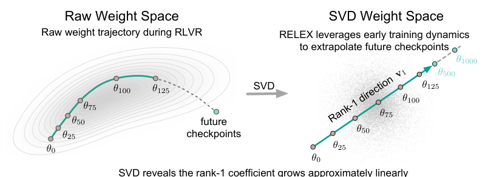
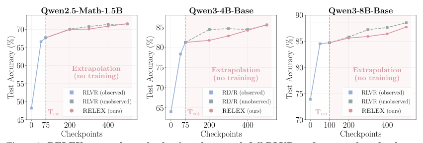
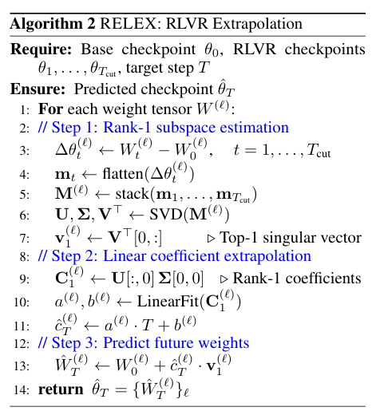
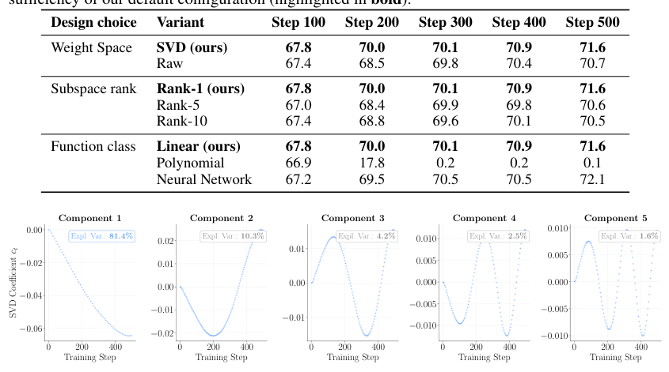
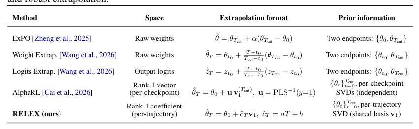
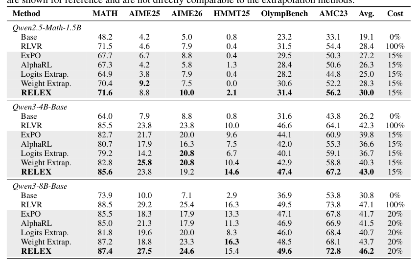
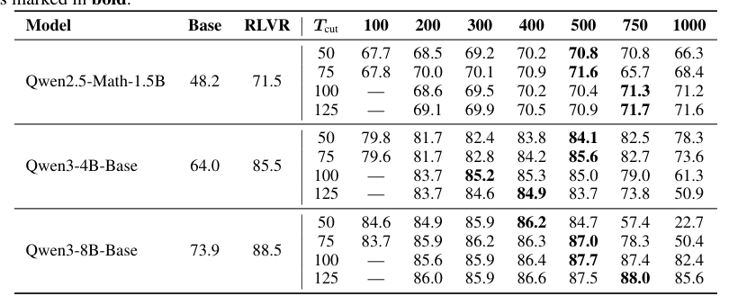
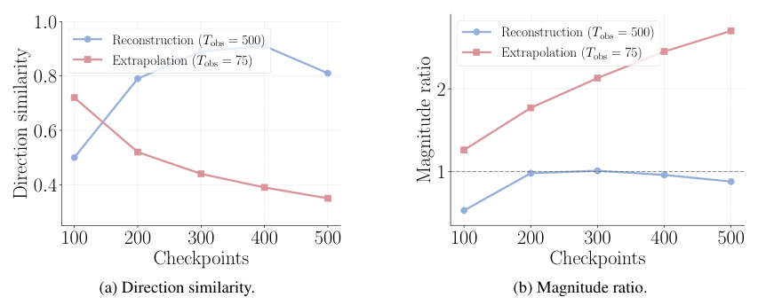

## 论文链接

- 原始论文页面：https://arxiv.org/abs/2605.21468
- PDF 下载：https://arxiv.org/pdf/2605.21468.pdf
- Hugging Face 论文页：https://huggingface.co/papers/2605.21468
- 项目主页：https://weizhepei.notion.site/you-only-need-minimal-rlvr-training

你只需要极少量的 RLVR 训练：通过 Rank-1 轨迹对大语言模型进行外推

> 导读摘要：这篇论文的核心发现很直接：RLVR（可验证奖励强化学习）训练时，模型参数并不是在高维空间里复杂乱走，而是大多沿着每个张量的单一主方向前进；更关键的是，沿这条主方向前进的幅度还会随训练步数近似线性增长。基于这两个结构性现象，作者提出 RELEX：只观察前期少量 checkpoint，用一次逐张量 SVD 找方向，再用线性回归预测“会继续走多远”，就能在完全不继续训练的情况下合成后续 checkpoint，并在多个模型上逼近甚至超过完整 RLVR 的效果。

## 问题背景：为什么 RLVR 可以被“预测”出来

RLVR 已经是提升大语言模型推理能力，尤其是数学推理能力的一条主流路线。它通常配合 GRPO 这类算法，通过可程序验证的奖励信号，让模型逐步提升正确推理轨迹的概率、压低错误模式的概率。问题是，这套流程很贵：训练步数多、GPU 成本高，而且往往要持续跑到后期平台区，才能拿到最强 checkpoint。

这篇论文想问的不是“如何把 RLVR 训得更好”，而是一个更激进的问题：**后面那些 RLVR 步数，是否真的都需要跑出来？** 如果训练轨迹本身高度结构化，那么只看早期若干 checkpoint，也许就足够预测后续模型会走到哪里。

作者的基本假设是：RLVR 更像是在放大预训练模型中已经潜伏的正确推理行为，而不是从零发明全新能力。既然如此，参数更新轨迹可能并不杂乱，而是带有低维、稳定、可外推的几何结构。整篇论文就是围绕这个判断展开验证，并把它落实成一个几乎“零训练成本”的外推方法。

## 从经验现象到建模假设：RLVR 轨迹其实极低秩

论文首先不急着提方法，而是分析 RLVR 训练时的参数轨迹。设基座模型参数为 $\theta_0$，第 $t$ 步 RLVR checkpoint 为 $\theta_t$，作者考虑参数增量 $\Delta \theta_t = \theta_t - \theta_0$。接着，对每个权重张量单独处理：把每一步的增量展平并堆叠成轨迹矩阵，然后对这个矩阵做 SVD。

这个分解带来了两个非常关键的观察。

第一，**有效更新高度低秩**。也就是说，虽然参数空间极高维，但真正和性能提升相关的变化，大多可以压缩到每个张量的一个主方向上。作者直接用 rank-1 重建后的 checkpoint 去做评测，发现它和真实 RLVR checkpoint 在 MATH 上的性能走势非常接近。

这张图的重要性在于，它不是在说“rank-1 能近似参数数值”，而是在说：**rank-1 已经足以保留大部分下游性能收益**。这意味着对未来 checkpoint 的预测，不必建模整个高维轨迹，只要抓住那个主导方向即可。

第二，**沿主方向的系数随训练步数近似线性演化**。对某个张量来说，一旦拿到 top-1 奇异向量，就可以把每一步更新投影到这条方向上，得到一个标量系数 $c_t$。作者发现，这个系数序列可以被简单直线很好拟合，在多数张量上 $R^2 > 0.98$。

图中每个小图对应一个代表性模块。蓝点是真实系数，粉线是线性拟合。这里最关键的不是斜率大小，而是“几乎是一条直线”这个事实。也就是说，RLVR 后期训练在很多张量上干的事情，本质上可以被理解成：**沿着已经在前期显现出的主方向，继续稳定推进**。

这两个观察合起来，把原本复杂的“未来 checkpoint 预测”问题，降成了一个几乎一维的问题：

1. 先估计每个张量的主更新方向；
2. 再预测沿这条方向会继续走多远。

## RELEX：把未来 checkpoint 分解成“一个方向 + 一条直线”

RELEX 的设计非常朴素，但也正因为朴素才显得有力量。它完全不训练额外模型，只使用前 $T_{\text{cut}}$ 步 RLVR checkpoint，就能合成任意未来步数 $T$ 的预测 checkpoint。

先看整体直觉。原始权重空间里的 RLVR 轨迹看起来是弯曲的、难以直接猜测后续位置；但经过 SVD 后，复杂路径被压缩成“主方向 + 标量系数”的表示，于是未来预测就变成了对这个标量做外推。

这正是 RELEX 的方法主线。它可以分成三步：

上面这张结果图其实也同时概括了方法思想：虚线左边是已经真实训练得到的前缀，虚线右边则是不再训练后，RELEX 直接外推出的 checkpoint。之所以这件事可行，是因为它内部做了以下三件事：

### 1. 估计 rank-1 子空间

对每个权重张量 $W^{(\ell)}$，RELEX 收集前 $T_{\text{cut}}$ 步的增量
\[
\Delta \theta_t^{(\ell)} = W_t^{(\ell)} - W_0^{(\ell)}
\]
把这些增量向量化并堆叠成矩阵 $M^{(\ell)} \in \mathbb{R}^{T_{\text{cut}} \times d}$。然后对这个矩阵做 SVD，取 top-1 右奇异向量 $v_1^{(\ell)}$ 作为主更新方向。

这一步回答的问题是：**这个张量在 RLVR 前期主要往哪边变？**

### 2. 对 rank-1 系数做线性外推

有了主方向后，就可以得到每一步对应的 rank-1 系数轨迹
\[
c_t^{(\ell)}
\]
然后对它拟合一条线：
\[
\hat c_T^{(\ell)} = a^{(\ell)} T + b^{(\ell)}
\]

这一步回答的问题是：**沿着这个方向，训练会继续推进多远？**

### 3. 直接重建目标步数的权重

最后，把预测系数和主方向组合起来：
\[
\hat W_T^{(\ell)} = W_0^{(\ell)} + \hat c_T^{(\ell)} v_1^{(\ell)}
\]

对所有张量都这么做，再拼起来，就得到未来第 $T$ 步的预测 checkpoint。

值得注意的是，RELEX 并不是在学习“从前缀到未来”的黑盒映射，也没有使用神经网络预测器。它依赖的唯一假设就是：**主方向稳定，系数近线性增长**。而前面的实验现象已经为这两个假设提供了很强支持。

## 方法为什么成立：rank-1 不是简化过头，而是在做“谱去噪”

从方法表面看，RELEX 像是一个极度简化的低秩近似方案。但论文进一步说明，它之所以有效，不只是因为“线性拟合够用了”，更因为 **rank-1 投影本身就在去噪**。

先看高阶分量的行为。作者把某些张量的轨迹分解成多个 SVD 分量后发现，第一主分量既解释了绝大部分方差，也具有最平滑、最接近线性的时间结构；后面的分量占比小，波动却更大，更像随机优化噪声，而不是稳定的任务相关信号。

这幅图非常能说明问题：如果把更多高阶分量也纳入外推，理论上表达能力更强，但实践中反而容易把不稳定扰动一起带进去。换句话说，RELEX 的成功不是“碰巧用 rank-1 也凑合”，而是因为它故意只保留最稳定、最可预测的那部分更新。

论文还通过方法对比强调了这一点。许多已有外推方法，往往直接在原始权重空间里做插值/外推，或者只利用两个 checkpoint 的位移关系；而 RELEX 利用的是**整段早期轨迹的共享结构**：先抽取一个主基底，再预测这个基底上的时间系数。

从这个角度看，RELEX 的本质更接近一种几何建模：它不是把未来 checkpoint 当作“下一个参数点”，而是把 RLVR 看成在低维流形上的稳定推进过程。相比直接在高维空间中猜位置，这样的表示更鲁棒，也更便于长距离外推。

## 实验结果：只用 15%–20% 训练，就接近甚至超过完整 RLVR

论文在三个模型上做实验：Qwen2.5-Math-1.5B、Qwen3-4B-Base 和 Qwen3-8B-Base。主结论是，RELEX 只观察完整 RLVR 约 15%–20% 的前期训练，就能在 MATH 上达到与完整 RLVR 接近、部分情况下更好的表现，并且在多个 OOD 数学基准上平均成绩也很强。

这类结果有两个层面的含义。

第一，是直接的算力收益。RELEX 把“继续训练数百步”的成本，替换成了一次基于 checkpoint 的低秩分解和线性外推。对于 RLVR 这种后期成本随步数线性上涨的流程，这种替代非常有吸引力。

第二，是对 RLVR 机制的反向理解。若只看前期少量轨迹，就足以恢复后期绝大部分收益，说明 RLVR 的很多后续步骤，并不是在不断探索全新更新模式，而更像是在沿已经显现的主模式继续放大。

更有意思的是，RELEX 还能做**远超观察窗口的长距离外推**。例如只观察最开始几十步，却去预测几百步甚至上千步之后的 checkpoint，依然可能持续提升，而不是立刻崩掉。

这张表体现的是稳定性边界：随着 $T_{\text{cut}}$ 增大，外推自然更稳；但即便观察窗口很小，模型也已经捕获了足够强的结构信号，能够支持较远距离预测。这说明前期 RLVR 轨迹本身就高度信息密集。

而图 1 则更直观地展示了这种现象：三组模型中，RELEX 在虚线右侧无需继续训练，曲线却依然能贴近甚至超过真实 RLVR 的后续表现。

## 误差与局限：方向抓得住，但长距离外推会逐渐“走过头”

论文并没有把 RELEX 描述成完美方法。作者还分析了它在权重空间里的误差来源：随着外推步数越来越远，模型虽然通常还沿着正确的大方向前进，但会逐渐发生两类问题——方向开始偏移，幅度也可能累积得过大。

这张图很关键，因为它帮助区分“方法为什么有效”和“方法最终在哪里失效”。

- 在较近区间内，RELEX 和真实 RLVR 的更新方向对齐得不错，说明 rank-1 主方向确实抓住了有效信号。
- 但外推越来越远后，方向相似度会下降，说明真实训练后期并非完全静止在同一条一维子空间里。
- 同时，更新范数比值会高于 1，表明 RELEX 往往不是彻底走错，而是**沿大致正确方向走得过头了**。

这也解释了为什么论文最后强调：RELEX 的成功主要来自“谱去噪”，而不是因为 RLVR 真的严格一维、严格线性。真实训练仍然存在更高阶结构，只是这些结构在大多数实际区间里贡献较小、且更不稳定。

## 这篇论文最值得记住的三点

第一，**RLVR 的参数轨迹具有惊人的低秩性**。对每个张量而言，一个 rank-1 主方向就能保留大部分任务相关改进，这为理解 RLVR 为什么有效提供了新的几何视角。

第二，**未来 checkpoint 预测可以极度简化**。RELEX 不是学复杂预测器，而是把问题分解成“找方向”和“推系数”，从而用前期少量训练前缀替代大量后续 RLVR 成本。

第三，**rank-1 的价值在于去噪，而不只是压缩**。更高 rank 或更复杂的非线性拟合并没有稳定带来收益，反而说明最重要的信号恰恰存在于那个最稳定、最可预测的主分量中。

如果从方法论角度总结，这篇论文最强的一点是：它没有把“训练外推”做成一个更复杂的学习问题，而是先找到 RLVR 轨迹里真正简单的结构，再让方法本身服从这种结构。这样的结论不仅能省算力，也会影响我们如何理解强化学习微调到底在参数空间里做了什么。
