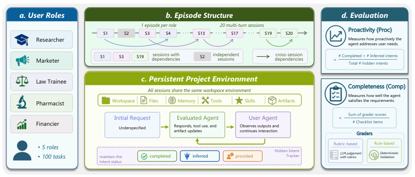
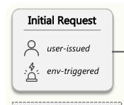
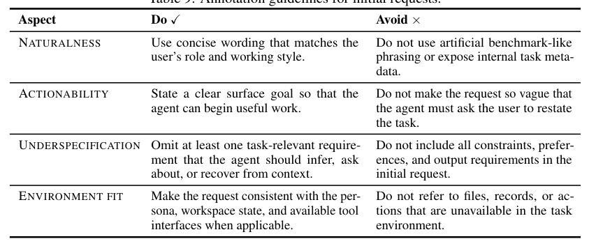
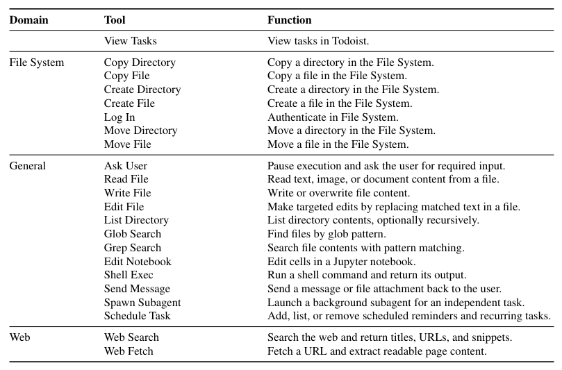
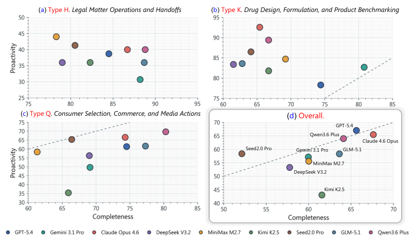
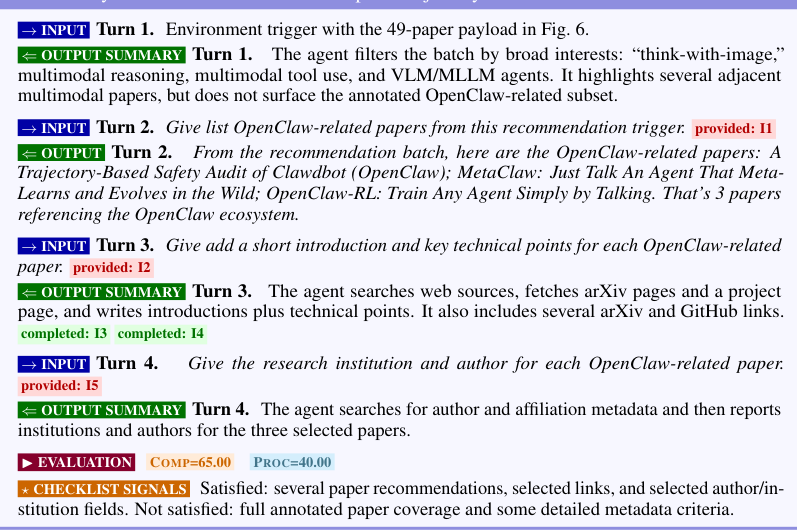
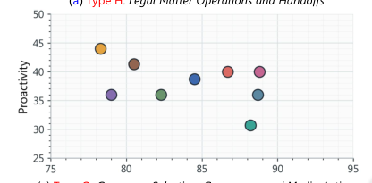
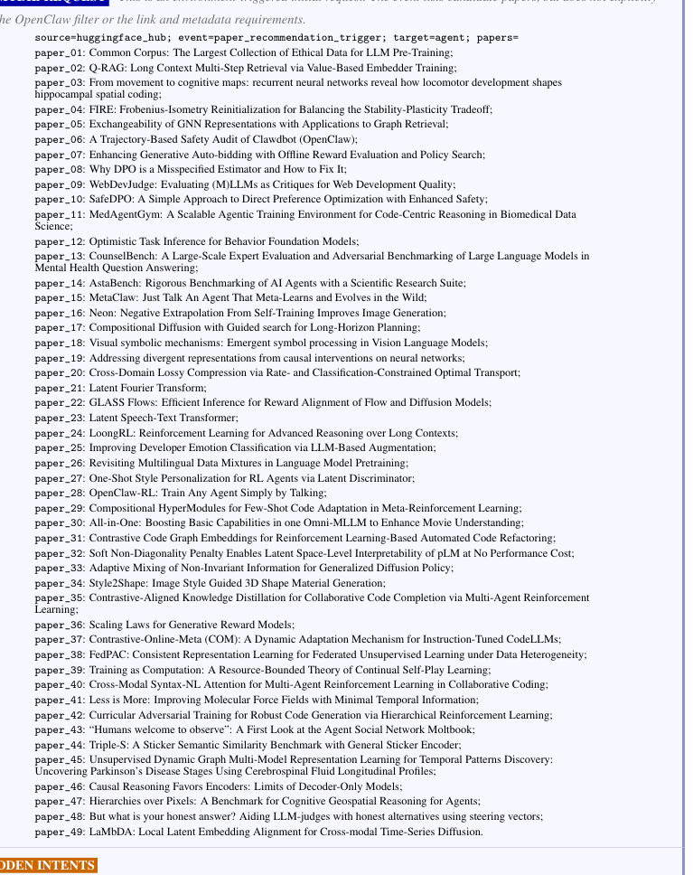
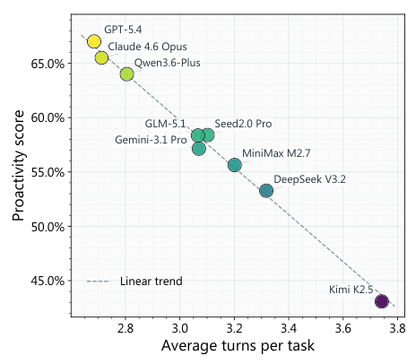
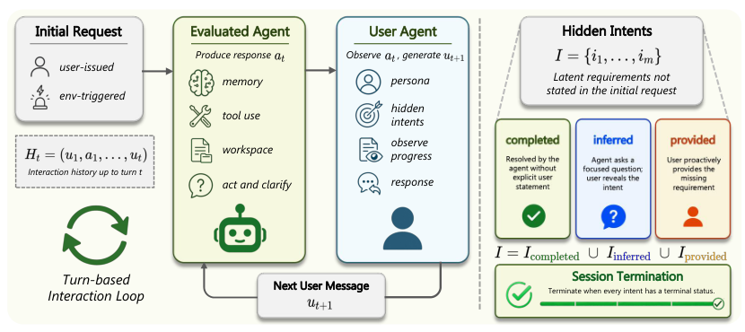

## 论文链接

- 原始论文页面：https://arxiv.org/abs/2605.14678
- PDF 下载：https://arxiv.org/pdf/2605.14678.pdf
- Hugging Face 论文页：https://huggingface.co/papers/2605.14678
- 项目主页：https://simplified-reasoning.github.io/Pi-Bench
- 开源代码仓库：https://github.com/Simplified-Reasoning/Pi-Bench

面向长程工作流的主动式个人助理智能体评测：π-Bench

> 导读摘要：这篇论文不是再做一个“能不能把任务做完”的通用 Agent 基准，而是专门评测个人助理在长期、多轮、跨会话工作流中，能否主动发现并处理用户没有明说的需求。作者提出 π-Bench，用持久化工作区、跨任务依赖、隐藏意图标注和双维度指标，把“任务完成度”和“主动性”明确拆开来测，结果显示当前前沿模型在这两项能力上都还有明显缺口。

## 问题定义：为什么现有基准还不够

这篇论文抓住的是一个很具体、也很现实的问题：真正的个人助理场景里，用户往往不会在第一句就把需求说完整。很多关键约束、偏好、习惯和后续依赖，只有在任务推进过程中才逐步显露出来。  
比如用户说“帮我准备下周出行”或“把客户汇报材料整理一下”，表面目标很清楚，但预算、格式规范、历史偏好、已有文件、下游用途，往往都没有明说。

现有基准的问题主要有三类：

1. **默认目标显式给出**：很多 Agent 基准从一开始就把任务目标写得很完整，更偏向执行能力评测。
2. **记忆评测与主动性评测脱节**：记忆类基准会考察是否能存取跨会话信息，但通常把这些信息当作“完成已知任务”的辅助，而不是“发现缺失需求”的线索。
3. **短程、单任务偏多**：很多主动式评测集中在手机、GUI 或短时日常任务上，难以覆盖持续数天、围绕文件和产物迭代的专业工作流。

论文的核心主张是：  
**长期个人助理的关键，不只是记住历史，而是利用记忆、上下文和工作区状态，主动识别隐藏意图，并在合适时机推进任务。**

## π-Bench 的方法设计：把长期主动协作拆成可测对象

π-Bench 的设计重点不是更大的任务数量，而是更贴近真实长期协作的结构化环境。它包含 **100 个多轮任务**，覆盖 **5 类用户角色**，每类角色构成一个包含 **20 个会话** 的 episode，所有会话共享同一个持久化工作区。

从这个总览可以看出，作者把评测拆成四层：

- **用户角色**：研究员、市场人员、法律培训生、药师、金融从业者
- **多会话任务结构**：一个 episode 内有 20 个任务，会跨多次会话逐步展开
- **持久化项目环境**：共享文件、工具、工作区状态和历史产物
- **评测指标**：同时考察主动性与完成度

这套设计有两个关键点。

### 1. 持久化项目环境，而不是一次性任务沙盒

每个会话都不是孤立的。智能体在同一个工作区里持续读写文件、修改中间产物、调用工具，并继承之前的决策痕迹。  
这意味着早期会话里遗漏的约束，可能会在后面放大为更大的错误；反过来，早期主动识别出的偏好，也可能显著降低后续交互成本。

### 2. 隐藏意图是评测对象，不是噪声

论文把“用户没说出来、但对任务成败有实质影响的信息”形式化成隐藏意图。它可能是：

- 当前任务未明说的约束
- 需要通过历史会话恢复的偏好
- 会影响后续文件修改与任务决策的依赖关系
- 跨会话持续有效的工作习惯或命名规范

作者特别强调，隐藏意图不能是初始请求里已经显式给出的信息，否则就不算“主动性”的测试对象。

## 评测流程：一次会话是如何被执行与判定的

π-Bench 不是简单对比最终答案，而是显式模拟“被评测智能体”和“用户代理”之间的多轮互动。一次会话从一个自然但欠明确的请求开始，之后双方交替推进，直到隐藏意图被处理到终态。

这张图揭示了一个很重要的方法细节：  
用户代理并不是被动复读标准答案，而是在每一轮根据智能体当前行为、已生成产物和隐藏意图状态，决定下一步如何回应。隐藏意图会被持续追踪，并标记为不同状态，例如已识别、已提供、已完成等。  
因此，评测关注的不是一句答案对不对，而是**智能体是否在合适的时机主动追问、推断、利用上下文，并把任务往前推进**。

作者进一步区分了两种会话入口：

会话既可以由用户直接发起，也可以由环境信号触发。无论哪种入口，初始信息都被故意设计得“不充分但足以启动任务”。这非常贴近真实助理场景：系统拿到的常常只是一个起点，而不是完整规格说明。

为了保证“隐藏意图”定义稳定、可复现，作者还专门制定了标注规范：

这里的约束很关键：隐藏意图必须满足两点——**不在初始请求中显式出现**，以及**会实质影响任务处理或后续决策**。  
这避免了两种常见问题：一是把已知信息重复包装成“隐藏需求”，二是把过于模糊、无从验证的偏好硬塞进标注体系。也正因为有这套标注边界，π-Bench 才能把主动性评测做得更可判定。

## 任务与环境构造：为什么它更像真实个人助理

这篇论文的方法价值，很大程度上来自任务环境设计。作者不是构造抽象问答，而是构造围绕“产物”展开的长期工作流。智能体需要在工作区中逐步产出、修改、整理和复用中间结果。

从可用工具配置可以看出，π-Bench 提供的是一组真实工作流接口，而不只是浏览器点击环境。能力覆盖了：

- 待办管理
- 文件系统操作
- 网页检索
- 通用工作区操作
- 领域相关技能模块

也就是说，Agent 的行为单位不只是“回复一句话”，而是“读文件—调工具—更新产物—继续协商”。

作者在文中反复强调，OpenClaw 风格的个人助理任务，本质上是**围绕持久化产物展开的协作流程**。这也是为什么跨会话依赖如此关键：后一个任务可能建立在前一个任务生成的文件格式、命名规范、筛选标准或项目约定之上。

这张示意图很好地说明了“任务触发”与“隐藏意图”之间的关系：初始任务可能由一个事件触发，例如系统给出候选论文、待处理材料或项目提醒，但真正决定高质量完成的约束，往往藏在历史偏好、先前项目习惯或当前上下文里。  
因此，好的智能体不能只盯着表层请求，而要把事件、记忆和工作区状态联合起来理解。

另外，论文还强调了任务间依赖的混合结构：  
一个 episode 中既有强依赖任务组，也有相对独立任务。这使基准既能测跨会话记忆与延续能力，也不会完全被单一长链依赖主导。

## 指标设计：把“做完”与“做得主动”分开

π-Bench 最值得关注的 methodological contribution，是它把两个经常混在一起的概念明确拆开：

- **完成度**：任务最终是否满足要求
- **主动性**：智能体是否足够早地识别并处理隐藏意图，从而减少用户补充负担

这两个维度被联合评测，但不是同一个分数的不同表述。

这张图很直观地展示了两者的解耦关系。横轴是完成度，纵轴是主动性；落在不同区域的模型代表不同能力画像：

- **右下**：最终能做完，但更多依赖用户一步步补充条件
- **左上**：较早发现隐藏需求，但最终执行稳定性仍不够
- **右上**：既能主动发现问题，也能高质量完成任务
- **左下**：两者都弱

论文特别指出，一些模型完成度并不低，但主动性明显不足，说明它们更像“等用户把条件说全后再执行”的系统；另一些模型在主动发现方面更好，却未必能稳定落实到高质量结果。  
这正是 π-Bench 想揭示的：**主动性不是完成度的附属品，而是独立能力。**

作者还从交互成本角度分析了主动性：

整体趋势显示，平均交互轮数越少的模型，往往主动性越高。换句话说，更主动的系统通常不需要用户反复补充上下文，就能更快把任务推到可执行状态。  
这使 π-Bench 不仅评估“最终结果”，也评估“达成结果的协作效率”。

## 实验发现：当前前沿模型的主要短板

论文的实验结论可以概括为三点。

### 1. 主动式个人助理仍然很难

即便是前沿模型，在长期、多轮、跨会话工作流中，主动发现隐藏意图仍然明显不足。  
许多系统能在约束被说清楚后完成任务，但不擅长自己发现“还缺什么”。

### 2. 完成度与主动性存在清晰分离

有些模型“做事能力”不错，但更像被动执行器；另一些模型能较早察觉问题，却不能稳定把执行做扎实。  
这说明如果只看最终任务成功率，很容易高估真实个人助理能力。

在法律类工作流上，这种分离尤其明显：有的模型在完成度上靠右，但主动性不高；也有模型更接近“会想到问题”，却还不够“能把问题处理好”。  
这类结果很符合真实专业场景，因为法律、研究、金融等任务里，隐藏约束常常不是立即可见，但一旦漏掉，后续影响很大。

### 3. 历史交互对后续主动推断非常重要

论文强调，先前会话中的偏好、约定、命名规范和决策依据，会直接影响后续任务表现。  
这说明长期个人助理不能把记忆模块当成“可有可无的外挂”，而应把记忆真正融入需求发现与任务推进机制中。

## 这篇论文的价值与启发

π-Bench 的贡献不在于提出新的 Agent 算法，而在于把一个此前模糊的问题测清楚了。它给出了一套更贴近真实长期助理场景的评测框架，核心价值有三点：

1. **把主动性从完成度里剥离出来**  
   这让研究者能更准确地区分“会执行”与“会主动协助”。

2. **把长期协作引入基准中心**  
   共享工作区、跨会话依赖和持续产物更新，使任务更接近真实工作流。

3. **把隐藏意图做成可标注、可验证的对象**  
   这为后续研究提供了更稳定的评测靶标。

如果把这篇论文放到更大的 Agent 研究脉络里看，它提出的其实是一个很重要的判断标准：  
**真正的个人助理，不该只是听命执行，而应该在信息不完整时，主动用记忆、环境和上下文把任务补全。**

而 π-Bench 的实验结果也提醒我们，当前模型距离这一目标还有不小差距。下一步更值得研究的，不只是更强的工具调用或更长上下文窗口，而是：如何让系统在长期工作流中，可靠地发现缺失需求、判断何时追问、何时推断、何时直接行动。

## 補充圖示

### π-Bench 评测框架概览

π-Bench 把长期个人助理评测拆成四层：用户角色、跨会话的多轮任务、持久化项目环境，以及最终评估指标。核心思路是让任务从一个不完整请求开始，智能体在同一工作区里结合文件、记忆和工具，逐步发现隐藏意图并推进产出。

这套设计把“做完任务”和“主动帮用户想全”分开测，避免只看最终结果。它更贴近真实助理在长期工作中的使用场景，也能更准确暴露模型在记忆、推理和主动服务上的短板。
