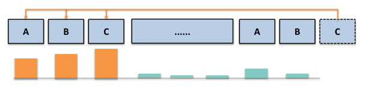
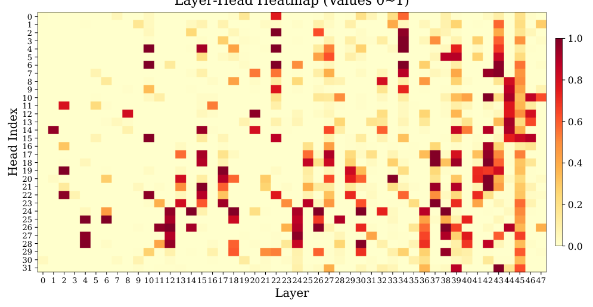
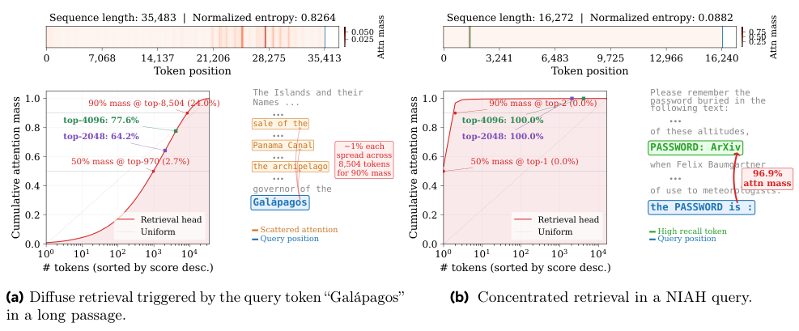
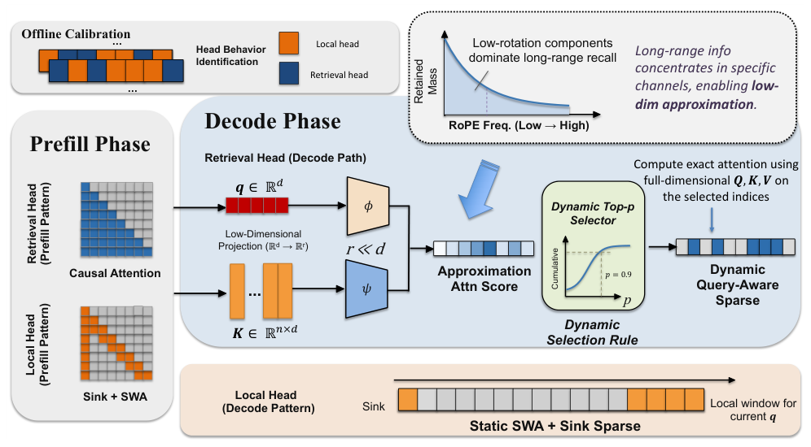
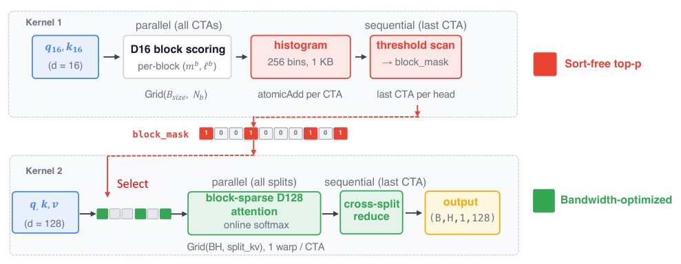
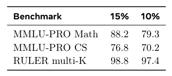
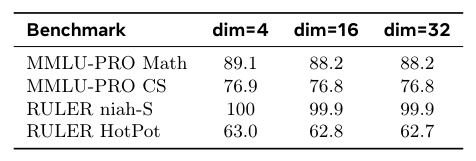
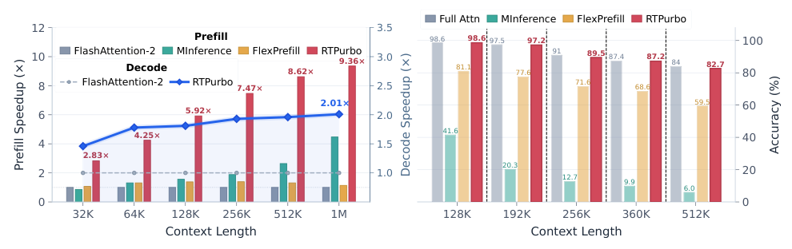
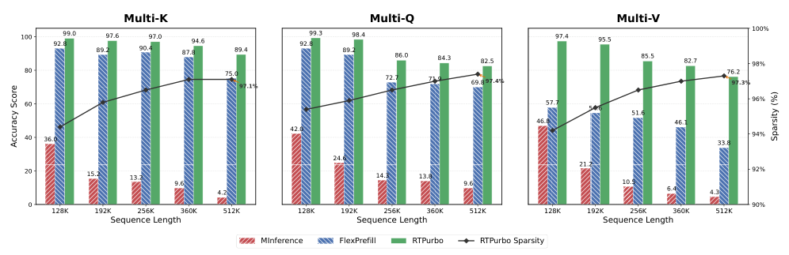
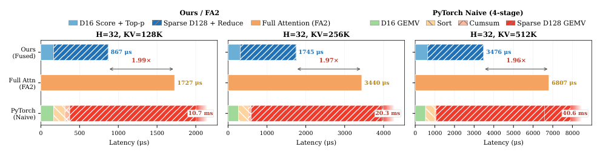

## 论文链接

- 原始论文页面：https://arxiv.org/abs/2605.16928
- PDF 下载：https://arxiv.org/pdf/2605.16928.pdf
- Hugging Face 论文页：https://huggingface.co/papers/2605.16928

全注意力强势回归：在数百步训练内将全注意力迁移为稀疏注意力

> 导读摘要：这篇论文的核心观点很明确：标准全注意力 LLM 其实已经天然带有明显的“头级分工”和“token 级稀疏性”，因此不必从零进行昂贵的原生稀疏预训练。作者提出 RTPurbo，通过离线识别少量真正负责远程检索的注意力头、为这些头构建低维检索索引、并在解码时使用动态 top-p 选择活跃 token，把全注意力模型以极小改动转成高效稀疏推理系统，而且只需数百步轻量训练就能把性能拉回接近原模型。

## 问题不是“要不要稀疏”，而是“稀疏该加在哪”

长上下文推理的瓶颈几乎都指向同一件事：全注意力的计算和存储成本随上下文长度二次增长。现有方案通常走两条路：要么从训练阶段就设计原生稀疏结构，要么在推理时用固定规则裁掉 KV 或 token。但前者成本高，后者常常会在精度上付出明显代价。

这篇论文换了一个角度：**既然全注意力模型已经训练好了，能不能只做最小手术，把它改造成稀疏推理模型？** 作者的回答是可以，而且关键不在于粗暴地“删掉远程信息”，而在于识别模型里哪些部分真的需要全局能力，哪些部分本来就主要处理局部上下文。

从这个角度看，RTPurbo 的真正贡献不是提出一种新的稀疏模式，而是提出一种**后训练式、按头分工的稀疏化范式**：  
- 少数头保留远程检索能力；  
- 大多数头退化为局部注意力；  
- 远程检索本身再通过低维索引和动态预算做近似加速。  

这使得论文的主线非常清楚：先证明“模型本来就稀疏”，再把这种稀疏性工程化。

## 三个观察支撑了 RTPurbo 的设计

作者的方法建立在三个关键观察上。

第一，**并不是所有注意力头都需要完整长程上下文**。只有少数头真正负责从远距离位置找回相关信息，其余大多数头主要聚焦局部模式、邻近上下文或滑动窗口式的信息整合。这一点直接解释了为什么“一刀切”的全局保留没有必要。

上图直观展示了这种“检索头”的行为：它不像普通局部头那样主要看邻近 token，而是会跨很远的距离，去对齐语义相关的早期片段。也就是说，模型内部已经存在专门承担远程召回的子结构，这为按头拆分提供了直接依据。

第二，**远程检索主要由低维子空间决定**。作者把这一点与 RoPE 的几何结构联系起来：长程检索更依赖低频、变化更平滑的成分，而高频成分在长距离上反而容易带来干扰。于是，检索头不必在原始高维空间里为所有 token 逐一精确打分，可以先投影到极低维空间中做粗筛。

这张图进一步说明，不同头的远程检索能力差异很大，而且这种差异是稳定的、结构性的，而不是某个样本上的偶然现象。也正因为如此，离线先给每个头打分、再决定谁保留全 KV，才是合理的。

第三，**检索预算强烈依赖查询本身**。同一个检索头，面对不同 query，所需保留的 token 数量可能差异极大：有时注意力分布很分散，需要保留大范围相关区域；有时又高度集中，只需极少 token 就足够。

这也是作者坚持用动态 top-p，而不是固定 top-k 的原因。固定 k 的问题不是参数调得不够好，而是它默认所有查询都该用同一预算，这与检索头的实际行为不匹配。

## RTPurbo：按头分治 + 低维检索 + 动态稀疏选择

RTPurbo 的整体框架可以概括为三步：**离线识别检索头、在线区分两类计算路径、再用轻量训练把能力补齐**。

先看离线阶段。作者设计了一个 head-wise calibration 过程，用很少量的长文本样本就能对所有 query heads 评分，判断谁具备强远程检索能力。这里的核心不是重新训练 backbone，而是利用一个校准任务测量“后面的 needle 是否会回看前面的 needle”。最终，所有头被划分为两类：  
- **检索头**：保留完整 KV cache，负责远程召回；  
- **局部头**：只保留 sink token 和滑动窗口，远处 token 可直接丢弃。  

这个离线划分只做一次，因此不会把在线推理复杂度继续抬高。

接着看在线推理。对于局部头，策略很直接：采用 sink + SWA（滑动窗口注意力）的局部模式。对于检索头，则分成两个阶段：

- **prefill 阶段**：仍执行全量 dense attention，用来建立完整 KV cache；  
- **decode 阶段**：对每个 query，用低维投影后的 query/key 先算近似相关性；再用动态 top-p 选出活跃 token；最后只在这些候选位置上做真正的全维精确注意力计算。  

这里最关键的一点是：**低维空间只负责路由，不负责替代最终注意力**。也就是说，作者不是直接在压缩空间里完成输出，而是把压缩空间当作“检索索引器”。因此，最终生成仍保留原始特征空间和精确相对位置几何，近似误差主要出现在候选筛选阶段，而不是最终值聚合阶段。

为了说明为什么不用固定 top-k，论文还给出了非常具体的例子：对某些分散检索型 query，top-4k 只能回收约 75% 的注意力质量，而动态 top-p 可以用约 8.5k token 回收 90% 质量；但对高度集中型 query，只保留 2 个 token 就能回收 96.6% 的质量。  
这意味着 top-p 不是“另一种选择器”，而是**唯一和 query 依赖性相兼容的预算机制**。

工程实现上，作者还专门设计了解码内核：先用低维打分快速生成块级掩码，再只对被选中的块执行高维稀疏注意力。这个两步式 kernel 设计减少了排序、访存和带宽浪费，使方法的收益不仅停留在算法复杂度上，而能转化成实际解码速度。

## 训练只做“轻量适配”，而不是重训模型

RTPurbo 的另一个很强的点，是它并不要求昂贵再训练。训练流程是轻量的两阶段：

1. **先冻结 backbone**，训练低维投影器，让它学会为检索头提供足够可靠的近似路由；
2. **再做短程自蒸馏式适配**，让稀疏模型的输出对齐原始全注意力模型。

这里的逻辑很重要。因为稀疏化本质上改变了可见上下文，模型能力下降往往不是因为主干参数“不会做任务”，而是因为读入证据的路径变了。所以作者不是大规模继续预训练，而是用自蒸馏快速校正这种分布偏移。论文强调，整个适配只需数百步、约 1M 标注 token 量级，就能把性能明显拉回。

关于超参数，论文还给出两个很有用的经验结论。  
一是检索头比例不能压得太狠，约 15% 比 10% 更稳妥：

这说明少数头虽然数量不多，但对远程能力至关重要，过度压缩会直接伤害推理与检索任务表现。

二是低维投影的维度并不需要很大，16 维已基本够用：

这恰好支持作者的理论观察：长程检索确实主要受低维、低频子空间支配，因此用非常紧凑的索引就能完成高召回候选筛选。

## 实验结果：接近无损的精度，明显可见的速度收益

结果部分最醒目的结论是：**RTPurbo 在长上下文任务上几乎不损失精度，却能拿到非常可观的加速。**

从整体趋势看，随着上下文长度拉长，RTPurbo 的优势越来越明显。在 1M 上下文时，论文报告最高可达 **9.36× 的 prefill 加速**，以及约 **2.01× 的 decode 加速**。这不是只对某个特殊基准成立，而是贯穿长上下文和推理任务两侧的统一结果。

更关键的是，在超长多跳场景下，方法并没有像不少稀疏基线那样快速失稳：

在 128K 到 512K 的超长上下文多跳任务上，RTPurbo 仍能维持较高准确率，同时保持很强的稀疏性。这一点尤其说明，它的动态检索机制不是简单压缩，而是确实保留了长程证据链所需的信息流。

解码速度同样不是理论收益，而是有实际端到端表现：

这张结果图说明，RTPurbo 的 decode 侧收益会随着上下文变长而稳定显现。很多方法主要优化 prefill，却很难让逐 token 生成真正加速；而 RTPurbo 由于把检索选择和稀疏精算都落到了专门 kernel 上，因此 decode 也能得到接近 2 倍的稳定提速。

## 这篇论文真正改变了什么

这篇工作的价值，不只是又提出了一种 sparse attention，而是重新提出了一个很有启发的问题：**也许全注意力训练出来的模型，本身就已经学会了“谁该全局、谁该局部”**。如果这件事成立，那么长上下文高效推理未必要依赖昂贵的原生稀疏预训练，反而可以通过后训练式、可解释的结构迁移来实现。

RTPurbo 的方法主线可以压缩成一句话：  
**先按头识别职责，再用低维索引近似远程召回，最后用动态 top-p 给每个 query 分配合适预算。**

这套设计的好处在于三点：  
- 它尊重模型内部已经形成的功能分化，而不是强行施加统一稀疏规则；  
- 它把近似限制在“候选检索”层面，最终注意力仍保持精确计算；  
- 它所需训练和改动都很小，因此更接近实际可部署方案。  

如果用一句更直接的话总结：**RTPurbo 证明了，全注意力模型并不是稀疏注意力的对立面，恰恰可能是稀疏推理最好的起点。**
