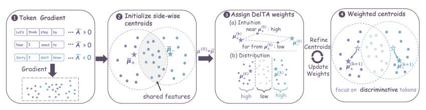
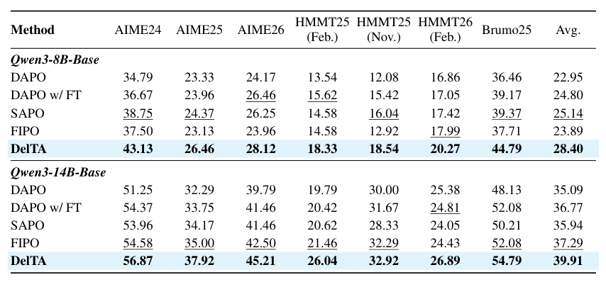
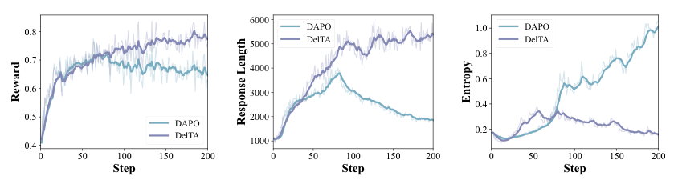
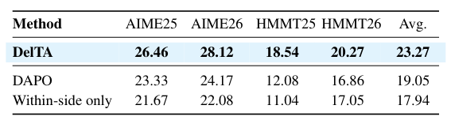
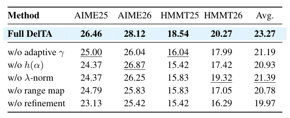
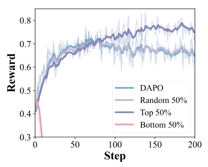
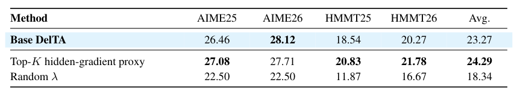
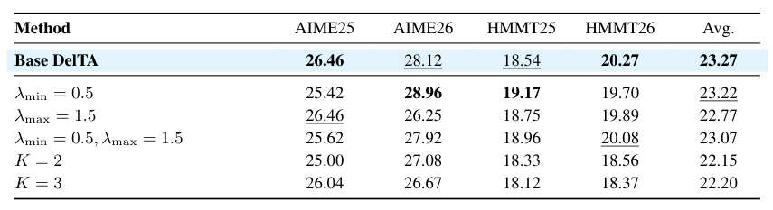
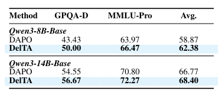
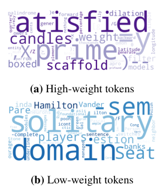

## 论文链接

- 原始论文页面：https://arxiv.org/abs/2605.21467
- PDF 下载：https://arxiv.org/pdf/2605.21467.pdf
- Hugging Face 论文页：https://huggingface.co/papers/2605.21467

DelTA：用于可验证奖励强化学习的判别式 token 信用分配

> 导读摘要：这篇工作把 RLVR 的更新过程重新解释成 token 梯度空间里的隐式判别器：奖励并不是“平均地”作用到所有 token 上，而是通过更新方向决定哪些 token 会被抬高、哪些会被压低。DelTA 进一步用正负优势响应之间的对比信号重写 token 信用分配，压低格式词、共享实体等高频噪声，强化真正区分高低质量响应的方向，因此在数学推理、代码生成和分布外评测上都更稳。

## 问题从哪儿来：响应级奖励与 token 级更新的错位

RLVR 的优势很直接：只要答案对不对，就能训练大模型，不必额外标注每一步过程。但它也天然有一个粒度错位——奖励是给整条响应的，优化却落到每个 token 的概率上。结果是，同一条响应里的所有 token 共享同一个优势信号，真正决定学习效果的，反而变成了这些 token 的梯度方向如何在更新里被聚合。

这也是为什么近年的观察会发现，RLVR 往往只改动少数 token 的分布，大多数位置几乎不动。换句话说，问题不只是“奖励够不够好”，更是“奖励最后把力气花在了哪些 token 上”。如果聚合方式不对，格式词、标点、题面里反复出现的实体，都会把更新方向带偏。

## RLVR 的更新为何像一个隐式判别器

论文先做的不是改算法，而是改视角：把局部参数更新看成 token 空间里的判别规则。对某个候选 token 来说，它的 log-prob 变化可以近似看成“它自己的 token 梯度”和“当前更新方向”之间的内积。于是，如果把正优势响应里的 token 梯度汇成一侧中心，把负优势响应里的梯度汇成另一侧中心，更新方向就变成了一个非常直观的二分类器：更像正侧的 token 被抬高，更像负侧的 token 被压低。

用公式写就是这种“正侧得分减负侧得分”的结构：

\[
\Delta \log \pi(x\mid c)\propto M_+ \langle g(x,c),\bar\mu_+\rangle - M_- \langle g(x,c),\bar\mu_-\rangle
\]

这里的 \(g(x,c)\) 是候选 token 的梯度向量，\(\bar\mu_+\) 和 \(\bar\mu_-\) 分别是正、负优势侧的参考方向。这个视角的关键意义在于：RLVR 并不是在 token 空间里“平均施压”，而是在做一次隐式判别。

问题也随之暴露出来：标准序列级 RLVR 往往只是把两侧的 token 梯度直接平均成质心。这样的质心很适合“总结本侧”，却未必适合“区分两侧”。一旦高频格式词、共享实体、常见模板同时出现在正负两边，它们就会把两侧中心一起拖向背景结构，稀释真正稀疏但更有判别力的方向。

## DelTA：把对比信号写回 token 信用

DelTA 的核心，就是把上面这个隐式判别器做得更“挑剔”。它不再把所有 token 一视同仁，而是先估计每个 token 到底有多能代表自己那一侧、又有多能区别另一侧；越“本侧显著、对侧排斥”的 token，得到的权重越大，反之则被压低。

整体链路可以先看这张图：先从 token 梯度出发，按正负优势分别形成两侧参考方向，再据此分配判别性权重，最后把权重写回训练目标，反过来重塑更新方向。  

更具体地说，DelTA 会在每个 rollout 批次里反复细化：先用当前的两侧中心给 token 打一个软判别分，再把这个分数映射成有界系数 \(\lambda_{i,t}\)，并通过停止梯度把它当作信用分配信号，乘回自归一化的 RLVR 代理目标。这个过程不是额外加一个损失项，而是直接改写更新方向本身；而且它是迭代式的，中心和权重会互相促进，逐步变得更有对比性。

直观地看，DelTA 做的不是“偏爱本侧”，而是“优先保留更有信息量的梯度方向”。共享的格式模式、弱判别的重复片段，会被降权；真正能把高低奖励响应区分开的稀疏 token，则会被放大。

## 训练过程和主结果：不只是最后分数更高

从训练曲线看，DelTA 的优势不是只在最后阶段刷分，而是把学习过程拉得更稳。和 DAPO 相比，它前期差距不大，但后期还能继续把奖励推上去；同时回答长度更长、熵更低，说明模型没有过早收缩成短而保守的答案。  

这种更有耐心的更新，最后也体现在结果上。作者在 7 个数学基准上，用 Qwen3-8B-Base 和 Qwen3-14B-Base 做了系统评测，DelTA 都拿到了最强的整体成绩，平均比分别比同规模最强基线高出 3.26 和 2.62 分。  

更重要的是，这种提升不是靠某一两个任务“碰巧赢了”，而是多数基准都同步改善，说明 DelTA 改的是更新机制本身，而不是某个题型的局部技巧。

## 消融验证：为什么要看对侧

最关键的消融之一，是只保留“本侧信息”的版本。结果很清楚：少了对侧比较，效果反而变差，说明 DelTA 真正依赖的不是单边加权，而是“本侧—对侧”的相对判别。  

不同 token 选择策略的曲线也支持这个结论。DelTA 选出的高价值 token，确实更能推动奖励上升；随机保留一半时，效果几乎回到普通基线；低价值 token 则会明显拖累训练。  
  

在实现层面，DelTA 还需要一个梯度代理来估计 token 权重。实验表明，更贴近真实梯度的 Top-K 隐藏梯度近似最好，随机 \(\lambda\) 会明显破坏收益。再看超参数，\(\lambda_{\min}\)、\(\lambda_{\max}\) 和迭代轮数 \(K\) 的变化只带来小幅波动，默认配置已经相当稳。  
  

## 泛化到代码和分布外任务

DelTA 也不只是在数学题上有效。论文还报告了代码生成任务上的收益，换到不同 backbone 后同样能保持提升；在更偏分布外的 GPQA-D 和 MMLU-Pro 上，Qwen3-8B/14B 的结果也都超过了 DAPO。  

这说明 DelTA 学到的不是某个数据集的表面模式，而是一种更通用的更新规则：让 RLVR 在 token 级别上优先保留“更能区分高低质量响应”的方向。换句话说，这篇工作的核心贡献，不只是一个更好的训练技巧，而是把 RLVR 的信用分配问题，改写成了一个可优化、可验证、也更有判别力的 token 级学习机制。
