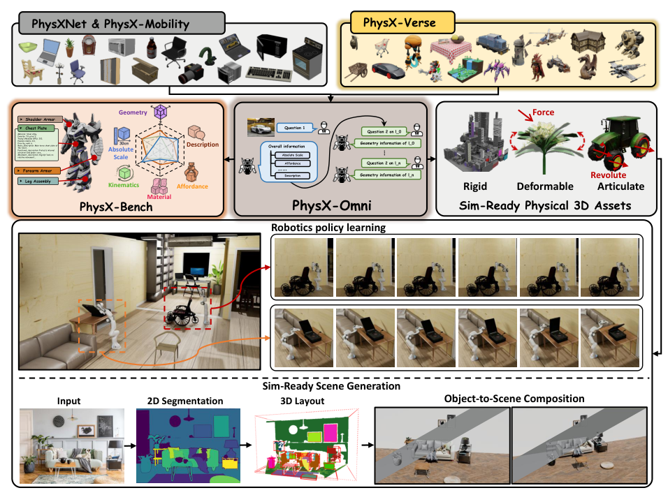
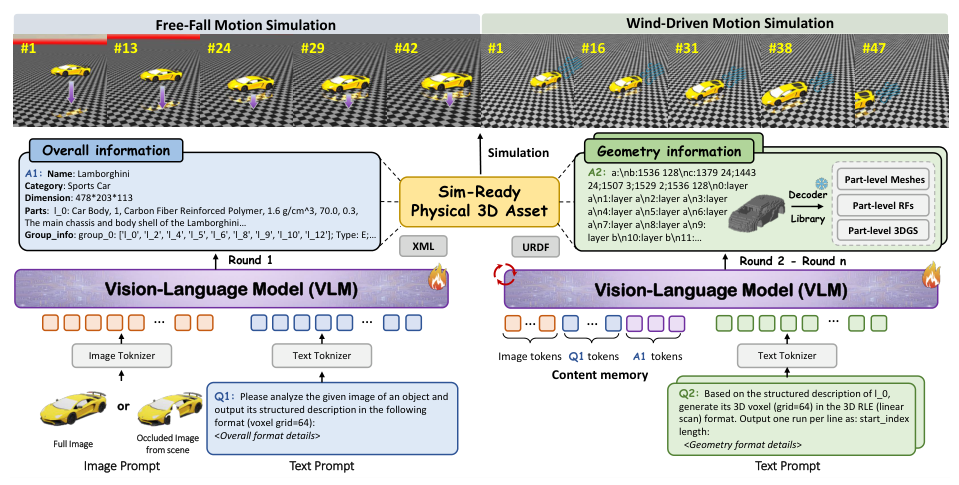
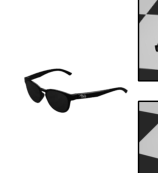
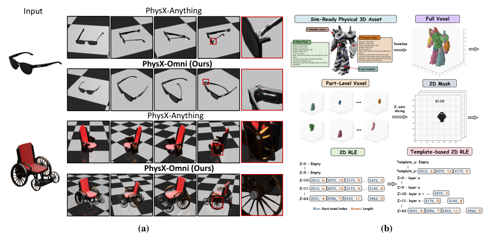
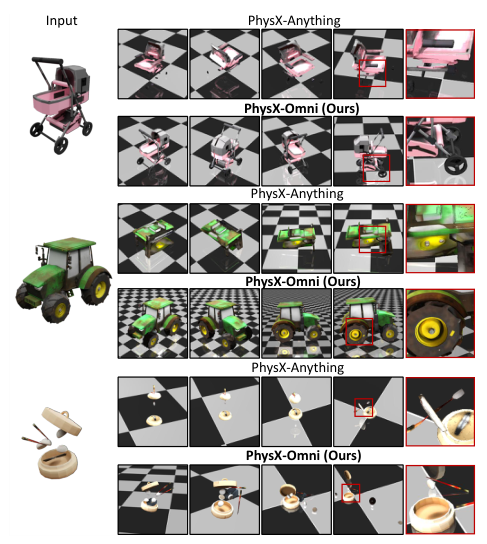
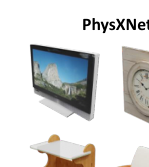
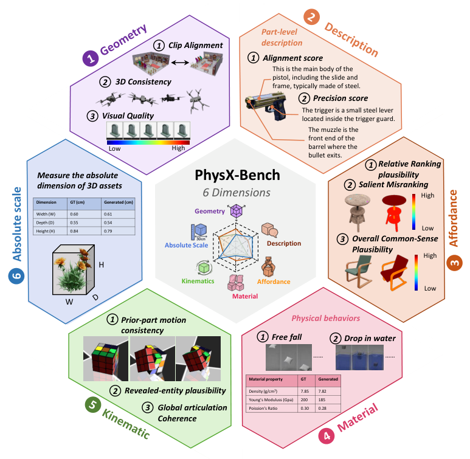
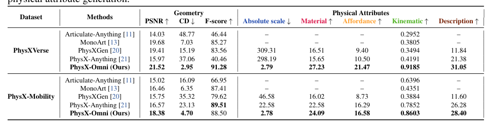
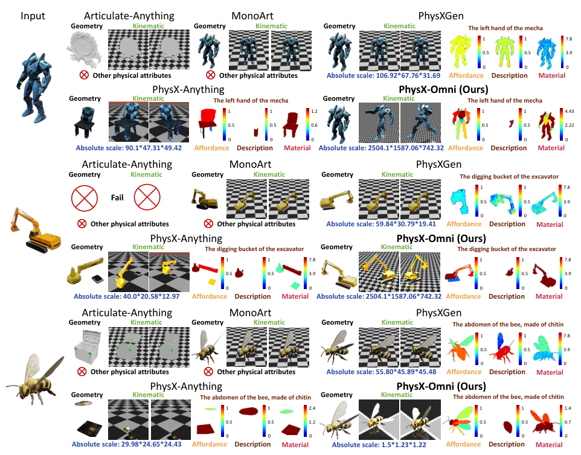
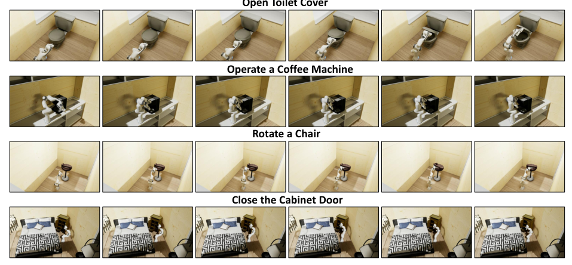

## 论文链接

- 原始论文页面：https://arxiv.org/abs/2605.21572
- PDF 下载：https://arxiv.org/pdf/2605.21572.pdf
- Hugging Face 论文页：https://huggingface.co/papers/2605.21572
- 项目主页：https://physx-omni.github.io
- 开源代码仓库：https://github.com/physx-omni/PhysX-Omni

PhysX-Omni：面向刚体、可变形体与关节物体的统一仿真就绪物理3D生成框架

> 导读摘要：这篇论文真正想解决的，不是“把3D物体生成得更像”，而是“把3D物体生成得能直接进仿真”。作者提出 PhysX-Omni，用统一框架同时处理刚体、可变形体和关节物体；关键做法是设计了一种更适合视觉语言模型的显式高分辨率几何表示，并配套构建了通用数据集 PhysXVerse 与六维评测基准 PhysX-Bench。结果上，它不仅在几何与语义上更强，也更能生成带有尺度、材料、可供性和运动学信息的可用资产，最终还能直接支持机器人策略学习等下游任务。

## 问题定义：为什么“看起来像”还远远不够

过去很多 3D 生成工作，核心目标是外观真实、几何细节丰富，适合渲染、展示或内容创作；但如果把这些结果直接放进物理引擎，问题就会立刻暴露出来：没有可靠的**绝对尺度**，材料属性缺失，哪些部件可动、如何运动也不明确，更别说可供性与功能描述。对于机器人、具身智能、交互仿真这类任务，这些属性不是附加项，而是资产可用性的前提。

这也是本文的出发点：把“仿真就绪”作为 3D 生成的一等目标，而不是后处理补丁。作者认为现有方法还有两层割裂：

1. **对象类型割裂**：很多方法只覆盖刚体、或只覆盖可变形体、或只覆盖关节物体。
2. **评测方式割裂**：传统指标多偏向几何或视觉质量，难以衡量真实开放场景下的物理可用性。

论文整体框架可以先从总览图理解。它把多类资产、统一生成、物理属性建模和下游应用串成了一条闭环链路。  

这张图最重要的信号是：PhysX-Omni 的目标不是孤立生成一个网格，而是输出能进入场景组合、仿真环境乃至机器人学习流程的物理 3D 资产。

## 方法主线：从整体语义到部件级物理资产

PhysX-Omni 采用的是一种**多轮、分层**的生成范式，而不是单步端到端直接吐出完整 3D 模型。这个设计很重要，因为仿真资产天然带有层级结构：先有整体对象，再有部件，再有部件对应的材料、尺度、运动方式和功能。

具体流程可以概括为两段：

- **第一段：全局推理**  
  输入是一张完整或部分遮挡的单图。模型先推断对象的整体信息，包括类别、总体结构、层级关系、功能语义等。
- **第二段：局部细化**  
  在全局表示约束下，模型逐步生成部件级几何，并补充每个部件的物理属性，最终导出可仿真的资产表示。

这个过程不是“先描述一下，再随便补细节”，而是通过显式的全局表示，把后续部件生成约束在一致的语义和结构空间里。下面这张流程图就很直观：  

图中最值得注意的是“多轮生成”而不是“一次生成”。这样做的核心收益，是避免局部部件各自合理、但拼起来不合理的问题。对于关节物体尤其关键，因为一个把手、轮轴或铰链生成得稍微错一点，后续运动学就会出问题。

为了进一步保证整体与局部的一致性，作者还强调了“整体语义先验”对后续部件生成的约束作用。全局对象表示会持续影响局部几何与属性生成，而不是在第一步后就被丢弃。  

这其实体现了论文很清晰的方法判断：**仿真资产生成的难点，不只是生成细节，而是让细节服从整体结构与功能语义。**

## 核心创新：面向 VLM 的显式高分辨率几何表示

如果说上面的多轮流程是框架层创新，那么论文最关键的技术点，是它提出的几何表示。

作者观察到，很多 3D 表示虽然紧凑，但对视觉语言模型并不友好；另一些方法虽然能表达形状，但往往依赖额外的专用 3D tokenizer、网格分解或显式分割模块，训练和推理链路都更复杂。PhysX-Omni 想做的是：**既保留高分辨率结构信息，又保持与现有语言建模范式兼容。**

其做法是把 3D 体素结构转成一种模板化的 **RLE（游程编码）** 文本式表示：

- 先把对象按部件体素化；
- 再沿 z 轴切成 2D 切片序列；
- 对每个切片使用模板化 RLE 编码占据区域；
- 最终得到适合自回归建模的紧凑文本序列。

这一设计避免了对 3D 结构做过强压缩，因此更能保留细长杆件、轮辐、连接件这类容易丢失的局部细节。作者把这种表示与其他几何表示做了对比，显示出它在复杂拓扑和高分辨率结构上的优势。  

这张图传达的核心不是“换个编码形式”这么简单，而是：**几何表示本身就是生成质量的瓶颈。**  
PhysX-Omni 的优势，来自它把“高保真 3D 结构”转译成了 VLM 能直接处理的序列，同时又不引入额外的专用 3D 词表和复杂分割依赖。

作者还进一步用可视化对比说明，不同几何表示会直接影响生成结果的完整性和结构稳定性，尤其在刚体和带复杂局部结构的对象上更明显。  

从方法角度看，这一部分是全文最值得记住的点：**不是单纯把 VLM 用到 3D 上，而是重写了 3D 几何进入 VLM 的接口。**

## 数据与评测：PhysXVerse 和 PhysX-Bench 如何支撑统一框架

统一框架必须有统一数据支撑。为了解决高质量仿真资产稀缺的问题，作者构建了 **PhysXVerse**，这是论文另一项很重的贡献。它不是简单收集模型，而是把已有带结构信息的 3D 资产经过清洗、过滤、自动标注和人工校验，补齐成可用于仿真的资产集合。

论文给出的信息显示，PhysXVerse 包含超过 8.7K 个高质量仿真就绪 3D 资产，覆盖 2K+ 室内外类别，横跨刚体、可变形体与关节物体。更重要的是，标注内容不止几何，还包括：

- 绝对尺度
- 材料
- 可供性
- 运动学
- 功能描述

其数据构建流程如下图所示：  

这里能看出作者不是“先做模型，再顺便补个数据集”，而是把数据构建本身也当成方法的一部分。没有这套高质量标注，统一建模上述多种物理属性几乎不可能。

在评测上，作者提出 **PhysX-Bench**，专门面向仿真就绪物理 3D 生成。它覆盖六个关键维度：

1. 几何
2. 绝对尺度
3. 材料
4. 可供性
5. 运动学
6. 功能描述

评测设计的意义在于，把“像不像”与“能不能用”放到同一体系中检查。其整体框架如下：  

这套基准的价值很大，因为它让后续工作不再只能汇报 CLIP、几何距离这类单一结果，而可以系统衡量物理世界所需的多属性一致性。

## 实验结果：不只更像，而且更可用

在结果上，论文同时给出了传统生成指标、PhysX-Bench 结果、定性可视化和下游任务验证。最关键的结论是：PhysX-Omni 的提升不是局部性的，而是贯穿几何质量、结构一致性、物理属性建模和跨场景泛化。

先看 PhysX-Bench 的定量对比，作者显示其方法在大多数关键指标上都有明显优势，且这种优势不仅体现在几何维度，也体现在尺度、材料、运动学和描述一致性上。  

从这张表最该读出的结论是：PhysX-Omni 的强项不是只赢一个视觉分数，而是在“几何 + 物理属性”联合评价中表现更平衡。这比单一高分更有说服力，因为它更符合“仿真就绪”的目标定义。

定性结果也支持这个结论。与已有方法相比，PhysX-Omni 在复杂对象上更容易保持结构完整，局部连接更清晰，生成结果更少出现断裂、错位或部件关系不协调的问题。  

这与前面的表示设计是对应的：当几何序列能更直接保留高分辨率结构时，模型在生成复杂部件关系时自然更稳。

此外，论文还特别强调生成资产的**可部署性**。作者将生成结果放入机器人操作任务中，例如开合、旋转、交互等，验证这些资产不仅视觉上合理，而且运动行为和接触关系也足够可信。  

这一点非常关键，因为它把论文从“更好的生成模型”推到了“更好的仿真基础设施”。对于具身智能研究者而言，这往往比纯视觉指标更重要。

## 这篇论文最值得记住的三点

第一，PhysX-Omni 把目标从“生成 3D 形状”升级为“生成可直接进仿真的物理资产”。这使得尺度、材料、可供性和运动学从附属信息变成核心输出。

第二，方法上的真正创新不只是统一框架，而是那套**面向 VLM 的显式高分辨率几何表示**。它在结构保真、序列建模效率和与现有解码器兼容性之间取得了很好的平衡。

第三，PhysXVerse 与 PhysX-Bench 让这个方向从单点方法展示，走向了“统一训练 + 系统评测”的研究范式。也就是说，论文贡献的不只是一个模型，而是一整套方法、数据和评测基础设施。

如果只用一句话概括本文：**PhysX-Omni 证明了，3D 生成真正通向机器人与具身智能的关键，不是更会“画形状”，而是更会“生成有物理意义的对象”。**
