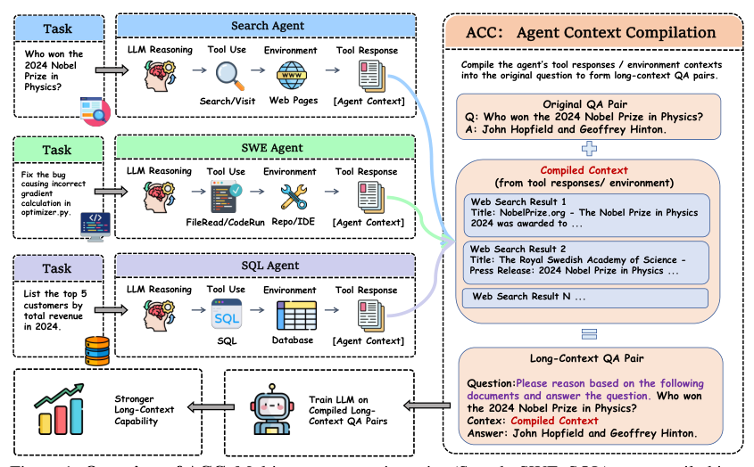
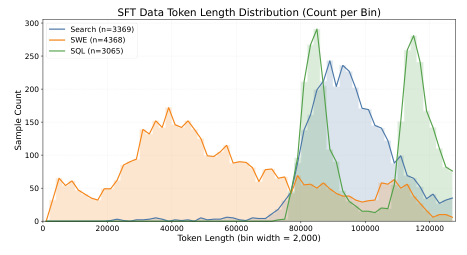
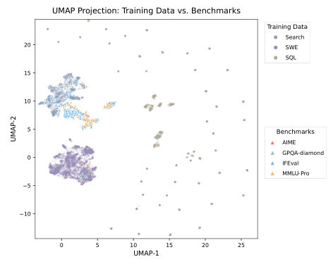
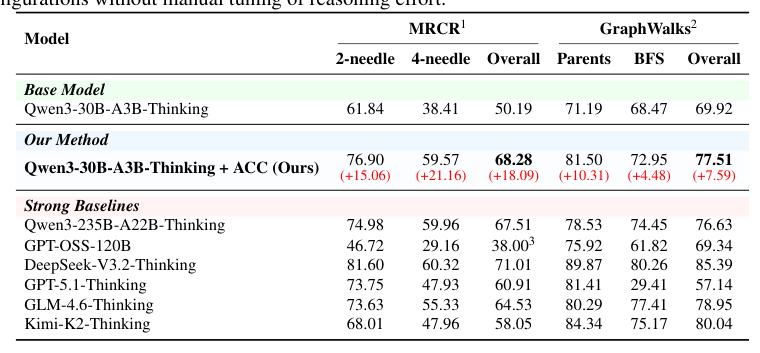
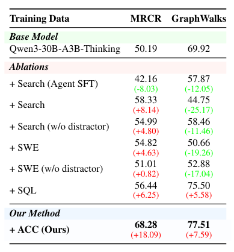
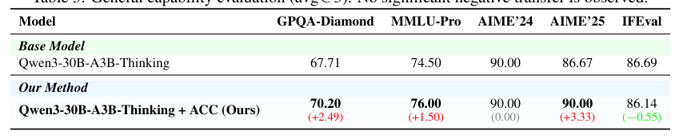
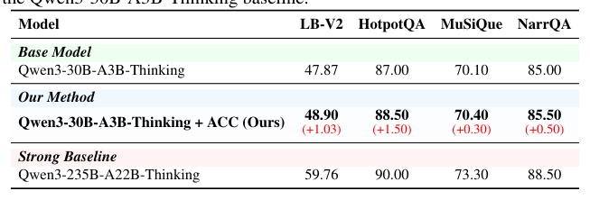
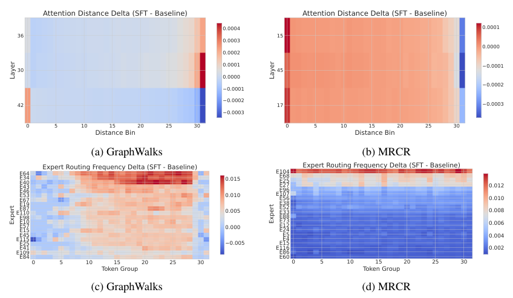
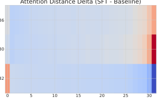
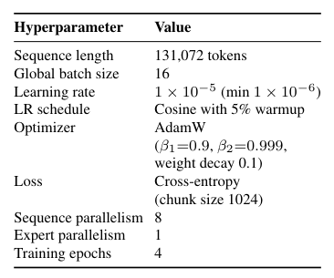

## 论文链接

- 原始论文页面：https://arxiv.org/abs/2605.21850
- PDF 下载：https://arxiv.org/pdf/2605.21850.pdf
- Hugging Face 论文页：https://huggingface.co/papers/2605.21850

ACC：将智能体轨迹编译为长上下文训练数据

> 导读摘要：这篇论文的关键不在于“把上下文拉长”，而在于把智能体多轮调用工具时分散在不同回合里的证据，重新编译成可直接监督的长上下文问答样本，从而补上传统 agent SFT 的监督盲区，并显著提升跨轮证据整合能力。

## 一、论文想解决的核心问题

随着搜索、软件工程、SQL 等智能体越来越依赖多轮工具调用，真正决定最终答案的信息，往往并不集中在某一个局部回合，而是散落在很远的上下文片段里。模型如果只会在每一步“选下一个动作”或“选下一个工具”，并不等于会把这些分散证据整合起来。

论文指出，传统 agent SFT（监督微调）有一个很重要的**监督盲区**：训练时通常会屏蔽工具返回和环境观测，只监督每一轮的局部推理与动作选择。这样一来，模型优化的重点就会落在“下一步怎么做”，而不是“如何综合多轮证据回答原问题”。

作者的观察是：智能体轨迹本身其实天然包含了长程依赖所需的监督信号，只是这些信号被埋在多轮交互里，没有被显式转化成适合长上下文训练的样本。于是，论文提出 ACC，把已有 agent 轨迹重新组织成新的训练数据，而不是重新做人力昂贵的长文档标注。

这张图最能代表论文主线：左侧是不同类型的智能体任务，中间是多轮工具调用与环境反馈，右侧则把这些分散信息重新编译成“问题 + 长上下文证据 + 推理/答案”的训练样本。也就是说，ACC 的本质不是复刻 agent 的每一步，而是把原问题与跨轮证据之间的依赖关系显式化。

## 二、ACC 的方法主线：从轨迹监督转向证据整合监督

### 1. 传统目标的问题出在哪里

论文把一条智能体轨迹表示为：原问题、若干轮“推理-动作-观测”交互，以及最后的答案回合。标准训练目标会对每一轮模型生成的 token 做监督，但工具返回的观测通常不计入损失。

这会带来一个后果：中间回合中的观测 token 虽然进入了上下文，却不能被最终答案监督直接充分利用。梯度主要沿着短路径流向下一步动作预测，而不是回流到那些真正支撑最终答案的远距离证据上。结果就是模型更擅长局部决策，不擅长跨多轮整合。

### 2. ACC 的核心改造

ACC（智能体上下文编译）的想法很直接：  
不再把原始多轮轨迹当成逐轮决策序列去训练，而是把其中与答案相关的工具响应、环境观测、外部文档、文件内容、表格查询结果等，抽取并整理为一个**长上下文 QA 样本**。

新的训练样本可概括为三元组：

- 输入：原始问题 + 编译后的上下文
- 输出：最终答案
- 可选监督：对应的推理痕迹

这样一来，训练目标就从“预测下一个工具动作”变成“基于长上下文直接写出推理与答案”。最终答案的监督可以直接作用到所有证据 token，而不需要穿过一长串中间动作选择。

### 3. 上下文是如何构造的

ACC 不是简单把整条轨迹原封不动拼接起来，而是做了更有针对性的“证据编译”：

- **搜索任务**：提取访问过网页的全文，并加入未访问候选结果作为干扰项  
- **SWE 任务**：提取最终修复相关文件，同时加入调试时查看过但不一定关键的上下文文件作为干扰  
- **SQL 任务**：提取轨迹中查询过的表内容，形成结构化证据集合  

随后，作者会把这些证据片段随机打乱顺序，在 token 预算内拼接成统一长上下文。这个设计很关键：它迫使模型依赖**语义关联**去定位证据，而不是依赖 agent 原始交互顺序。

从样本长度分布也能看出，ACC 生成的数据并不只是“稍长一点”的普通样本，而是覆盖了从中短到超长的广泛区间，不同 agent 类型提供了互补的长度分布。这说明 ACC 不只是重排轨迹，还真的构造出了适合训练长程依赖能力的数据基础。

### 4. 推理痕迹从哪里来

答案验证过的轨迹通常有正确答案，但未必自带高质量、显式的推理链。为此，作者使用强教师模型为这些“问题 + 编译后上下文 + 正确答案”样本合成候选推理，再只保留能导向正确答案的推理痕迹。

这一步的意义在于：ACC 不需要新增人工标注，就能把原始 agent 日志进一步提升为可用于监督微调的长上下文推理数据。

## 三、为什么这种方法有效：它补上了 agent SFT 的“监督盲区”

论文最有启发性的地方，是把问题说清楚了：  
传统 agent SFT 的瓶颈不只是上下文窗口不够长，而是**训练目标错位**。

如果训练目标主要奖励局部工具选择，那么模型自然会形成一种偏好：先学会在局部上下文里做合理动作，而不是在全局范围里整合分散证据。ACC 则把监督中心从“局部动作”移到“全局答案生成”，让原问题与远距离证据之间的依赖显式暴露出来。

这张二维语义分布图提供了一个侧面支撑：训练数据与评测题目不是简单重合，三类训练数据各自成簇，而评测问题多落在团簇之外或边缘。这意味着性能提升更可能来自可迁移的长上下文整合能力，而不是训练集和测试集题面高度相似。

另外，作者强调 ACC 是一种**数据与目标层面的改造**，而不是架构修改。它可以和现有长上下文扩展方案兼容，比如位置编码扩展、稀疏注意力、已有长上下文继续训练等。也就是说，ACC 更像一个上层训练范式：谁能处理更长上下文，谁就可以从这类编译数据中受益。

## 四、实验结果：小模型显著逼近更大模型

论文在 Qwen3-30B-A3B 上进行训练，重点评测两类长程依赖任务：

- **MRCR**：强调跨轮指代消解
- **GraphWalks**：强调长上下文中的图遍历式推理

核心结果可以概括为：

- 在 **MRCR** 上达到 **68.3**，相比基线提升 **18.1**
- 在 **GraphWalks** 上达到 **77.5**，相比基线提升 **7.6**
- 整体表现已经接近更大规模的 **Qwen3-235B-A22B**

这张结果表最直接地说明了论文主张：把 agent 轨迹编译成长上下文训练样本，确实能同时改善多种需要跨段整合证据的任务，而不是只对某一个 benchmark 有效。

从数据组成上看，完整的混合训练优于只使用某一类 agent 数据，说明 Search、SWE、SQL 三类轨迹提供的是互补信号，而不是冗余样本。

这也进一步支持了 ACC 的一个重要判断：收益并不只是来自“更多数据”，而是来自“把不同来源的多轮证据统一编译成同一种长上下文监督形式”。

与此同时，论文也专门检查了通用能力是否受损。结论是，在 GPQA、MMLU-Pro、AIME、IFEval 等通用基准上，ACC 后模型整体波动很小，基本保持稳定。

这点很重要，因为很多专项训练方法都会带来能力偏移；而 ACC 的代价相对较小，更像是在原能力上补强长上下文推理短板。

此外，补充结果也显示，ACC 的收益不只体现在论文主打的 agent 派生任务上，对更一般的长上下文任务也有一定迁移作用。

## 五、机制分析：模型内部发生了什么变化

论文没有停留在“分数提升”，而是进一步分析了模型内部机制变化，发现 ACC 训练后出现了**任务自适应的注意力重构**与**专家分化**。

从这张图可以读出两个结论：

- 在注意力距离分布上，ACC 并不是简单地让模型“一律看得更远”  
- 不同任务的变化模式不同：有的任务同时增强近处与远处依赖，有的则主要强化局部验证  

这说明 ACC 学到的不是单纯“拉长注意力”，而是更贴合任务需求的证据组织方式。

在 MoE 路由上，ACC 还带来了更清晰的专家分工：某些专家更频繁处理某类长程整合模式，说明长上下文训练信号不只是表层行为改进，也在内部计算结构上诱导出更专门化的处理路径。

这张图进一步表明，ACC 训练后的注意力变化存在明显任务差异：有的任务更依赖远距离片段，有的更依赖局部核查。换句话说，ACC 的作用不是机械放大长距离依赖，而是让模型学会“何时需要远，何时需要近”。

## 六、这篇论文的价值与边界

### 价值

这篇论文最值得记住的贡献有三点：

1. **问题定义得很准**：指出 agent SFT 的真正短板是监督盲区，而不只是上下文长度不够  
2. **方法非常朴素但有效**：不改模型结构，而是把现成轨迹转成更对路的训练样本  
3. **扩展性强**：可以复用已有 agent 日志，也能与其他长上下文技术叠加

训练配置本身也说明，这项工作并不依赖特别花哨的优化技巧，更大的创新主要来自数据编译方式和训练目标设计，而不是靠异常激进的工程堆料。

### 边界与风险

论文也隐含了几个边界条件：

- 它依赖**答案验证过的 agent 轨迹**，而这类高质量轨迹在不同任务上的获取成本并不一致  
- 推理痕迹依赖强教师模型生成，存在教师偏差传播风险  
- 原始轨迹与编译上下文可能带来隐私、版权、专有数据泄漏等问题，需要严格过滤

## 总结

如果只用一句话概括 ACC：  
**它把“智能体如何一步步操作工具”转换成“模型如何基于长上下文整合证据直接回答问题”的训练问题。**

这件事之所以重要，是因为它正面修复了传统 agent SFT 学不到跨轮证据整合的结构性缺陷。实验上，它让 30B 级模型在长程依赖任务上显著提升，并逼近远大于自身的模型；机制上，它诱导出任务自适应的注意力重构与专家 specialization。对于长上下文训练来说，ACC 提供的不是又一种上下文扩展技巧，而是一种更贴近真实智能体数据形态的监督范式。
