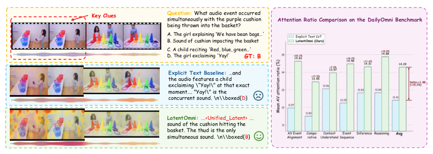
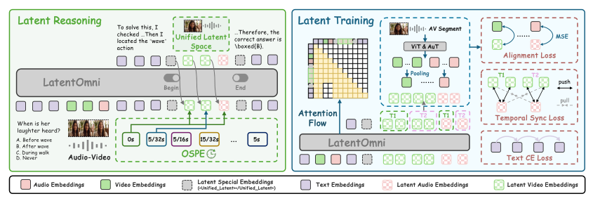
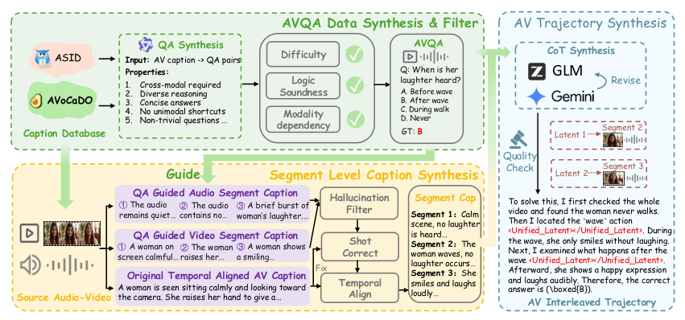
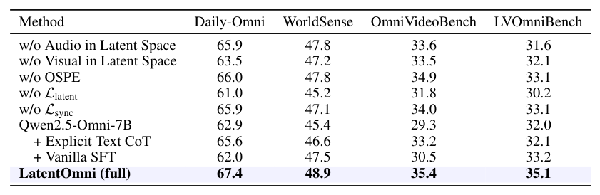
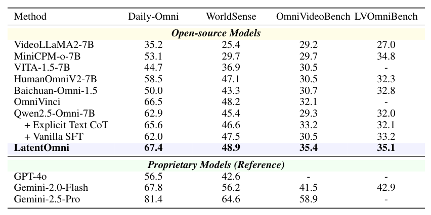
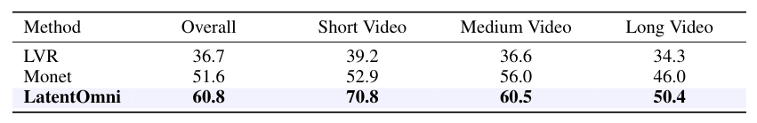
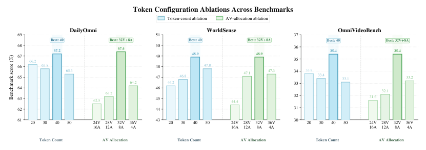
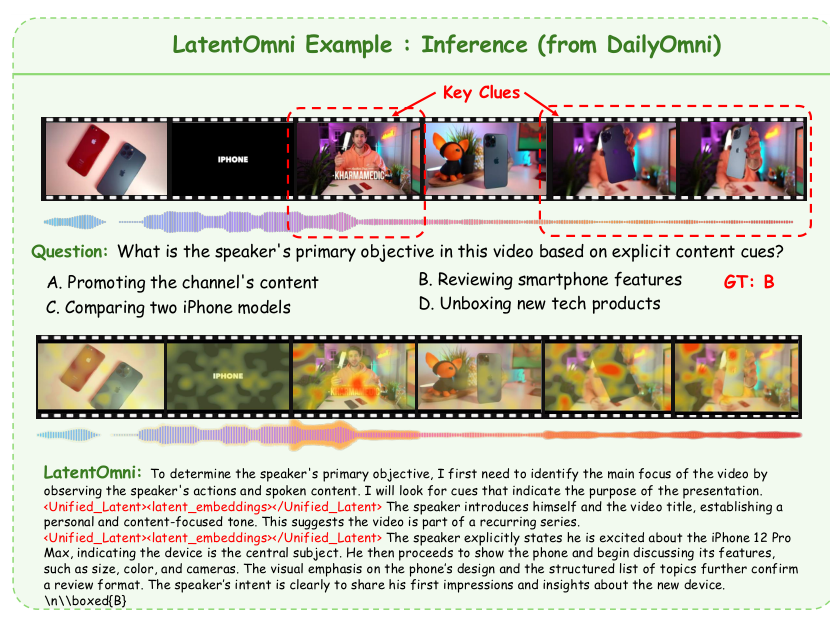
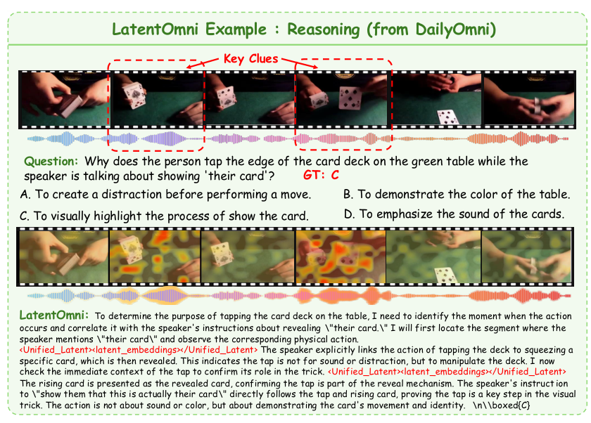
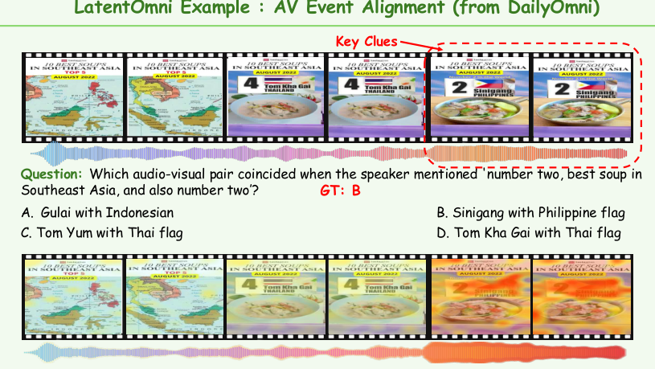

## 论文链接

- 原始论文页面：https://arxiv.org/abs/2605.22012
- PDF 下载：https://arxiv.org/pdf/2605.22012.pdf
- Hugging Face 论文页：https://huggingface.co/papers/2605.22012

LatentOmni：通过统一音视频潜空间推理重新思考全模态理解

> 导读摘要：这篇论文的核心判断很直接：在音频与视频联合推理里，把中间过程过早压成文本，会丢掉最关键的时序与细粒度证据。LatentOmni 通过“文本推理 + 统一音视频潜表示推理”交替进行的方式，把一部分思考放回连续潜空间中完成，并用特征级监督、时序同步位置编码与专门构建的数据集，把这种潜空间推理真正训练出来。结果上，它不仅比同底座的显式文本 CoT 更强，也说明了一个更普遍的方向：跨模态推理未必要全部写成文字，保留原生感知证据本身就是能力来源。

## 问题从哪里来：显式文本 CoT 为什么不够

论文关注的是一种比常见“看图说话”更难的任务：模型不仅要看见视频、听见声音，还要把两者在**同一时刻**发生的细节联系起来，完成因果、意图、事件对应等推理。难点不在于识别单个物体或单句语音，而在于持续利用跨模态、跨时间的证据。

作者认为，现有 MLLM 的关键瓶颈在于：它们大多仍依赖显式文本 CoT，把连续的音视频信号离散化成文字中间步骤。这样做当然有好处，语言推理结构清晰、易监督、易生成；但代价是，原始信号中的时间同步关系、局部细节和密集证据会在“翻译成文本”的过程中被压缩掉。模型后续推理时，越来越依赖语言先验，而不是继续回看原始感知证据。

这一点在论文给出的对比例子里很直观。显式文本基线会把注意力落在语言上更显眼、却不一定与问题真正相关的声音线索上；而 LatentOmni 更能持续锚定到问题所需的音画同步证据。

这张图传达的不是“又一个案例”，而是整篇论文的出发点：**文本化中间推理会让模型和原始音视频证据脱节**。作者甚至进一步统计了注意力分布，发现 LatentOmni 在多个任务上都保持了更高的原始音视频 token 关注比例，说明它的增益并不只是答案更准，而是推理过程本身更贴近证据。

## 方法主线：把推理过程拆成“文本阶段”和“潜空间阶段”

LatentOmni 的设计并不是抛弃文本推理，而是把推理过程改造成一种**混合轨迹**：需要抽象逻辑时继续用文本；需要回看细粒度音视频证据时，就切换到统一潜空间中做连续推理。

整体框架如下图所示。左侧是推理流程，右侧是训练目标的组合。

可以把它理解成三步：

1. **输入表示**  
   视频特征、音频特征和文本查询先分别编码，作为模型上下文。

2. **交替式推理轨迹**  
   模型先按普通自回归方式生成文本 token。  
   当它判断“这里需要重新检查感知证据”时，会输出一个特殊触发标记，进入统一潜空间阶段，开始连续生成若干个潜状态；完成后再输出结束标记，回到文本空间继续生成解释与答案。

3. **答案输出**  
   文本仍然承担高层逻辑组织和最终回答的职责，但中间有一部分证据密集的推理被放在潜空间里完成。

这套设计的妙处在于，它保留了语言推理的结构优势，同时避免把所有中间证据都塞进离散文本。作者把这种轨迹写成“文本 token + 潜状态 + 文本 token”的混合序列，本质上是在自回归框架里插入可回看的连续推理段。

论文中特别强调，潜空间阶段不是另起一个分支模型，而是直接使用主干 Transformer 的隐藏状态来承载推理。也就是说，模型并不是“先写文字，再调用外部感知模块”，而是把连续潜状态当成正式的中间推理介质。

## 关键技术细节：统一潜表示、OSPE 与特征级监督

如果只说“在潜空间推理”，这个想法还不够落地。LatentOmni 真正有技术含量的地方，在于它回答了三个问题：潜状态怎么表示、跨模态时间怎么对齐、这种中间状态怎么监督。

### 1. 统一音视频潜表示

作者把视频潜特征和音频潜特征放进同一个连续空间里建模，而不是各自做一段隐式推理再晚融合。这样做的目标是让模型能直接在共享表示里访问“同一事件的视觉证据”和“同一时刻的声音证据”。

同时，论文还讨论了潜 token 的分配问题：给视觉多少、给音频多少，以及总长度设多大。这个问题不是实现细节，而会直接影响模型能否保留足够信息量。后面的消融也证明了，潜长度和音视频分配比例都显著影响结果，尤其是在长视频推理里更明显。

### 2. OSPE：保持跨模态时间一致性

统一空间还有一个难点：音频和视频虽然描述同一现实过程，但采样方式不同、序列长度不同，如果只是顺序生成潜状态，属于同一时刻的音频与视频证据可能在位置上漂移，破坏时间对应关系。

为了解决这个问题，作者提出 **OSPE（同步位置嵌入）**。它的核心思想是：不给不同模态单独的“序列位置”，而是给它们注入**共享物理时间戳**。这样，同一时间窗口内的视觉帧和音频片段，在潜空间中会带有一致的时间先验，后续注意力就更容易把它们对齐起来。

这个设计很重要，因为 LatentOmni 不是只想“看见两种模态”，而是想让模型在潜推理时真正围绕**同一时间点的跨模态证据**进行聚合。没有这一步，统一潜空间很容易退化成简单拼接。

### 3. 特征级监督：让潜推理不漂走

另一个更难的问题是：潜状态没有天然可读语义，怎么知道模型在潜空间里不是“随便想想”？

作者的做法是引入**特征级监督**。简单说，训练时不只要求模型输出对的文本答案，还要求潜推理阶段生成的状态，与任务相关的音视频片段表示对齐。也就是把潜状态拉向“应该回看的那段证据”的压缩表征。

因此训练目标不只一个，而是三部分联合：

- 文本预测损失：保证正常语言生成与回答能力；
- 潜表示对齐损失：保证潜状态贴着任务相关音视频证据；
- 时序同步损失：保证音频与视频潜表示在时间上保持一致。

这也是 LatentOmni 相比“直接往模型里塞 latent token”更完整的地方：它不只定义了新中间表示，还明确规定了这个表示应该学成什么样。

## 数据是怎么造出来的：LatentOmni-Instruct-35K

潜空间推理要成立，光有问答对是不够的。模型必须知道：在每一步推理里，应该回看哪段音频、哪段视频，以及这些片段如何嵌入到推理轨迹中。现有音视频指令数据通常只给粗粒度 QA 或文字解释，并不提供这种局部、时序对齐的监督。

因此作者专门构建了 **LatentOmni-Instruct-35K**。数据流水线的目标，不是单纯扩充样本量，而是制造出“可监督潜推理”的训练轨迹。

从图里能看出，这个流程大致分三层：

1. **AVQA 合成与过滤**  
   先从原始音视频数据中生成较高质量的问题与答案，并过滤掉不可靠样本。

2. **片段级描述生成**  
   不只保留全局答案，还进一步生成和定位与问题相关的音频片段、视频片段描述，让关键证据可被局部标注。

3. **交错式推理轨迹构建**  
   最终把“文本步骤 + 对应音视频片段”组织成交替出现的监督轨迹，教模型学会在推理过程中持续回到原始证据。

这一步其实是整篇论文很容易被低估的部分。LatentOmni 的效果不只是“架构更聪明”，还来自训练信号终于与目标能力匹配：模型学到的不是直接答题，而是**边推理边检索、边对齐证据**。

## 实验结果：不仅整体更强，而且说明增益来自方法本身

论文在四个全模态基准上评估：Daily-Omni、WorldSense、OmniVideoBench 和 LVOmniBench。总体结论很明确：在开源模型里，LatentOmni 取得了最好的整体表现，并且稳定超过同底座的普通 SFT 和显式文本 CoT 版本。

如果只看一个更典型的基准，OmniVideoBench 上的对比也能说明问题：LatentOmni 相对原始底座模型有稳定提升，说明这种“部分推理放到潜空间”的策略不是只在单一任务上有效。

更关键的是，作者没有把结果停留在“总分更高”，而是做了充分消融。组件级实验显示，去掉音频潜表示、去掉视觉潜表示、去掉 OSPE、去掉潜对齐或同步损失，性能都会下降，而且不是某一个数据集偶然波动，而是整体退步。

这组结果支持了一个重要判断：LatentOmni 的提升不是因为“训练得更多”或“数据做大了”，而是因为以下几个设计形成了闭环：

- 统一潜空间承载跨模态证据；
- OSPE 保持同一时刻音画对齐；
- 特征级监督防止潜推理脱离任务证据；
- 交错式数据让模型学会何时进入潜空间、何时回到文本。

作者还进一步分析了潜配置本身。结果表明，潜 token 不是越长越好，存在较稳定的优选范围；而在视觉与音频的分配中，偏视觉但保留足够音频容量的设置更有效，尤其长视频场景受益更明显。

这说明 LatentOmni 不是“多塞点 latent 就行”，而是需要合适的信息带宽和模态配比。对实际系统设计来说，这是很有操作价值的结论。

## 可视化与案例：模型确实更贴着证据在推理

论文还给了多组案例，目的不是展示漂亮答案，而是回答一个更重要的问题：**LatentOmni 在推理时，真的把注意力放回了关键音视频证据吗？**

例如下面这个推断案例，模型需要根据说话内容、展示动作与画面片段判断视频意图。热力图显示，它的注意力集中在真正相关的语音和画面时刻，而不是泛化成抽象语言猜测。

另一个案例强调的是“推理过程中是否抓住关键视听线索”。这里模型需要同时利用说话内容、动作以及时间对应关系。高亮区域落在问题真正相关的时刻上，说明潜空间阶段承担了“回看证据”的作用。

还有一类更典型的任务，是音画事件对齐：模型必须把语音中提到的内容和画面中同步出现的对象或事件对应起来。这正是纯文本中间推理最容易丢失细节的地方，而 LatentOmni 在这种例子里表现出更强的对齐能力。

这些图和前面的量化结果是互相呼应的：前者说明“它怎么做对”，后者说明“它经常做对”。两者合在一起，才真正支撑了论文的主张。

## 这篇论文最值得记住的三点

第一，作者提出的不只是一个新模块，而是一个新的判断：**跨模态推理的中间过程，不一定都该文本化**。对音视频这类连续信号，保留部分推理在潜空间里进行，本身就可能更接近问题结构。

第二，LatentOmni 的完整性很强。它不是单点创新，而是把**表示、对齐、监督、数据**四件事一起补齐了：统一潜空间、OSPE、特征级监督、LatentOmni-Instruct-35K，缺一项都难以成立。

第三，实验给出的证据比较扎实。它不仅优于显式文本 CoT，也通过消融和可视化说明：收益确实来自“让模型在推理时持续锚定原始音视频证据”，而不是单纯依赖语言先验。

如果只用一句话概括，这篇论文真正想说的是：

**在全模态理解里，更强的推理不只是“写出更长的思维链”，而是“在该回看感知证据的时候，真的还能回到感知证据本身”。**
