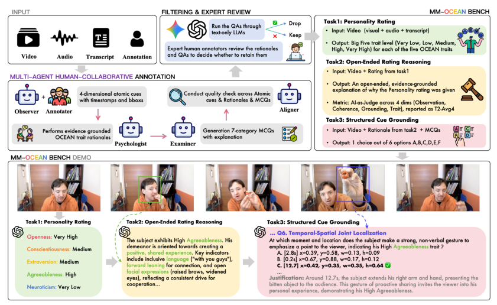
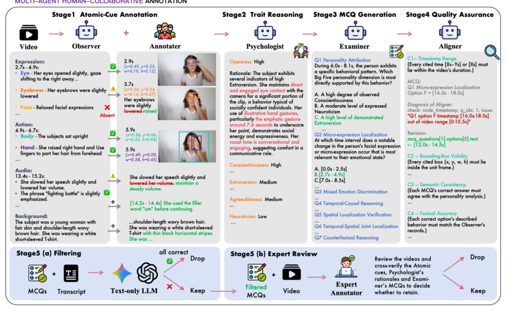
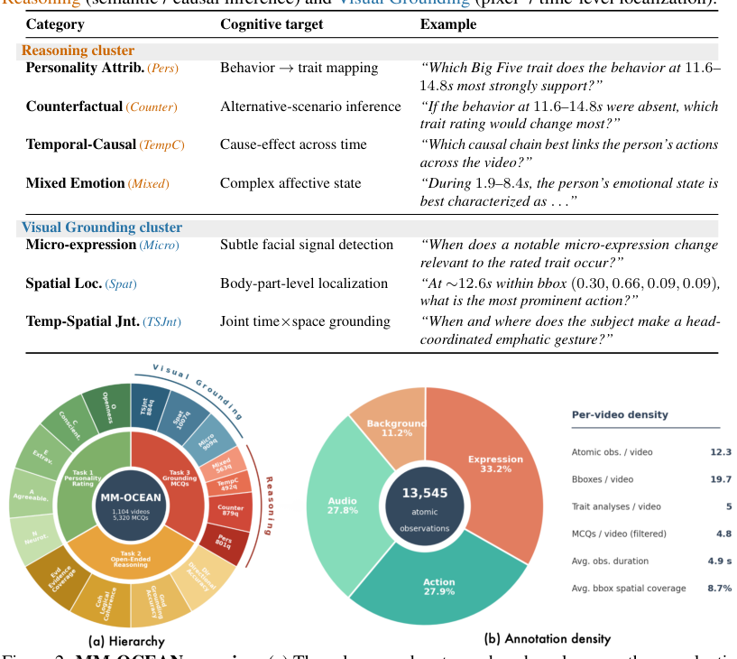
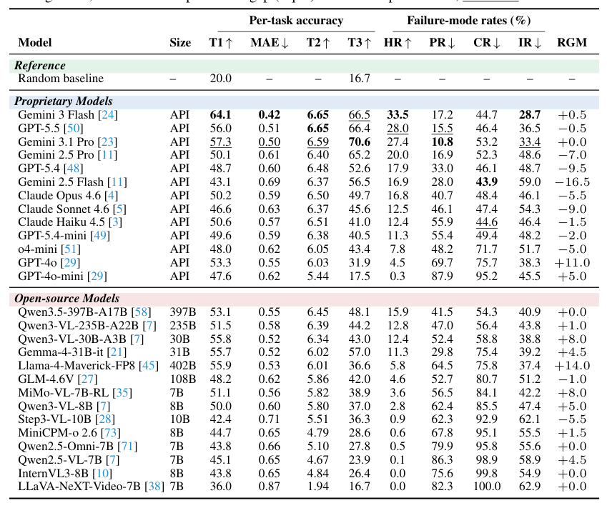
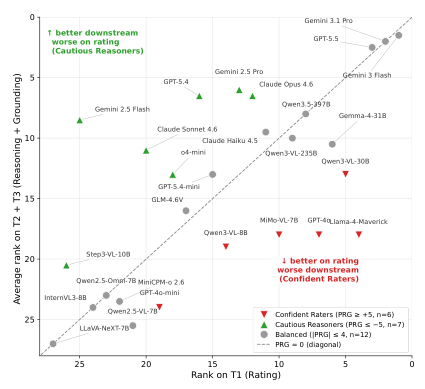
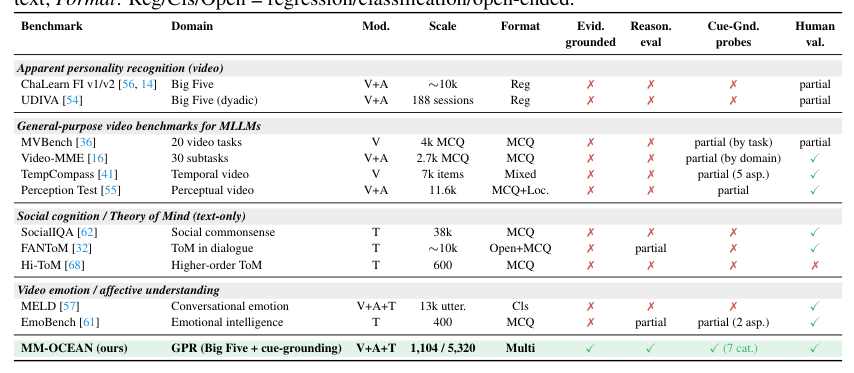
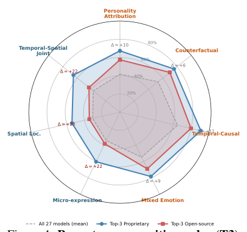
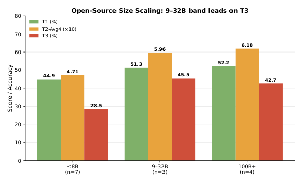
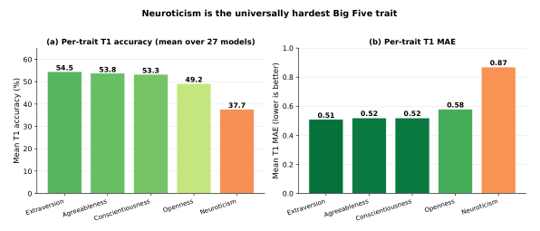
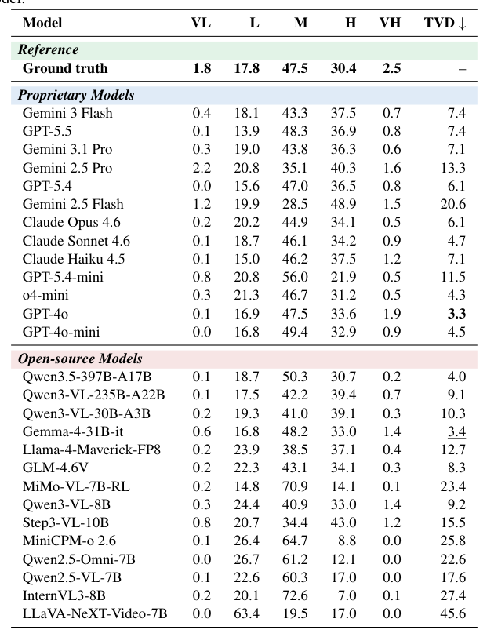

## 论文链接

- 原始论文页面：https://arxiv.org/abs/2605.22109
- PDF 下载：https://arxiv.org/pdf/2605.22109.pdf
- Hugging Face 论文页：https://huggingface.co/papers/2605.22109

感知还是偏见：多模态大语言模型能否超越对人格的第一印象？

> 導讀摘要：本文提出“证据锚定的人格推理”任务（Grounded Personality Reasoning, GPR）与 MM-OCEAN 基准，通过“人格评分—文字推理—线索 grounding”三层评测和 PR/CR/IR/HR 失效指标，系统揭示 MLLM 在人格判断中普遍存在“分打对了，但理由不对”的偏见缺口。

## 研究背景與任務定義

现有人格识别基准大多只要求回归或预测 Big Five 数值分数，因此无法区分模型究竟是真的从视频中的行为、表情、语音和上下文中理解人格，还是仅仅利用表面相关性做出“猜对”的判断。随着 MLLM 被用于招聘、教育、心理健康和陪伴式交互等高风险场景，这种“答对但无证据”的现象会直接影响可解释性、公平性与可信度。论文因此希望把人格感知从单纯评分问题，提升为必须可追溯、可验证、可 grounding 的社会认知任务。

## 方法設計與核心機制

论文首先正式定义 Grounded Personality Reasoning（GPR）：模型不仅要给出 Big Five 的五级序数评分，还要给出基于可观察线索的推理链，并在结构化题目中证明自己能找回支持该判断的具体证据。围绕这一任务，作者构建了 MM-OCEAN 数据集，包含 1104 个视频、约 1.35 万条经人工核验的原子行为观察、5520 条人格分析以及 5320 道 cue-grounding 选择题。数据通过五阶段多代理加人工协作流程生成：先由 Observer 提取原子线索并由人工校验，再由 Psychologist 生成人格分析，Examiner 生成七类 MCQ，Aligner 做一致性检查，最后经过文本泄漏过滤与专家复核，以保证样本既高质量又确实需要多模态 grounding。评测上，作者设计了 T1 评分、T2 开放式证据推理、T3 七类 cue-grounding MCQ 的三层框架，并进一步提出 PR、CR、IR、HR 四个样本级失效指标，用来定位模型是在“打分”“解释”还是“找依据”这一步出错。方法上的关键创新不只是新数据集，更是把人格判断重写为一条必须闭环的“评分—推理—grounding”链。

## 實驗結果與結論

在 27 个闭源与开源 MLLM 上的基准测试表明，领域内平均有 51.3% 的正确人格评分并没有被模型实际检索到的行为线索支撑，平均 Holistic-Grounding Rate 只有 10.4%，说明 Prejudice Gap 普遍存在。最佳模型 Gemini 3 Flash 的 HR 也仅为 33.5%，且开闭源模型在 T1 评分和 T2 解释上的差距相对有限，但在 T3 细粒度 cue grounding 上差距明显扩大，瓶颈尤其集中在微表情、空间定位和时空联合 grounding。进一步的 RGM 分析还揭示出两类典型模型：一类是“评分强但依据弱”的 Confident Raters，另一类是“依据较强但评分校准差”的 Cautious Reasoners，说明评分能力与 grounded reasoning 能力并不同步。

### MM-OCEAN 的构建流程与三层评测

核心思路是把原始视频、音频和转写，经过多角色协作处理成三层材料：细粒度行为线索、基于证据的人格分析，以及可验证的选择题。前面的观察与标注模块负责提取带时间戳的行为证据，中间的分析与出题模块把证据映射为人格解释并生成检查题，之后再经过 LLM 过滤和专家复核。底部示例对应最终的三类任务：人格等级判断、开放式解释、结构化线索定位。

### MM-OCEAN 的五阶段证据链标注流程

核心是在把“人格判断”拆成一条可核查的证据链，而不是直接给分。流程从视频中的细粒度行为线索出发，先做人类校验，再生成基于证据的人格分析与选择题，最后经过自动和人工双重质检，形成数据集与评测题目。

### MM-OCEAN 的任务结构与证据标注

图中把 MM-OCEAN 的方法拆成两部分：一部分说明它评测哪些能力，另一部分说明证据被标注到多细。上方把线索题分成推理类和视觉定位类两簇七类能力，下方左侧对应三项任务，右侧则说明证据来自表情、动作、音频和背景四个通道。

### 多层人格评测排行榜：准确不等于有依据

表中把模型在三层任务上的能力放在一起比较：人格打分（T1）、文字解释（T2）和行为线索定位（T3），并进一步统计几种典型失败模式。整体趋势是，闭源前沿模型通常更强，尤其在线索定位上占优，但即便最好的模型，真正同时做到“打分对、解释通、证据实”的比例也仍然有限。

### 评分与证据链能力是否匹配

每个点代表一个模型。横轴是 T1 人格评分的名次，纵轴是 T2+T3（解释与证据定位）的平均名次，越靠右上说明两类能力都更靠前。对角线附近表示评分、解释和找证据三步较一致，偏离越大则说明链条越不协调。

### MM-OCEAN相对现有基准的定位

表格把 MM-OCEAN 放到几类相关基准中一起比较，包括人格识别、通用视频理解、社会认知和情感理解。关键信息不是数据量大小，而是 MM-OCEAN 少见地把证据支撑、推理评估、线索定位探测和人工验证放进同一套基准里。

### 按子能力拆解的线索定位难点

雷达图把 MM-OCEAN 的 T3 任务拆成七类子能力，用来比较三组模型：全部模型平均、前三名闭源模型、前三名开源模型。越靠外表示该类题目准确率越高，能看出模型在“时序因果”上相对较强，而在“空间定位、微表情、时空联合定位”这类细粒度视觉落点上明显更弱。

### 开源模型变大后，证据落地能力并不持续提升

按参数规模把开源模型分成三档后，论文比较了三层任务：T1 人格评分、T2 解释推理、T3 线索落地。结果是，从小模型到 9–32B，三项能力都有明显提升；再继续增大到 100B+，T1 和 T2 只小幅变好，T3 反而基本停滞。

### T1中不同人格维度的难度差异

图里把任务1（大五人格打分）的结果按五个维度拆开比较。左边是平均准确率，右边是平均绝对误差，两项指标都指向同一结论：神经质最难判断，外向性、宜人性和尽责性相对更容易。

### 人格评分分布是否贴近真实标签

表中把任务1的五档人格评分预测，按“很低—很高”汇总成整体分布，并与真实标签分布对照。最后一列 TVD 表示模型输出分布与真实分布的距离，越低越接近。整体趋势是多数模型更常给中间档，极端档位明显报得偏少。

## 要點總結

- 这篇论文最重要的观念转变是：人格感知不能只看最终分数是否正确，而要检查模型是否能把判断锚定到可观察、可定位、可核验的行为证据上。
- MM-OCEAN 的方法价值在于其多代理加人工校验的数据生产链，以及覆盖评分、推理、grounding 三层能力的评测设计，这使它比传统 APR 基准更能诊断“为什么模型会答对或答错”。
- 实验结果说明当前 MLLM 的主要短板不是不会输出人格标签，而是不会稳定地做细粒度、多模态、时空一致的证据检索与整合；同时，模型常分化为“自信评分者”和“谨慎推理者”，进一步证明评分与 grounding 是两种不同能力。
