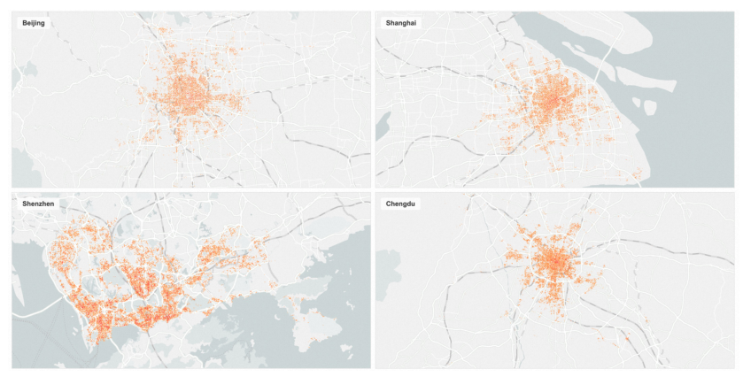
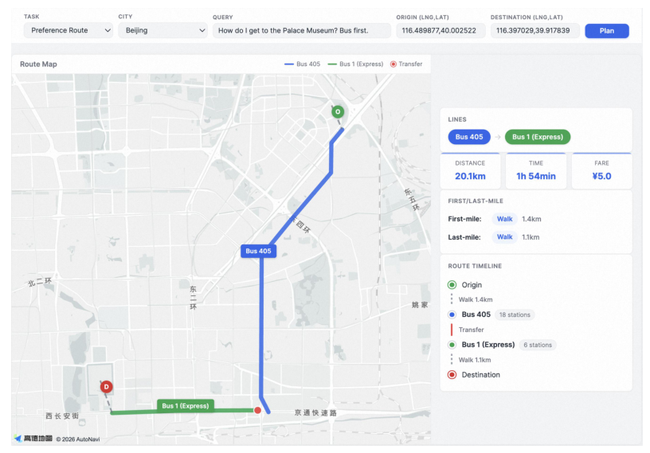
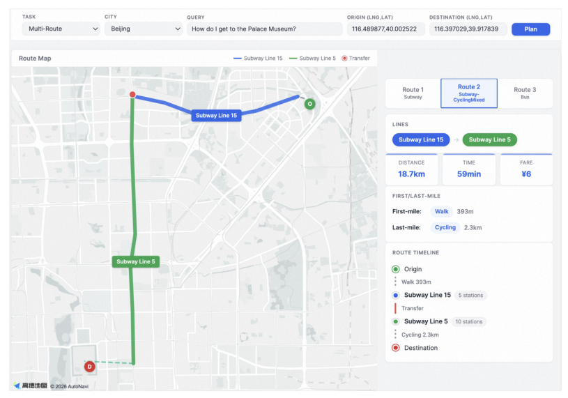
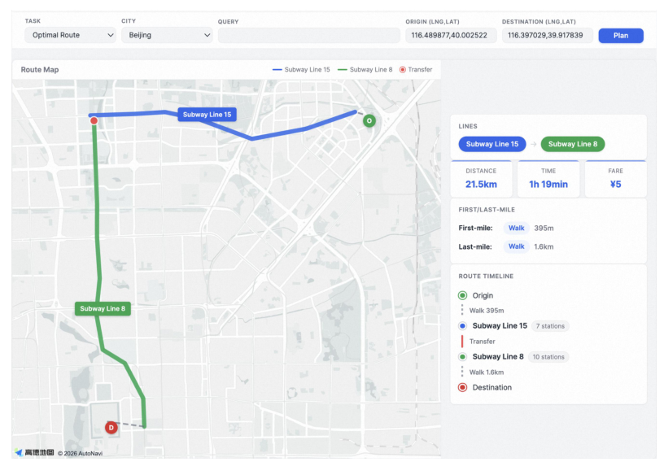
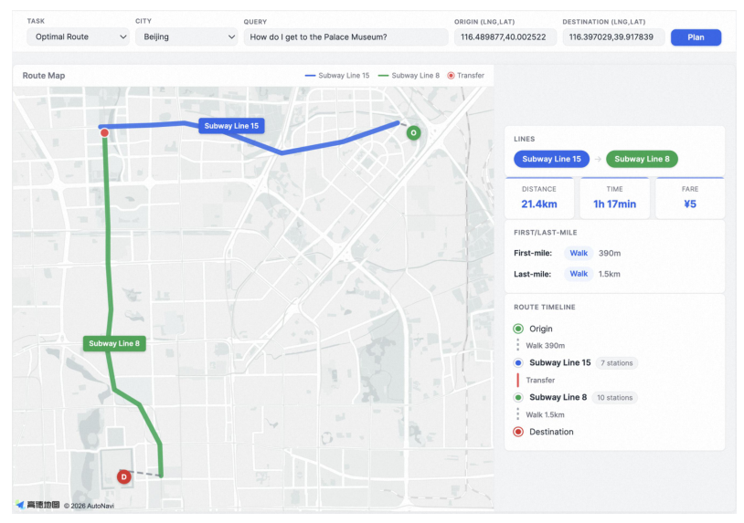

## 论文链接

- 原始论文页面：https://arxiv.org/abs/2605.22355
- PDF 下载：https://arxiv.org/pdf/2605.22355.pdf
- Hugging Face 论文页：https://huggingface.co/papers/2605.22355

TransitLM：用于无地图公共交通路线生成的大规模数据集与基准测试

> 导读摘要：这篇论文的重点不在于设计一个新的显式路由算法，而是在真实公交导航日志之上构建了一个训练—评测一体化资源，系统证明了大语言模型可以仅凭起终点信息与历史规划数据，学习到端到端、无地图的公共交通路线生成能力。

## 一、论文要解决的核心问题

传统公共交通规划系统，本质上依赖两类“重基础设施”能力：一类是结构化地图、站点拓扑、线路时刻表；另一类是复杂的候选检索与排序引擎。这样的范式在工业上成熟，但工程链条很长，也很难回答一个更基础的问题：**如果不给模型显式地图与路由器，它能不能直接从数据里学会公交规划？**

这篇论文的切入点非常明确：现有数据源要么偏“静态网络”，例如只给站点和线路；要么偏“轨迹日志”，例如只给移动轨迹，却没有完整的站点级规划结果、候选路线和用户偏好信号。因此，研究者既缺训练语料，也缺统一评测基准，无法严格验证 LLM 是否真的具备“无地图公交规划”能力。

作者提出的 TransitLM，正是为补上这块空白：它不是单一模型，而是一整套数据与评测资源。其目标是让模型从真实导航日志中学习公交网络拓扑、换乘规律、首末程接驳方式以及用户偏好，从而直接生成结构有效的路线。

## 二、TransitLM 的数据构成与方法主线

方法主线可以概括为一句话：**把真实导航平台中的公交规划会话，转写成语言模型可学习的序列知识，再通过持续预训练和监督微调，让模型把“路线规划”内化为参数知识。**

数据来自四个中国城市：北京、上海、深圳、成都，总计覆盖 120,845 个站点和 13,666 条线路，包含超过 1300 万条路线规划记录。论文特别强调，这些记录不是人工拼接的，而是来自真实平台生产环境中的导航日志，因此天然满足连通性、可达性和工程可执行性约束。

从结构上看，TransitLM包含两类互补资源：

1. **CPT（持续预训练）语料**：把大规模规划会话、站点描述、线路描述转成文本，用于下一词预测训练。
2. **SFT（监督微调）基准**：围绕具体任务构造标准化提示与标签，用于可复现评测。

作者还引入了三类知识源共同支撑训练：

- 路线规划记录：包含起终点、候选路线、用户最终选择；
- 站点信息：名称、坐标、描述等；
- 线路信息与连通性：线路经过站序、运营属性、站点一阶连接关系等。

这里有一个很关键的方法细节：论文没有让模型只输出自然语言站名，而是通过**扩展词表**把站点 ID 纳入模型可表达空间。这样做的意义非常大——它把原本模糊的文本匹配，转成了更离散、可校验的站点级建模，使模型能直接学习站点—线路—换乘之间的拓扑关系。

上图能帮助理解数据分布特征：四座城市中的规划出发点并不是均匀撒开的，而是明显集中在城市核心区和高频通勤走廊。这说明 TransitLM 学到的不是“人造均匀采样”的交通世界，而是真实城市出行需求驱动下的路线规律。对方法而言，这种分布既是优势，也是挑战：优势在于更贴近真实应用，挑战在于模型必须从高密度、强结构的需求模式中归纳可泛化的规则。

## 三、任务设计：从“能走通”到“懂偏好、会给备选”

论文将评测拆成三个任务，这也是它比一般数据集更完整的地方。

### 1. 最优路线生成

这是最基础的任务：给定起终点信息，生成一条与参考结果一致、结构合法的公交路线。这里的“最优”不是抽象最短路，而是对真实导航平台输出结果的拟合，包含站点序列、线路选择、换乘点，以及相关时间、距离、票价等字段。

### 2. 偏好感知规划

真实用户往往不只关心最短时间，还会带有偏好约束，例如“公交优先”“少换乘”等。作者因此单独设计了偏好感知任务，要求模型根据自然语言偏好调整路线，而不是机械复述默认方案。

这张图最能体现该任务的价值：同样的起终点，一旦加入“公交优先”之类的约束，模型会主动避开地铁，改写成纯公交或更符合偏好的方案。也就是说，模型学习到的不只是“某个 OD 对应哪条路”，而是**同一 OD 在不同目标函数下如何重排方案**。

### 3. 多路线生成

在实际产品中，平台通常会返回多条候选路线，供用户在速度、价格、便利性之间权衡。因此论文还要求模型一次生成多个结构合理且互有差异的备选方案。

从这个示例可以看出，模型给出的候选方案并非简单改几个数值，而是在出行方式组合上具有明显差异，例如地铁方案、带骑行接驳的方案、公交方案等。这说明模型学习到的是“候选空间”的组织能力，而不只是单点预测。

## 四、评测指标：为什么这套 benchmark 更像“工程验收”

TransitLM 的另一个亮点是评测设计很细，不只看文本相似度，而是从五类维度给出 10 个指标。核心思想是：公交规划是否有效，不能只靠 BLEU 或 ROUGE 这类表面相似指标判断，必须检查结构和数值是否真的可执行。

几类关键指标包括：

- **连通性**：路线是否从起点到终点连续可达，换乘是否断裂；
- **接驳可行性**：上车站、下车站是否合理，首末程距离是否可信；
- **路线重合度**：预测路线与参考路线在线路、站点序列上的一致程度；
- **数值字段精度**：时间、距离、票价等是否接近真实值；
- **任务特定约束**：偏好是否被满足，候选路线是否足够多样。

这套设计非常重要，因为它直接约束了“幻觉”的具体形式。论文在引言里就指出，通用 LLM 常见的失败模式包括：

- 幻觉站点；
- 不连通路线；
- 非法上下车点；
- 结构合理但数值字段乱填。

TransitLM 的指标基本就是围绕这些失败模式反向构建的，因此更像是在验证一个“可部署规划器”，而不是单纯验证语言生成器。

## 五、训练范式：持续预训练 + 多任务监督微调

论文采用的是两阶段训练框架。

### 持续预训练

第一阶段在 CPT（持续预训练）语料上做领域适配。其作用不是直接学会某个任务，而是让模型先吸收公交领域的“世界知识”：

- 站点与坐标之间的对应关系；
- 线路经过站序与换乘结构；
- 用户在候选路线中的选择偏好；
- 时间、距离、票价等字段之间的统计一致性。

由于训练语料中包含大规模真实规划会话，模型会逐步把公交网络的局部拓扑、常见换乘模式和空间邻近关系内化到参数中。

### 监督微调

第二阶段使用三项任务的 SFT 数据，把这种领域知识对齐到明确输出格式上。作者不仅做了任务专用训练，也做了联合训练，观察一个统一模型能否同时支持多目标规划。

论文的关键发现之一是：**联合训练不会明显伤害单任务性能，反而说明数据中编码的公交知识具有跨任务可迁移性。** 这意味着“最优路线”“偏好路线”“多路线备选”并不是彼此割裂的技能，而是共享一套底层公交结构知识。

这张图进一步支撑了作者的核心论点：即使把文本查询去掉，只保留起终点 GPS，模型生成的结果仍与常规输入下的路线高度接近。这表明模型学到的不只是语言模板，而是某种**隐式空间 grounding**——它能把任意坐标落到合适的上车站和下车站，再在内部恢复可行路线。

## 六、实验结果说明了什么

论文的总体结论很鲜明：在 TransitLM 上训练过的专用模型，显著优于通用 LLM，能够生成更高比例的结构有效路线，并在数值字段、偏好遵循和多路线多样性方面表现更稳定。

这个案例最直观：模型输入只是自然语言问题和起终点坐标，却能直接输出包含换乘关系、距离、时间、票价以及首末程接驳信息的完整方案。它说明模型不再只是“给建议”，而是在生成接近真实导航结果的结构化规划。

从论文总结的结果看，最值得关注的有三点：

1. **无地图端到端规划是可行的**  
   这不是让 LLM 充当搜索启发式，而是真正绕过显式地图检索和传统路由引擎，直接从 OD 信息生成公交方案。

2. **隐式空间 grounding 出现了**  
   模型只看 GPS 坐标，也能对齐到合适站点并恢复合理路线。这一点是全文最有方法意义的发现，因为它说明空间拓扑可以通过大规模真实规划数据被参数化学习。

3. **知识具有跨任务通用性**  
   单一联合模型能覆盖最优路线、偏好约束和多路线生成，说明 TransitLM 捕捉到的不是任务表层格式，而是更底层的公交规划知识。

当然，这篇论文也有边界。首先，它证明的是“从真实平台日志中学习到接近生产系统的规划能力”，而不是取代所有在线地图与时刻表系统；其次，数据来自四个城市，虽然规模已很大，但跨城市、跨国家、跨制度泛化仍值得继续检验。再进一步，当前模型更多是学习“生产系统和用户行为的联合分布”，这既是优点，也意味着它的最优性标准带有平台偏好，而不一定等同于理论上的全局最优。

## 七、如何理解这篇论文的价值

如果把论文放在更大的研究图景里看，它的贡献主要有三层。

第一层是**资源贡献**：第一次把真实公交导航日志、站点知识、线路知识、用户选择信号统一成一个可训练、可评测的数据集与 benchmark。

第二层是**方法论贡献**：证明公共交通路线规划这种强结构、强约束任务，并不一定要依赖显式地图检索，也可以通过持续预训练和微调，从大规模行为数据中直接学出来。

第三层是**能力诊断贡献**：它给出了一个非常具体的场景，用来研究 LLM 的结构生成、空间 grounding 和多目标决策能力，而不是只停留在开放式问答。

简而言之，TransitLM 最重要的启发不是“LLM 已经完全替代传统路由器”，而是：**只要数据足够真实、结构足够完整，原本依赖复杂工程系统的城市交通规划能力，至少有一部分可以被语言模型端到端吸收并复现。**
