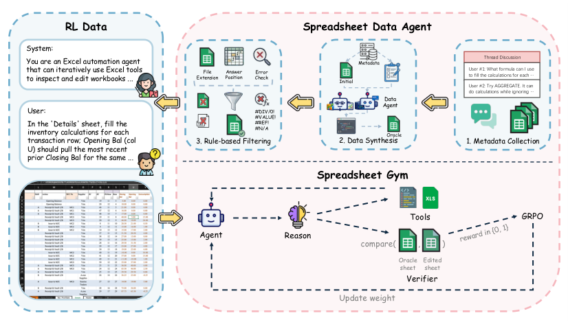
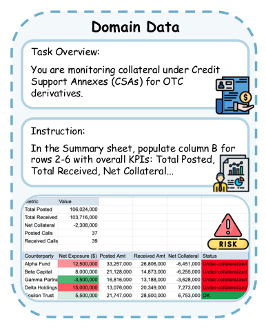
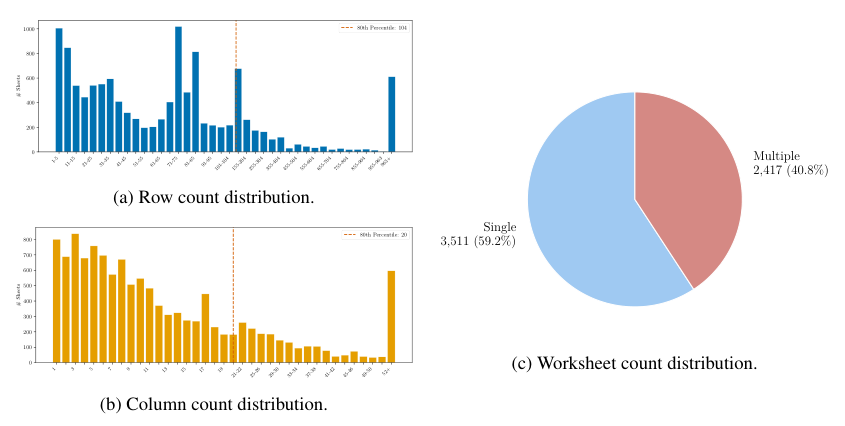
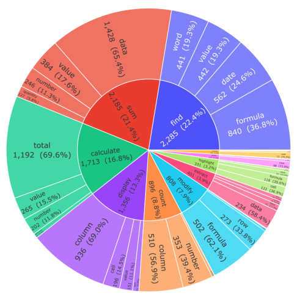
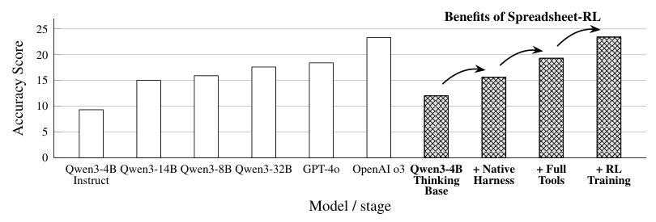
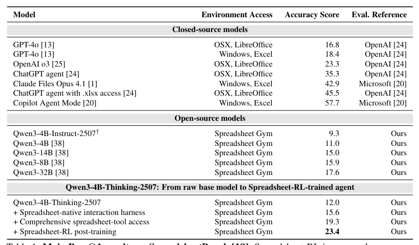
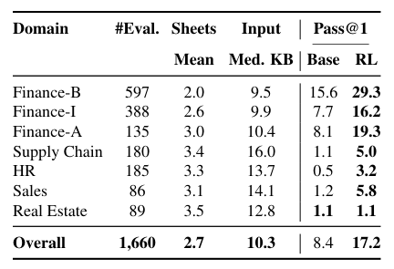
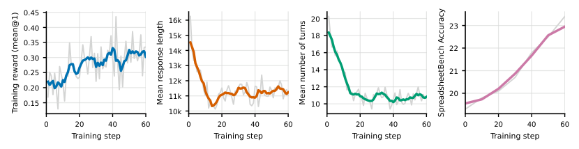
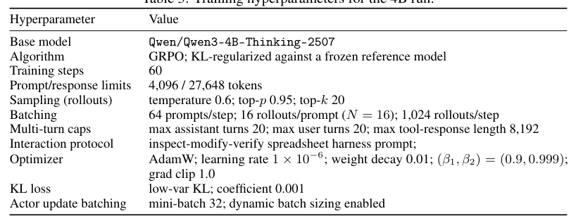

## 论文链接

- 原始论文页面：https://arxiv.org/abs/2605.22642
- PDF 下载：https://arxiv.org/pdf/2605.22642.pdf
- Hugging Face 论文页：https://huggingface.co/papers/2605.22642
- 项目主页：https://spreadsheet-rl.github.io/
- 开源代码仓库：https://github.com/Spreadsheet-RL/Spreadsheet-RL

Spreadsheet-RL：通过强化学习推进大语言模型智能体在真实电子表格任务上的能力

> 导读摘要：这篇论文的核心不是单独提出一种新的 RL 技巧，而是首次把“真实表格数据构建、Excel 原生交互环境、可验证结果奖励、端到端后训练”打通成一套完整基础设施，用来训练真正会操作电子表格的 LLM 智能体，并在通用与领域任务上显著提升表现。

## 一、这篇论文要解决的真问题

电子表格一直是现实工作流里最常见、也最被低估的数据接口之一。很多任务看起来只是“改几个单元格”，但真实场景往往不是这样：它们通常涉及多张工作表、长步骤依赖、公式与格式联动、查找与汇总混合，甚至还带有金融、供应链、人力资源等行业语义。

现有表格智能体大多依赖更强的通用 LLM 加上提示工程，能处理一些简单操作，但一旦进入真实的多步任务，问题就暴露出来了：  
一是缺少适合大规模训练的真实任务数据；  
二是缺少贴近真实 Excel 的交互环境；  
三是缺少便于 RL（强化学习）使用的、可自动验证的奖励机制。

作者的判断很明确：表格智能体的瓶颈，不只是模型“会不会推理”，而是**模型是否能在一个结构化、可执行、可反馈的表格环境中形成稳定策略**。因此，Spreadsheet-RL 试图把结果可验证的 RL 系统性引入电子表格智能体训练。

## 二、方法主线：把数据、环境、奖励和训练闭环打通

这篇论文的方法可以概括为三层闭环：

1. **自动构建真实表格任务数据**
2. **提供真实 Excel 风格的多轮交互环境**
3. **用结果对齐的奖励做 GRPO 后训练**

上图最值得注意的地方，不是某个单一模块，而是它把整个系统串起来了：从真实任务出发，先构造训练样本，再让策略模型进入可交互的 Spreadsheet Gym 环境执行操作，最后由验证器把最终结果与 oracle 目标表格比较，形成奖励信号，反向更新模型。也就是说，作者不是只训练一个“会说操作步骤”的模型，而是训练一个**真的能在环境里检查、修改、验证表格**的智能体。

### 2.1 任务形式化

作者沿用了表格任务的基本形式：每个样本包含初始表格、自然语言指令、目标表格，以及可用于奖励计算的操作区域信息。模型的目标不是直接生成答案文本，而是通过多轮交互执行一串表格操作，使最终工作簿状态尽量与目标结果一致。

这点非常关键。它意味着监督对象从“文本正确”转移到了“状态正确”。对于表格任务来说，这比普通问答更自然，因为最终用户关心的是工作簿是否被正确修改，而不是模型解释得多漂亮。

### 2.2 Spreadsheet Gym：面向长程任务的真实交互环境

作者构建了 Spreadsheet Gym，用来承载多轮 RL 训练。这个环境的核心特征有三点：

- 运行在真实 Excel 功能语义上，而不是简化的表格玩具环境
- 通过 Python 沙箱暴露丰富的表格操作能力
- 支持“检查—修改—验证”的多轮交互协议

也就是说，模型不需要一次性把整条解法全部说对，而是可以像真实用户一样先查看某些单元格、再写公式、再核对结果。对多步任务来说，这种交互式执行比单轮文本生成更符合问题结构。

### 2.3 奖励设计：结果可验证，而不是逐步标注

作者没有依赖昂贵的逐步人工轨迹，而是采用结果导向奖励。核心思想是：只要模型最终生成的表格状态足够接近 oracle 目标表格，就给出高奖励；否则给低奖励。

这类设计特别适合表格场景，因为很多操作结果都可以程序化比较，例如：

- 公式是否等价
- 单元格值是否一致
- 目标区域是否被正确编辑
- 错误值是否消除
- 多工作表状态是否对齐

这种“结果监督”让训练数据获取成本显著下降，也使得 RL 更容易扩展到真实工作流。

### 2.4 用 GRPO 做策略优化

在优化层面，作者采用 GRPO 做 on-policy RL 后训练。这里最重要的不是算法名本身，而是它与表格环境的组合：模型先在真实环境中 rollout，多轮调用工具并执行表格修改，再根据最终状态得到奖励。这样训练出的不是抽象的推理偏好，而是**面向环境交互的行动策略**。

换句话说，Spreadsheet-RL 的贡献更偏系统方法论：  
它证明了只要数据构造、环境设计和奖励验证三者足够扎实，中小开源模型也能通过 RL 学到更强的表格操作能力。

## 三、数据构建：真实任务从哪里来

论文的一大亮点，是没有把训练建立在纯合成任务上，而是尽量从真实来源自动收集和整理样本。作者设计了一个表格数据代理，从公开论坛和专业领域材料中抽取种子任务，再逐步构造成可训练的“初始—目标”表格对。

这张图展示了作者为什么要专门做 Domain-Spreadsheet 基准：真实任务并不只是“排序、求和、填充”这种通用动作，而是嵌在行业语境里。以金融风控为例，模型不仅要会操作表格，还要理解风险相关字段、汇总逻辑和判断规则。也因此，单靠通用提示工程往往不够，必须让模型在训练时接触这种带专业语义的真实任务。

### 3.1 种子任务收集

作者首先从高质量公开表格论坛中收集种子元数据。理想的种子任务通常包含：

- 用户提供的初始工作簿
- 清晰具体的任务描述
- 多轮讨论中的候选解法或中间解释

这些材料为后续自动构造 oracle 目标表格提供了条件。与从零开始人工编造题目不同，这种做法能较好保留真实用户问题分布。

### 3.2 用强代理构造 oracle 结果

对每个种子任务，作者借助强编码代理自动生成一串可执行表格编辑操作，从而得到目标工作簿。随后再通过规则过滤和验证流程，剔除错误样本，保留适合 RL 训练的高置信数据。

这一步很像“用强者生产可验证作业，再让待训练模型去学会完成作业”。它避开了人工逐步标注的高成本，同时保留了真实任务复杂性。

### 3.3 数据覆盖面

作者还专门统计了训练数据的规模与多样性。训练样本并不是只围绕特别小的表格展开，而是覆盖了不同的行数、列数，以及单工作表和多工作表任务。

这张图传达的信息很直接：训练数据不是只在“小而简单”的表格上刷题，而是覆盖了多种规模形态。尤其多工作表任务的存在很重要，因为很多真实 Excel 工作流都跨 sheet 协作，这正是简单 benchmark 容易忽略、但实际最影响 agent 能力的部分。

除了表格规模，作者还统计了任务中涉及的操作类型分布。

从这类分布可以看出，训练数据的主体围绕常见且可验证的表格操作展开，例如求和、查找、计算、列处理和修改等。这种设计很务实：既保证奖励可自动判断，又让模型在真实高频操作上学到稳定行为，而不是被少量花哨操作主导。

## 四、为什么这套方法有效：原生交互比提示工程更关键

论文一个很强的观点是：表格智能体的性能提升并不只是“RL 让模型更强”，而是**原生表格交互设计、完整工具访问、RL 后训练**三者逐步叠加的结果。

这张图非常适合把整篇论文的主线看清楚。右侧高亮的连续几根柱子，不应被理解成几个不同模型的横向比较，而应看成**同一个基础模型的四阶段演化**：从原始模型，到表格原生交互，再到更完整工具集，最后到 RL 后训练。性能是一步一步抬上去的。作者想说明的不是“换个更大模型就好了”，而是：**先让模型真正会用 Excel，再让它通过 RL 优化策略，收益才会释放出来。**

这一点也解释了为什么很多既有工作在简单任务上看起来还能用，但面对复杂工作流就失效。根本原因在于：

- 它们依赖自然语言描述操作，而非稳定的环境动作空间
- 它们缺少适配表格语义的工具调用协议
- 它们没有通过环境反馈学习长程决策

Spreadsheet-RL 的价值就在于把这些环节都工程化了。

## 五、实验结果：不只提升最终准确率，也提升交互效率

### 5.1 通用表格基准上的提升

作者在 SpreadsheetBench 上报告了主结果。对 Qwen3-4B-Thinking-2507，Pass@1 从 **12.0% 提升到 23.4%**。这说明即便基础模型规模不大，只要训练方式和环境设计对了，仍然能在复杂表格任务上得到明显增益。

这张结果表最值得看的不是全表排名，而是同一基座模型在“原生交互设计 → 完整工具访问 → RL 后训练”三步上的连续变化。它把方法拆成了可解释的模块，而不是只给一个最终分数，因此说服力更强。

### 5.2 领域表格上的泛化

论文还构建了 Domain-Spreadsheet 基准，覆盖金融、供应链、人力等更贴近工作场景的任务。结果显示，同一模型经过 Spreadsheet-RL 训练后，整体 Pass@1 从 **8.4% 提升到 17.2%**。

这个结果很重要，因为它说明方法并不只对通用 benchmark 有效，而是能迁移到带专业语境的真实任务中。对表格 agent 来说，这比单一公开榜单上的提升更有意义。

### 5.3 训练过程中的行为变化

作者不仅报告最终成绩，也分析了训练动态。

从训练曲线可以看到，准确率随 RL 训练推进持续改善；同时，奖励、回复长度、交互轮数等中间量也在变化。它们共同表明，模型不是单纯“输出更长了”，而是在逐步学会更合适的交互方式与执行节奏。这类证据对于 agent 论文尤其重要，因为它说明模型学到的是策略改进，而不只是表面文本模式。

## 六、补充信息：训练配置与可复现性

这篇论文另一个加分点，是把系统工程细节也公开得比较完整，包括训练流程、环境、数据与配置。对于 4B 基座模型，作者还整理了训练配置概览。

这类配置表虽然不直接证明方法有效，但能帮助读者判断结果是否可信、是否可复现。尤其在 agent + RL 任务里，很多性能差异都可能来自 rollout 规模、交互轮数限制、优化稳定性设置等工程选择；把这些前提讲清楚，本身就是论文成熟度的一部分。

## 七、如何理解这篇论文的真正贡献

如果只看数字，这篇工作是“一个表格 RL 框架，把两个 benchmark 的 Pass@1 提高了一倍左右”；但如果从方法论看，它更大的贡献在于建立了一条可扩展路线：

- **用真实来源自动构造表格任务，而不是只靠纯合成数据**
- **让模型在真实表格语义环境里学习，而不是只在文本空间里模仿**
- **用最终结果做奖励，避免逐步标注的高成本**
- **把表格原生工具协议设计成训练的一部分，而非只做推理时外挂**

因此，Spreadsheet-RL 更像是“表格智能体的开源训练基础设施”，而不只是一个局部技巧。它说明，对于与真实软件、数据接口深度耦合的 agent 任务，真正决定上限的往往不是更长的 prompt，而是**环境、动作空间、奖励和数据闭环是否成立**。

## 八、局限与值得继续追问的问题

论文已经把很多基础工作补齐，但也留下了几个自然问题：

- 目前结果虽有显著提升，但绝对数值仍不高，说明真实表格任务依然很难。
- 奖励主要基于最终结果对齐，这对部分需要中间语义判断的任务可能仍有盲区。
- 训练数据虽来自真实来源，但 oracle 构造仍依赖强代理，代理偏差可能会传递到训练分布中。
- 当前环境围绕 Excel 工作流设计，未来是否能迁移到更广泛的数据界面，如 BI 工具、数据库前端、协作文档表格，值得继续验证。

## 九、一句话总结

Spreadsheet-RL 证明了一件很实际的事：**要把 LLM 训练成真正能完成复杂电子表格工作的智能体，关键不是继续堆提示词，而是给它真实任务数据、原生交互环境、可验证结果奖励，再用 RL 把这些连成闭环。**
