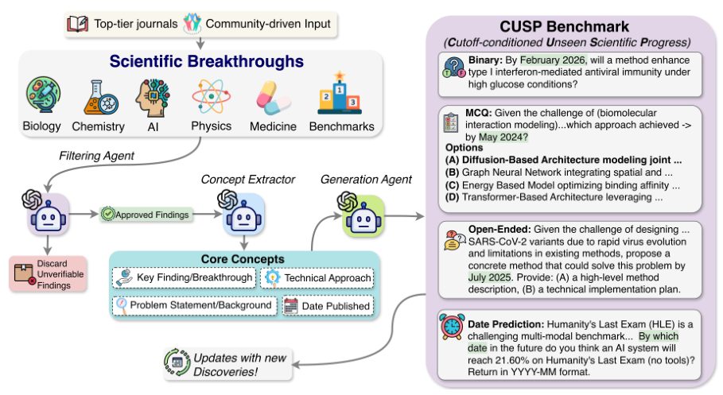
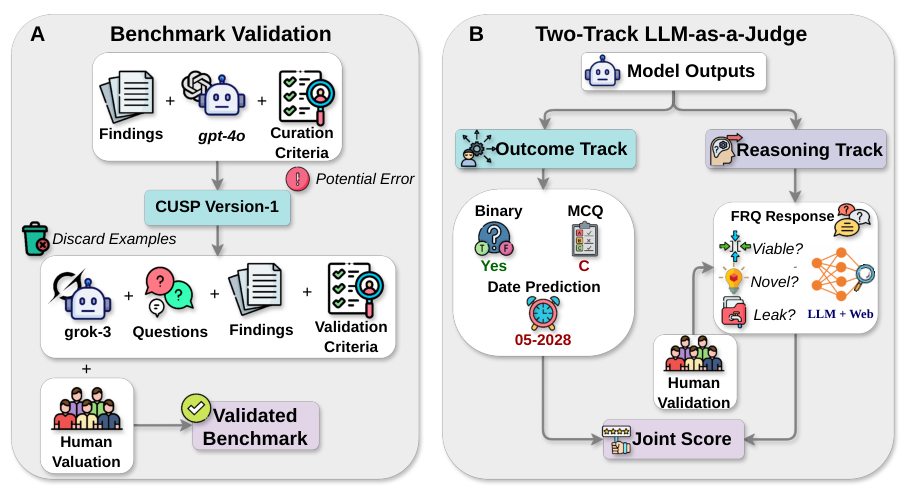
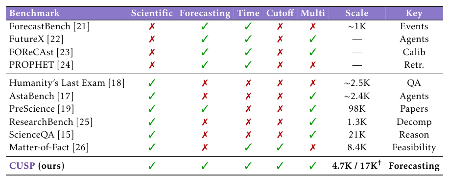
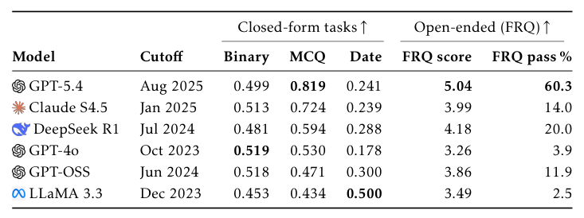
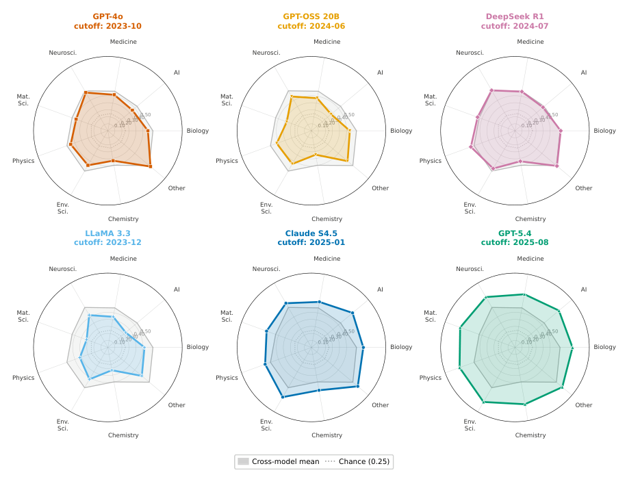
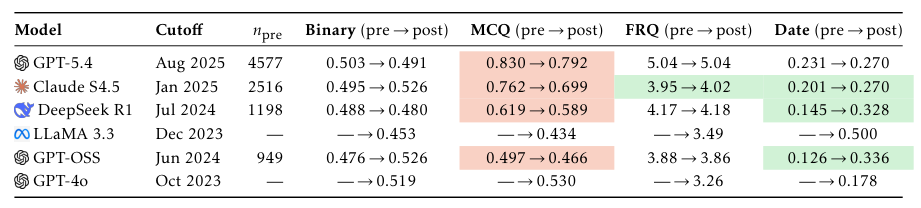
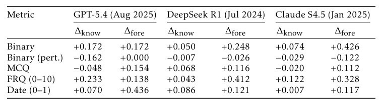
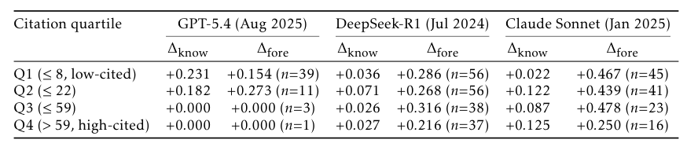
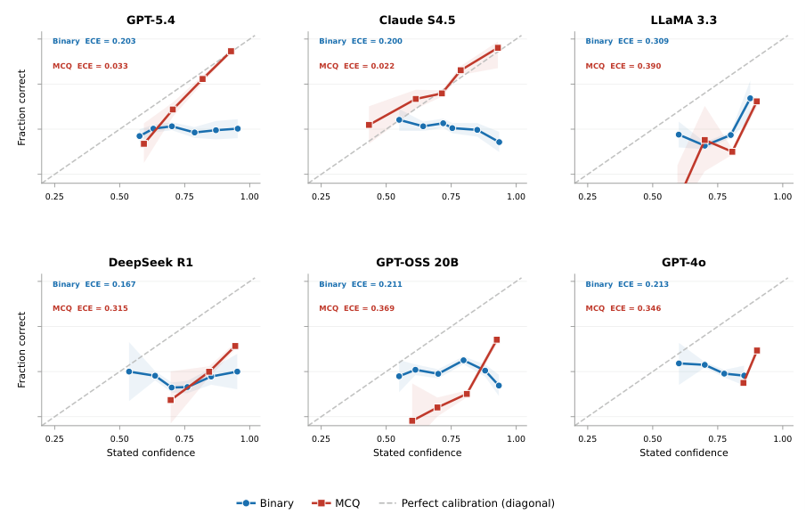
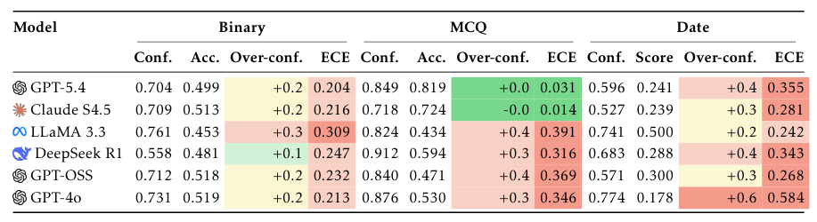

## 论文链接

- 原始论文页面：https://arxiv.org/abs/2605.22681
- PDF 下载：https://arxiv.org/pdf/2605.22681.pdf
- Hugging Face 论文页：https://huggingface.co/papers/2605.22681
- 项目主页：https://seanwu25.github.io/CUSP-Science/

用人工智能预测科学进展

> 导读摘要：这篇论文的重点不是提出一个更强的新模型，而是提出一个更严格的评测框架 CUSP，用来检验大模型是否真能在给定时间截点下预测尚未发生的科学进展。作者把“科学预测”拆成可行性判断、机制推理、方案设计和时间预测四类能力，并在 4760 个真实科研里程碑、17429 个结构化任务上系统评估前沿模型。结论相当鲜明：模型能从候选方向里识别“看起来合理”的研究路径，却难以可靠判断突破会不会真正发生、何时发生，以及应采取什么真正有效的方法。

## 问题到底难在哪：评测“预测”而不是“复述”

论文要回答的问题很直接：当大模型越来越深地介入科研流程时，它们是否真的具备**前瞻性科学预测**能力，而不只是擅长事后解释、知识检索或模式匹配。

难点在于，这件事很容易被“信息泄漏”污染。如果一个模型已经在训练数据里见过事件发生后的论文、综述、术语甚至社区叙事，那么它在测试里给出的“预测”，很可能只是回忆或拼接，而不是在有限信息下做出的前瞻判断。作者因此把核心问题重新定义为：**在严格时间截断下，模型是否还能预测尚未实现的科学进展**。

这也是 CUSP（时间截断条件下的未见科学进展）的出发点。它不把任务停留在普通科学问答，而是把评测锚定到**带时间戳、可验证、真实发生过的科研里程碑**上。

上图展示了整套基准的主线：左边是如何从顶级期刊、社区来源和榜单记录中收集科研突破，右边是如何把这些事件改写成四类预测任务。读这篇论文时，这张图最值得看的不是来源细节，而是作者如何把“未来不可见”落实到数据构建流程里，把分散的科研成果变成可持续更新、可验证、带时间约束的评测样本。

## 方法核心：CUSP 如何被构建出来

方法上，论文最大的贡献是把“科学进展预测”从抽象命题，压缩成一套可操作的数据工程与任务设计流程。

作者先汇聚来自顶级期刊和社区驱动来源的 4760 个科研里程碑，覆盖 2024 年 1 月到 2026 年 3 月，涉及九个顶层学科、4245 个细分主题。每个事件都绑定明确的时间参考，用来界定模型在某个时刻“应当知道什么、不应知道什么”。随后，作者将每篇摘要拆成三个结构化部分：**问题、技术路线、结果总结**，再基于这些部分生成评测任务。

CUSP 最关键的设计，是把科学预测拆成四个互补维度：

1. **可行性判断**：某个具体科研声明是否会实现。
2. **机制推理**：在若干候选技术路径中，识别后来真正促成突破的方法。
3. **生成式方案设计**：根据问题背景提出具体解决策略。
4. **时间预测**：预测某个里程碑何时会实现。

这样一来，论文不是只问“你知不知道答案”，而是分别考察模型是否会判断、会解释、会设计、会估时。

这张图对应方法实现层面更重要的一点：CUSP 不是简单自动生成题目，而是采用**两阶段验证**。先用独立模型按规则过滤和检查任务，再结合人工专家复核，尽量确保题目既忠实于原始科研摘要，又不含无效扰动或时间泄漏。这一步非常关键，因为如果任务构造本身不可靠，后续所有“预测能力”结论都会失去解释力。

## 为什么这个基准比现有工作更严格

作者专门把 CUSP 和相关基准做了结构性对比，强调它不是普通科学 QA，也不是泛化的现实世界预测。

从这张对比表可以看出，CUSP 的独特之处在于它把几个过去常常分散存在的要求合在一起：既要求**科学事件锚定**，又要求**严格时间截断**，还要求**多任务评测**和**多学科覆盖**。这意味着它评测的不是某种局部能力，而是“在受限知识条件下，对科学进展做前瞻判断”的复合能力。

这点很重要。很多已有工作要么评估一般科学推理，要么评估新闻、市场、地缘政治类预测；前者缺乏真正的未来事件约束，后者又未必落在可验证、可复验的科研事件上。CUSP 则试图把这两者接起来：既保留预测问题的时间性，又保留科学问题的可验证性。

## 实验结果：模型会“识别合理”，不会“可靠预见”

整体实验结论可以概括成一句话：**当前模型更像是在做科研方向识别，而不是在做可靠的科学预测。**

总表显示，模型在封闭式任务上通常只是略高于随机水平，开放式任务也没有展现出稳定、全面的优势。论文最关心的不是谁排第一，而是这些“最好成绩”是否已经达到能支撑真实科研预测的程度；答案显然是否定的。

进一步看学科分布，模型表现非常不均衡。

这组雷达图说明两件事。第一，模型在不同学科上的能力差异很大，说明“科学预测”不是单一能力。第二，即使在多选式机制识别上整体高于随机，这种优势也并不自动迁移到更难的可行性判断和时间预测。换句话说，模型能从多个候选方案里认出“哪个听起来最像正确路线”，但这不等于它能判断这条路线最终会不会成功。

论文摘要里有一个很有分量的发现：模型在判断**何时发生**上，往往系统性地把时间估得更晚；在判断**会不会发生**上，则常接近随机。这说明模型并不是简单缺一点细节知识，而是缺少将已有知识转化为前瞻判断的机制。

## 这些失败是不是因为“没见过”答案

作者专门做了一个很重要的控制分析：把样本按训练截点前后分组，检查模型在“截点前已存在”和“截点后新出现”的事件上是否有显著断崖。

结果很耐人寻味：多数任务上，截点前后并没有出现那种压倒性的性能落差。这意味着模型的薄弱点，不能简单归因于“训练时没见过这些事件”。也就是说，问题不只是知识覆盖不足，更是**即便给了可用知识，模型也不太会把它组织成可靠预测**。

这个结论在后面的“知识差距/预测差距”分析里被进一步拆开。

作者把收益分成两部分：补充更多截点前知识带来的提升，以及加入事后信息带来的额外提升。前者可以看作“知道得更多”的收益，后者更接近“拿到结果后变得更会回答”的收益。结果表明，额外的截点前知识确实能改进表现，但无法弥合与完整信息设定之间的差距；模型明显更受益于事后信息，而不是前瞻推断本身。

按论文影响力进一步分组后，这种现象更明显。

高引用、潜在高影响的科研突破并没有因为“线索更多”就变得更容易被提前预测。相反，这类事件上的预测缺口往往更大。换句话说，越是重要的突破，模型越难真正提前判断。

## 不只是分低：模型还不知道自己什么时候不可靠

如果把 CUSP 当作未来科研助手评测，另一个关键问题是：模型的置信度能不能信。

这张校准图和对应统计表都指向同一结论：模型普遍存在**过度自信**，而且在不同任务上校准都不稳定。对科学预测这种高风险用途来说，这比“答错”本身更严重，因为系统可能把不确定判断包装成高把握结论。

表中的过度自信指标和校准误差说明，模型不仅整体准确率有限，而且对自己的判断缺乏可靠的误差感知。于是，哪怕某个模型在局部任务上分数更高，也不代表它适合作为真实科研决策工具，因为它未必知道自己什么时候应该保留意见。

## 可以带走的结论

这篇论文最值得记住的，不是某个模型赢了几分，而是它把“AI 能否预测科学进展”这个问题，第一次放进了一个足够严格的评测框架里。

可以把结论浓缩成三点：

- **CUSP 的核心价值在评测设计**：它把时间边界、可验证科研事件和多任务能力拆解放进统一框架，真正区分了知识访问与前瞻预测。
- **当前模型更擅长识别合理方向，不擅长可靠预测结果**：尤其在“是否会实现”和“何时会实现”上仍然明显偏弱。
- **知识更多不等于预测更强**：补充截点前知识有帮助，但无法填平与完整信息之间的差距，说明知识调用与科学预见之间存在本质鸿沟。

如果要用一句话概括：这篇论文并没有证明 AI 已经会预测科学未来，恰恰相反，它更严谨地说明了——**当前 AI 离真正可用的科学预测工具，还有相当长的距离。**
