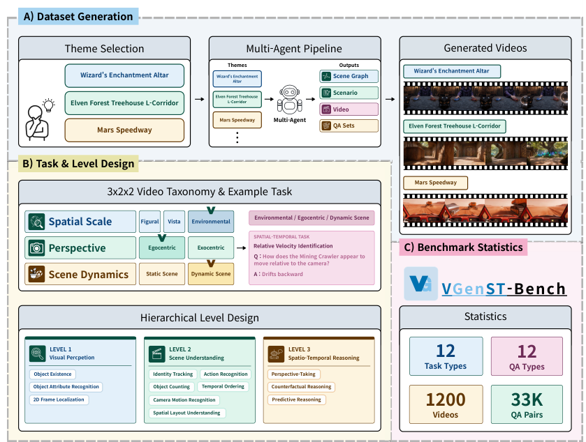
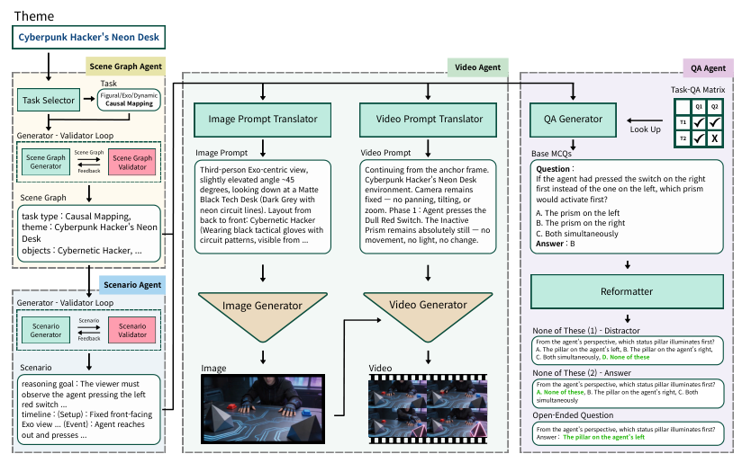
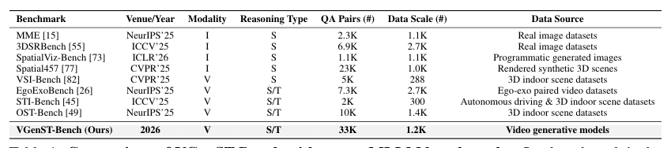
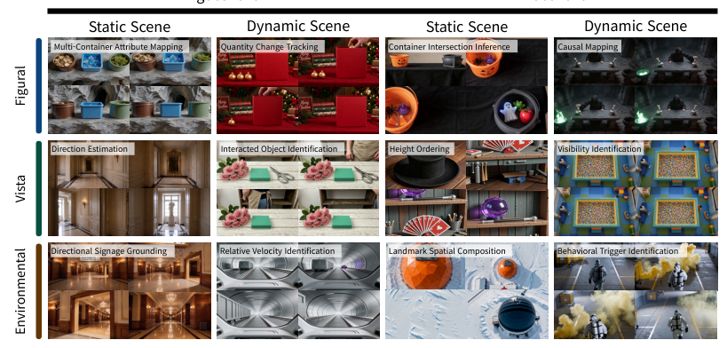
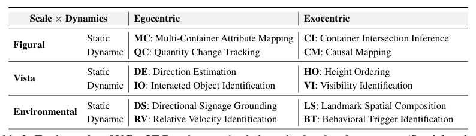
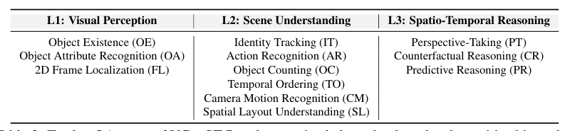
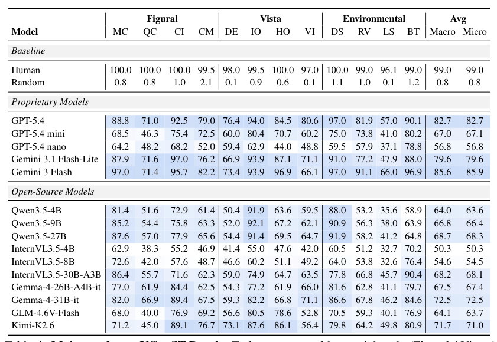
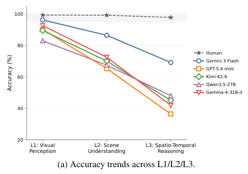
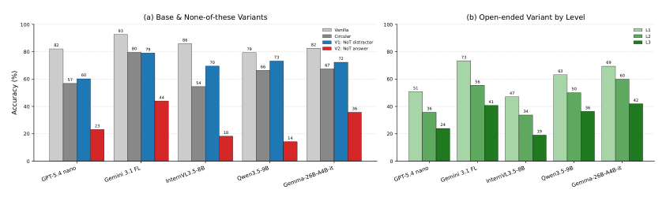
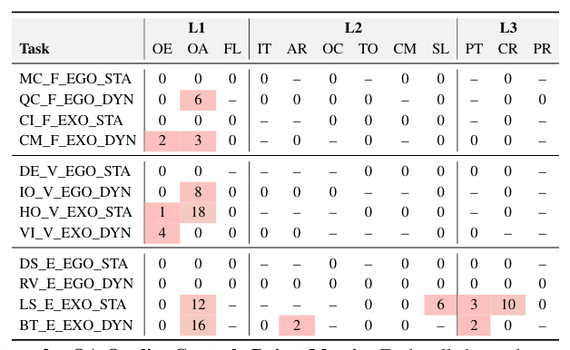

## 论文链接

- 原始论文页面：https://arxiv.org/abs/2605.22570
- PDF 下载：https://arxiv.org/pdf/2605.22570.pdf
- Hugging Face 论文页：https://huggingface.co/papers/2605.22570
- 项目主页：https://zinosii.github.io/VGenST-Bench/
- 开源代码仓库：https://github.com/zinosii/VGenST-Bench

VGenST-Bench：一个通过主动视频合成评测时空推理能力的基准

> 导读摘要：本文提出 VGenST-Bench，用多智能体主动合成视频、场景图与问答对，构建面向多模态大语言模型的分层时空推理评测基准。

## 这篇论文在做什么

这篇工作想解决一个很实际的问题：**现有多模态模型的“视频理解”评测，往往测到的是静态识别或表面线索，而不是更难的时空推理能力**。  
作者认为，如果仍然依赖被动收集的视频数据，评测就会受到数据污染、题目偏置、场景覆盖不足等问题影响，难以真实反映模型上限。

于是他们提出了 **VGenST-Bench**：不是从现成视频里挑题，而是**主动合成**一套可控、覆盖广、层次清晰的视频时空推理基准。

---

## 方法主线：从“收集数据”变成“设计数据”

论文的方法核心，是一条多智能体流水线：

1. **Scene Graph Agent**：先生成场景图，明确对象和空间关系  
2. **Scenario Agent**：把场景图扩展成带时间线的事件脚本  
3. **Video Agent**：据此合成视频  
4. **QA Agent**：围绕视频生成问答对  
5. **人工质检**：再做最终筛查，保证视频与问题匹配

这意味着，数据不是“碰巧存在”，而是**被设计出来**，特别适合做诊断式评测。

---

## 三维任务组织：3×2×2 的视频推理税onomy

VGenST-Bench 的另一个关键设计，是把任务系统地拆成一个 **3×2×2** 的结构：

- **空间尺度**：  
  - Figural（局部/单帧层面）
  - Vista（场景层面）
  - Environmental（环境层面）

- **视角**：  
  - Egocentric（自我视角）
  - Exocentric（他者/外部视角）

- **场景动态**：  
  - Static（静态）
  - Dynamic（动态）

三维组合后，形成 **12 类任务**，每个格子都对应一个专门设计的推理题型。

---

## 三层问答：把“会看”与“会推理”分开

论文还把题目分成 **L1 / L2 / L3** 三层：

- **L1：视觉感知**  
  主要考单帧里看见了什么、有什么属性

- **L2：场景理解**  
  需要跨帧整合信息，理解对象关系、位置变化、场景组织

- **L3：时空推理**  
  更难，包含预测、反事实、视角转换、关系演化等

这套分层设计很重要，因为它能回答一个问题：  
**模型到底是“看得见”，还是“真会推理”**。

---

## 结果说明了什么

实验结果显示：

- 当前最强模型在 VGenST-Bench 上依然**明显落后人类**
- 几乎所有模型都存在从 **L1 到 L3 持续下滑**
- 也就是说，模型在基础视觉感知上还行，但在**高阶时空整合、反事实推理、预测推理、视角转换**上短板很明显

鲁棒性实验进一步表明：  
如果不控制题型偏置和选项模板，模型分数容易被高估；而 VGenST-Bench 能更真实地暴露模型能力上限。

---

## 图表怎么读

### 图2：基准构建流程
这张图展示了整个数据生成流水线：从主题到场景图、场景脚本、视频，再到问答和质检。  
它强调的重点不是“结果”，而是**基准如何被主动造出来**。

### 图3：12 类任务样例
图中把 12 类任务放进统一的 3×2×2 框架里，按空间尺度、视角和动态属性组织。  
它证明这不是零散样例，而是一个系统设计的任务空间。

### 图4：方法总览
这张图把数据生成与 QA 质检流程串起来，说明作者不仅生成题目，还会**筛掉不可靠样本**。  
这是保证评测可信度的关键。

### 图5：分层任务下的性能下滑
图里最重要的信息是：  
**模型层级越高，准确率越低；人类始终接近上限。**  
这直接支撑了论文关于“真正难点在高阶时空推理”的判断。

### 图6：鲁棒性分析
这张图说明，一旦题型变体增多，很多模型分数都会明显下滑。  
它揭示了：传统多选题准确率可能高估真实能力。

### 表1：与已有基准的对比
这张表强调 VGenST-Bench 的独特性：它是**首个面向视频时空推理、且由视频生成模型主动合成**的评测基准。

### 表2：12 类任务组织方式
表2展示了 12 个任务如何按三维 taxonomy 编排。  
它的意义在于：评测不再只看“答对多少”，而是看**哪种能力出问题**。

### 表3：12 类问答设计
表3把 L1/L2/L3 的题型映射得更清楚，体现出分层认知设计：  
从“看见什么”到“理解什么”，再到“推断什么”。

### 表4：主结果
表4汇总了各类模型在 VGenST-Bench 上的表现。  
结论很明确：**强模型虽领先开源模型，但离人类仍有稳定差距**。

### 表12：QA 质检的拒绝分布
这张表说明作者做了严格的人工筛查，不是把自动生成结果直接拿来用。  
这保证了基准更可信，也解释了为何它比普通合成数据更适合评测。

---

## 一句话总结

**VGenST-Bench 的核心贡献，不是“又做了一个更大数据集”，而是把视频时空推理评测从被动收集，推进到主动合成、分层诊断与鲁棒验证。**

## 補充圖示

### VGenST-Bench 的构建流程与任务设计

这张图说明作者是怎么造出这个视频时空推理基准的：先选定多个不同场景主题，再用多智能体流程生成视频、场景图和问答，最后组织成一个覆盖视觉感知、场景理解和时空推理的分层任务集。右下角还给出规模信息，强调它不是零散样例，而是一个有系统设计的大型评测集。

重点不在单个例子，而在它把视频评测从“静态看图”推进到“主动合成、分层评测”的设计上，这让时空推理能力更容易被细粒度地测出来。

### VGenST-Bench 构建流程图

这张图说明作者如何把一个主题，拆成图像、视频和问答三类输入，再经过生成器与校验器反复筛选，最后做成用于评测时空推理的基准数据。重点是它不是结果展示，而是“数据集怎么造出来”的流程。

它强调评测不是随便找视频问问题，而是要有受控、覆盖广、能检查时空理解能力的数据，这决定了后面的测试是否可信。

### 视频空间-时间推理基准的对比概览

这张表是在说明：VGenST-Bench 相比已有基准，更专门针对“视频里的空间 + 时间推理”设计。它把不同基准按模态、题型、规模和数据来源放在一起对照，重点突出我们的基准来自视频生成模型，而不是沿用静态图像或少量人工整理数据。

它说明本文不是简单做一个更大的数据集，而是在补齐现有评测主要偏静态、难以检验时空理解的缺口。这样后面的模型比较才更有说服力。

### 12类时空推理任务的样例版图

图中把基准的12类任务放进一个统一的3×2×2框架里：按空间尺度分行，再按视角与场景是否动态分列。每个小格都配一个代表性视频任务，说明这个基准不是随意收集案例，而是在系统覆盖不同类型的时空推理情境。

这幅图帮助读者快速把握方法设计的核心：作者先定义清晰的任务空间，再为每一类生成可控视频进行测试。这样做能更有针对性地诊断模型到底是不会看、不会理解场景，还是不会做真正的时空推理。

### 十二类时空推理任务的组织方式

表中把基准测试的 12 个任务放进一个 3×2×2 的框架里：按空间尺度、观察视角和场景是否动态来划分。重点不在单个任务名称，而在于作者用这套结构系统地覆盖不同类型的视频推理情境。

这张表说明方法设计不是随意拼任务，而是先定义场景维度，再为每种组合配一个专门任务。这样做能避免评测只集中在少数简单情形，也更容易定位模型究竟是在哪一种时空理解能力上出问题。

### 三层级问答设计

表格把基准中的 12 种问答类型整理成一个三层认知结构：从基础视觉感知，到场景理解，再到更高阶的时空推理。它想强调的不是题目数量，而是方法上如何把“看见什么”和“真正推断什么”分开设计。

这张表说明该基准不仅在收集视频题目，更在刻意控制“题目考的是哪一层能力”。这样的分层设计有助于分析模型究竟是卡在感知、场景整合，还是高阶时空推理上。

### 主结果：不同模型在时空推理任务上的整体表现

表4汇总了各类模型在 VGenST-Bench 上的主结果，任务按 Figur​al、Vista、Environmental 三类场景组织。整体看，领先的闭源模型明显强于多数开源模型，但距离人类表现仍有稳定差距。

这张表回答的是：现有多模态模型在细粒度时空推理上到底做到什么程度。结果说明，基准并不饱和，模型虽然已有明显能力，但在跨视角、动态场景和组合推理上仍有改进空间。

### 分层任务下的性能下滑

图中把题目分成 L1、L2、L3 三层：从基础视觉感知到更高阶的时空推理。可以看到，模型在层级越高时准确率越低，而人类表现始终接近满分，说明真正困难的部分不在“看见”，而在“跨时间和空间地推断”。

这张图直接支撑了论文的分层设计是有效的：它能把“会识别画面”与“会做时空推理”区分开。结果也表明，当前模型即使在基础题上不错，到了需要整合运动、视角和关系的任务时仍有明显短板。

### 鲁棒性分析：题型一变，模型成绩就明显下滑

图6检验的不是模型平时能答多高分，而是它在题目形式变化后是否还能稳定作答。结果很一致：基础选择题里一旦加入“以上皆非”等变体，尤其是 V2，几乎所有模型都会明显掉分；开放式评测里，难度从 L1 升到 L3 时也普遍持续下降。

这说明单看普通多选题准确率，容易高估模型的真实能力，因为模型可能依赖题型惯性或表面线索。对这个基准来说，真正困难的部分不是看见物体本身，而是在题目改写或推理层级提高后，能否保持稳定判断。

### 第二阶段问答质检的拒绝分布

这张表统计的是第二阶段人工质检里，哪些任务与题型组合更容易被判定为不合格。数字越大，说明该类问答更难稳定生成；横线表示该任务本来就不生成这种题型。

这张表补上了数据构建中很关键的一环：不仅生成问答，还系统地淘汰不可靠的问答。它说明作者的基准并非直接使用自动生成结果，而是通过分类型质检控制噪声，从而让后续评测更可信。
