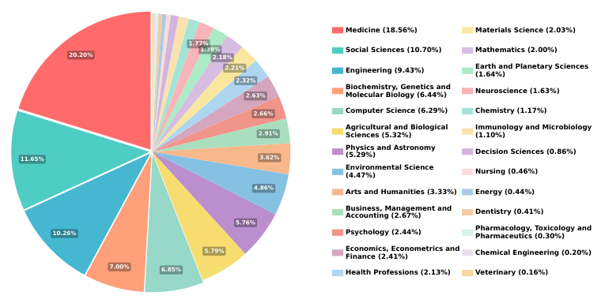
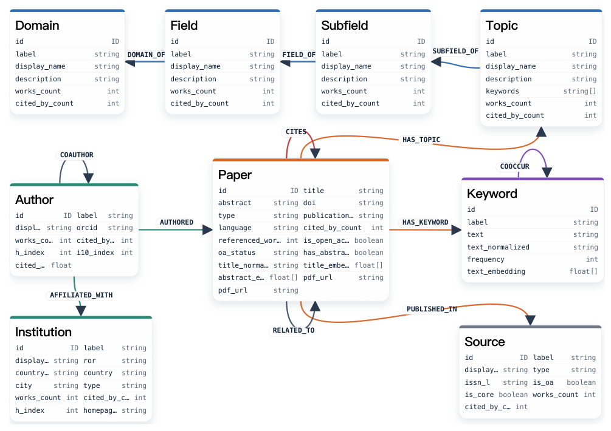
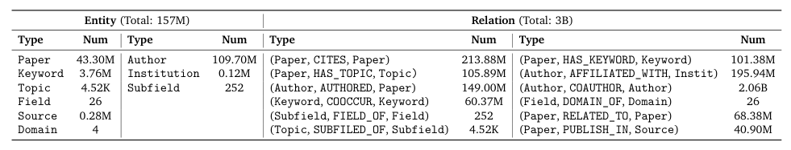
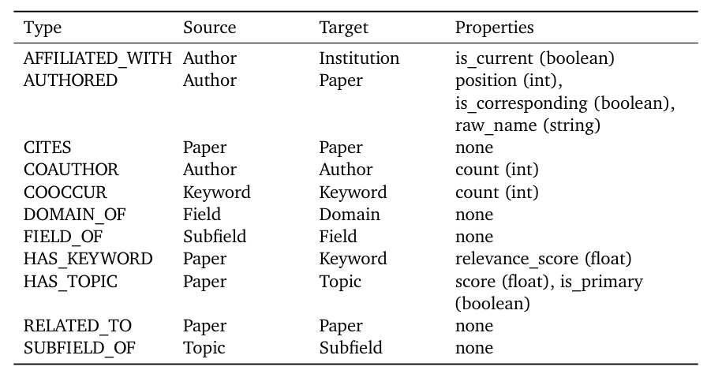
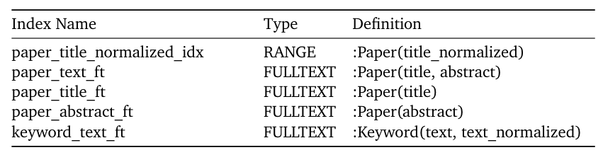
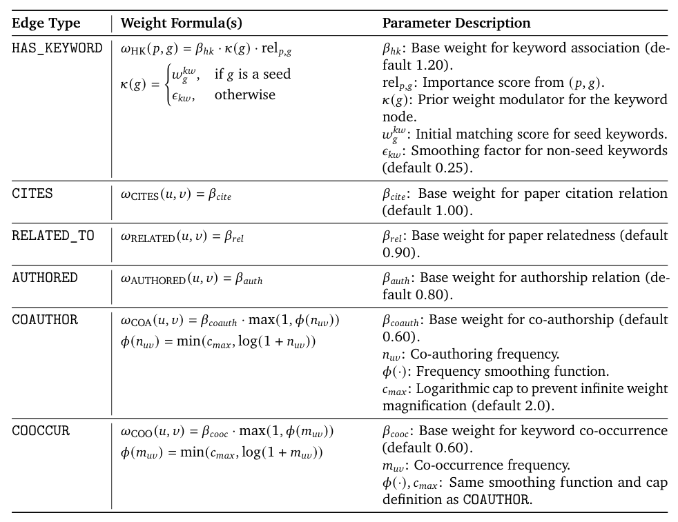
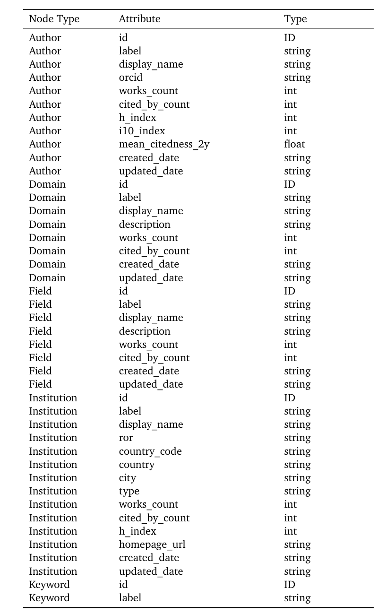
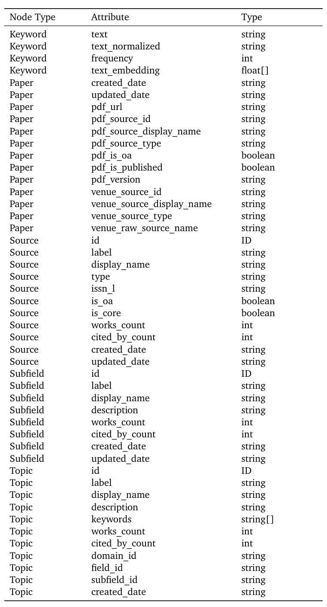
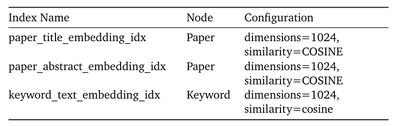

## 论文链接

- 原始论文页面：https://arxiv.org/abs/2605.22878
- PDF 下载：https://arxiv.org/pdf/2605.22878.pdf
- Hugging Face 论文页：https://huggingface.co/papers/2605.22878

SciAtlas：面向自动化科学研究的大规模知识图谱

> 导读摘要：SciAtlas 把分散的学术论文、作者、机构、关键词和学科层级组织成一个可计算的多层异构知识图谱，并在此基础上设计了低成本、可解释的神经符号检索方法，用于支持跨学科发现、趋势综合与自动化科研。

## 一、为什么要做 SciAtlas
随着学术产出爆炸式增长，研究知识越来越碎片化，传统检索工具主要依赖关键词或向量语义相似度，很难真正支持跨实体、跨层级的深层关联发现。  
作者想解决的核心问题，不是“再做一个更大的论文库”，而是给自动化科研提供一张能推理的“认知地图”。

## 二、SciAtlas 先解决了什么数据问题
SciAtlas 以 OpenAlex 为基础，构建了一个覆盖 26 个学科、超过 4300 万篇论文、157M 实体和 30 亿条三元关系的学术知识图谱。  
这里最关键的是：它不只存论文文本，还显式保存论文、作者、机构、关键词、主题、子领域、领域、域、来源等 9 类实体，以及 12 类关系。

这张图展示了学科覆盖分布：SciAtlas 的数据并不集中在单一领域，而是同时覆盖医学、社会科学、工程、计算机等多个学科，说明它的设计目标本来就是跨学科知识组织。  
理解这张图时，可以把它看成“底层资源的广度证明”——如果数据本身不够跨学科，后面的检索与推理也很难成立。

## 三、知识图谱是怎么搭起来的
构建流程可以概括为三步：抽取、清洗、重构。

第一步，系统从 OpenAlex 中抽取论文、作者、机构、关键词、主题等多种实体；随后标准化名称、过滤噪声、去掉缺少关键属性的对象，并避免作者名重复造成歧义。  
第二步，系统为这些实体建立关系边，重点包括论文—作者、论文—引用、作者—机构、论文—关键词，以及论文到主题/子领域/领域/域的层级映射。  
第三步，系统为不同节点补充属性信息，使其不仅“能连边”，还“能检索、能排序、能参与推理”。

这张结构图是全文的方法核心：左边是实体类型，右边是关系类型，中间串起了论文、作者、机构、关键词与学科层级。  
读它时不要死记每个字段名，更重要的是看出 SciAtlas 的建模方式——它把“文献库”升级成了一张可计算、可传播的关系网络。

## 四、检索方法：神经符号检索怎么做
SciAtlas 的方法不是单靠大模型，也不是单靠图算法，而是把两者结合成一个分层检索流程。

首先，LLM 负责从查询中提取关键词，并辅助把自然语言问题变成更适合检索的结构化意图。  
然后，系统同时用三种方式召回候选：精确匹配、向量匹配和标题匹配，保证既能抓到显式词项，也能抓到语义近邻。  
接着，系统在图上做局部子图扩展和带重启随机游走，让候选节点沿着论文—作者—关键词—主题这些高价值路径继续传播。  
最后，系统把初始语义相关性、图结构支持度、论文影响力联合打分，得到最终排序。

这张表体现了 SciAtlas 的索引与召回设计：论文标题、摘要、关键词分别对应不同索引入口，支持精确检索、全文检索和向量检索。  
方法上最值得注意的是，它先把“找得到候选”这一步做细，再交给后面的图传播和重排序去做深层推理。

这里展示的是 Neo4j 中关系类型的设计。你可以先看 `Source` 和 `Target`，理解一条边到底连接哪两类对象；再看 `Type`，理解这条连接的学术含义；最后看 `Properties`，把它当作边的补充标签，比如作者顺序、通讯作者、关键词相关分数等。  
这说明 SciAtlas 不只是连边成图，而是给边也加了可计算的语义层。

这张表是节点索引配置：论文和关键词节点都配置了向量索引，向量维度为 1024，距离度量使用余弦相似度。  
它的意义在于：系统先用向量相似性做粗召回，再把结果送入后续图推理流程，形成“语义召回 + 结构推理”的组合。

这张表解释了边权重如何编码关系强弱。不同关系类型有不同权重公式，核心思想是：直接证据更重要，高频共现会加分，但增幅会被限制，避免少数超强连接主导结果。  
换句话说，检索质量不只取决于“有没有边”，还取决于“这条边在传播时有多重要”。

## 五、实验结论说明了什么
论文表明，SciAtlas 能作为自动化科研的基础认知底座，支持文献综述、研究趋势综合、想法定位和学术轨迹探索等下游任务。  
作者强调，整套检索流程可在约两分钟内完成，显著低于反复依赖 LLM 的深度搜索方案，同时仍保留较强的深层关联发现能力和可解释性。

这张图对应 SciAtlas 的整体 schema：它把论文、作者、机构、关键词、主题、子领域、领域和域组织成分层网络。  
如果要抓住一条主线，就把它理解为：SciAtlas 不是在做“论文检索”，而是在做“学术知识的组织与推理基础设施”。

## 六、这篇工作的真正贡献
1. 把学术检索问题转成了跨层级图推理问题。  
2. 用大规模异构知识图谱把碎片化学术资源整合成可计算结构。  
3. 用神经符号检索把语义召回、图传播和重排序连接起来，兼顾效率、解释性与扩展性。  
4. 给自动化科研提供了可复用的基础设施，而不只是一个单点工具。

## 七、一句话总结
SciAtlas 的核心价值，不是“收录更多论文”，而是把分散的学术资源组织成一张能支持推理的多层异构知识图谱，让自动化科学研究真正有了可计算的认知底座。

## 補充圖示

### SciAtlas节点属性表示例

这是一张模式设计表，用来说明 SciAtlas 里不同节点类型各自保存哪些属性。重点不是具体数值，而是作者、机构、领域、关键词等对象都被整理成统一且可计算的结构化记录。

方法上，这张表说明 SciAtlas 不是只连边成图，而是给节点补充了可检索、可排序、可推理的属性层。这样的设计让后续检索、重排序和跨学科关联发现有稳定的数据基础。

### 节点属性设计示例

这部分表格列出 SciAtlas 中几类节点的属性字段，包括 Keyword、Paper、Source、Subfield 和 Topic。重点不在具体值，而在说明知识图谱把论文、来源与学科主题都整理成了可检索、可计算的结构化对象。

这张表反映了方法设计的基础：图谱不是只存“有哪些节点”，而是为不同节点配了足够丰富的属性。这样后续才能同时支持关键词匹配、语义检索、图结构关联和跨学科分析。

### 向量索引配置

这里列的是 SciAtlas 在图数据库里为语义检索准备的向量索引。重点不在具体表项本身，而在于系统把论文标题、摘要和关键词都预先编码成向量，作为后续召回入口。

这张表说明 SciAtlas 不是只靠图结构，也保留了现代语义检索的底座。方法设计上的意义在于把非结构化文本先变成可检索表示，再与知识图谱结合，兼顾召回能力和结构化推理能力。
