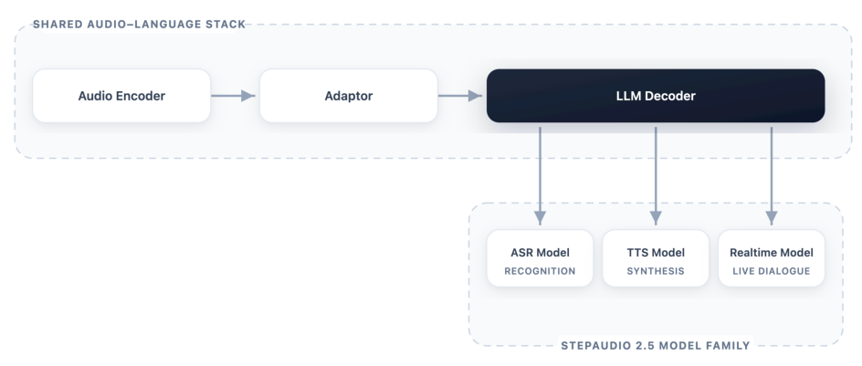
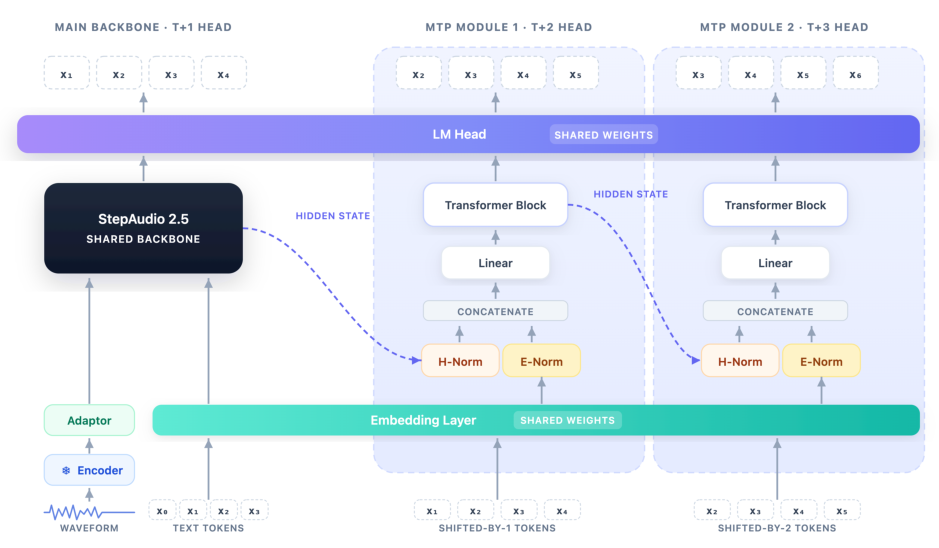
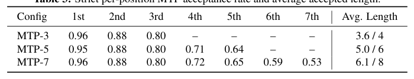
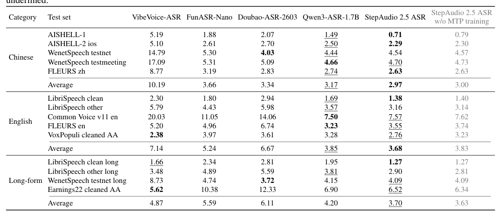
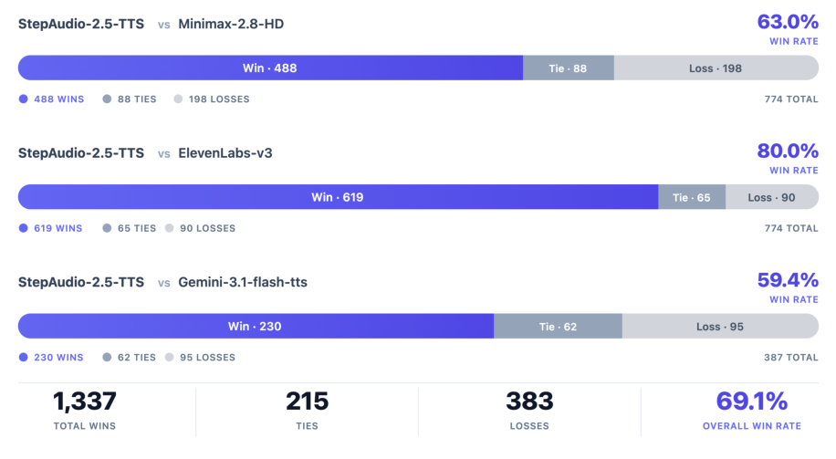
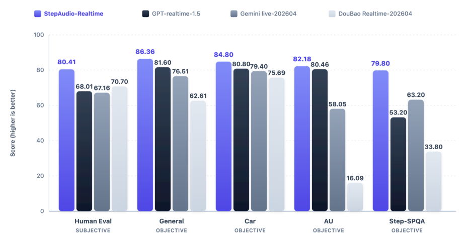

## 论文链接

- 原始论文页面：https://arxiv.org/abs/2605.23463
- PDF 下载：https://arxiv.org/pdf/2605.23463.pdf
- Hugging Face 论文页：https://huggingface.co/papers/2605.23463

StepAudio 2.5 技术报告

> 导读摘要：这篇论文的核心不是“用一个模型顺手做三类语音任务”，而是重新定义了统一语音系统的实现方式：先用共享的音频—语言骨干建立统一表示空间，再把任务差异下放到数据构造、后训练目标与解码约束中；在此基础上，作者以 RLHF（基于人类反馈的强化学习）为中心组织 ASR、TTS 和实时语音交互三条能力线，最终让统一模型在三类能力上同时逼近甚至超过专用系统。

## 一、论文想解决的真正问题

统一音频—语言模型近两年已经很热，但多数系统仍有一个共同短板：**能统一，却不够“专业”**。  
具体说，ASR 追求的是长音频下的准确率与转写效率，TTS 追求的是自然度、可控性和表现力，实时语音交互则要求低延迟、人格一致性、上下文连贯和副语言响应。三者的部署目标并不天然一致，因此很多“统一模型”最后仍然会在某一项上落后于专用系统。

这篇工作提出的判断非常关键：**任务差异不一定要体现在架构分裂上，而可以体现在“操作范式”上**。  
也就是说，只要文本与音频已经被放进了一个共享的多模态表示空间，那么后续的任务专门化，未必需要分别设计三套完全不同的网络；更合理的做法，是让三类任务共享骨干，然后通过：

- 不同的数据构造方式，
- 不同的优化目标，
- 不同的解码约束，

把同一个基础模型塑造成三种可部署的工作模式。

这个观点贯穿全文，也是 StepAudio 2.5 相比“多任务训练模型”的真正进步点。

## 二、统一骨干：共享表示，而不是共享接口

StepAudio 2.5 的基础架构沿用当前音频—语言建模中较成熟的模式：**音频编码器—适配器—LLM 解码器**。  
音频先被冻结的编码器压缩成声学表示，再由轻量适配器映射进解码器的隐藏空间，最后进入文本原生的 LLM 解码器，与文本 token、音频 token 一起在统一序列空间中建模。

从整体视角看，这张图最值得注意的不是“三个任务分支”，而是上方那条共享主干：ASR、TTS、实时交互并不是三套并排系统，而是在同一音频—语言堆栈上形成的三种部署模式。作者的意思很明确：共享的不是一个松散品牌名，而是一个真正复用参数、复用语义记忆、复用上下文能力的基础模型。

这种设计还有一个重要细节：它是**非对称统一**。  
编码器负责稳定地提取声学抽象，解码器负责语义、上下文管理、指令跟随和生成。换句话说，系统并不强行要求“理解”和“生成”在结构上完全镜像，而是承认语音系统里语义控制主要聚集在解码侧。正因为如此，下游任务虽然输出不同，仍能大量共享同一个解码骨干。

进一步看任务方向：

- **ASR**：输入音频，输出文本 token；
- **TTS**：输入文本与控制指令，输出音频 token 或中间音频表示；
- **实时交互**：把听、想、说耦合在一个低延迟回合式生成过程中。

因此，StepAudio 2.5 的统一不是“所有任务都做同一种生成”，而是让不同任务都查询同一套多模态记忆，再通过任务化约束得到不同输出。

## 三、训练主线：先对齐表示，再做统一预训练，再做任务化后训练

作者在训练设计上非常系统，重点不是单次大规模混训，而是**阶段化课程学习**。

### 1. 共享数据引擎与数据分级

论文先构造一条共同的数据生产管线：原始音频经过 SED（声音事件检测）和 VAD（语音活动检测）过滤低质量片段，再进行重切分，使样本在语义完整性和时长上更适合训练。之后又叠加多层注释，包括：

- 音频质量评分，
- 合成语音检测，
- 说话人数标注，
- 双 ASR 转写与语言识别，
- 语义完整性评估，
- 内容分类，
- 元数据分级。

这件事很重要，因为作者的观点是：统一模型能否真正落地，关键不只是参数共享，而是**三类任务能否建立在同一套高质量、可分级、可抽样的数据产品上**。数据不统一，后面所有“统一训练”都会变成表面文章。

### 2. 先做音频—文本空间对齐

训练第一阶段先沿用早期 StepAudio 思路，用大量 ASR 数据让适配器学习把语音特征接入文本 LLM。此时音频编码器和 LLM 主体冻结，只训练适配器，目的不是立刻追求最强多模态能力，而是先建立一个稳定接口：让文本原生解码器“听得懂”音频表示。

### 3. 再做大规模统一预训练

完成初始对齐后，模型词表扩展到包含语音 token，开始真正的统一多模态训练。论文给出的规模相当大：在文本与音频上持续预训练，总体达到万亿级 token 量级，并且数据不只包含 ASR，还包含：

- TTS，
- 语音到文本翻译，
- 文本—语音交错续写，
- 语音到语音对话数据。

这一步的作用，是让模型不再把音频只视为“待转写输入”，而是把它当成能出现在多种输入输出配置中的通用序列模态。

### 4. Progressive recipe：warmup、main training、cooldown

作者尤其强调配方式训练，而不是松散扩容：

- **warmup**：让新增语音词表和 MoE 路由快速适应音频模态；
- **main training**：大规模主训练，学习统一音频—语言能力；
- **cooldown**：转向更高质量、更长上下文的数据，进一步精修多模态能力。

这个设计的技术含义是：统一模型不是简单把语音 token 塞进 LLM 就行，而是要精细控制不同层、适配器、输出层、路由器在不同阶段的学习率和训练重心，让系统逐步稳定过渡到“真正的音频—语言模型”。

## 四、方法核心：把任务差异下放到后训练与解码机制

这是全文最值得读的一部分。StepAudio 2.5 的核心创新，不是共享骨干本身，而是**如何在共享骨干之上做任务化专门化**。

### 1. ASR：用可验证的多 token 预测换取效率

ASR 分支的重点不只是识别准，还要识别快。作者为此引入了可验证的多 token 预测机制，即 MTP。其思路是：在当前位置不仅预测下一个 token，还并行预测未来多个 token，然后只接受那些与正常自回归路径一致的前缀，从而在不破坏正确性的前提下加速解码。

这张图清楚展示了 ASR 分支如何在共享 encoder-adapter-decoder 骨干上外挂并行未来 token 分支。关键不在“多预测”本身，而在“可验证”：一旦后续 token 与主路径不一致，提案就被截断，系统继续按普通自回归方式生成。因此 MTP 只是加速原语，不会把识别过程变成不可控的并行猜测。

为了说明为什么选当前配置，论文还给出不同 MTP 分支数的接受率权衡：

从这个结果可以看出，分支数增加虽然能扩展一次接受的 token 长度，但越往后的预测位接受率下降越明显，收益存在递减。作者最终选择类似 MTP-5 的折中方案，本质上是在**并行度、验证通过率和系统复杂度**之间做工程最优解，而不是盲目追求更长前瞻。

最终，这个分支既提升了转写效率，也没有牺牲识别能力。客观识别结果表明，统一模型在多语言与长音频场景下依然非常强：

这张表最说明问题的地方，是 StepAudio 2.5 ASR 并没有因为“还要兼顾 TTS 和实时交互”而退化成泛用但不专业的系统；相反，它在中文、英文以及长上下文转写上保持了很强竞争力，支撑了作者“统一模型也能达到专用级 ASR”的论点。

### 2. TTS：从监督学习推进到偏好驱动对齐

TTS 分支的挑战与 ASR 完全不同。ASR 的输出空间窄，正确性相对可定义；TTS 的输出空间极其丰富，目标不是“字词正确”，而是自然、忠实、可控、有表现力。  
因此作者认为，单纯 SFT 不足以覆盖这种复杂目标，必须把 **RLHF（基于人类反馈的强化学习）** 放到中心位置。

他们的做法是把上下文丰富监督与偏好学习结合起来：

- 用更丰富的文本、语境、控制条件做监督，
- 用人类偏好数据训练奖励模型，
- 再用偏好驱动的 RLHF 调整语音生成风格、自然度与控制效果。

这其实是在把 LLM 时代“对齐”那套思想搬到 TTS：  
不是只问“读出来了没有”，而是问“读得像不像人想要的那个样子”。

结果上，TTS 分支在主观竞技场式评测中对多个强基线都表现出明显优势：

这类结果的重要性高于单一客观声学指标，因为 TTS 的最终评判者本来就是人耳。图中稳定更高的胜率说明，该方法不仅技术上可行，而且确实把偏好建模转化成了可感知的语音质量、自然度和控制力提升。

### 3. 实时交互：统一模型最难的落地场景

实时语音交互是三条能力线里要求最苛刻的一条。它要求模型同时具备：

- 音频理解能力，
- 对话状态维护能力，
- 低延迟回合切换能力，
- 人格一致性，
- 副语言敏感性，
- 情境恰当回应能力。

作者的做法是两步走：

1. 先用渐进式 SFT 建立对人格与副语言信息的敏感性；
2. 再引入生成式奖励模型和显式交互规则，在 RLHF 框架中优化真实交互体验。

这说明论文里的 RLHF 不是只服务 TTS，而是被提升为一个统一后训练范式：  
凡是那些难以由明确标签定义、却直接影响部署体验的目标——如自然度、人格一致、互动质量——都交给偏好与奖励建模去处理。

## 五、实验怎么看：不是单项最优，而是三条能力线同时成立

StepAudio 2.5 的实验价值，在于它并不是某一项任务刷榜，而是三项能力一起成立。

### 1. ASR：统一不牺牲专业度

从识别结果看，模型在常规语种和长音频场景上都很强，说明共享骨干没有破坏专门化识别能力；配合 MTP 后，推理效率也显著提升，说明作者不是只做“高分模型”，而是兼顾了部署时最重要的吞吐与时延。

### 2. TTS：主观偏好优势更有说服力

竞技场式评测中，StepAudio 2.5 TTS 对多个强商用/强闭源参照都取得优势。这意味着统一模型不是“能发声”，而是能在真实听感、表达和控制上进入第一梯队。

### 3. 实时交互：综合能力最能体现统一建模价值

实时交互结果尤其关键，因为这类任务天然最能检验统一模型是否真正保留了端到端语音信息，而不是退回“先识别成文本再处理”的级联思路。论文给出的评测显示，模型在多项实时交互任务上都有稳定领先：

这张图传达的重点不是某一列最高分，而是整体一致性：主观和客观维度都保持优势，说明模型确实把“听、推理、回应”融合成了统一能力，而非临时拼接出来的流水线。

## 六、这篇论文最值得记住的三点

第一，**统一语音系统的关键不再是给每个任务造一套架构，而是让它们共享一个足够好的表示骨干，再通过数据、目标和解码机制实现任务化专门化**。这是一种方法论转向。

第二，**RLHF 在这篇工作里不是锦上添花，而是后训练主轴**。  
无论是 TTS 的自然度与可控性，还是实时交互中的人格一致和副语言响应，很多真正影响用户体验的目标都难以写成简单监督标签，RLHF 因而成为统一对齐的核心工具。

第三，**StepAudio 2.5 证明了统一模型不只是“覆盖更多任务”，还可以在识别效率、生成质量和实时交互体验上同时逼近甚至超过专用系统**。这比“一个模型做三件事”更重要，因为它说明统一建模开始具备真正的工程可替代性。
