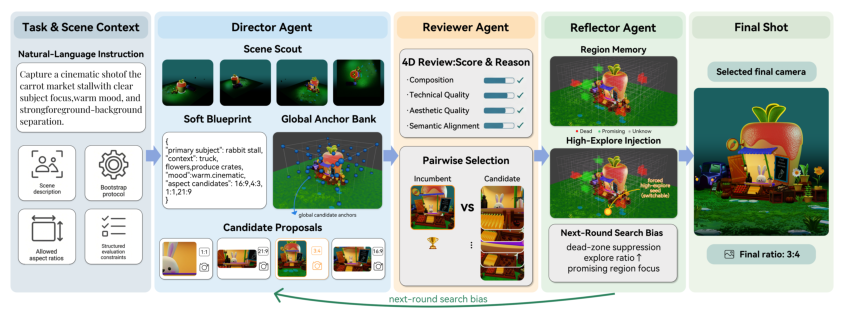
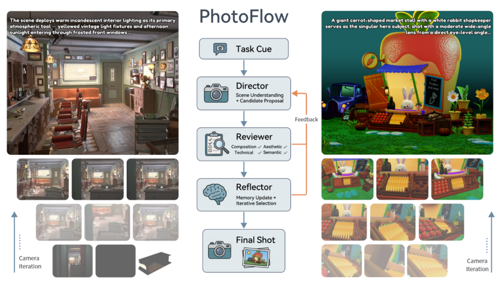
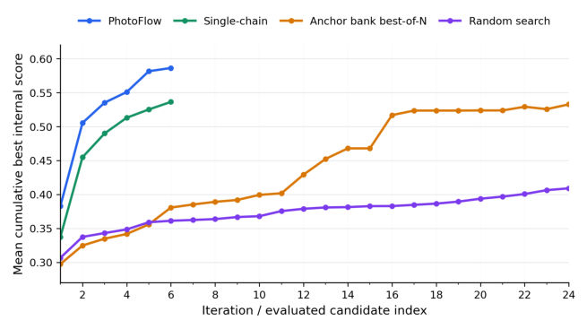
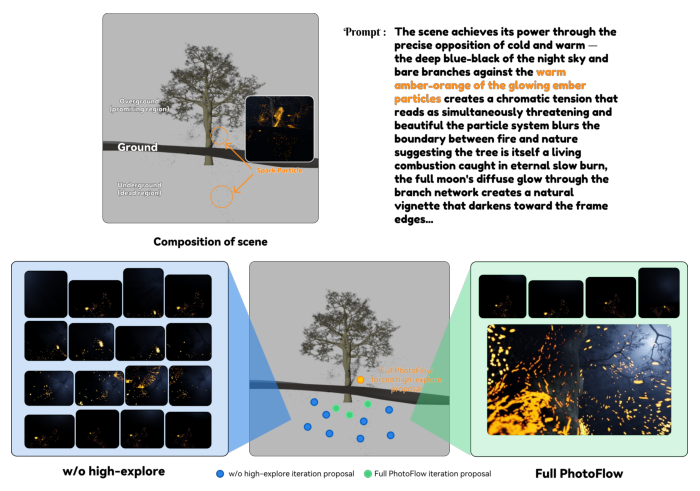
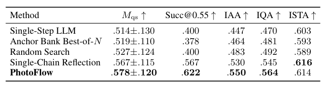
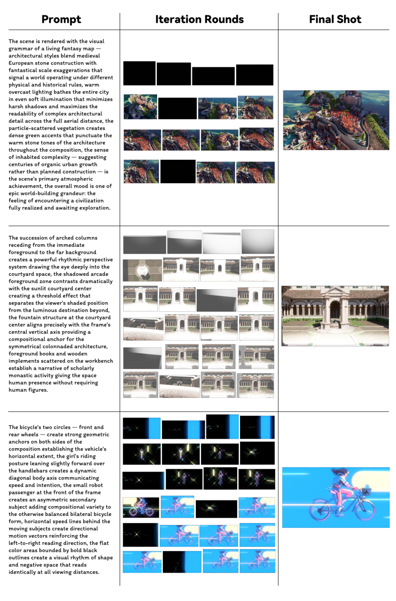
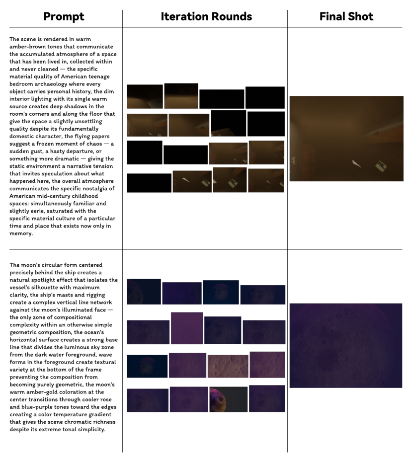
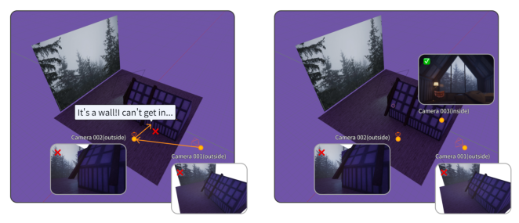
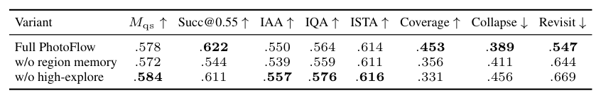
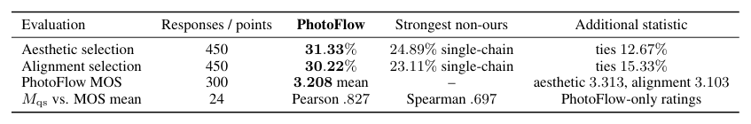

## 论文链接

- 原始论文页面：https://arxiv.org/abs/2605.23771
- PDF 下载：https://arxiv.org/pdf/2605.23771.pdf
- Hugging Face 论文页：https://huggingface.co/papers/2605.23771
- 项目主页：https://visionary-laboratory.github.io/PhotoFlow/
- 开源代码仓库：https://github.com/Visionary-Laboratory/PhotoFlow

PhotoFlow：面向智能体的三维虚拟摄影任务

> 導讀摘要：本文提出一个将语言条件下的虚拟摄影建模为可执行闭环搜索任务的多角色智能体系统 PhotoFlow，并配套构建了 VPhotoBench 基准，用于同时评测三维空间理解与摄影美学决策能力。

## 研究背景與任務定義

虚拟摄影并不是简单的图像生成，而是要求智能体在任意三维场景中选择一个真正可渲染、可执行的相机状态，从而满足语言指令中的主体、构图、氛围与风格要求。现有视觉语言模型通常分别在空间理解或美学判断上做局部评测，但缺少一个能把“3D 推理 + 摄影审美”联合起来考察的任务设定与基准。

## 方法設計與核心機制

PhotoFlow 将问题设计为 Director-Reviewer-Reflector 的闭环相机搜索框架。Director 先对 Blender 场景进行 scouting，提取几何摘要、拓扑关系与全局预览，并将语言指令转化为“软摄影蓝图”，再基于全局锚点、区域记忆和高探索通道提出候选相机。Reviewer 结合规则侧几何约束与 VLM 侧图像评价，对候选预览从构图、技术质量、美学质量和语义一致性等维度打分，并通过成对 incumbent 选择提升搜索稳定性。Reflector 则把每轮失败经验压缩为区域记忆、死区抑制和下一轮搜索偏置，从而避免局部塌缩，并在必要时触发 high-explore relocation 跳出局部最优。

## 實驗結果與結論

在 VPhotoBench 的保留测试中，PhotoFlow 在固定六轮渲染预算下取得了所有对比方法中最强的外部质量-对齐综合指标与成功率，整体优于单步预测、单链反思、锚点库筛选和随机搜索。按任务类别分解后，方法在主体放置、关系构图和氛围/风格三类任务上都保持稳定收益，说明其改进并非来自某个单一子任务。

### PhotoFlow 的闭环选镜头流程

核心思路不是一次性预测相机，而是把“找机位”做成多轮搜索。系统先读懂场景与文字意图，提出一批候选视角，再经过评分、比较和反思，逐步收敛到最终镜头。

### 把虚拟摄影建模为闭环选机位

核心意思不是“生成一张图”，而是在一个可控制的3D场景里，反复寻找合适相机位置。中间流程把任务提示词逐步变成候选机位、预览评审和最终成片；左右两侧示例则说明，同一任务需要同时满足空间可行性和画面美感。

### 搜索过程中的得分爬升

图里比较的是几种选相机视角方法在搜索过程中，内部“当前最好分数”如何随步骤上升。可以看出，PhotoFlow提升更快、最终也更高，说明它不只是终点结果更好，连搜索过程本身也更有效。

### 高探索如何帮搜索跳出局部最优

重点不是“多探索一定更好”，而是当搜索已经找到一个勉强可用但构图较弱的视角时，系统需要一次主动跳转，去别处重新找候选。图中用一个案例说明：加入 high-explore 后，最终能从局部停滞里跳出来，找到更强的画面组织。

### Table4

（圖表解釋生成失敗：LLM API error (HTTP 403): {"error":{"message":"insufficient balance","type":"billing_error"}}）

### Fig6

（圖表解釋生成失敗：LLM API error (HTTP 403): {"error":{"message":"insufficient balance","type":"billing_error"}}）

### Fig7

（圖表解釋生成失敗：LLM API error (HTTP 403): {"error":{"message":"insufficient balance","type":"billing_error"}}）

### Fig3

（圖表解釋生成失敗：LLM API error (HTTP 403): {"error":{"message":"insufficient balance","type":"billing_error"}}）

### Table10

（圖表解釋生成失敗：LLM API error (HTTP 403): {"error":{"message":"insufficient balance","type":"billing_error"}}）

### Table11

（圖表解釋生成失敗：LLM API error (HTTP 403): {"error":{"message":"insufficient balance","type":"billing_error"}}）

## 要點總結

- 这篇论文的核心贡献不是单纯提出一个更强的相机选点器，而是把“语言条件虚拟摄影”正式定义为一个需要可执行相机状态、三维空间推理与摄影审美联合优化的智能体任务。
- PhotoFlow 的关键创新在于闭环搜索：由 Director 负责提案、Reviewer 负责多维评价、Reflector 负责跨轮记忆与失败归纳，使系统能够在有限渲染预算下逐步逼近更优视角。
- 作者同时提出 VPhotoBench，为这一新任务提供了覆盖 47 个 Blender 场景、141 个摄影任务的系统化评测基准，从而使该方向首次具备较完整的可复现实验比较基础。
