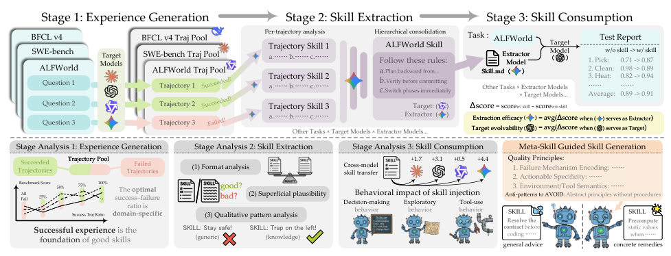
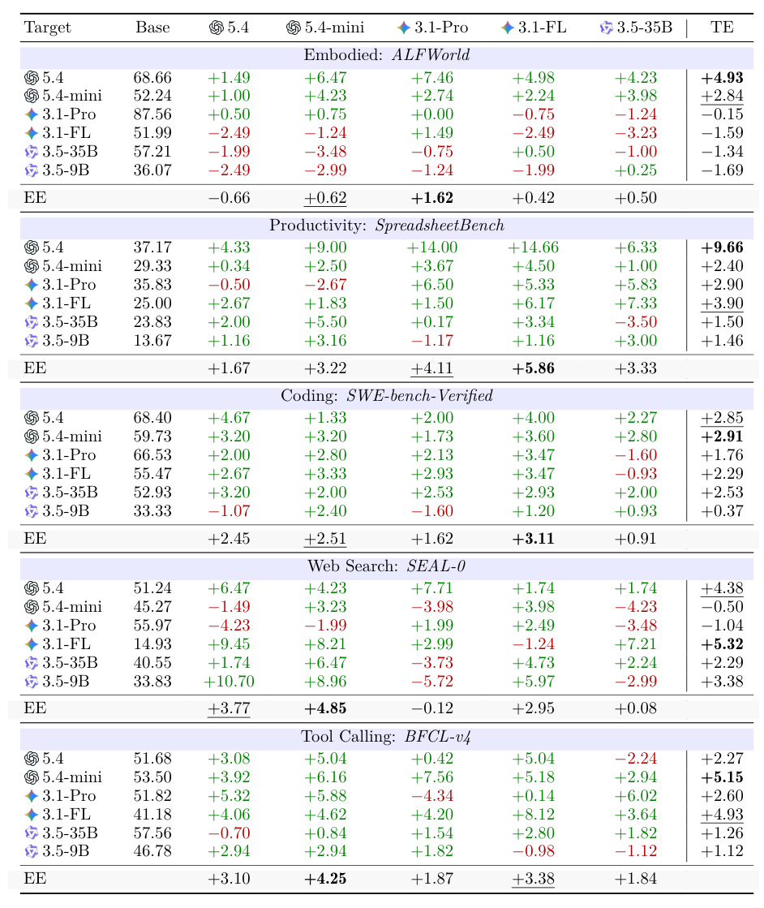
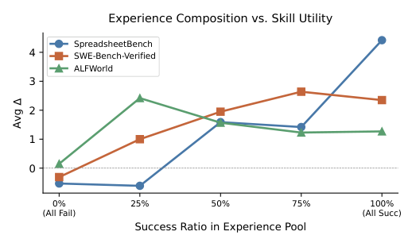
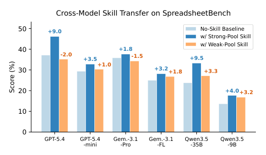
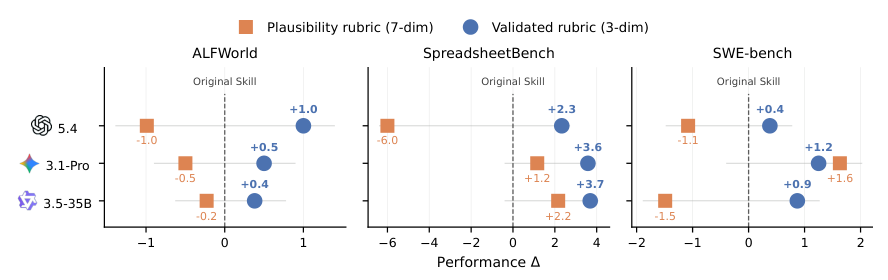
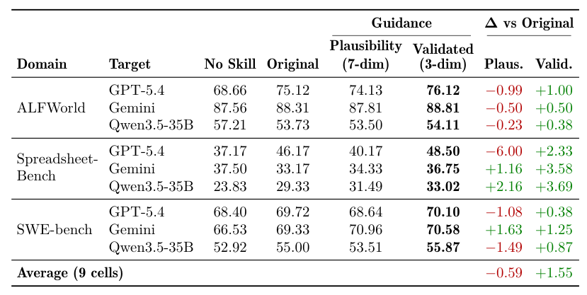
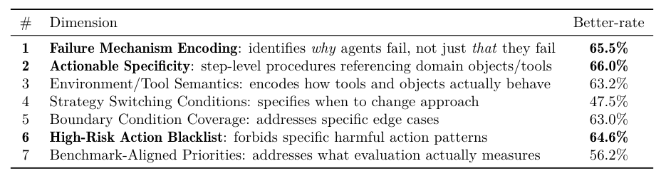
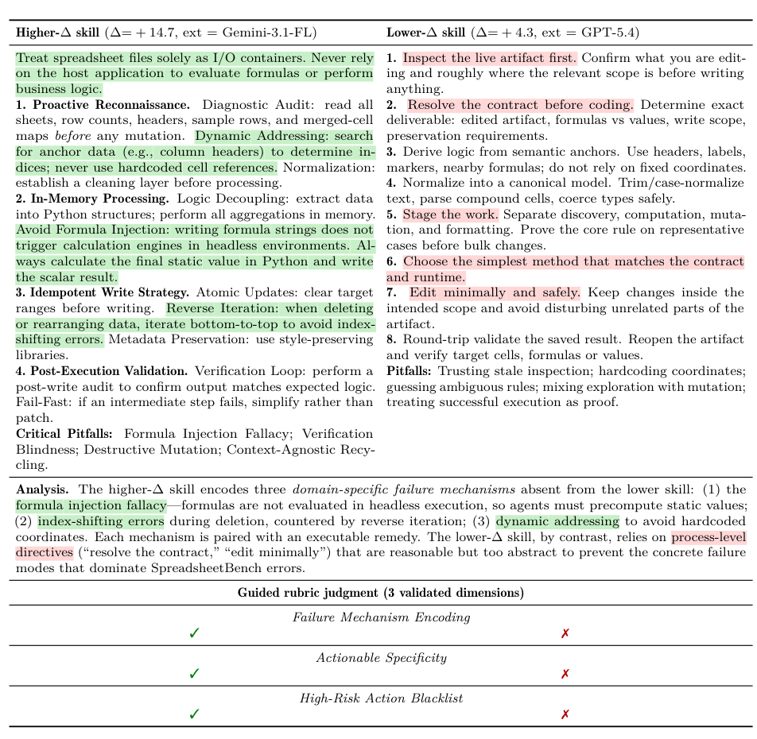
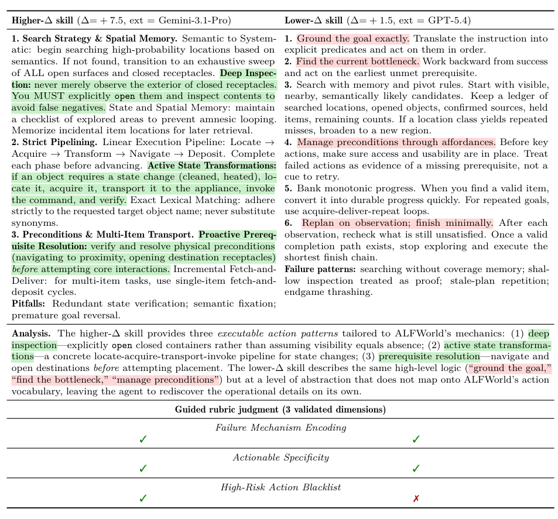
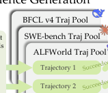

## 论文链接

- 原始论文页面：https://arxiv.org/abs/2605.23899
- PDF 下载：https://arxiv.org/pdf/2605.23899.pdf
- Hugging Face 论文页：https://huggingface.co/papers/2605.23899
- 项目主页：https://microsoft.github.io/SkillLens/
- 开源代码仓库：https://github.com/microsoft/SkillLens

从原始经验到技能消耗：对模型生成的智能体技能的系统性研究

> 导读摘要：本文围绕“经验生成—技能提取—技能消费”这一完整生命周期，构建了一个以实际效用为依据的统一评测框架，系统揭示了模型生成技能虽平均有效但存在显著负迁移、提取器能力与消费者能力解耦，并进一步提出以真实效用为导向的元技能指导来稳定提升技能质量。

## 研究动机：为什么要单独研究“技能”？

语言智能体越来越依赖可复用“技能”来积累经验、提升下游任务表现，但现有工作往往只看“技能有没有用”，很少追问三件事：技能从哪里来、如何被提取、以及为什么有时会失效。尤其是领域级、模型自动生成的技能，虽然有希望规模化生产，但缺少跨提取器、跨目标模型、跨任务域的系统研究。

作者因此想回答三个核心问题：

1. 模型生成的技能，是否真的能稳定提升下游表现？
2. 这种收益来自“会生成经验”，还是“会提取技能”，还是“会消费技能”？
3. 如何判断一条技能是真正有用，而不是看起来很合理？

## 方法主线：三阶段生命周期

### 1）先生成经验，再提取技能
论文把整个流程拆成三步：  
- 目标智能体先在任务中执行，产生经验池；  
- 独立提取器从经验池中蒸馏出可复用技能；  
- 再把技能注入目标模型，并在保留测试集上评估增益。

这套设计的关键，是尽量减少“领域启发式”干扰，让性能差异更多反映模型本身对技能的抽象与复用能力。

### 2）用两个指标拆开“提取”和“消费”
作者定义了两个核心指标：  
- **提取有效性（EE）**：固定提取器，跨目标模型看平均收益；  
- **目标可进化性（TE）**：固定目标模型，看它能从不同提取器技能中获益多少。

这让“谁更会提技能”和“谁更会用技能”不再混在一起。

### 3）引入“元技能指导”
在分析基础上，论文进一步提出**元技能指导**：不再按表面写法挑技能，而是反向用“与真实效用相关的特征”指导技能生成，尽量过滤掉那些看起来合理、但实际无用的内容。

## 实验发现：技能不是“有就行”

### 1）平均有效，但负迁移并不少
大规模实验表明，模型生成的领域级技能在平均意义上确实能提升下游性能；但约四分之一的模型配对会出现负迁移，说明“有技能”不等于“更好”。

### 2）提取器、目标模型、经验池三者缺一不可
实验显示，技能收益不只取决于提取器强弱，还取决于：
- 经验池里成功/失败轨迹的构成，
- 技能是否足够可执行，
- 目标模型本身有没有“消费”这些技能的能力。

换句话说，技能效果是三段链路共同作用的结果。

### 3）元技能指导能更稳地提升质量
引入元技能指导后，技能质量在多个领域上更稳定，负迁移风险明显下降。也就是说，作者不是单纯追求“更会写技能”，而是追求“更接近真实效用的技能”。

## 结果图怎么读

### Figure 1：技能研究的三阶段框架
这张图把整篇论文压缩成一条清晰流水线：先让目标智能体在任务中产生轨迹，再由提取器把多条轨迹归纳成可复用技能，最后把技能重新交回智能体并比较前后表现。下半部分对应三阶段分析，强调作者不只看“技能有没有用”，还追问经验质量、提取方式和使用方式分别起了什么作用。

## 表格1怎么读

### 表1：不同技能是否真的提升下游任务
这张表把“先抽取技能再拿去做任务”的效果，与“不用技能”的基线做对比。绿色表示提升，红色表示下降；右侧的 TE 是综合看目标模型到底获益多少。核心结论很直接：很多技能确实有效，但并不稳定，模型大小、提取器来源和任务域都会影响结果。

### Figure 2：经验池成分如何影响技能效果
这张图比较经验池里“成功轨迹”占比变化后，提取出的技能在多个任务上的平均收益。结论是：成功经验通常更有帮助，但最佳比例并不统一，不同任务对成功/失败样本的需求并不相同。

### Figure 4：跨模型技能迁移效果
这里横轴是不同目标模型，纵轴是任务得分。浅色柱是不用技能的基线，深色和橙色柱表示注入强/弱技能后的变化。整体看，强技能通常能明显提分，弱技能效果小甚至会下降，说明“学到什么技能”比“只要有技能”更关键。

### Figure 5：元技能指导对下游效用的影响
这张结果图比较两种技能来源：可解释性较强的朴素技能，与经过验证、可执行的技能。三组任务里，后者整体更能提升模型表现；前者有时甚至带来负面效果。它说明真正有用的技能，不是更抽象的经验总结，而是能对应任务机制的可执行程序。

### 表11：元技能标尺对下游表现的影响
这张表比较了两种“技能标尺”：直接用 7 个可行性维度，和先验证再筛成 3 个更可靠维度。结果表明，后者更容易带来稳定提升，尤其在更强的目标模型上更明显；未验证维度的收益则更不稳定。

### 表13：技能质量评估的七个候选维度
作者从对比分析中归纳出七类技能质量维度，并给出它们与真实下游效用的一致程度。重点不在于“写得像不像技能”，而在于哪些维度真的能对应任务中的有效行为。

### 表14：高效技能与低效技能的对照案例
这张表把同一任务中两种技能写法直接对照：效果更好的版本更贴近真实操作机制；较差的版本则停留在通用流程建议。它说明技能是否有用，不在于是否完整，而在于是否写出了可执行、可避免失败模式的规则。

### 表15：高收益技能与低收益技能的对照案例
这是一组方法层面的对照：同样面向 ALFWorld 任务，增益更高的技能写成了更具体的操作规则，增益较低的技能则偏抽象。核心信息是：有用的技能不是“看起来像技能”的文字，而是能稳定改善任务结果的、被验证过的可执行技能。

## 结论：这篇论文真正说了什么？

这项工作把“技能”从一个模糊概念，变成了可分解、可评估、可优化的三段式问题：**经验生成、技能提取、技能消费**。它证明了模型生成技能平均有效，但负迁移不可忽视；也证明了技能质量不只取决于提取器，还取决于经验构成、目标模型和评估标尺。最重要的是，作者给出了一条更实用的路径：不要只看技能写得漂不漂亮，而要看它是否真的贴近任务机制、能否执行、以及是否能稳定带来真实收益。

## 補充圖示

### 三阶段技能生成流程

这张图在讲：模型不是直接“背答案”，而是先从任务轨迹里生成经历，再从经历中提炼技能，最后把技能压缩成可复用的技能库。核心意思是，技能形成有一个从“做过什么”到“会什么”的逐步抽象过程。

它说明模型能力提升的关键，不只是规模变大，而是把经验结构化成技能并反复复用，这样更容易跨任务迁移，也更有机会减少负迁移。
