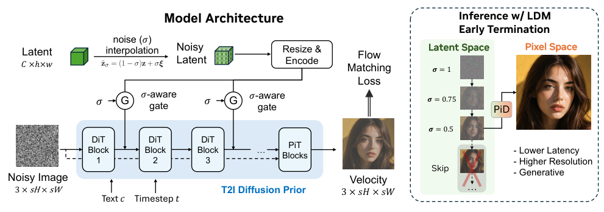
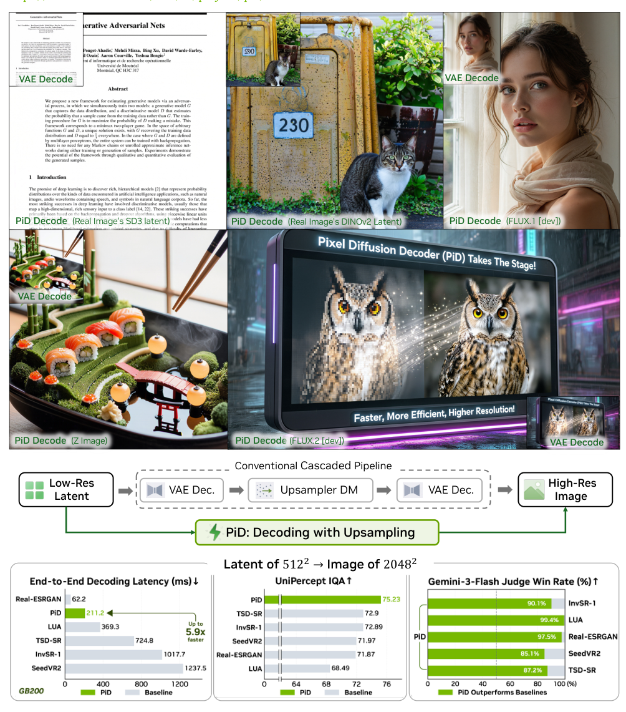
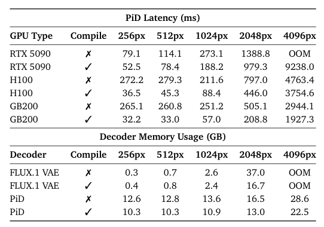
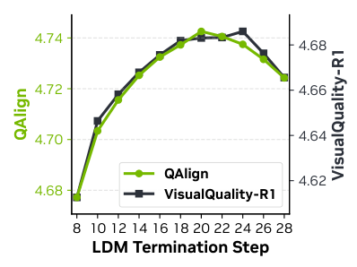
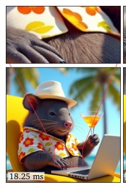
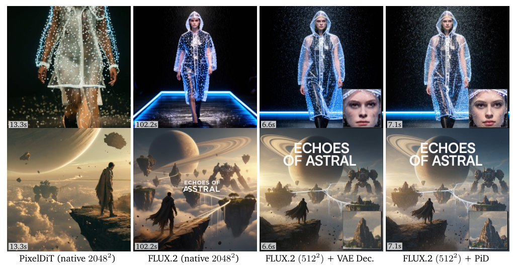
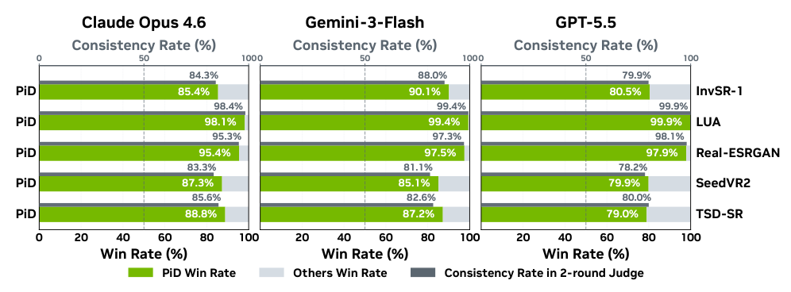
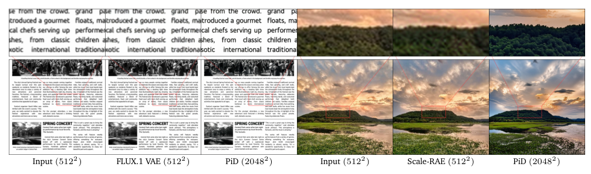
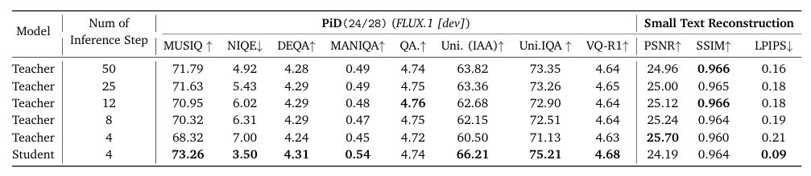

## 论文链接

- 原始论文页面：https://arxiv.org/abs/2605.23902
- PDF 下载：https://arxiv.org/pdf/2605.23902.pdf
- Hugging Face 论文页：https://huggingface.co/papers/2605.23902
- 项目主页：https://research.nvidia.com/labs/sil/projects/pid/
- 开源代码仓库：https://github.com/nv-tlabs/PiD

PiD：利用像素扩散实现快速高分辨率潜变量解码

> 导读摘要：本文把“潜变量解码”和“高分辨率放大”合并为一个以潜变量为条件的像素空间扩散生成模块，用更少的步数、更低的延迟把低分辨率 latent 直接解码到高分辨率图像，同时尽量保住细节与视觉质量。

## 1. 问题背景：为什么传统解码器不够用

高分辨率文生图系统通常先在紧凑的 latent 空间生成，再用解码器映射回像素空间。这个范式的问题在于：解码器更擅长“还原”而不是“补细节”，一旦分辨率升到 2K、4K，串联式的“先解码再超分”就会变慢、变重，还容易放大伪影与细节缺失。

## 2. 核心想法：把解码改写成像素空间扩散

PiD 的关键不是把解码器做大，而是把“解码”本身重写成一个生成问题：  
给定一个来自 VAE/RAE 等编码器的 latent，模型不再先输出低分辨率图，再接超分模块，而是直接在目标高分辨率像素空间里去噪生成。

这一点很重要，因为 latent 负责提供结构和语义，像素扩散负责补高频细节，二者在一个单阶段里完成，天然比多阶段级联更适合高分辨率生成。

## 3. 方法主体：PiD 怎么工作

PiD 的整体结构可以理解为三步：

1. **输入带噪 latent**：将潜变量加噪后送入适配器，作为条件信号。  
2. **像素扩散解码**：主干扩散模型直接在目标分辨率的像素空间去噪，生成高分辨率图像。  
3. **提前终止并蒸馏**：通过 DMD2 蒸馏，把原本较长的扩散过程压缩到约 4 步，让解码足够快。

论文里还引入了两个关键设计：

- **sigma-aware gating**：根据 latent 的噪声水平自适应控制注入强度，让模型同时处理干净 latent 和部分去噪 latent。
- **noisy latent conditioning**：让模型在训练时就习惯“部分去噪”的条件，从而能在基础 LDM 还没完全结束时提前切换到像素解码阶段。

这让 PiD 不只是“解码器替换件”，而是一个统一的 latent-conditioned pixel generation 模块。

## 4. 为什么它能更快，也更清楚

传统级联方案通常是：低分辨率 latent → VAE 解码 → 超分模型 → 更高分辨率结果。  
PiD 则是：latent → 条件控制 → 直接生成目标高分辨率图像。

这样做有两个直接收益：

- **减少多阶段级联开销**，推理更快；
- **更适合补足高频细节**，所以画面边缘、纹理、文字等更清晰。

论文的图 7、图 9 都在说明同一件事：PiD 在更短时间内，能给出更锐利的局部细节，并且在部分案例里可读性接近甚至优于原生高分辨率结果。

## 5. 实验结果：速度、显存和画质一起看

实验表明，PiD 在多种 latent 设置下都优于传统 VAE/RAE 解码器 + 级联超分的基线：

- **速度**：512×512 latent 可在约 1 秒内解到 2048×2048；
- **显存**：消费级 RTX 5090 上峰值显存约 13GB；
- **效率**：在 GB200 上约 210ms；
- **整体**：相较级联扩散超分方案，推理约快 6 倍，画质更好。

更关键的是，它对不同 latent 都有效：既适用于传统 VAE latent，也适用于更语义化的 RAE / 视觉编码器 latent。

## 6. 消融结论：关键模块不是装饰

论文的消融实验说明，PiD 的性能来自几个必要部件共同作用：

- 去掉 **noisy latent conditioning** 或 **sigma-aware gating**，画质会明显下降；
- 蒸馏到 **4 步** 后，PiD 仍能保持较强感知质量；
- 在不同步数下，PiD 都能在速度与画质之间给出更好的折中。

这意味着它不是单纯“堆算力换效果”，而是在可部署的延迟/显存约束里，真正把高分辨率解码做成了可用方案。

## 7. 一句话总结

PiD 的本质，是把高分辨率解码从“先重建、再放大”的旧管线，改造成“以 latent 为条件的像素扩散生成”；它因此同时获得了更快的推理速度、更低的延迟，以及接近或优于传统级联方案的视觉质量。

## 補充圖示

### PiD 的整体方法框架

核心思路是把“潜变量解码”和“高分辨率放大”合并成一次像素空间扩散生成，而不是先用 VAE 解码、再接超分模块。潜变量先被加噪后送入适配器，作为条件去引导像素扩散模型，直接生成目标分辨率图像。

这张图解释了 PiD 为什么同时更快、分辨率更高：它去掉了传统串联式“解码后再超分”的多阶段流程。方法上更关键的一点是，潜变量负责提供结构和语义，像素扩散负责补细节，因此更适合生成高分辨率结果。

### 把高分辨率解码做得更快的 PiD

这张图把现有“先低分辨率解码、再放大”的传统流程，和 PiD 的新流程放在一起对比。核心意思是：PiD 直接在高分辨率像素空间里做解码，同时还能利用低分辨率 latent 作为条件，因此既更快，也更容易保留细节。

它说明高分辨率生成不一定要依赖又慢又复杂的级联管线；PiD 给出了更直接的解码方式，适合需要更低延迟和更高画质的图像生成场景。

### 高分辨率解码器的整体结构

这张图说明 PiD 不是把低分辨率潜变量直接“放大”成图片，而是把解码过程改成更适合高分辨率生成的单阶段结构。左侧是带噪声的潜变量输入，经过多个 PiT/DiT 模块和噪声感知门控后，逐步恢复成更清晰的高分辨率图像；图中也对比了传统级联超分方案与 PiD 的差别。

它的核心意义是同时兼顾速度和画质：减少多阶段级联带来的计算开销，又能比传统解码器更好地保留高分辨率细节。

### PiD消融：速度、显存与关键模块作用

这张表主要回答两个问题：PiD在不同分辨率下跑得是否够快、占用显存是否可控，以及它的关键设计是否真的带来质量提升。结论很直接：PiD虽然比普通VAE解码器更重，但能稳定扩展到更高分辨率；而去掉文生图先验或sigma感知门控后，图像质量会明显下降。

这说明PiD不是单纯靠堆算力换效果，而是在可运行的速度和显存范围内，把高分辨率解码真正做成了一个可用方案。对理解整篇论文很关键，因为它同时支撑了方法设计的必要性和实际部署的可行性。

### 终止步数与解码画质的关系

图中比较了 PiD 在不同 LDM 提前终止步数下的图像质量变化，横轴是基础扩散模型停止的位置，纵轴是两种感知质量指标。整体趋势是：过早停止会明显降质，停在靠后的几步时质量最好，再继续接近完整去噪时提升反而不明显。

这说明 PiD 不需要等到底层模型完全去噪后再解码，保留最后几步给像素解码器处理，反而更有利于细节生成。对方法设计而言，它支持“提前结束 LDM + 由 PiD 补足高频细节”的核心思路，也解释了为什么该方法能同时兼顾速度与画质。

### PiD 与级联超分方案的效果对比

图中比较的是：把同一个 512 分辨率潜变量还原成 2048 图像时，传统“先 VAE 解码、再做超分”的级联方案，与 PiD 直接高分辨率解码的差别。核心结论很直接：PiD 在更短延迟下生成了更锐利的纹理和边缘，细节也更自然。

这幅结果图支撑了论文的核心主张：解码和超分可以合并成一个生成步骤，而不必依赖更慢的级联流程。对非专业读者来说，重要之处在于它说明 PiD 不只是“更快”，而是用更简单的流程同时保住了高分辨率细节。

### 低分辨率生成配合 PiD 的 2K 对比

图中比较了原生 2048×2048 生成，与“先生成较小 latent、再用 PiD 解码到 2K”的结果。结论很直接：后者能把耗时大幅压低，同时画面细节和文字可读性仍接近原生高分辨率，部分局部甚至更清晰。

这幅结果图支撑了论文的核心主张：高分辨率生成不一定要从头在高分辨率上完成，低分辨率模型加上 PiD 也能达到很强的视觉效果。对实际部署而言，这意味着更低的推理成本和更快的生成速度，而不必明显牺牲成像质量。

### 偏好判断结果对比

这张图比较了 PiD 和传统级联式方案在多轮偏好判断中的胜率与一致性。整体看，PiD 在不同模型和任务上大多更容易被判为更好，说明它生成的结果更稳、更受偏好；同时，两轮判断的一致性也较高，表示结论不只是偶然。

这说明把 PiD 放在解码端做高分辨率生成是有效的，既能提升视觉质量，也能保持判断稳定性。

### 重建时的细节恢复对比

图中比较了把同一份干净图像的 latent 解码回图像时，不同解码器的效果。PiD 不只是把 latent 还原出来，还会在更高分辨率下补出更清晰的局部纹理，因此文字边缘和自然场景细节都更锐利。

这张图说明论文的改进不只是“放大图片”，而是把解码本身变成了带生成能力的过程。对于高分辨率生成来说，这意味着即使 latent 本身不够完整，PiD 也能在输出阶段恢复更可信、更清楚的视觉细节。

### 速度与画质的权衡结果

这张表比较了 PiD 在不同推理步数下的解码效果，关注的是高分辨率解码时“快不快”和“好不好”能否兼得。核心结论是：蒸馏后的少步数 PiD 仍保持很强的感知质量，其中 4 步学生模型在大多数主观/感知指标上尤其突出。

它说明 PiD 的目标不是单纯还原 latent，而是用很少步骤直接生成更自然、细节更丰富的像素结果。这也解释了论文的方法设计：用像素扩散式解码后，少步推理依然能保住观感质量，但与严格重建相关的指标会出现取舍。
