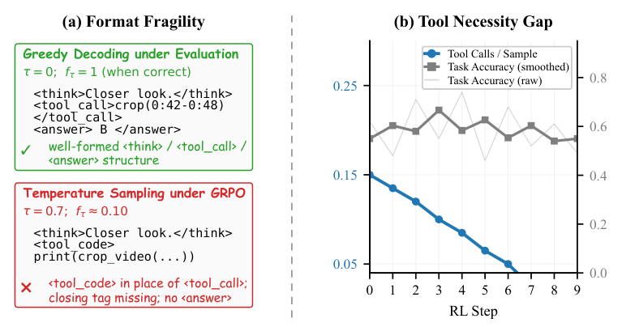
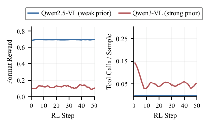
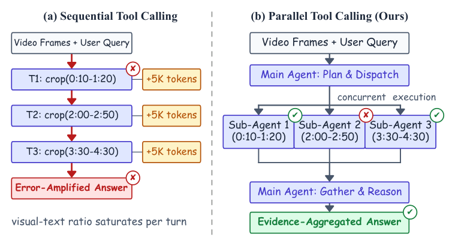
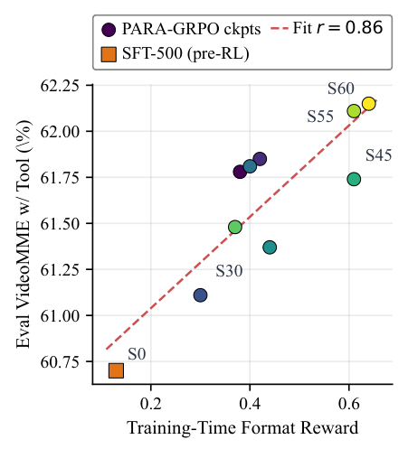
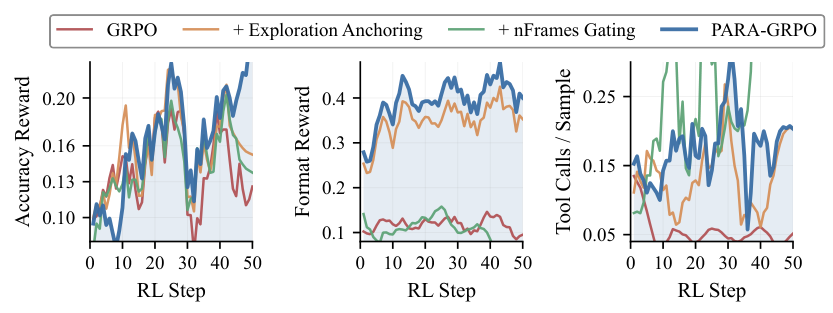
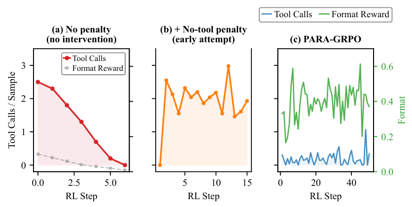
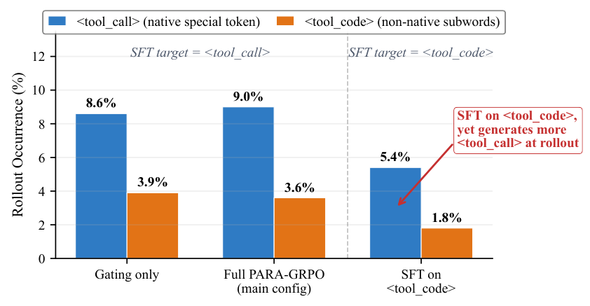
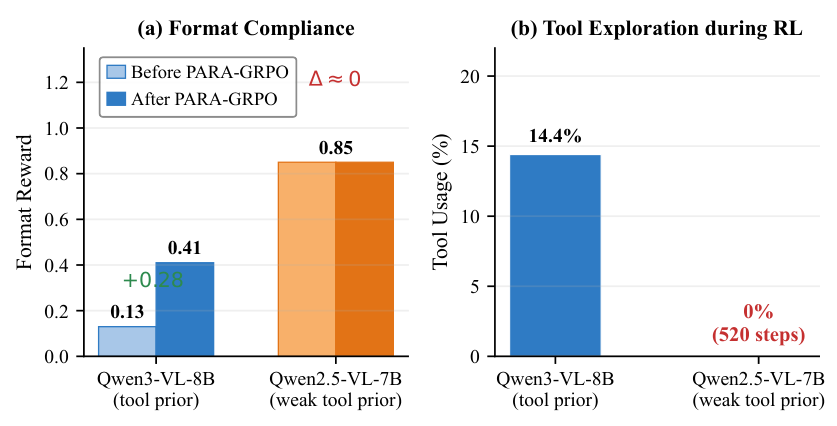
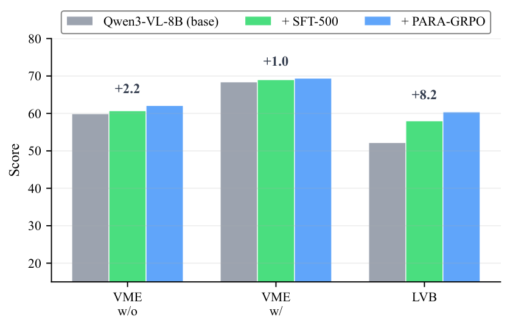
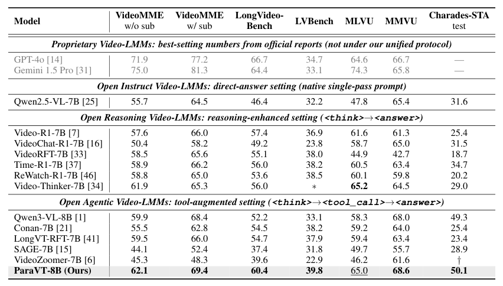

## 论文链接

- 原始论文页面：https://arxiv.org/abs/2605.20342
- PDF 下载：https://arxiv.org/pdf/2605.20342.pdf
- Hugging Face 论文页：https://huggingface.co/papers/2605.20342
- 项目主页：https://evolvinglmms-lab.github.io/ParaVT/
- 开源代码仓库：https://github.com/EvolvingLMMs-Lab/ParaVT
- 开源代码仓库：https://github.com/EvolvingLMMs-Lab/LongVT
- 开源代码仓库：https://github.com/EvolvingLMMs-Lab/lmms-engine
- 开源代码仓库：https://github.com/inclusionAI/AReaL
- 开源代码仓库：https://github.com/EvolvingLMMs-Lab/lmms-eval

ParaVT：驯服工具先验悖论——面向智能体视频强化学习中的并行工具使用

> 导读摘要：这篇论文讨论的不是“怎么让视频模型多调几次工具”这么简单，而是一个更底层的训练悖论：带工具先验的多模态模型在强化学习里，一方面更容易探索工具，另一方面却更容易把输出格式搞坏，或者干脆学会跳过工具。作者提出 ParaVT，把长视频理解里的串行裁剪改成单轮并行裁剪；再用 PARA-GRPO 同时约束格式可解析性和工具调用必要性，最终在 6 个长视频基准上平均提升约 7.9%。

## 一、问题不在“不会用工具”，而在“先验把训练带偏了”

长视频理解常常需要模型主动调用视频工具，比如从 90 分钟比赛里裁出几个关键时间窗，再围绕这些局部证据作答。已有方法大多采用**串行、多轮、每轮一次工具调用**的方式：模型先裁一段、看结果、再决定下一段。

这个范式有三个明显缺陷：

1. **错误会级联放大**：第一次裁偏了，后续推理就建立在错误证据上。
2. **上下文会持续污染**：每一轮返回的视觉内容都塞进同一个上下文，导致信息越来越臃肿、混杂。
3. **推理成本线性上涨**：轮数越多，推理时延和上下文长度越高。

更关键的是，作者发现原生带工具能力的 LMM 在 RL 中会出现一个更隐蔽的问题：**工具先验悖论**。强工具先验确实让模型更“愿意”探索工具，但也会在采样训练时诱发格式崩坏；而弱工具先验虽然格式稳定，却可能完全不触发工具调用。

上图把这个悖论拆成两个早期症状。左侧体现的是**格式脆弱性**：模型在贪心解码下能维持规范结构，但一进入带温度采样的 GRPO 训练，原本学到的结构化输出很快失稳。右侧体现的是**工具必要性缺口**：训练中工具调用数迅速掉到接近零，但任务准确率并没有同步改善，说明模型学会了“跳过工具”这条奖励捷径。

作者进一步做了跨模型对比：工具先验较弱的模型能守住格式，但几乎不调用工具；工具先验较强的模型更愿意探索工具，却更容易把格式弄坏。这个现象说明，问题不是某个基座模型特有，而是工具原生模型在 RL 中的普遍张力。

这也是论文最有价值的诊断：**工具先验既是能力来源，也是训练不稳定的根源**。所以后续方法设计的重点，不是简单鼓励多调工具，而是把“结构可解析”和“工具有必要被调用”拆开处理。

## 二、ParaVT：把串行裁剪改写为单轮并行证据收集

ParaVT 的核心改动很直接：把原来跨多轮进行的工具调用，改成**单轮内并行分发多个时间窗口**。

传统串行方式是：模型先决定一个时间段，调用裁剪工具，拿到结果后继续下一轮。ParaVT 则让**主智能体**一次性规划出多个不重叠的时间窗口，再把这些窗口分派给多个**共享参数的子智能体**并行检查，最后由主智能体汇总子智能体返回的文本证据并生成答案。

这个改写带来三方面收益：

- **证据可互相纠错**：某个窗口定位失误，不会像串行链条那样主导后续决策，其他窗口的证据可以“投票压住”错误。
- **上下文增长受控**：子智能体返回的是文本摘要，而不是把大量重采样帧重新塞回上下文，避免视觉 token 爆炸。
- **推理时延更可控**：K 个子智能体并发执行，因此延迟更接近最慢的一个，而不是 K 轮串行求和。

从方法结构看，ParaVT 是一个多智能体但参数共享的框架：

- **主智能体**：负责全局规划、时间窗分发、证据聚合、最终回答。
- **子智能体**：各自只看分配到的局部时间窗，调用短裁剪并产出局部文本摘要。
- **统一聚合接口**：所有子智能体的结果被拼成一个工具响应块，供主智能体最终推理。

这比“让同一个模型反复自己纠正自己”更适合长视频场景，因为后者本质上仍在一个污染持续累积的上下文里工作。ParaVT 相当于把问题从“串行放大错误”改写成“并行收集证据再做汇总判断”。

## 三、真正的难点：标准 GRPO 为什么会把 ParaVT 也训坏

有了并行结构，并不意味着 RL 就自然稳定。作者发现，把标准 GRPO 直接套到 ParaVT 上，仍然会触发前述悖论。于是论文进一步分析：问题具体出在**格式侧**和**奖励侧**两个层面。

### 1. 格式侧：可解析性先崩，工具信用就无从分配

工具调用必须通过规范结构输出，才能被系统解析、执行并返回奖励。一旦 rollout 里标签闭合错误、调用块变形，哪怕模型“本来想调工具”，也无法形成有效的工具调用轨迹。这样算出来的优势信号就建立在被破坏的轨迹群上，工具使用的信用无法正确分配。

作者还指出，这种脆弱性与监督微调形成的浅层结构习得有关：SFT 时模型学到的是比较表面的格式模式，到了 RL 采样阶段，预训练里的其他工具相关先验会重新浮现，造成标签替换、缺失闭合、答案块丢失等问题。

### 2. 奖励侧：调用与不调用的收益差太小

另一侧的问题是，很多样本仅靠均匀采样的概览帧就能答对大半，于是“调用工具”和“跳过工具”之间的奖励差接近于零。GRPO 的组内归一化优势在这条维度上也会接近零，模型最容易学到的策略就变成：**少做事，少冒险，直接回答**。

这意味着，若不人为制造“只有调工具才能拿到额外收益”的训练环境，模型很容易走向一种看似合理、实则偷懒的局部最优。

## 四、PARA-GRPO：把“格式锚定”和“工具激励”拆成两个互补机制

为了解这个悖论，作者提出 PARA-GRPO。名字可以理解为：在标准 GRPO 上，加上**可解析性锚定**与**比例门控**两套互补机制。

### 4.1 可解析性锚定：先把最容易崩的结构位置钉住

PARA-GRPO 的第一部分，是围绕**格式可解析性**做定向约束，而不是粗暴限制整个输出内容。

做法有两点：

- **选择性格式奖励**：奖励只重点施加在最容易坍塌的结构 token 位置上，比如推理块、工具调用块、答案块的边界位置。
- **选择性结构约束**：只修正少数最脆弱的结构边界，而不强行束缚中间的推理内容和工具参数内容。

这个设计很重要，因为作者不想把模型重新退化成“只能按模板背格式”的系统，而是只把信用分配所必需的解析边界稳住。可以把它理解为：不是把整条输出轨道都焊死，而是在关键岔路口加护栏。

格式稳定性为什么这么关键，作者也给了经验支撑：训练期格式奖励与最终评测效果呈显著正相关，说明“能稳定生成可解析工具调用”并不是表面问题，而是下游性能的先决条件。

上图中的正相关关系很有说服力：格式奖励越高，最终 VideoMME 准确率通常也越高。也就是说，格式稳定不是附带目标，而是工具学习真正落地的前提。

### 4.2 比例门控：人为制造“调工具比跳过更值”的样本

第二部分是 **nFrames Gating**，本质上是一种按样本随机化概览帧预算的训练设计。

作者对每个训练样本随机化可见的概览帧数量。这样一来：

- 对某些样本，少量概览帧已经足够，调不调工具差异不大；
- 对另一些样本，概览帧明显不够，只有调用局部裁剪工具才能拿到有效证据。

于是训练分布中自然出现一批“**调用工具能带来非平凡收益差**”的样本。GRPO 在这些样本上就能学到稳定的调用偏好，而不会在 call/skip 维度上平均成零。

这相当于为模型构造了一种课程式信号：不是硬性规定“必须调工具”，而是让一部分样本客观上“不得不调”。

### 4.3 两个机制缺一不可

作者做了非常清楚的拆解实验：只做格式锚定，模型更合规，但工具调用仍偏弱；只做门控，工具调用上去了，但格式未必稳。只有完整的 PARA-GRPO，才能同时把格式奖励和工具使用频率维持在合理区间。

这张图把训练轨迹讲得很清楚：标准 GRPO 会让工具调用塌到接近零；只加单个组件只能修一边；完整方案才能同时稳住任务准确率、格式奖励和工具调用频率。

从更细的工具使用走势看，也能看到相同结论：不干预时，模型很快学会奖励黑客式地不调工具；只靠“不用工具惩罚”又不足以稳定格式；完整方案才真正把两者兼顾。

## 五、训练流程与数据：方法、优化、数据三层闭环

除了框架与优化，论文还把训练管线补齐成了完整闭环。

### 1. 两阶段训练

整体采用经典但必要的两阶段流程：

- **SFT 冷启动**：先让模型学会并行工具调用的结构、主子智能体协作方式和多任务视频推理格式。
- **RL 优化**：再用 PARA-GRPO 在可验证奖励上继续优化工具调用与最终回答。

这里的关键不是“先 SFT 再 RL”本身，而是 SFT 阶段就已经把目标格式从串行调用改成了并行调用，为后续 RL 打下结构先验。

### 2. 自构建多任务数据

作者构建了一个约 97K 的多任务 SFT 数据集，覆盖一般视频问答、并行工具轨迹、长视频推理等任务；以及一个约 4.4K 的 RL 数据集，覆盖开放问答、选择题和时间定位。

这说明 ParaVT 并不是只在单一 benchmark 上做提示词工程，而是通过数据显式教会模型：

- 什么时候该分派多个时间窗；
- 子智能体如何各自返回局部摘要；
- 主智能体如何聚合证据并生成最终答案。

### 3. 关于标签混淆的观察

作者还分析了工具调用标签和工具代码式标签之间的干扰：如果简单换一种调用标记，不会自动解决格式脆弱性，反而可能产生新的标签混淆。这个观察说明，问题不只是“用哪个 tag”，而是 RL 会让预训练中的工具相关分布重新浮现。

这张图的意义在于，它排除了一个常见误解：不是把调用标签从一种形式换成另一种形式，问题就能消失。真正需要处理的是训练时对结构边界和工具信用分配的联合建模。

另外，双模型轨迹对比也进一步支持“悖论”这一命名：强先验模型能在完整方法下把格式拉稳，同时保留适度工具探索；弱先验模型则天然更稳，但缺少主动调用动力。

## 六、实验结果：不仅训练更稳，而且最终长视频性能更高

结果层面，论文最重要的结论有两个。

### 1. 端到端性能确实提升

在 6 个长视频理解基准上，ParaVT 相比 Qwen3-VL 基线平均提升约 **7.9%**。而且收益并不是集中在单一任务，而是覆盖长视频问答、多选和时间定位等不同类型任务。

从这张结果图能看出，SFT 冷启动已经提供了一部分增益，但加入 PARA-GRPO 后，性能还能继续上升，说明 RL 部分不是装饰，而是确实把并行工具结构变成了更强的下游能力。

更全面的总表结果也显示，ParaVT 在多个长视频任务上处于领先位置，说明这种“并行证据收集 + 双机制 RL 稳定化”的思路具有跨任务一致性，而不是只对某个数据集偶然有效。

### 2. 论文给出的不是技巧，而是一类通用配方

我认为这篇论文最值得记住的，不只是一个新框架名字，而是它给出了一条适用于更广泛智能体 RL 的经验法则：

- 当模型本身已有很强工具先验时，RL 不一定自然把这种先验转化成更好的工具使用；
- 相反，先验可能诱发**结构坍塌**或**奖励捷径**；
- 因此需要把“输出可解析性”和“行为必要性”分开设计奖励与约束。

这个思路对很多 agent 场景都成立：代码执行、网页操作、数据库查询，往往都依赖结构化动作输出。若结构本身不稳，后续行为学习就很容易失真。

---

**一句话总结**：ParaVT 的贡献不是单纯把视频工具调用并行化，而是把“并行调用为什么在 RL 中难以学稳”这件事拆解清楚，并用 PARA-GRPO 同时修复格式脆弱性与工具必要性缺口，让长视频工具学习第一次真正变成一个可稳定优化的问题。
