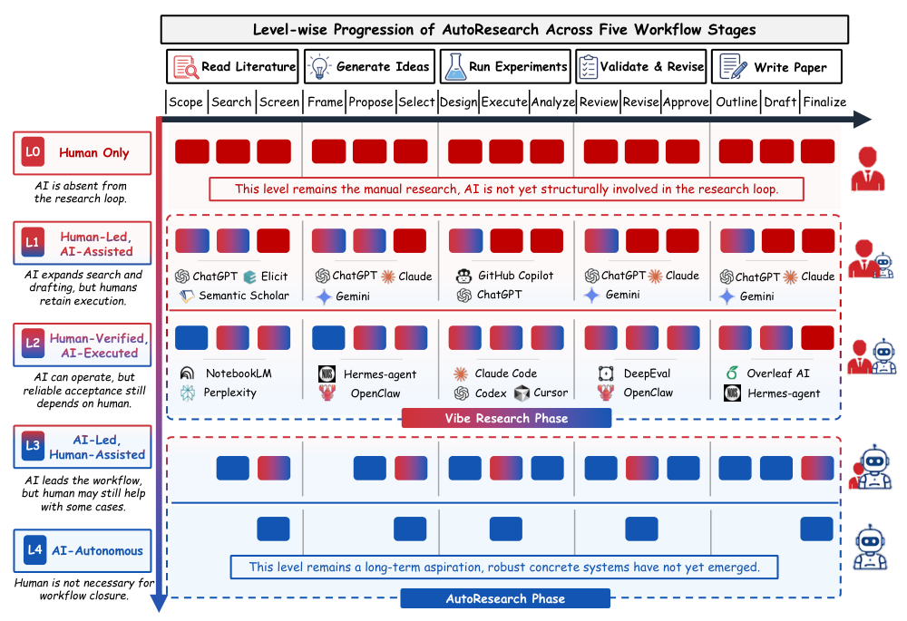
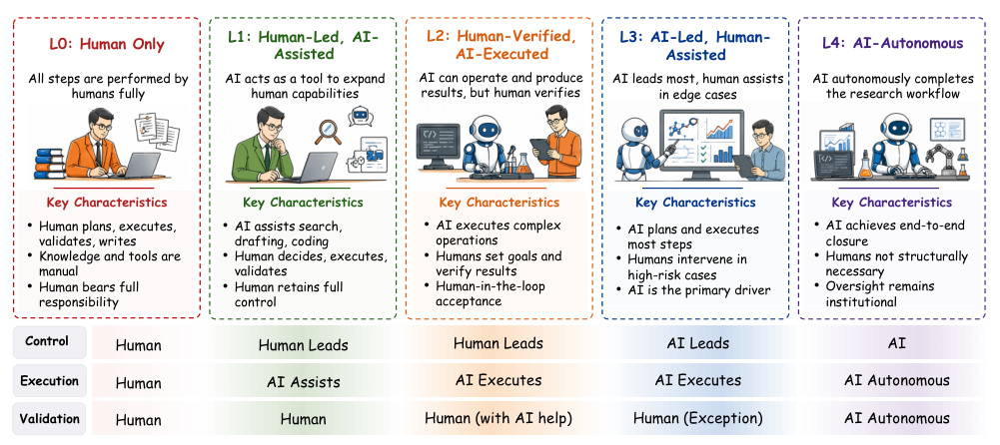
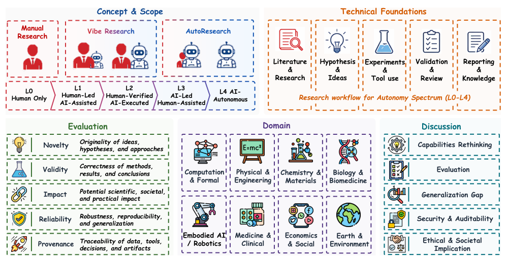
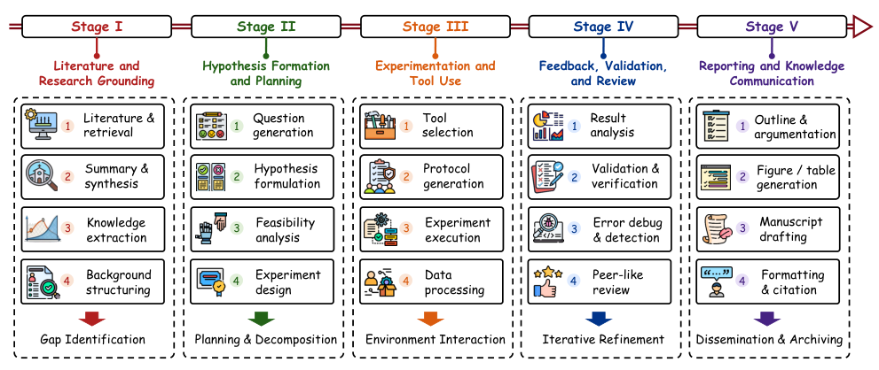
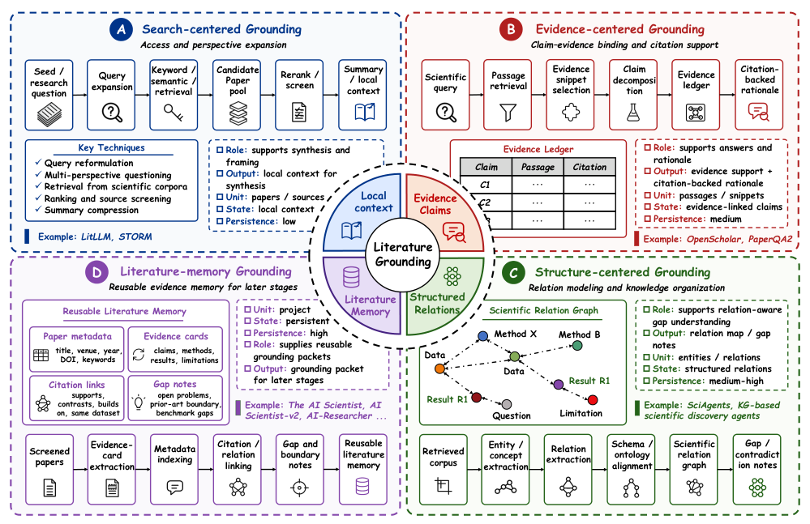
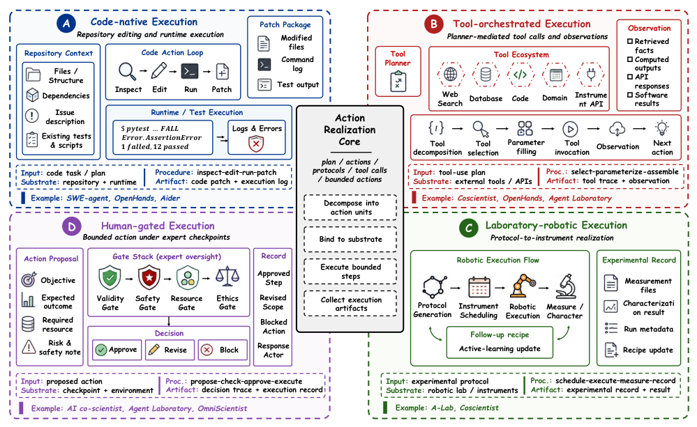
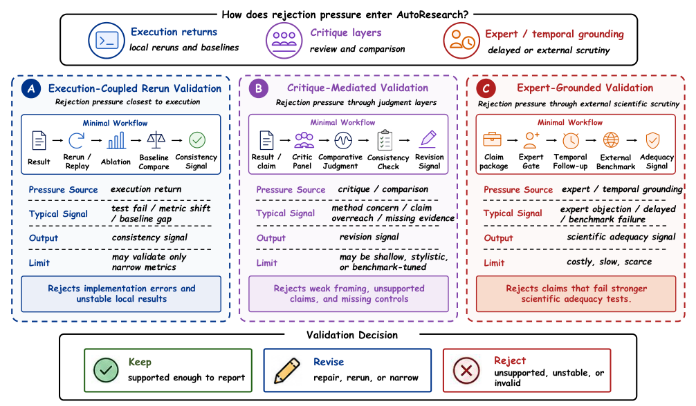
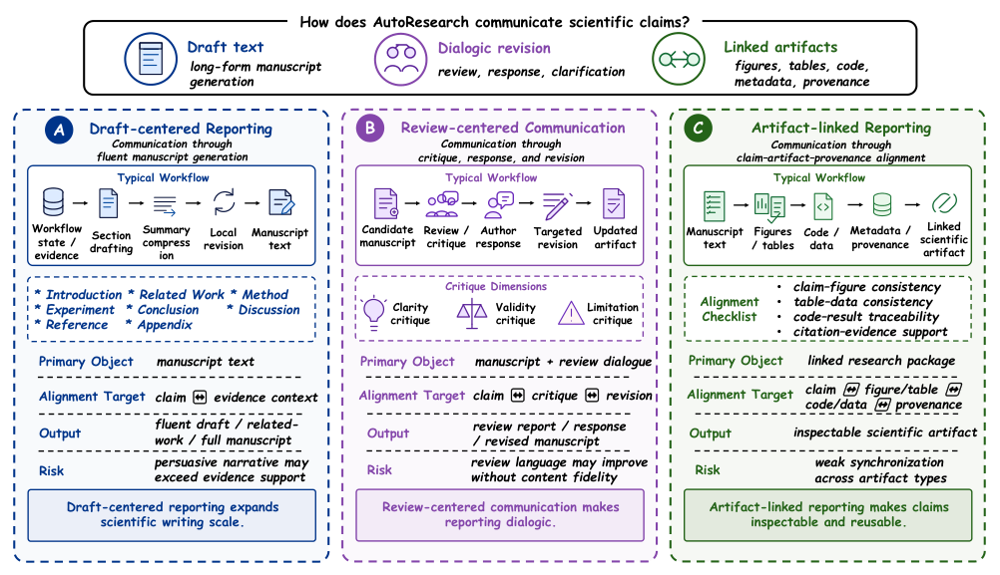
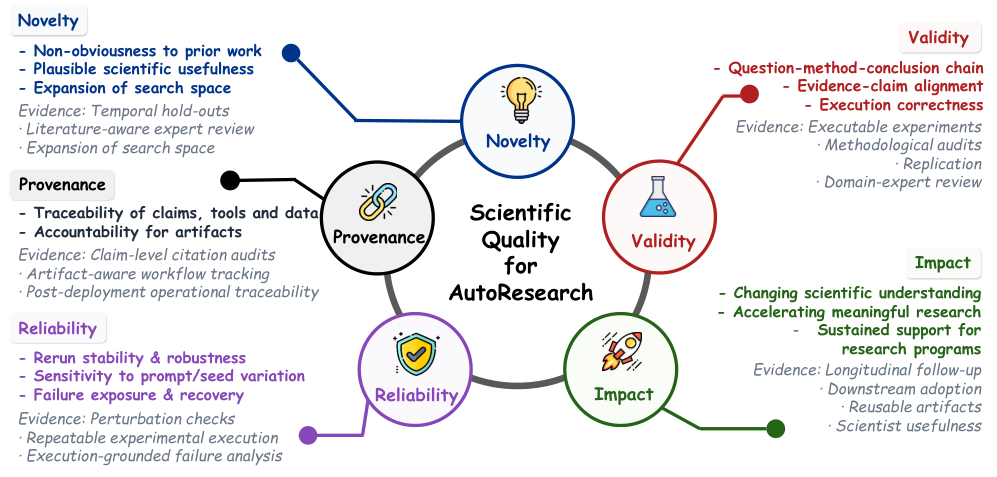
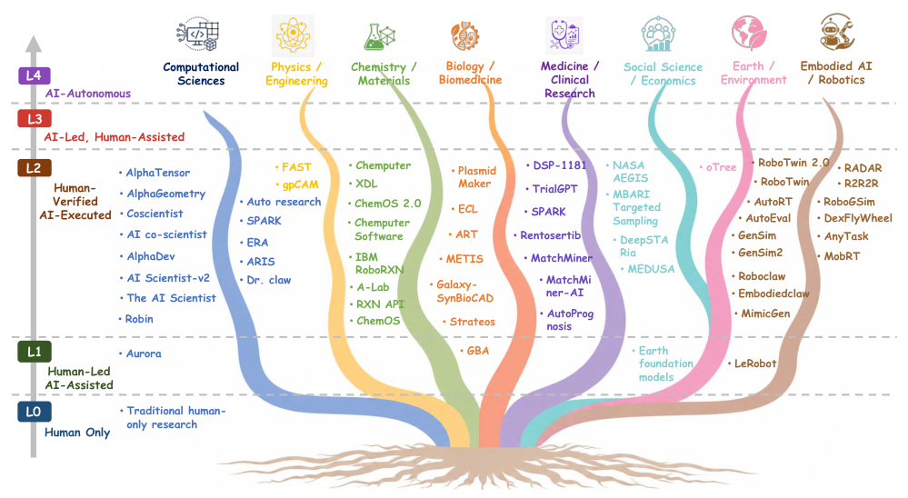

## 论文链接

- 原始论文页面：https://arxiv.org/abs/2605.23204
- PDF 下载：https://arxiv.org/pdf/2605.23204.pdf
- Hugging Face 论文页：https://huggingface.co/papers/2605.23204
- 项目主页：https://mr-tieguigui.github.io/Autoresearch/
- 开源代码仓库：https://github.com/Mr-Tieguigui/Survey-of-AutoResearch

自动研究AI：面向科学发现的AI驱动研究自动化

> 导读摘要：这篇综述不在讨论“某个模型会不会做科研”，而是在建立一套**工作流级**的分析框架：把科研拆成文献扎根、假设形成、实验执行、验证审查、报告传播五个阶段，再用 L0-L4 五级自主性来描述控制权、执行权、验证权如何从人逐步转移给 AI。它最重要的贡献，是把零散的“AI 科研助手”“AI Scientist”“实验代理系统”放进同一坐标系中比较，并明确指出真正的难点不是生成内容，而是证据保留、可复现、可追溯与可问责。

## 一、这篇论文到底提出了什么框架

这不是一篇提出单一新模型的论文，而是一篇试图**统一语言、统一坐标、统一评估口径**的综述。作者把“AutoResearch”定义为：AI 不再只在单点任务上帮忙，而是开始进入完整科研工作流，承担从检索、构思、执行到验证、写作的连续职责。

最关键的两层定义是：

1. **按工作流看科研自动化，而不是按单任务看能力**
2. **按自主性等级看人机责任分配，而不是按模型名字分类**

作为总入口，论文先用一张全局图把“科研五阶段 × L0-L4 自主性”放在一起。  

这张图的意义很直接：它不是问 AI 会不会写代码、会不会搜文献，而是问它在五个科研阶段中分别承担多少责任，以及人是否仍然掌握最终的方向、执行和验收。作者还特别区分了当前更常见的 **Vibe Research**：即人主导、AI 扩展局部能力的阶段，主要落在 L1-L2；而更广义的 AutoResearch 则指向 L3-L4 的工作流主导能力。

在更抽象的层面上，论文给出五级自主性定义。  

这套 L0-L4 不是“自动化多少”的粗糙排序，而是围绕三种权力来划分：

- **工作流控制权**：谁决定下一步做什么
- **任务执行权**：谁真正调用工具、运行实验、产生中间结果
- **验证权**：谁决定结果可不可以被接受

对应地：

- **L0**：纯人工科研
- **L1**：人主导、AI 辅助
- **L2**：AI 可执行，但人负责验收
- **L3**：AI 主导工作流，人只在例外或高风险场景介入
- **L4**：理想中的端到端闭环自主科研

作者的核心判断也很克制：**目前大多数系统仍主要停留在 L1-L2，少量系统对 L3 形成压力，但稳健的 L3/L4 还远未成熟。**

## 二、方法主线：用“工作流中心主义”重组整个领域

论文的方法论价值，在于它不按模型家族、代理架构或榜单成绩组织文献，而是按一个统一的分析框架来组织整个领域。这个框架可以从下图读出：  

这张框架图把全文组织成五个互相连通的部分：

- 概念与边界：什么算 AutoResearch，什么只算科研辅助
- 技术基础：五个工作流阶段各需要哪些方法
- 评估体系：如何判断科研质量，而不是只看任务完成
- 领域部署：不同学科里自动化能走到哪一步
- 讨论问题：可靠性、泛化、伦理、制度责任

这意味着作者真正想做的不是“列系统清单”，而是搭一个**科研自动化分析坐标系**。在这个坐标系里，系统之间可以被比较，瓶颈可以被定位，未来研究也能知道自己是在推进哪一段链路。

进一步地，作者把技术主线拆成五个递归出现的工作流阶段：  

这五阶段分别是：

1. **文献与研究扎根**
2. **假设形成与规划**
3. **实验执行与工具使用**
4. **反馈、验证与审查**
5. **报告与知识传播**

这张图非常重要，因为它把“科研自动化”从模糊口号变成了可以拆解的系统工程。后文所有方法讨论，基本都能落回这五段中：前面是否有证据基础，中间是否能稳定执行，后面是否能完成拒绝、修订与报告闭环。

## 三、五个阶段里，真正难的方法问题分别是什么

### 1. 文献扎根：不是“搜到论文”，而是“沉淀证据状态”

作者认为，文献阶段的关键不只是检索，而是把检索结果转成后续环节可用的**证据状态**。  

这一步之所以重要，是因为后续的假设、实验、写作如果没有可追溯证据锚点，就很容易退化为“流畅但不可审计”的生成。论文总结的方向包括：

- 局部背景构建：围绕具体问题建立上下文
- 论点—证据绑定：让主张能回指来源
- 结构化科学关系抽取：把文本转成可操作的关系网络
- 文献记忆：形成可持续复用的知识状态

这反映出一个很强的方法偏好：**AutoResearch 需要状态化、持久化、可追踪的中间表示**，而不仅是一次性问答。换句话说，检索增强只是起点，关键是证据如何在系统内部持续存在，并服务后续决策。

### 2. 假设与规划：从“想法生成”走向可执行研究程序

在这个阶段，AI 不能只提出看似合理的点子，而要把点子约束为可执行、可检验、可迭代的研究计划。作者反复强调：弱方向必须能被拒绝，模糊问题必须能被收敛，规划必须与可用证据和可用工具绑定。

因此，一个真正靠近 L2/L3 的系统，往往需要：

- 将研究目标分解为可执行子任务
- 将假设与已有文献证据对齐
- 明确变量、评价指标和失败条件
- 在计划中预留验证和回滚路径

这也是为什么很多系统看起来“会构思”，但离可靠科研还很远：它们常能生成候选方向，却不擅长系统性地淘汰坏方向。

### 3. 实验执行：科研自动化最“硬”的部分

实验执行是全文最 method-heavy 的部分之一。作者强调，研究自动化的难点不在于写出一段实验描述，而在于把计划真正落实到环境、工具和约束中。  

论文把行动落地概括为几类典型机制：

- 代码原生执行
- 工具编排执行
- 实验室或机器人执行
- 人工把关执行

这里的关键差别，在于执行环境的结构化程度。越接近“代码即可运行、结果可快速验证”的环境，AI 越容易逼近更高自主性；越依赖真实仪器、复杂物理条件、漫长周期和人工安全约束，自主性天花板越低。

这也解释了作者后面的一个重要结论：**计算型、形式化、可快速回放的领域，更容易先出现更高等级的 AutoResearch。**

### 4. 验证与拒绝：不是补丁，而是闭环核心

作者对验证阶段的强调，几乎是全文最重要的立场之一。科研系统不是“做出结果”就结束，而是必须能决定结果是否应被接受、修订或拒绝。  

这张图展示了几种把拒绝压力引入闭环的方法，例如：

- 与执行耦合的重跑验证
- 基于批评与比较的审查
- 引入专家或更强外部标准的评估

作者特别提到一个关键问题：**弱方向拒绝**。很多系统会不断扩展一个貌似合理的方向，但缺乏足够强的机制在早期就将其否决，导致后续所有执行和写作都建立在不稳固基础上。

因此，从方法设计看，可靠的 AutoResearch 至少需要：

- 明确的失败判据
- 可重复执行的检查路径
- 面向中间状态而非只面向最终文本的审查
- 能把验证信号反馈回规划层的闭环更新

### 5. 报告与知识传播：把发现变成可审计成果

最后一个阶段不是“顺手写论文”，而是把整个研究过程沉淀成可检查、可复用、可传播的科研产物。  

作者将其概括为三种沟通机制：

- 以草稿为中心的报告
- 以审查与评阅互动为中心的沟通
- 以成果物绑定为中心的报告方式

这里的重点是：科研表达不只是自然语言生成，而是要让**文本、图表、代码、实验记录、证据链**之间保持稳定对应。否则即使结论写得再像论文，也不具备科学上的闭环意义。

## 四、论文如何评估 AutoResearch：从“能完成任务”转向“科学上是否站得住”

作者认为，评测 AutoResearch 不能只看成功率、排行榜或生成质量，而必须评估科研输出的科学质量。为此论文提出五个维度：  

这五个维度是：

- **新颖性**
- **有效性**
- **影响力**
- **可靠性**
- **可追溯性**

这套评估框架的价值在于，它把“好科研”的要求重新引入 AI 系统评价。尤其是后两项，非常贴近作者全篇主张：

- **可靠性**：结果能否稳定复现，流程是否对扰动鲁棒
- **可追溯性**：证据、过程、决策和产出能否被审计与回链

这意味着一个系统即便能快速生成假设、运行代码、写出漂亮报告，如果没有过程证据、没有重跑能力、没有来源绑定，依然不能被视为高质量 AutoResearch。

作者等于把评估重心从“任务完成”推向“科学可信度”。这也是这篇综述相较一般系统盘点最有分量的地方。

## 五、最重要的现实判断：自主性是强烈依赖领域条件的

论文最后一个非常关键的结论是：**AutoResearch 的上限不是统一的，而是被学科条件强烈制约。**  

这张图传达的核心信息是：

- 在计算型、代码原生、可形式化验证、可快速回放的领域，高自主性更有现实基础
- 在依赖真实实验、验证延迟长、证据异质、受伦理与制度约束强的领域，自主性上限显著更低

也就是说，作者反对一种“通用科研代理会统一接管所有学科”的简单叙事。真正合理的判断应当是：

- **哪些环节可执行**
- **哪些结果可快速验真**
- **哪些证据可结构化保存**
- **哪些场景允许责任外包给 AI**

因此，AutoResearch 更像是一个**分领域、分阶段、分责任迁移**的连续谱，而不是单一终点。

## 六、这篇论文最值得记住的三点

第一，论文真正建立的是一种**工作流级方法论**。  
科研自动化的关键不是单点能力，而是把证据、规划、执行、验证、报告串成可追溯闭环。

第二，L0-L4 五级谱系提供了一个很有用的公共语言。  
以后讨论某个“AI Scientist”系统时，重点不应只问它用了什么模型，而应问：控制权、执行权、验证权分别在谁手里，它实际处在哪一级。

第三，作者对现状的判断相当克制。  
今天的系统已经对 L3 形成想象空间，但主流仍是 L1-L2；真正困难的问题不是“能不能生成研究内容”，而是**能不能在证据保留、拒绝弱结论、可复现和可问责的前提下完成科研闭环**。

如果用一句话概括全文：**AutoResearch 不是让 AI 更像研究者，而是让科研工作流本身变得可编排、可执行、可验证、可审计。**
