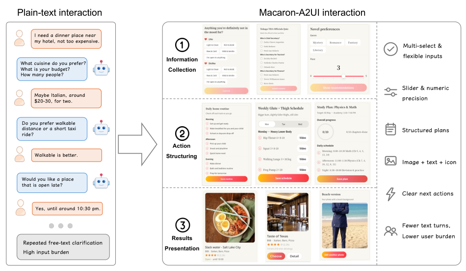
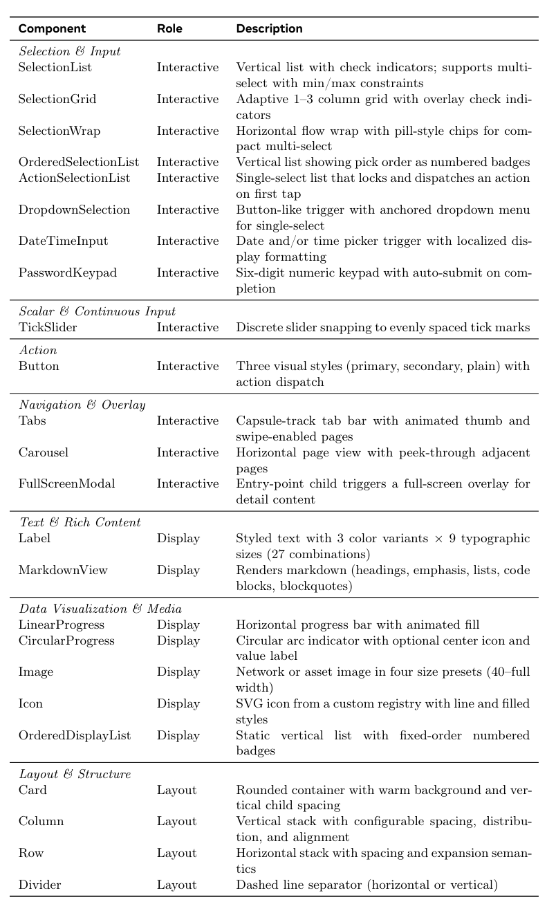
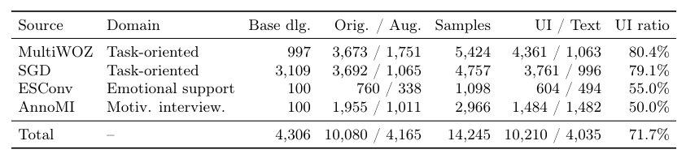
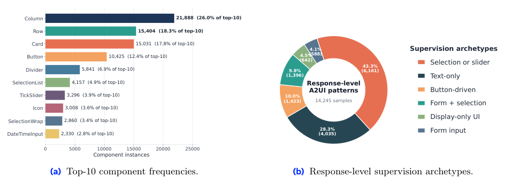
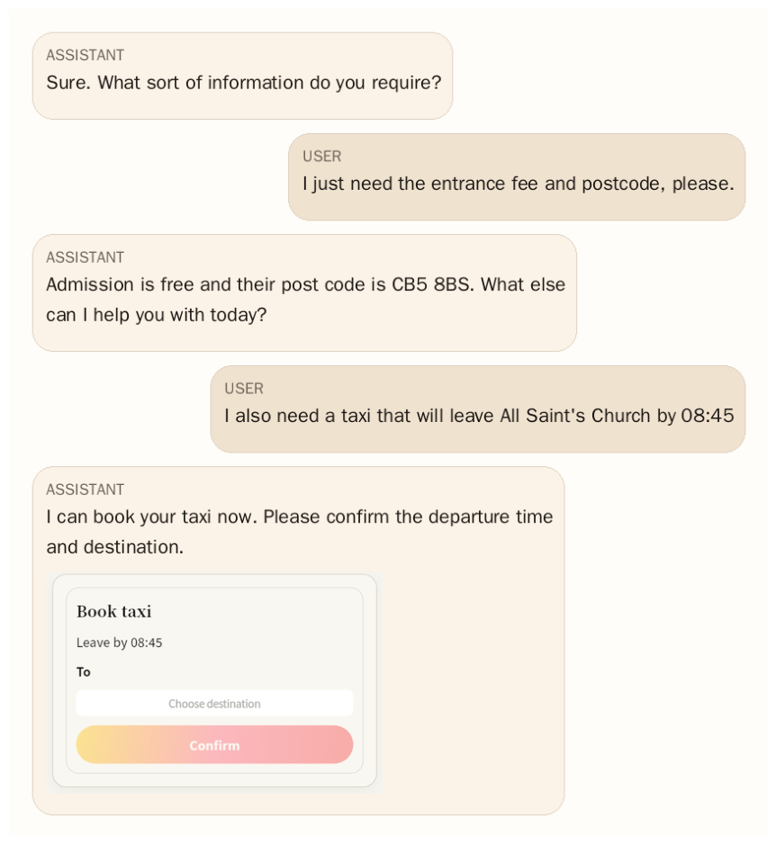
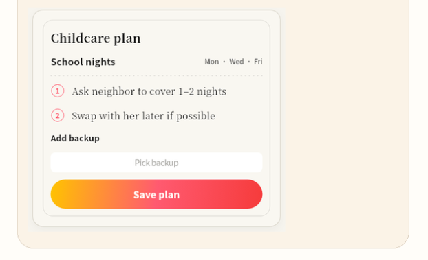
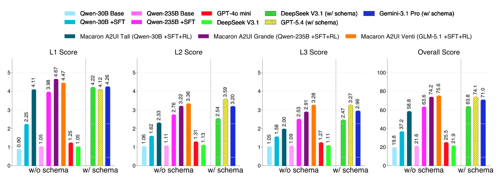
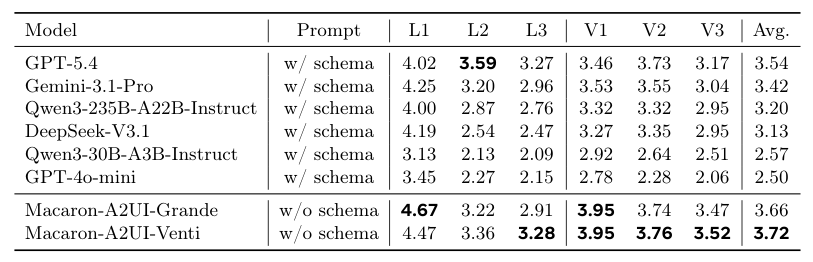
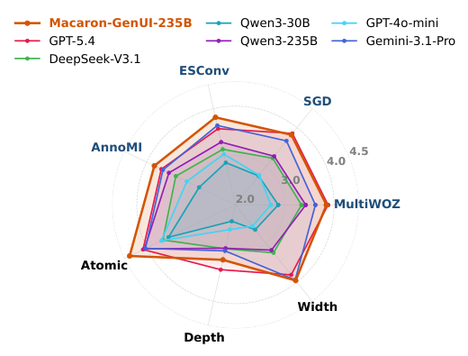

## 论文链接

- 原始论文页面：https://arxiv.org/abs/2605.24830
- PDF 下载：https://arxiv.org/pdf/2605.24830.pdf
- Hugging Face 论文页：https://huggingface.co/papers/2605.24830

Macaron-A2UI：面向个人智能代理的生成式用户界面模型

> 导读摘要：这篇论文不是单纯在做“让模型生成一个界面”，而是把个人智能代理里的生成式 UI 系统化为一个可训练、可评测、可部署的问题：何时该生成 UI、生成什么 UI、以及怎样保证它既可执行又真正改善交互效率。作者围绕 A2UI 协议，构建了大规模异构语料、分层基准与两阶段训练流程，并证明模型可以在很少提示甚至无显式结构提示的条件下，内化这种能力。

## 一、论文想解决的究竟是什么问题

个人智能代理越来越常见，但很多复杂任务仍然被“纯文本聊天”卡住了。原因并不神秘：一旦任务涉及偏好收集、条件澄清、候选比较、最终确认，用户就不得不在多轮对话里反复回答细碎问题，既慢，也增加认知负担。

这正是论文的出发点。作者认为，代理不该只会继续追问文本，而应在合适的时机动态生成轻量、可执行、可验证的结构化界面，把原本散落在多轮对话中的信息收集与决策压缩成一次更直接的交互。

上图直观展示了这种范式变化：左边是传统纯文本多轮追问，右边则把条件收集、操作组织和结果呈现折叠成一个轻量界面。这里的重点不是“聊天框里嵌了个卡片”这么简单，而是把交互单位从“继续说一句话”升级成“给用户一个可操作的下一步”。

因此，这篇论文真正研究的不是 UI 设计生成本身，而是**面向代理交互的生成式 UI 学习问题**：给定系统指令、历史对话和当前用户消息，模型需要联合产出自然语言回复，以及必要时的结构化 UI 动作序列。

## 二、A2UI 设定：把“生成界面”变成可学习的输出空间

论文采用 A2UI 作为统一协议。核心思想是：模型不直接写前端代码，也不直接生成任意 HTML，而是输出一种声明式消息序列；客户端再通过受信任的组件目录完成渲染。这样做有三个直接好处：

1. **更安全**：避免任意代码生成与执行风险。  
2. **更可移植**：同一份结构化输出可在不同渲染环境中复用。  
3. **更可验证**：可以自动检查协议合法性、类型一致性、可渲染性。

从问题定义上看，模型的目标是输出一个统一响应，其中既包含自然语言，也包含可执行 UI 动作。这个动作序列不只是“画一个界面”，还涉及什么时候开始渲染、如何更新状态、何时删除已有界面等。

这张图很好地概括了论文的方法目标：模型不仅要决定“说什么”，还要决定“让用户怎么操作”。例如，类别偏好适合离散选择控件，连续数值适合滑杆，确认步骤适合按钮或摘要卡片。也就是说，生成式 UI 在这里不是装饰层，而是任务推进机制。

为了让这个输出空间足够规范，作者还依赖一个受控组件目录。评测时允许调用的组件是固定集合，并按功能分成可交互组件、展示组件和布局组件三类。这个限制非常关键：它把“生成 UI”从开放式网页生成，收束成可执行、可检验的组合问题。

这意味着模型学到的并不是随意画界面，而是在受限组件集合中选择合适控件、组织结构并驱动交互。对方法研究而言，这种约束比“直接生成前端代码”更适合训练和评测。

## 三、方法主线：数据构建比模型结构更关键

这篇论文最有价值的部分，其实不只是训练了一个模型，而是搭建了一整套把异构对话数据转成 A2UI 训练样本的方法流水线。作者的判断很明确：要让模型学会生成式 UI，首先必须有足够大、足够规范、足够可验证的数据。

### 1. 数据来源与统一化

作者从四类异构对话源构建训练语料：

- MultiWOZ 2.2
- SGD（Schema-Guided Dialogue）
- ESConv
- AnnoMI

这四类数据覆盖了任务型助理、情感支持、动机式访谈等不同交互风格，不仅场景多样，标注形式也很不同。所以第一步不是训练，而是**对话归一化**：将原始分段、说话人轮替、数据集特有标注统一成一致的用户—助手历史格式。

从这张表能看出，作者并不是只在单一任务型语料上附加一些 UI 标注，而是建立了一个跨场景、跨任务的大规模训练基础。总规模达到约 1.42M 助手轮训练样本，其中相当高比例带有 UI 负载，这一点对“何时生成 UI”尤其关键。

### 2. 中间交互表示

不同数据集的原始标注并不能直接对应 UI。于是作者设计了一个紧凑的中间交互表示，把任务型数据中的意图、槽位、对话行为，以及情感支持数据中的支持策略、反思、行动规划等，统一映射到若干交互模式。

例如：

- 类别选择 → 选择控件  
- 数值或序数条件 → 滑杆式控件  
- 布尔条件 → 复选框  
- 时间参数 → 日期/时间输入  
- 候选比较、确认决策 → 摘要卡片或确认界面

这种“先语义归一，再落到组件”的过程，是整篇论文最核心的方法设计之一。它避免了直接让 LLM 从原始对话跳到最终 UI，从而降低了标注与建模难度。

### 3. 规则优先 + LLM 补全

作者的方法不是完全依赖 LLM 自动标注，而是采用混合流水线：

- **有充分结构信号的地方**，优先用确定性规则生成；
- **源数据没明确指定 UI 决策的地方**，再用 LLM 补全；
- 最后经过**确定性后处理、修复、验证与必要重试**，进入最终语料。

这张统计图反映出训练分布的两个事实：其一，数据集中高频组件是少量基础布局与交互控件；其二，监督信号里大量样本不是纯文本回复，而是带有结构化交互模式的响应。这正是模型能够学会稳定生成 UI 的基础。

### 4. 语料构建流水线

整条流水线可以概括为：

1. 采样源对话  
2. 规范化历史  
3. 映射到中间交互动作  
4. 转换为 A2UI 响应  
5. 进行语法、类型、绑定、语义和渲染验证  
6. 修复失败样本并重试  
7. 形成最终训练语料

像上面的确认型界面示例，体现了作者特别强调的一点：生成式 UI 应该出现在真正能减少负担的节点，而不是机械地“每轮都来个卡片”。最终确认被压缩成可核对的小界面，本质上是在做任务状态收束。

## 四、评测怎么做：不仅看协议对不对，还看交互值不值

仅仅检查 JSON 合法性远远不够。论文明确把生成式 UI 的质量拆成三层问题：

1. **协议有效性**：格式、类型、引用、可渲染性是否正确  
2. **交互构造质量**：控件选得对不对，状态更新是否合理，是否真正承接文本语义  
3. **用户体验质量**：是否比纯文本更有价值，是否降低负担，是否使流程更清晰

围绕这三层，作者提出 A2UI-Bench，并组织成多任务、多层级的评估框架。一个重要特点是，它把“协议正确”和“交互好不好”明确分开，这样模型不会因为只会输出合法结构就被高估。

这个例子很好地体现了评测关注点：好的生成式 UI 不是简单复述长对话，而是把复杂讨论压缩成可行动的计划卡片，保留关键状态、备选步骤和明确动作入口。也就是说，评测看的是“是否推进任务”，而不是“是否生成了一个像 UI 的东西”。

## 五、训练方案：LoRA-SFT 打底，奖励驱动 RL 提升交互质量

模型训练采用参数高效的两阶段方案，训练了 30B、235B、754B 等不同规模版本。方法重点不在新架构，而在训练配方。

### 第一阶段：LoRA-SFT

先用 LoRA 进行监督微调，让模型学会最基础的两件事：

- 文本与 UI 的联合输出格式  
- 对话语义到结构化控件的基本对齐

这一阶段主要解决“会不会生成”和“格式稳不稳”的问题。没有这一步，模型即使理解任务，也很容易在协议层面失误。

### 第二阶段：奖励驱动 RL

在 SFT 基础上，再通过奖励驱动强化学习，优化更高层的交互质量，包括：

- 是否选择了更合适的控件  
- 是否减少不必要的文本轮次  
- 是否使状态推进更自然  
- 是否让最终界面更有用

这张消融图非常关键。它表明两阶段训练不是可有可无的工程叠加，而是对应不同能力层：SFT 建立稳定的格式与对齐，RL 则继续提升可执行交互的整体质量。更重要的是，作者重点考察了**无显式 schema 提示**的更难场景，结论是这些能力可以被模型内化，而不是永远依赖推理时塞入一大段结构说明。

## 六、结果说明了什么：生成式 UI 能被模型真正学会

论文的主结果可以用一句话概括：**最好的 Macaron-A2UI 模型在无显式 schema 提示下，依然超过了依赖完整 schema 提示的强基线。**

表中的核心信息是，Macaron-A2UI 系列在更贴近真实部署的“轻提示”条件下，仍然取得更高平均分。这说明模型学到的不是“照着提示模板填结构”，而是更直接地掌握了生成式 UI 的任务规律。

具体来说，最佳模型在 A2UI-Bench 上达到 **75.6** 总分，并超过最强的全 schema 前沿基线。这个结论非常重要，因为真实产品部署往往不希望每次推理都附带又长又脆弱的结构提示。

按数据集和任务拆分后，性能提升也并非只出现在单一场景，而是整体更均衡。这意味着模型不仅能处理标准任务型对话，也能在更开放、更依赖组织信息的场景里受益于生成式 UI。

从方法视角看，最有说服力的结论有三点：

- **生成式 UI 是可学习的统一问题**，而不是一些零散 demo 的集合。  
- **数据构建与协议设计是成功前提**，不只是模型规模。  
- **UI 能力可以内化进模型**，不必长期依赖长 schema 提示。

## 结语

这篇论文最值得记住的，不是某个具体分数，而是它把“代理何时以及如何生成界面”首次比较完整地做成了一个方法学闭环：**协议定义、数据构建、验证流水线、基准评测、两阶段训练**全部连起来了。

如果你把它放在更大的研究图景里看，Macaron-A2UI 的意义在于：它把个人智能代理从“会聊天”推进到“会组织交互”。未来代理系统的竞争，很可能不只是谁回答得更像人，而是谁更会在关键时刻生成一个更短、更清晰、更可执行的界面。
