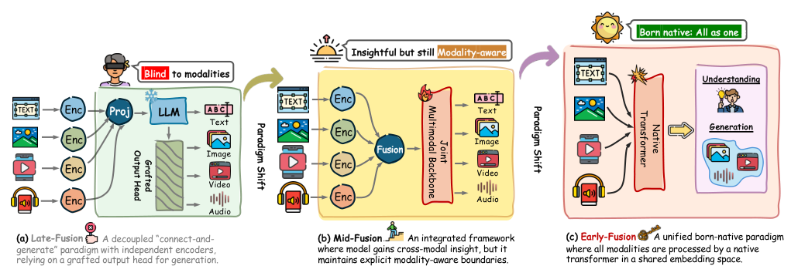
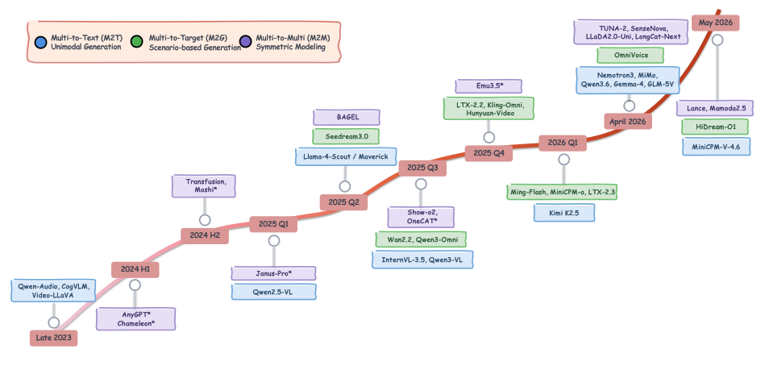
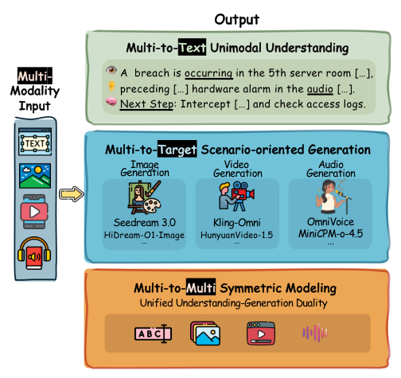
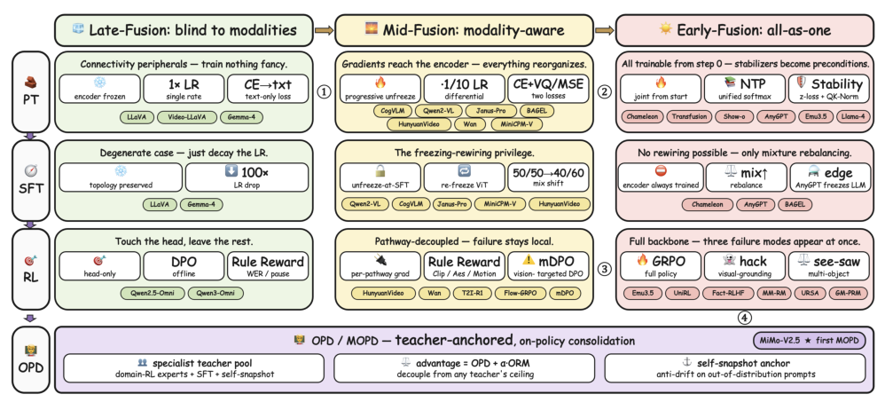
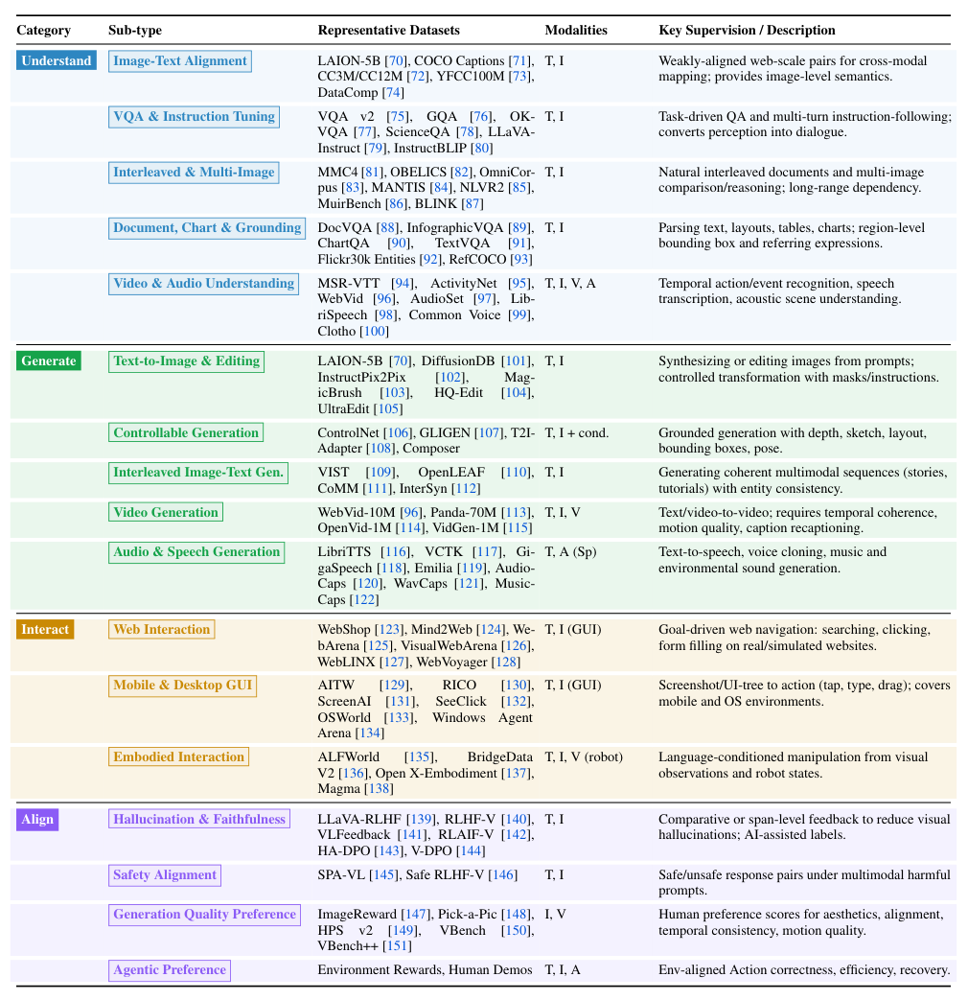
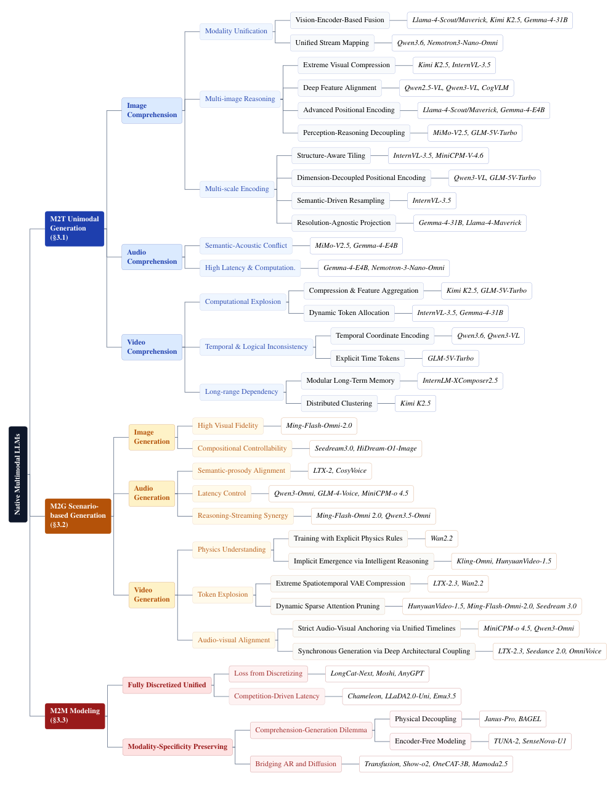
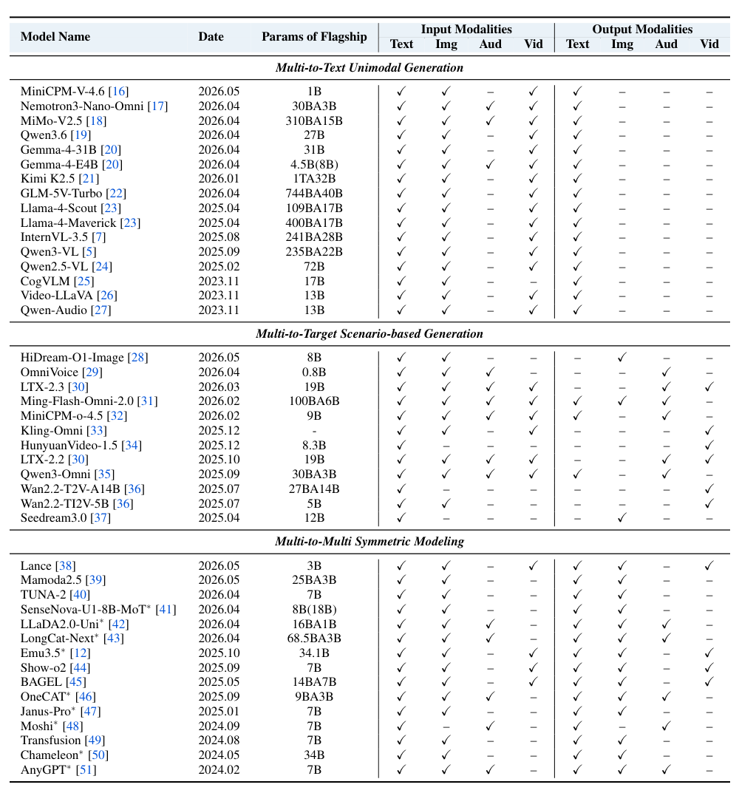
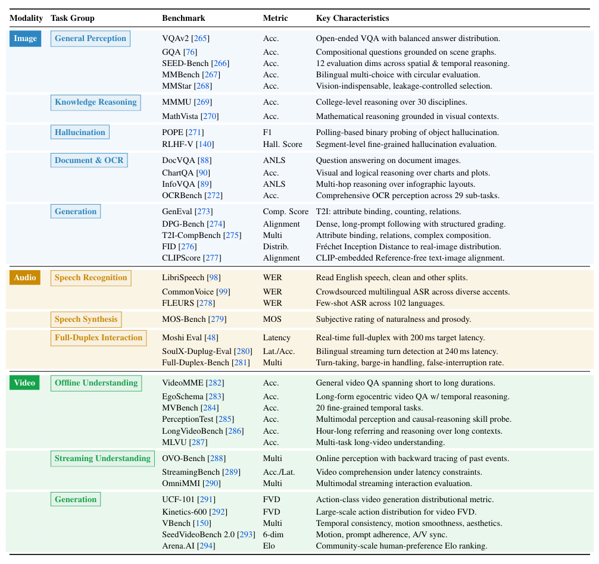

## 论文链接

- 原始论文页面：https://arxiv.org/abs/2605.25343
- PDF 下载：https://arxiv.org/pdf/2605.25343.pdf
- Hugging Face 论文页：https://huggingface.co/papers/2605.25343
- 项目主页：https://nmm-roadmap.github.io/
- 开源代码仓库：https://github.com/NMM-Roadmap/Awesome-NMM-List

原生多模态建模：一份路线图

> 导读摘要：这篇论文系统提出“原生多模态建模（NMM）”的形式化定义、架构分层与技术路线图，明确区分晚融合、中融合与早融合范式，并从任务、数据、训练、部署到评测给出通向统一世界模型的全景方法论。

## 论文想解决什么

多模态模型这几年发展很快，但大多数系统本质上仍是“先各自处理，再接到语言模型上”的拼接式方案。它们能用，但离真正的原生多模态还有距离：模态之间没有在核心结构里自然共存，理解和生成也常被拆成两套流程。

这篇论文的价值不在于提出一个新模型，而在于把这个方向“讲清楚”：什么叫原生多模态，现有方法到底处在什么阶段，下一步应该往哪里走。

## 一、先给出统一坐标系：什么才算“原生”

论文最重要的贡献，是提出一套分类框架，把原生多模态系统分成两条轴来理解：

- **融合深度**：晚融合 / 中融合 / 早融合
- **输入输出对偶性**：M2T、M2G、M2M

其中，**原生性**的核心不是“能不能接多种模态”，而是**多模态是否被内生地整合进架构和输出路径**。  
如果只是外接编码器、冻结语言骨干、再做浅层投影，本质上还是晚融合。

## 二、三类原生多模态：从拼接到统一

论文把现有方法整理成三类。

### 1）晚融合：先理解，再接语言模型

这一类最像传统多模态系统：各模态先单独编码，最后接到语言模型上生成文本。  
它的优点是工程上容易落地，但问题也明显：模态之间交互浅，原始感知信号进不来，生成也基本被文本框住。

### 2）中融合：让模态在编码阶段开始交互

中融合开始让梯度进入各模态编码器，多模态不再只是末端拼装，而是在表示层面逐步融合。  
这类方法比晚融合更“深”，但仍保留较明显的模态边界。

### 3）早融合：所有模态进入同一骨干

早融合是论文眼里更接近“原生”的方向：图像、音频、视频等都被统一处理进同一 Transformer 空间里，理解和生成天然共存。

这张图给人的核心判断是：**原生多模态的发展，不只是增加模态种类，而是让理解与生成在同一架构里自然协同。**

## 三、方法论主线：任务、数据、训练如何一起变

论文最实用的地方，是把原生多模态建模拆成一整套方法版图，而不是只谈架构。

### 1）按任务重构设计空间

作者把任务分成三类：

- **多模态到文本（M2T）**：偏理解
- **多模态到目标模态（M2G）**：偏生成
- **多模态到多模态（M2M）**：偏统一建模

这一步很关键，因为不同任务其实对应不同“输入—输出”结构，也就决定了模型该怎么设计。

### 2）训练方式不是通用模板

论文强调：不同融合范式，对应的训练策略并不一样。  
从晚融合到中融合再到早融合，不只是连法变了，预训练、监督微调、强化学习、OPD 等训练 recipe 也要跟着重写。

这张图很直观：**训练阶段和融合方式是绑定的。**

### 3）数据也要按功能分工

原生多模态不是只靠图文对齐数据训出来的。论文把训练数据分成四类：

- 理解
- 生成
- 交互
- 对齐

它的意思很明确：模型既要学会“看懂什么”，也要学会“生成什么”，还要知道“如何交互”和“按什么偏好回答”。

## 四、评测与技术谱系：别只看分数，要看能力结构

论文还给出一张很有用的评测地图，把图像、音频、视频三种模态下的任务、基准和指标整理在一起。

以及一张总览表，对近年原生多模态模型做了系统比较：

这里最值得关注的不是单个分数，而是三件事：

- 模型接收哪些模态
- 模型能生成哪些模态
- 这些能力是否正在从“看懂多模态”走向“同时理解与生成多模态”

## 五、论文真正想传达的结论

这篇论文的结论非常清楚：  
**原生多模态的发展方向，不是简单增加模态输入，而是走向统一建模。**

它用一套形式化框架把零散的模型现象收拢起来，告诉我们：

- 原生性要看结构，不只看接口
- 融合深度决定模型的能力边界
- 训练、数据、部署、评测都必须和架构同步设计
- 最终目标，是让理解与生成在同一网络内对称共存

如果只记一句话，就是：

> 原生多模态不是“多模态 + 大模型”，而是把多模态真正写进模型骨架里。

## 读图建议

- **Fig1**：看问题背景，理解为什么需要原生多模态
- **Fig2**：看演进主线，抓住晚融合集合到早融合的变化
- **Fig3**：看方法分类，理解三类任务如何对应不同架构
- **Fig4**：看评测地图，知道不同能力该怎么测
- **Fig5**：看训练逻辑，理解融合方式如何反过来决定训练配方

## 一句话总结

这篇论文不是在“做一个更强的模型”，而是在为**原生多模态建模**建立一套可执行、可比较、可延展的统一框架。

## 補充圖示

### 多模态模型评测基准总览

这是一张“评测地图”，按图像、音频、视频三种模态，把常见任务分组列出来，并标注各自常用基准、指标和关注点。它想说明：不同能力不能只用同一种测试来衡量，理解、生成、对齐和流式交互各有专门评测。

它把领域里零散的评测方法整理成一张全景图，帮助读者快速判断一个模型到底强在哪、弱在哪，也反映出多模态模型正在从单项能力走向更综合、更接近真实应用的评估。
