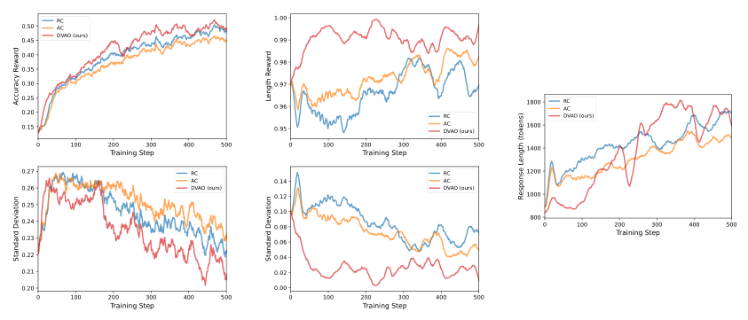
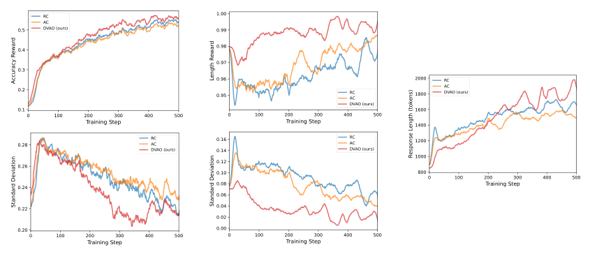
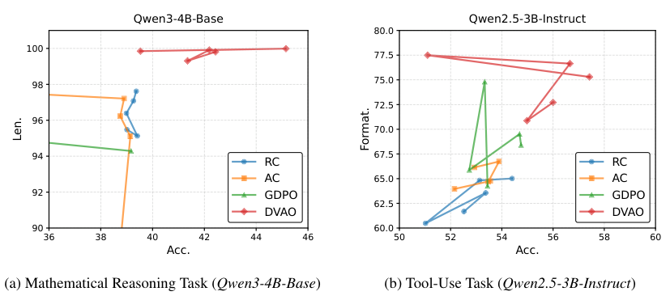
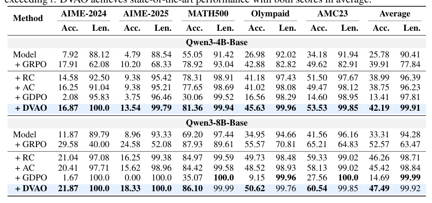
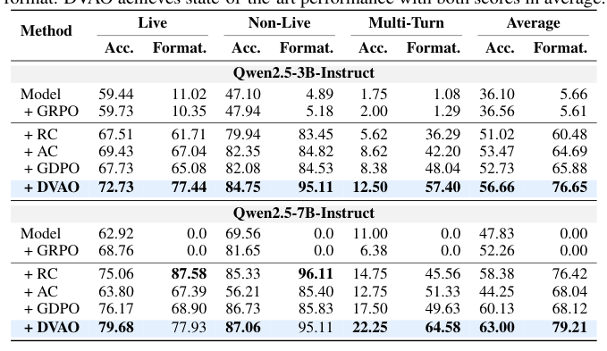

## 论文链接

- 原始论文页面：https://arxiv.org/abs/2605.25604
- PDF 下载：https://arxiv.org/pdf/2605.25604.pdf
- Hugging Face 论文页：https://huggingface.co/papers/2605.25604

DVAO：面向多奖励强化学习的动态方差自适应优势优化

> 导读摘要：这篇论文讨论的是 LLM 在多奖励强化学习里的一个核心难题：多个目标该怎么一起优化，而不把训练弄得又抖又不稳。作者指出，传统做法不是先把奖励线性加权，就是把各自优势分别归一化后再合成，但前者容易让优势幅度过大、训练不稳定，后者又依赖静态权重，且忽略目标间相关性。DVAO 的关键想法是：在每个 rollout 组内，根据各目标奖励的经验方差，动态调整各目标优势在最终更新中的权重，让“学习信号强”的目标被更多利用，让噪声大的目标被抑制。论文不仅给出理论分析，说明这种做法能控制优势幅度、引入跨目标自适应正则效应，也在数学推理和工具使用任务上验证了它比固定加权基线更稳、更快、更接近更优的多目标帕累托前沿。

## 一、问题背景：多奖励 GRPO 为什么难做

这篇工作针对的是一个很实际的问题：LLM 的强化学习训练很少只优化单一指标。真实场景里，模型往往既要答案正确，又要满足长度约束、格式约束，或者在工具使用中既要任务成功，又要函数调用格式正确。

在单奖励场景下，GRPO 这类方法已经很常用，因为它不需要单独训练价值模型，训练开销更低，也更适合大模型后训练。但一旦进入多奖励场景，最自然的办法通常只有两类：

- **奖励合成**：先把多个奖励按固定权重线性合成，再像单奖励一样做优势估计；
- **优势合成**：先对每个奖励分别做组内归一化得到各自优势，再按固定权重把这些优势合起来。

作者认为，这两条路都不够好。

第一类的问题是，它会把多个奖励直接叠加，容易产生过大的优势平方幅度，最终带来更激进、更不稳定的策略梯度更新。第二类虽然缓和了幅度爆炸，但仍然依赖静态超参数，而且把不同目标“各算各的”，等于默认目标之间彼此独立，无法利用一次 rollout 中多个目标之间可能存在的协同或冲突关系。

论文的核心动机可以概括成一句话：**多目标优化不该靠固定手工权重，而应该让训练数据自己告诉我们，当前哪一个目标更值得被强调。**

## 二、作者先批判了什么：两种基线的根本缺陷

论文在方法提出前，先做了比较扎实的理论铺垫。

对于 GRPO，单奖励时会在同一输入下采样一组回复，然后用组内均值与标准差做归一化，得到相对优势。多奖励时，如果把奖励先加权求和，再做统一归一化，本质上是把多个目标揉成一个标量目标。作者证明，这种做法得到的优势，其平均平方幅度往往**不小于**先分别归一化再做组合的方法。直观理解是：

- 奖励先混合，会把不同目标的波动一起放大；
- 一旦某些目标本身方差大，或者与其他目标相关性复杂，合成后的信号可能更尖锐；
- 策略梯度和优势成正比，因此更大的优势幅度意味着更猛的更新，也就更容易震荡。

而对“优势合成”这一路线，作者进一步指出，它虽然看起来更稳定，但有两个问题：

1. **静态权重问题**：不同训练阶段、不同样本组中，各目标的重要性并不一样，固定权重很难始终合适。
2. **目标隔离问题**：每个目标先独立归一化，再线性求和，等于忽略了一个目标的学习价值是否应该由“整体多目标表现”来调节。

论文后面还分析了合成优势对某个原始奖励的偏导。结论很关键：传统优势合成中，一个目标对最终更新信号的影响，主要只由它**自身**的孤立优势决定；而 DVAO 中，这个影响会被**整体多目标表现**所调制，于是自然产生跨目标的自适应正则化效果。

这也是论文最有意思的点：它不只是“动态调权”，而是在梯度层面改变了多目标之间的耦合方式。

## 三、DVAO 的核心方法：按组内方差动态重加权优势

DVAO 的设计其实很简洁，但抓住了一个很强的统计信号：**组内经验方差**。

基本流程是这样的。对于同一个输入，模型采样出一组回复；对于每个目标奖励，都可以在这组回复上计算：

- 该目标奖励的组内均值；
- 该目标奖励的组内标准差；
- 进而得到该目标独立归一化后的优势。

接下来，DVAO 不再使用固定权重，而是把原始权重按各目标的组内标准差重新缩放，形成动态权重。直观上：

- 组内标准差更大的目标，会获得更高的相对权重；
- 组内标准差更小的目标，会被相对下调。

作者把这解释为：高方差意味着该目标在当前 rollout 组中区分样本优劣的能力更强，也就是更强的学习信号；反过来，低方差目标在当前组里可能提供的信息更弱，甚至更多是噪声或饱和信号。

最终，DVAO 的总优势就是这些“单目标优势 × 动态方差权重”的加权和。

如果只看一句话，DVAO 的核心就是：

**不是固定决定每个目标有多重要，而是根据当前 rollout 组里这个目标到底提供了多强的可学习差异，动态决定它对策略更新的贡献。**

这种设计有三个直接后果：

- **避免奖励直接相加带来的优势幅度膨胀**；
- **避免静态优势加权对超参数的依赖**；
- **把多目标之间的整体表现信息带回到每个目标的梯度贡献里。**

从论文的表述看，DVAO是一个完全数据驱动、无需额外调权超参数的方案，这对 LLM 后训练很重要，因为多目标权重通常最难手调，也最不稳。

## 四、方法为什么有效：理论上控制幅度，实践上引入跨目标正则

这篇论文不只是经验技巧，而是试图说明 DVAO 为什么“在结构上更合理”。

### 1. 它能控制优势幅度，缓解训练不稳定

奖励合成的问题在于，最终优势往往过大。作者从优势平方幅度入手，说明传统奖励合成更容易产生更大的梯度更新。而 DVAO 的动态方差重加权，不是把原始奖励直接揉成一个大数，而是先做单目标归一化，再按统计强度分配贡献，因此能把最终优势幅度维持在更可控的范围里。

这意味着训练时更不容易出现“某一步更新过猛，把策略推偏”的情况。

### 2. 它不是简单平均，而是显式利用“谁更有信号”

很多多目标方法默认每个目标都该稳定发声，但现实里并非如此。某些目标在当前训练阶段可能已经接近饱和，继续放大它只会压制别的目标；有些目标则仍然有明显区分度，应该被重点利用。

DVAO 用方差作为“当前信号强弱”的代理量，给了一个非常实用的自适应策略。

### 3. 它带来了跨目标的隐式正则化

这是比“动态权重”更深一层的贡献。作者分析偏导后指出，DVAO 中某个目标的梯度贡献不再只由它自己的孤立表现决定，而会受到总优势的影响。换句话说，它优化的不是几个彼此独立的小任务，而是在每次 rollout 上看“这个回复在整体多目标上到底值不值得强化”。

这使得 DVAO 更像一种**整体协调器**：当多个目标协同一致时，会更容易共同被强化；当某个目标单独冒尖但拖累整体时，它的影响不会被无条件放大。

## 五、实验怎么看：更稳的训练曲线，更优的帕累托前沿

论文的实验覆盖了数学推理和工具使用两类场景，模型包括 Qwen3 和 Qwen2.5 系列。整体结论很明确：DVAO 同时提升了训练稳定性、收敛速度和多目标折中表现。

在训练动态上，作者用两张图展示了这种“稳”和“快”不是口头描述，而是持续可见的现象。对于较小模型的数学推理训练， 可以看到 DVAO 在准确率奖励、长度奖励以及平均输出长度上的轨迹更平滑：一方面主任务奖励提升更稳定，另一方面输出长度也更容易被控制在目标范围内，说明它并不是靠无节制生成来换正确率。到了更大模型设置， 依旧呈现同样趋势：相比固定加权方法，DVAO 的平均奖励更高、波动更小，说明这种动态加权并不是只对某个规模偶然有效。

如果把视角从“训练过程”切到“最终多目标折中”，论文最有说服力的是帕累托前沿结果。 展示出 DVAO 在数学推理与工具使用任务上的点集整体更靠右上，也就是在准确率与长度/格式约束之间给出了更优折中。这很重要，因为多奖励训练最怕的就是只把某一项做高，另一项明显崩掉；而 DVAO 的优势恰恰在于它能减少这种偏科。

定量结果表也支持这一点。 汇总了数学推理任务上的结果，能看到 DVAO 相比 GRPO、奖励合成、优势合成以及其他多奖励变体，在正确率和长度控制的综合表现上更稳健，不是单点领先，而是多数设置下一致占优。对应的工具使用场景， 进一步说明 DVAO 不只适用于“正确率—长度”这种双目标，也能在“任务成功—格式合规”这类更贴近 agent 场景的目标组合中保持优势。

## 六、这篇论文真正的贡献在哪里

如果只看表面，DVAO 像是在 GRPO 上加了一个“按方差调权”的小技巧；但从论文主线看，它的价值更大：

- 它指出了**多奖励 GRPO 中两种标准标量化做法的结构性问题**；
- 它提出了一个**不依赖额外价值模型、也基本不依赖手工调权**的动态加权框架；
- 它把“方差”从一个描述统计量，变成了**优势合成时的学习信号强度估计器**；
- 它在理论上解释了为什么这种做法既能控幅，又能引入跨目标自适应正则；
- 它在实验上证明，这种设计不是只提升一个指标，而是改善整体多目标帕累托表现。

对做 LLM 后训练的人来说，这篇论文最值得记住的结论不是某个具体公式，而是一个方法论：

**多目标强化学习里，关键不是预先规定每个目标永远有多重要，而是让当前 rollout 的统计结构决定，谁在这一刻更值得推动策略更新。**

这也解释了为什么 DVAO 在“稳定性”和“多目标折中”上能同时占优。它不是简单做平均，而是在每一组样本上重新估计学习信号，把训练从“固定配方”变成“按数据自调节”的过程。
